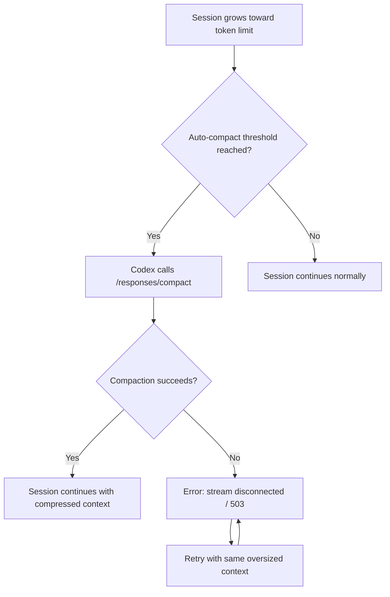

# Codex CLI Context Compaction Under GPT-5.5: Diagnosing Failures, Configuring Fallbacks, and Keeping Long Sessions Alive


---

Since GPT-5.5 became the default model in Codex CLI, a wave of compaction failures has disrupted long-running sessions for practitioners worldwide. GitHub issues report roughly 80% of compaction operations failing under GPT-5.5[^1], with sessions becoming unrecoverable once the context window fills. This article examines what is going wrong, what configuration levers exist today, and how to build session workflows that survive compaction failures.

## What Compaction Does — and Why It Breaks

Codex CLI manages growing conversation context through *compaction* — a process that summarises prior turns into a compressed representation, discarding raw history while preserving essential state[^2]. Two mechanisms exist:

1. **Server-side (remote) compaction** — triggered automatically when rendered tokens cross a threshold, handled by the `/responses/compact` endpoint on OpenAI's infrastructure[^3].
2. **Manual compaction** — invoked via the `/compact` slash command in the TUI.

Both call the same upstream endpoint. When compaction succeeds, the session continues with a smaller context footprint. When it fails, the oversized conversation history is retried against the same endpoint — and fails again, creating a death spiral[^4].



## The GPT-5.5 Problem

Three interrelated issues make GPT-5.5 compaction unreliable as of May 2026:

### 1. Endpoint Incompatibility

The `/responses/compact` endpoint does not yet fully support GPT-5.5 as a compaction model[^5]. When Codex sends the active model slug (`gpt-5.5`) to the compact endpoint, the request fails with `invalid_request_error` or `503 Service Unavailable`. Codex falls back to gpt-5.4 for compaction in some configurations, but this fallback is inconsistent.

### 2. Context Window Mismatch

GPT-5.5 advertises 400K tokens (or 1M for some tiers), but sessions report an effective context window of approximately 258,400 tokens[^6]. Auto-compaction triggers based on the *advertised* window size, meaning it fires too late — the context is already larger than the compact endpoint can process.

### 3. Compaction State Lock

Once a compaction attempt fails, the session enters a broken compaction state. Subsequent turns push the context further over the limit, and the session becomes unrecoverable. Restarting the application does not recover the lost session[^1].

## Diagnosing Compaction Failures

When compaction fails, the TUI displays:

```
Error running remote compact task: stream disconnected before completion
```

To get more detail, check the session log:

```bash
# Find the active session directory
ls -lt ~/.codex/sessions/ | head -5

# Search for compaction errors
grep -i "compact" ~/.codex/sessions/<session-id>/log.jsonl | tail -20
```

The `/debug-config` slash command reveals the effective context window and auto-compact threshold:

```
/debug-config
```

Look for `model_auto_compact_token_limit` and `model_context_window` — if the former is unset or close to the latter, compaction fires too late.

## Configuration Defences

### Lower the Auto-Compact Threshold

The single most effective mitigation is triggering compaction *well before* the context window fills. Set `model_auto_compact_token_limit` to roughly 60% of the effective window[^7]:

```toml
# ~/.codex/config.toml or .codex/config.toml
model = "gpt-5.5"
model_context_window = 258400
model_auto_compact_token_limit = 150000
```

This gives the compact endpoint a smaller payload to process, reducing the chance of stream disconnection.

### Override the Compaction Prompt

The default compaction prompt can lose critical context. Override it with a file that enforces cumulative summary preservation[^8]:

```toml
experimental_compact_prompt_file = ".codex/compact_prompt.md"
```

A minimal `compact_prompt.md` should include:

```markdown
## Compaction Rules

1. Preserve ALL previous compaction summaries cumulatively — never overwrite prior summaries.
2. Capture decision reasoning (why) alongside outcomes (what).
3. Maintain a structured list of: current branch, recent commits, active files, and blocking issues.
4. Document any tool state, MCP server connections, or running processes.
5. Include a "Next Steps" section with the immediate work queue.
```

### Use a Compaction-Safe Model Profile

Create a named profile that routes compaction through a model known to work reliably with the compact endpoint:

```toml
[profiles.long-session]
model = "gpt-5.5"
model_auto_compact_token_limit = 150000
model_reasoning_effort = "high"
model_reasoning_summary = "concise"
```

⚠️ There is currently no dedicated `compaction_model` configuration key — Codex uses the active session model for compaction. The workaround of switching models mid-session (described below) is the only way to route compaction through a different model.

## Session Survival Strategies

### The Model-Switch Workaround

When compaction fails, switch to a model with reliable compaction support before the context fills completely[^4]:

```
/model gpt-5.4
/compact
/model gpt-5.5
```

This routes the single compaction call through GPT-5.4's compact endpoint, then switches back for subsequent work. It is manual and inelegant, but it works.

### Subagent Scoping

Rather than running a single long session, delegate discrete work units to subagents[^9]. Each subagent starts with a fresh context window:

```toml
[agents.refactor]
model = "gpt-5.4-mini"
prompt = "Refactor the authentication module. Run tests after each change."

[agents.tests]
model = "gpt-5.4-mini"
prompt = "Write integration tests for the payment service."
```

The parent session stays small — it only coordinates — while subagents handle the token-intensive work.

### The Brain Dump Pattern

Before context reaches the danger zone, manually extract session state into a file that survives compaction[^8]:

1. Ask Codex to write a `SESSION_STATE.md` capturing: current progress, decisions made, files changed, tests passing, and next steps.
2. Compact the session.
3. On the next turn, reference `SESSION_STATE.md` to rehydrate context.

This is the manual equivalent of compaction hooks. When hooks land as stable features, this pattern will be automatable via `pre_compact` and `post_compact` lifecycle events[^10].

### Pre-Emptive Forking

If you anticipate a long session, fork proactively before compaction territory:

```
/fork
```

The fork preserves the full transcript in the original session whilst giving you a fresh context window to continue. You lose nothing and gain a clean runway.

## What Is Coming

Two developments should improve the situation:

1. **Compaction endpoint support for GPT-5.5** — the most likely near-term fix. Once `/responses/compact` handles GPT-5.5 natively, the stream disconnection errors should resolve[^5].
2. **Stable compaction lifecycle hooks** — `pre_compact` and `post_compact` events are requested (GitHub issues #16098 and #19061)[^10] and partially implemented in v0.129's hook system. When stable, they will enable deterministic memory reinjection and pre-compaction state snapshots without manual intervention.

## Decision Framework

| Session length | Strategy |
|---|---|
| < 30 minutes | No action needed — unlikely to hit compaction |
| 30 min – 2 hours | Set `model_auto_compact_token_limit = 150000`; use `compact_prompt` override |
| 2 – 6 hours | Add subagent delegation; write `SESSION_STATE.md` at milestones |
| 6+ hours | Use `/goal` with subagents; fork at compaction boundaries; consider `/model gpt-5.4` for the main session |

## Summary

GPT-5.5 compaction failures are a known, unresolved issue as of May 2026. The root cause is an endpoint compatibility gap that OpenAI is expected to address. In the meantime, lowering the auto-compact threshold, overriding the compaction prompt, and using the model-switch workaround provide the most reliable mitigation. For genuinely long-horizon work, subagent delegation and pre-emptive forking remain the safest patterns regardless of compaction reliability.

---

## Citations

[^1]: [Context compact error — GitHub Issue #21343](https://github.com/openai/codex/issues/21343) — Reports of ~80% compaction failure rate since GPT-5.5 release, May 2026.
[^2]: [Compaction Guide — OpenAI API Documentation](https://developers.openai.com/api/docs/guides/compaction) — Server-side compaction architecture and `/responses/compact` endpoint reference.
[^3]: [Configuration Reference — Codex | OpenAI Developers](https://developers.openai.com/codex/config-reference) — `compact_prompt`, `model_auto_compact_token_limit`, and `model_context_window` configuration keys.
[^4]: [GPT-5.5 Codex session hits unrecoverable compaction failure around ~220k tokens — GitHub Issue #19386](https://github.com/openai/codex/issues/19386) — Model-switch workaround and subagent scoping suggestions.
[^5]: [Remote compaction fails when using gpt-5.5 — GitHub Issue #19400](https://github.com/openai/codex/issues/19400) — Confirmation that `/responses/compact` does not support GPT-5.5 model slug.
[^6]: [GPT-5.5 context catalog mismatch — GitHub Issue #19409](https://github.com/openai/codex/issues/19409) — Effective context window of 258,400 tokens vs advertised 400K/1M.
[^7]: [Advanced Configuration — Codex | OpenAI Developers](https://developers.openai.com/codex/config-advanced) — Context management and auto-compact trigger configuration.
[^8]: [Compaction Memory: How to Stop AI Agents From Losing Context Across Compressions — GitHub Gist by sigalovskinick](https://gist.github.com/sigalovskinick/e2e329bb37ecc74b9f15d5ba74ee1ee5) — Four-component compaction memory system: extended prompt, pre-compact hook, post-compact hook, and brain dump skill.
[^9]: [Subagents — Codex | OpenAI Developers](https://developers.openai.com/codex/subagents) — Subagent delegation for parallel task execution with isolated context windows.
[^10]: [Add pre_compact and post_compact hooks for context compaction — GitHub Issue #16098](https://github.com/openai/codex/issues/16098) — Feature request for compaction lifecycle hooks.
