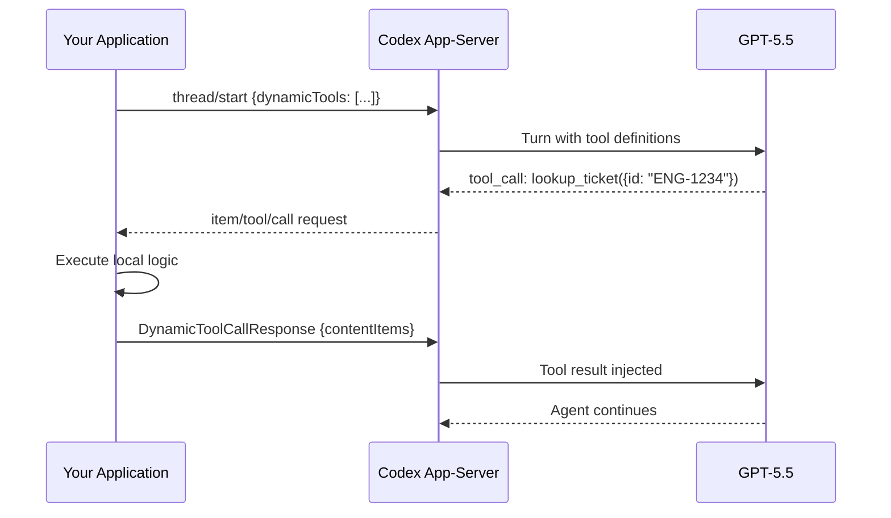

# Codex CLI Dynamic Tools: Building Custom Client-Side Tool Handlers via the App-Server Protocol


---

Every MCP server and built-in skill in Codex CLI runs server-side — the agent invokes it, the sandbox executes it, and results flow back through the turn. But what if the tool you need lives in *your* process? Perhaps you need to query an internal ticketing system behind a VPN, call a proprietary calculation engine, or present a custom approval UI before the agent proceeds.

The **Dynamic Tools** API answers this. Introduced as an experimental feature in the Codex app-server protocol, dynamic tools let clients register custom tool definitions at thread start and handle invocations locally — turning any app-server client into a tool provider without writing or deploying an MCP server[^1].

## Architecture Overview

Dynamic tools invert the normal tool-call flow. Instead of the app-server executing commands in its sandbox, it dispatches tool calls *back to the client* over the same JSON-RPC transport[^2].



The critical distinction: dynamic tools execute in the **client's process**, not in Codex's sandbox. This means they have access to whatever resources your application can reach — local databases, authenticated APIs, hardware peripherals, or interactive UIs[^1].

## Enabling the Experimental API

Dynamic tools require an explicit opt-in during the `initialize` handshake[^1]:

```json
{
  "jsonrpc": "2.0",
  "method": "initialize",
  "id": 1,
  "params": {
    "clientInfo": {
      "name": "my-orchestrator",
      "title": "Custom Orchestrator",
      "version": "1.0.0"
    },
    "capabilities": {
      "experimentalApi": true
    }
  }
}
```

Without `experimentalApi: true`, the app-server silently ignores any `dynamicTools` array on `thread/start`[^2].

## Registering Tools at Thread Start

Tools are declared as part of the `thread/start` request. Each tool definition mirrors the OpenAI Responses API function tool schema[^1][^3]:

```json
{
  "jsonrpc": "2.0",
  "method": "thread/start",
  "id": 2,
  "params": {
    "model": "gpt-5.5",
    "dynamicTools": [
      {
        "name": "lookup_ticket",
        "description": "Fetch a Jira ticket by ID and return its summary, status, and assignee.",
        "inputSchema": {
          "type": "object",
          "properties": {
            "id": { "type": "string", "description": "Ticket ID, e.g. ENG-1234" }
          },
          "required": ["id"],
          "additionalProperties": false
        }
      },
      {
        "name": "run_proprietary_lint",
        "description": "Run the internal Acme linter on a file path and return findings.",
        "deferLoading": true,
        "inputSchema": {
          "type": "object",
          "properties": {
            "file_path": { "type": "string" }
          },
          "required": ["file_path"],
          "additionalProperties": false
        }
      }
    ]
  }
}
```

### Naming Constraints

Tool identifiers follow the same rules as Responses API function tools[^1]:

- `name` must match `^[a-zA-Z0-9_-]+$` (1–128 characters)
- `namespace`, when present, must match `^[a-zA-Z0-9_-]+$` (1–64 characters)
- `inputSchema` must be valid JSON Schema with `additionalProperties: false` at the top level

### The `deferLoading` Flag

Setting `deferLoading: true` keeps the tool registered and callable but **excludes it from the model-facing tool list** on ordinary turns[^1]. The tool remains available to runtime features (such as `js_repl` or code-mode execution) but won't appear as a candidate for the model's tool selection unless explicitly triggered. This is useful for tools that should only fire under specific conditions — for example, a deployment approval tool that only activates when the agent signals readiness.

## Handling Tool Invocations

When the model decides to call a dynamic tool, the app-server emits a server-initiated request to the client[^2]:

### 1. Item Started Notification

```json
{
  "jsonrpc": "2.0",
  "method": "item/started",
  "params": {
    "item": {
      "id": "item_abc123",
      "type": "dynamicToolCall",
      "tool": "lookup_ticket",
      "arguments": "{\"id\": \"ENG-1234\"}",
      "status": "inProgress"
    }
  }
}
```

### 2. Tool Call Request

The app-server sends a JSON-RPC **request** (not a notification) to the client, expecting a response[^2]:

```json
{
  "jsonrpc": "2.0",
  "method": "item/tool/call",
  "id": "call_xyz789",
  "params": {
    "itemId": "item_abc123",
    "tool": "lookup_ticket",
    "arguments": "{\"id\": \"ENG-1234\"}"
  }
}
```

### 3. Client Response

Your client executes the tool logic locally and returns a `DynamicToolCallResponse`[^2]:

```json
{
  "jsonrpc": "2.0",
  "id": "call_xyz789",
  "result": {
    "success": true,
    "contentItems": [
      {
        "type": "text",
        "text": "ENG-1234: Fix auth token refresh\nStatus: In Progress\nAssignee: daniel@example.com\nPriority: P1"
      }
    ]
  }
}
```

### 4. Item Completed Notification

The app-server confirms completion and injects the result into the model's context[^2]:

```json
{
  "jsonrpc": "2.0",
  "method": "item/completed",
  "params": {
    "item": {
      "id": "item_abc123",
      "type": "dynamicToolCall",
      "tool": "lookup_ticket",
      "status": "completed",
      "success": true,
      "contentItems": [...],
      "durationMs": 142
    }
  }
}
```

## TypeScript Implementation Pattern

Using the `@openai/codex-sdk` package (v0.16+), the SDK abstracts the JSON-RPC plumbing[^4]:

```typescript
import { Codex } from "@openai/codex-sdk";

const codex = new Codex();

const thread = codex.startThread({
  model: "gpt-5.5",
  dynamicTools: [
    {
      name: "lookup_ticket",
      description: "Fetch a Jira ticket by ID",
      inputSchema: {
        type: "object",
        properties: { id: { type: "string" } },
        required: ["id"],
        additionalProperties: false,
      },
    },
  ],
  onToolCall: async (tool, args) => {
    if (tool === "lookup_ticket") {
      const ticket = await jiraClient.getIssue(args.id);
      return {
        success: true,
        contentItems: [
          { type: "text", text: `${ticket.key}: ${ticket.summary}\nStatus: ${ticket.status}` },
        ],
      };
    }
    return { success: false, contentItems: [{ type: "text", text: "Unknown tool" }] };
  },
});

const result = await thread.run("Check the status of ENG-1234 and suggest next steps");
console.log(result.text);
```

## Practical Use Cases

### Internal Knowledge Bases

Register a `search_wiki` tool that queries your company's Confluence or Notion workspace. The agent can pull in relevant documentation without you needing to pre-load it as context[^5].

### Custom Approval Gates

A `request_deploy_approval` tool can trigger a Slack message or Teams notification, wait for human response, and return the decision. The agent pauses until your client responds to the `item/tool/call` request[^2].

### Hardware and IoT Integration

For embedded development workflows, a `flash_firmware` tool can trigger a local build-and-flash pipeline, returning success/failure status to the agent for iterative debugging.

### Proprietary Analysis Engines

Static analysis tools, licence scanners, or compliance checkers that cannot be open-sourced or deployed as MCP servers can run locally in your client process and expose results to the agent.

## Thread Persistence and Resumption

Dynamic tool definitions are persisted in the thread's rollout metadata[^1]. When resuming a thread via `thread/resume`, the app-server restores the original dynamic tool registrations automatically — unless you supply a new `dynamicTools` array, which replaces the stored set. This means:

- Sessions can survive restarts without re-registering tools
- Different clients can resume the same thread (provided they implement the same tool handlers)
- Tool schemas evolve gracefully by supplying updated definitions on resume

## Dynamic Tools vs MCP Servers

| Concern | Dynamic Tools | MCP Servers |
|---------|--------------|-------------|
| Execution location | Client process | Separate server process |
| Discovery | Registered per-thread | Configured in `config.toml` |
| Persistence | Thread-scoped | Global/project-scoped |
| Network requirements | None (same transport) | Stdio or HTTP/SSE |
| Approval flow | Implicit (client controls) | Standard sandbox approval |
| Portability | Tied to your client | Reusable across clients |
| Maturity | Experimental | Stable |

Choose dynamic tools when the tool logic *is* your application — when you're building a custom IDE extension, an orchestration platform, or a specialised workflow runner where the client naturally owns the execution context[^2]. Choose MCP when you want tools to be portable, discoverable, and usable across different Codex surfaces (CLI, app, IDE extension).

## Generating Type Definitions

For strongly-typed client development, the app-server can generate its own protocol schema[^2]:

```bash
# TypeScript type definitions
codex app-server generate-ts > codex-protocol.d.ts

# Full JSON Schema bundle
codex app-server generate-json-schema > codex-protocol.json
```

These generated schemas include the `DynamicToolDefinition`, `DynamicToolCallResponse`, and all event types — keeping your client implementation in sync with your installed Codex version.

## Caveats and Limitations

⚠️ **Experimental status**: The dynamic tools API may change without deprecation notice. Pin your Codex version in production integrations.

⚠️ **No sandbox enforcement**: Dynamic tool execution bypasses Codex's sandbox entirely. Your client is responsible for its own security boundaries.

⚠️ **Blocking behaviour**: The agent's turn blocks while waiting for your `item/tool/call` response. Slow handlers stall the entire session. Implement timeouts in your client.

⚠️ **No streaming results**: Dynamic tool responses are returned atomically. You cannot stream partial results back to the model mid-execution (unlike `item/agentMessage/delta` for agent output)[^2].

## What's Next

The dynamic tools API represents Codex's clearest path toward becoming an **embeddable agent runtime** rather than just a CLI tool. As the protocol stabilises, expect:

- Approval policy integration for dynamic tool calls
- Streaming response support for long-running tools
- A `dynamicTools/update` method for mid-session tool registration
- First-class IDE extension support (VS Code, JetBrains) using dynamic tools for editor-specific operations

For teams building custom Codex integrations today, dynamic tools eliminate the need to deploy and maintain separate MCP server processes — at the cost of coupling your tool logic to a single client implementation.

## Citations

[^1]: OpenAI, "App Server – Codex," OpenAI Developers Documentation, 2026. Available: [https://developers.openai.com/codex/app-server](https://developers.openai.com/codex/app-server)

[^2]: OpenAI, "codex-rs/app-server/README.md," GitHub, 2026. Available: [https://github.com/openai/codex/blob/main/codex-rs/app-server/README.md](https://github.com/openai/codex/blob/main/codex-rs/app-server/README.md)

[^3]: OpenAI, "Responses API — Function Tools," OpenAI Platform Documentation, 2026. Available: [https://platform.openai.com/docs/guides/tools-apply-patch](https://platform.openai.com/docs/guides/tools-apply-patch)

[^4]: OpenAI, "SDK – Codex," OpenAI Developers Documentation, 2026. Available: [https://developers.openai.com/codex/sdk](https://developers.openai.com/codex/sdk)

[^5]: OpenAI, "Model Context Protocol – Codex," OpenAI Developers Documentation, 2026. Available: [https://developers.openai.com/codex/mcp](https://developers.openai.com/codex/mcp)
