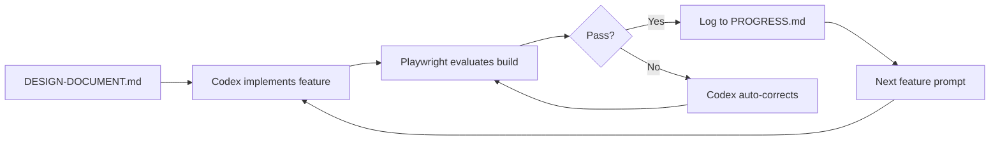
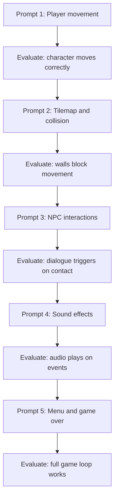

# Codex CLI for Game Prototyping: From Design Document to Playable Build with Godot, Phaser, and Agent Skills


---

Game prototyping rewards fast iteration above all else. You need to get a concept on screen, playtest it, throw away what fails, and refine what sticks — ideally within hours, not weeks. Codex CLI's agent loop maps neatly onto this cadence: describe a mechanic, let the agent scaffold it, verify it visually, and prompt again. OpenAI now lists game development as a first-class use case collection [^1], and a growing ecosystem of community skills, MCP servers, and AGENTS.md templates makes the workflow production-ready.

This article covers two stacks — Godot 4.x for native 2D/3D games and Phaser/PixiJS for browser games — walking through the AGENTS.md patterns, skill configurations, MCP integrations, and the implement–evaluate loop that lets Codex CLI drive a game from design document to playable build.

## The Game Prototyping Loop

Traditional game prototyping follows a tight cycle: design → implement → playtest → adjust. With Codex CLI, the cycle becomes:



Three documents anchor the workflow [^2]:

1. **`DESIGN-DOCUMENT.md`** — game objectives, layout, mechanics, win/fail states, visual direction, and tech stack.
2. **`PROGRESS.md`** — a rolling log the agent reads each turn, acting as session memory and reducing context noise after compaction.
3. **`AGENTS.md`** — the tooling contract: build commands, coding standards, testing expectations, and safety rails.

This structure was demonstrated by a community developer who built a complete 2D Phaser game with zero manual coding, crediting "harness engineering" with progressive disclosure as the key enabler [^2].

## AGENTS.md for Game Projects

A game-specific `AGENTS.md` differs from a typical web application's. It needs to handle engine-specific build systems, asset pipelines, and the fact that "correctness" often means "looks right on screen" rather than "tests pass".

### Godot 4.x Template

```toml
# .codex/config.toml — Godot project profile
[profiles.godot]
model = "gpt-5.5"
sandbox = "workspace-write"

[profiles.godot.tools.web_search]
mode = "cached"
allowed_domains = ["docs.godotengine.org", "github.com/godotengine"]
```

The companion `AGENTS.md` should specify:

```markdown
# AGENTS.md — Godot 4.x Project

## Build & Verify
- Run `godot --headless --import` before any code changes to ensure resources import cleanly.
- Validate GDScript with `gdformat --check --use-spaces=4` and `gdlint`.
- Build C# targets with `dotnet build` when Mono is active; check exit code zero.
- Never commit `.godot/` or `.import/` directory changes.

## Coding Standards
- GDScript: 4-space indentation, class_name declarations at the top, PascalCase for nodes, snake_case for variables and functions.
- Scene files (.tscn): Prefer composition over inheritance. Keep scene trees shallow (≤ 5 levels deep).
- Signals: Declare with `signal` keyword at the top of the script, connect in `_ready()`.

## Asset Pipeline
- Place sprites in `res://assets/sprites/`, audio in `res://assets/audio/`.
- Use the $imagegen skill for placeholder art. Save prompts to `assets/prompts/` for batch regeneration.
- Target 16×16 or 32×32 pixel art for 2D prototypes unless the design document specifies otherwise.
```

The CODEXVault_GODOT project [^3] provides a battle-tested `setup.sh` that installs Godot 4.6 Mono, .NET 8, GDToolkit, and pre-commit hooks in a headless sandbox — essential because Codex CLI's sandbox cannot run a display server. The setup script uses graceful failure logging and timeout guards (20 seconds for `gdformat`) to prevent agent hangs [^3].

### Phaser / Browser Game Template

For browser games, the recommended stack is Next.js with Phaser or PixiJS for rendering, optionally backed by Fastify with WebSockets for multiplayer [^1]:

```markdown
# AGENTS.md — Phaser Browser Game

## Tech Stack
- Phaser 3.80+ for rendering and physics.
- Next.js 15 for the application shell.
- TypeScript strict mode enabled.

## Build & Verify
- `npm run dev` starts the development server on port 3000.
- `npx playwright test` runs the evaluation checklist after each feature.
- Never modify `package-lock.json` manually.

## Game Architecture
- One Phaser.Scene per game state (Boot, Menu, Play, GameOver).
- Keep game config in `src/config/game.config.ts`.
- Physics bodies: use Arcade for prototypes, Matter.js only if the design document requires joints or complex shapes.
```

## Skills That Matter for Game Dev

Codex CLI's skills system — directories containing a `SKILL.md` with YAML frontmatter [^4] — is where game development workflows truly accelerate.

### Built-In Skills

| Skill | Game Dev Use |
|-------|-------------|
| `$imagegen` | Generate sprites, backgrounds, UI elements via gpt-image-2. Save prompts for batch consistency [^1]. |
| `$playwright-interactive` | Play the game in a live browser, inspect state, iterate on controls and timing [^1]. |
| `$jupyter-notebook` | Prototype procedural generation algorithms, visualise level layouts, tune difficulty curves. |

### Community Skills

The ecosystem now offers game-engine-specific skill packs:

- **Phaser skills** — the official Phaser repository ships AI agent skills covering scenes, physics, input, animations, tilemaps, tweens, particles, and cameras [^5].
- **PixiJS skills** — maintained by the PixiJS team, 25 focused skills across Application, Assets, Graphics, Filters, Mesh, and Performance [^6].
- **GodotPrompter** — 45 domain-specific skills for Godot 4.x covering project setup, architecture, gameplay systems, input handling, physics, 2D/3D systems, animation, shaders, audio, and UI [^7].
- **godot-skill** — a portable skill for scene editing workflows including batch transactions, node configuration, Control layout, script attachment, and signal wiring [^8].

Install a community skill pack into your project:

```bash
# Clone Phaser skills into the project skills directory
git clone https://github.com/phaserjs/phaser.git /tmp/phaser-ref
cp -r /tmp/phaser-ref/.agents/skills/* .agents/skills/
```

## MCP Servers for Game Engines

For Godot, several MCP servers bridge the gap between Codex CLI and the live editor [^9]:

```toml
# .codex/config.toml — Godot MCP server
[[mcp_servers]]
name = "godot"
command = "npx"
args = ["-y", "@anthropic/godot-mcp-server"]
```

These servers let agents inspect scenes, edit nodes and scripts, diagnose UI layout issues, work with signals, search project files, and inspect resources — without the agent guessing at API calls that may not exist [^9]. This matters because AI agents frequently misuse Godot classes or call non-existent methods when operating without structured engine context [^9].

For browser games, the built-in Playwright integration serves as the "MCP equivalent" — Codex can launch the dev server, navigate to the game, interact with it, and capture screenshots for visual verification.

## The Implement–Evaluate Loop

The most effective pattern for game prototyping is **progressive prompting** with an automated evaluation checklist [^2]. Rather than describing the entire game in one prompt, build incrementally:



Each evaluation step uses Playwright (for browser games) or headless Godot validation (for native games). A practical evaluation checklist in Playwright:

```typescript
// tests/game-eval.spec.ts
import { test, expect } from '@playwright/test';

test('player spawns and can move', async ({ page }) => {
  await page.goto('http://localhost:3000');
  // Wait for Phaser to initialise
  await page.waitForFunction(() =>
    (window as any).__PHASER_GAME__?.isRunning
  );
  // Verify player sprite exists
  const playerExists = await page.evaluate(() => {
    const scene = (window as any).__PHASER_GAME__
      .scene.getScene('Play');
    return scene?.player !== undefined;
  });
  expect(playerExists).toBe(true);
});

test('collision prevents wall pass-through', async ({ page }) => {
  await page.goto('http://localhost:3000');
  // Simulate movement into wall, verify position unchanged
  // ...
});
```

The `godogen` project [^10] takes this further with **frame-grounded self-repair**: agents judge progress from captured screenshots rather than compilation success alone. A visual defect caught on screen drives the next iteration, preventing the common failure mode where the agent declares success because the build compiled but the game renders incorrectly.

## Subagent Parallelism for Larger Games

For prototypes beyond a single scene, Codex CLI's subagent system [^11] maps naturally onto game architecture:

```
Spawn one subagent per game system:
- Agent 1: Player controller and input handling (src/player/)
- Agent 2: Level generation and tilemap loading (src/levels/)
- Agent 3: UI and HUD implementation (src/ui/)
- Agent 4: Audio manager and sound effects (src/audio/)
Wait for all, then run integration tests.
```

Configure subagent limits in `config.toml`:

```toml
[agents]
max_threads = 4
max_depth = 1
job_max_runtime_seconds = 300
```

Keep `max_depth = 1` to prevent subagents from spawning their own subagents — game systems have enough cross-cutting concerns that recursive delegation tends to create conflicts [^11].

## Practical Recipe: Browser Platformer in One Session

A complete session flow for a browser platformer:

```bash
# 1. Scaffold the project
codex "Create a Next.js project with Phaser 3. \
  Follow the DESIGN-DOCUMENT.md for game mechanics. \
  Use TypeScript strict mode. \
  Set up the Phaser game config with Arcade physics."

# 2. Generate placeholder assets
codex "$imagegen Generate a 32x32 pixel art sprite sheet \
  for a platformer character: idle, run (4 frames), jump. \
  Save to public/assets/player.png"

# 3. Implement core loop
codex "Implement the Play scene: player movement, \
  gravity, platform collision. Run Playwright tests \
  after each change."

# 4. Non-interactive asset batch
codex exec "Generate all remaining placeholder sprites \
  listed in DESIGN-DOCUMENT.md#assets" \
  --profile godot -m gpt-5.5
```

## What Does Not Work Well (Yet)

Honest caveats for game prototyping with Codex CLI:

- **Physics tuning.** Numeric feel — jump height, acceleration curves, friction — still needs human hands on a controller. The agent can set values, but evaluating whether a jump "feels right" is not automatable. ⚠️
- **3D workflows.** Godot 3D scene setup requires visual spatial reasoning that current models handle poorly. Stick to 2D or pre-built 3D templates.
- **Real-time multiplayer.** WebSocket synchronisation, client-side prediction, and rollback netcode involve subtle timing bugs that agents generate more often than they fix. ⚠️
- **Audio timing.** Syncing sound effects to animation frames requires frame-precise testing that Playwright's timing resolution cannot reliably verify.

## Citations

[^1]: [Game development — Codex use cases](https://developers.openai.com/codex/use-cases/collections/game-development) — OpenAI Developers, accessed 2026-05-10.
[^2]: [Show: 2D game built using Codex and agent skills (zero code)](https://community.openai.com/t/show-2d-game-built-using-codex-and-agent-skills-zero-code/1374319) — OpenAI Developer Community, 2026.
[^3]: [CODEXVault_GODOT](https://github.com/FromAriel/CODEXVault_GODOT) — GitHub, BulletProof CODEX Godot-focused scripts for AGENTS.md, accessed 2026-05-10.
[^4]: [Skills — Codex CLI](https://developers.openai.com/codex/skills) — OpenAI Developers, accessed 2026-05-10.
[^5]: [Phaser AI Agent Skills](https://github.com/phaserjs/phaser) — Phaser GitHub, agent skills covering game subsystems, accessed 2026-05-10.
[^6]: [PixiJS Skills](https://pixijs.com/llms) — PixiJS official, 25 focused skills maintained by the PixiJS team, accessed 2026-05-10.
[^7]: [GodotPrompter — Agentic skills framework for Godot 4.x](https://github.com/jame581/GodotPrompter) — GitHub, 45 domain-specific skills, accessed 2026-05-10.
[^8]: [godot-skill — Portable Godot project development skill](https://github.com/haxqer/godot-skill) — GitHub, scene editing workflows and bundled scripts, accessed 2026-05-10.
[^9]: [Godot MCP Servers](https://github.com/Coding-Solo/godot-mcp) — GitHub, MCP server for interfacing with Godot engine, accessed 2026-05-10.
[^10]: [godogen — Autonomous game development for Godot](https://github.com/htdt/godogen) — GitHub, frame-grounded self-repair with screenshot evaluation, accessed 2026-05-10.
[^11]: [Subagents — Codex](https://developers.openai.com/codex/subagents) — OpenAI Developers, accessed 2026-05-10.
