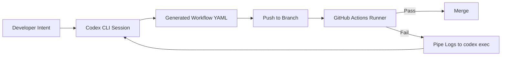

# Codex CLI for GitHub Actions Workflow Authoring: Agent-Assisted CI/CD Configuration, Failure Diagnosis, and Pipeline Optimisation


---

Most coverage of Codex CLI and GitHub Actions focuses on running Codex *inside* CI via `openai/codex-action@v1` [^1]. That is a solved problem. The unsolved problem — and the one that costs teams more cumulative hours — is writing, debugging, and evolving the workflow YAML itself. GitHub Actions configuration is declarative, schema-constrained, and notoriously brittle: a single indentation error, a misspelt context variable, or a misunderstood matrix propagation rule can waste an entire afternoon of push-wait-read-fix cycles [^2].

This article covers using Codex CLI as an **authoring tool** for `.github/workflows/` files — treating CI/CD configuration as first-class code that benefits from agent-assisted development.

## Why Workflow YAML Is Ideal for Agent Assistance

GitHub Actions workflows sit in an awkward middle ground: they are complex enough to require significant expertise (expressions, contexts, matrix strategies, reusable workflows, composite actions, OIDC auth), yet too declarative for traditional debugging tools [^3]. Three properties make them excellent candidates for agent-assisted authoring:

1. **Schema-constrained** — the workflow schema is finite and well-documented, meaning a model can generate syntactically valid YAML with high reliability.
2. **Deterministic feedback** — a failed run produces structured logs that an agent can parse.
3. **Isolated blast radius** — workflow files live in `.github/workflows/` and cannot break application code.



## Interactive Workflow Generation

The simplest pattern is to describe your CI requirements in natural language and let Codex generate the workflow:

```bash
codex "Create a GitHub Actions workflow that runs on push to main and PRs. \
  It should: lint with ESLint, run Jest tests with coverage, build the Next.js app, \
  and deploy to Vercel on main only. Use Node 22, pnpm, and cache pnpm store."
```

Codex will create the file at `.github/workflows/ci.yml`, correctly structuring jobs with dependency chains, caching via `actions/cache`, and conditional deployment steps [^4].

For more complex requirements, use a prompt file:

```bash
codex --prompt-file .github/codex/ci-requirements.md
```

This keeps your CI specification version-controlled and reviewable alongside the generated workflow.

## AGENTS.md Conventions for CI/CD Projects

Configure your project's `AGENTS.md` to enforce quality when Codex touches workflow files:


```markdown
## CI/CD Conventions

- All workflow files MUST pass `actionlint` before commit
- Use `actions/checkout@v4` — never `@master` or `@main`
- Pin third-party actions to full SHA, not tags
- Prefer reusable workflows over duplicated job definitions
- Cache dependencies using the official cache action with a hash of the lockfile
- Never store secrets inline — use `${{ secrets.* }}` references only
- Concurrency groups must use `${{ github.workflow }}-${{ github.ref }}`
- Matrix strategies must include a `fail-fast: false` for debugging
```


This AGENTS.md guidance prevents the most common workflow anti-patterns that agents typically produce: unpinned actions, missing caches, and overly permissive `permissions` blocks [^5].

## Debugging Failed Workflows with codex exec

When a workflow run fails, the fastest path to resolution is piping the failure logs directly into Codex:

```bash
gh run view 12345678 --log-failed | \
  codex exec "Analyse this GitHub Actions failure log. \
    Identify the root cause, explain why it failed, \
    and output a patch to .github/workflows/ci.yml that fixes it."
```

This pattern leverages `codex exec`'s stdin piping capability [^6] to provide the full failure context without manual copy-paste. For structured output suitable for automation:

```bash
gh run view 12345678 --log-failed | \
  codex exec --output-schema '{"diagnosis": "string", "root_cause": "string", "fix_patch": "string"}' \
  "Diagnose this CI failure and provide a fix."
```

The `--output-schema` flag ensures machine-parseable JSON output that downstream scripts can act upon [^7].

## The Self-Healing Feedback Loop

Combine workflow authoring with the autofix pattern for a complete feedback loop. When CI fails, `codex-action` can diagnose and fix the workflow file itself — not just application code:


```yaml
name: Self-Healing CI
on:
  workflow_run:
    workflows: ["CI"]
    types: [completed]

jobs:
  autofix:
    if: ${{ github.event.workflow_run.conclusion == 'failure' }}
    runs-on: ubuntu-latest
    permissions:
      contents: write
      pull-requests: write
    steps:
      - uses: actions/checkout@v4
      - uses: openai/codex-action@v1
        with:
          prompt: |
            The CI workflow failed. Download and analyse the failure logs.
            If the failure is in the workflow configuration itself (not application code),
            fix the workflow YAML file. Otherwise, fix the application code.
          sandbox: workspace-write
          safety-strategy: drop-sudo
        env:
          OPENAI_API_KEY: ${{ secrets.OPENAI_API_KEY }}
```


This approach uses the OpenAI Cookbook's autofix pattern [^8] extended to cover workflow-level failures, not just test or build failures.

## Generating Reusable Workflows and Composite Actions

As repositories grow, workflow duplication becomes a maintenance burden. Codex excels at extracting reusable patterns:

```bash
codex "Refactor .github/workflows/ci.yml and .github/workflows/deploy.yml. \
  Extract the shared setup steps (checkout, Node setup, pnpm install, cache) \
  into a composite action at .github/actions/setup/action.yml. \
  Update both workflows to use the composite action."
```

For organisation-wide reusable workflows:

```bash
codex "Create a reusable workflow at .github/workflows/reusable-node-ci.yml \
  that accepts inputs for node-version, package-manager, and test-command. \
  It should handle checkout, setup, caching, install, lint, test, and build. \
  Include a workflow_call trigger with appropriate inputs and secrets."
```

Codex handles the `workflow_call` trigger configuration, input/output declarations, and the `secrets: inherit` pattern correctly — areas where manual authoring frequently produces validation errors [^9].

## Matrix Strategy Generation

Matrix strategies are powerful but syntactically fiddly. Codex generates them cleanly:

```bash
codex "Add a test matrix to the CI workflow that tests against:
  - Node 20, 22
  - Ubuntu latest, macOS latest
  - pnpm 9, pnpm 10
  Include/exclude: skip pnpm 10 on macOS. Add fail-fast: false."
```

The resulting matrix configuration handles the `include`/`exclude` syntax that is a common source of confusion in hand-written workflows [^3].

## Workflow Optimisation Recipes

### Cache Audit

```bash
codex "Audit all workflow files in .github/workflows/ for caching opportunities. \
  Identify steps that download dependencies without caching, \
  and add appropriate cache keys using content hashes of lockfiles."
```

### Concurrency Control

```bash
codex "Add concurrency groups to all workflows so that:
  - PRs cancel previous runs on the same branch
  - Main branch runs never cancel each other
  Use the standard pattern: workflow name + ref for PRs, workflow name + SHA for main."
```

### Permission Minimisation

```bash
codex "Audit all workflow files for overly permissive permissions blocks. \
  Apply the principle of least privilege: set top-level permissions to read-all, \
  then grant specific permissions per job as needed."
```

This last recipe addresses a critical security concern — the GitHub Actions default of broad permissions when no `permissions` key is specified [^10].

## Validation Before Push

Add a local validation step to your Codex workflow using `actionlint`:

```toml
# config.toml — CI author profile
[profile.ci-author]
model = "gpt-5.5"
approval_policy = "unless-allow-listed"

[profile.ci-author.hooks.PostToolUse]
command = """
if echo "$TOOL_ARGS" | grep -q '.github/workflows/'; then
  actionlint .github/workflows/*.yml 2>&1
fi
"""
on_fail = "stop"
```

This PostToolUse hook runs `actionlint` [^11] automatically whenever Codex modifies a workflow file, catching syntax errors before they reach the remote runner.

## GitHub Agentic Workflows: The Next Evolution

GitHub's Agentic Workflows (technical preview since February 2026) [^12] push this pattern further — you write workflow logic in Markdown rather than YAML, and an AI agent handles execution. The Markdown is compiled to a lockfile, both committed to version control:

```markdown
---
on:
  issues:
    types: [opened]
permissions:
  issues: write
---

# Triage New Issues

Label the issue based on its content. If it mentions CI or workflows,
add the `ci/cd` label. If it mentions a specific package, add a label
matching that package name.
```

This represents the convergence of Codex CLI's agent-assisted authoring with GitHub's native agentic infrastructure [^12]. For teams already using Codex CLI to write their YAML workflows, Agentic Workflows offer a natural migration path for simpler automation tasks.

## Practical Considerations

**Model selection**: Use `gpt-5.5` for complex multi-job workflows with matrix strategies and conditional logic. For simple single-job workflows, `gpt-5.4-mini` produces correct output at a fraction of the cost [^13].

**Context**: When debugging failures, provide the workflow file AND the failure logs. The `--add-dir` flag can include your entire `.github/` directory for full context:

```bash
codex --add-dir .github/ "Fix the deployment workflow failure"
```

**Testing locally**: Combine Codex-generated workflows with `act` [^14] for local validation before pushing:

```bash
codex "Generate the workflow" && act -j build --container-architecture linux/amd64
```

## Citations

[^1]: OpenAI, "GitHub Action — Codex," OpenAI Developers, 2026. https://developers.openai.com/codex/github-action
[^2]: BSWEN, "Common GitHub Actions Mistakes Beginners Make and How to Fix Them," April 2026. https://docs.bswen.com/blog/2026-04-13-github-actions-common-mistakes/
[^3]: GitHub, "GitHub Actions: The Complete CI/CD Guide for Developers," env.dev, 2026. https://env.dev/guides/github-actions-guide
[^4]: OpenAI, "Features — Codex CLI," OpenAI Developers, 2026. https://developers.openai.com/codex/cli/features
[^5]: OpenAI, "Custom instructions with AGENTS.md," OpenAI Developers, 2026. https://developers.openai.com/codex/guides/agents-md
[^6]: OpenAI, "Non-interactive mode — Codex CLI," OpenAI Developers, 2026. https://developers.openai.com/codex/cli/reference
[^7]: OpenAI, "Configuration Reference — codex exec --output-schema," OpenAI Developers, 2026. https://developers.openai.com/codex/config-reference
[^8]: OpenAI, "Use Codex CLI to automatically fix CI failures," OpenAI Cookbook, 2026. https://developers.openai.com/cookbook/examples/codex/autofix-github-actions
[^9]: GitHub, "Reuse workflows," GitHub Docs, 2026. https://docs.github.com/en/actions/how-tos/reuse-automations/reuse-workflows
[^10]: GitHub, "Security hardening for GitHub Actions," GitHub Docs, 2026. https://docs.github.com/en/actions/security-for-github-actions/security-hardening-for-github-actions
[^11]: rhysd, "actionlint — Static checker for GitHub Actions workflow files," GitHub, 2026. https://github.com/rhysd/actionlint
[^12]: GitHub, "GitHub Agentic Workflows are now in technical preview," GitHub Changelog, February 2026. https://github.blog/changelog/2026-02-13-github-agentic-workflows-are-now-in-technical-preview/
[^13]: OpenAI, "Models — Codex," OpenAI Developers, 2026. https://developers.openai.com/codex/models
[^14]: nektos, "act — Run your GitHub Actions locally," GitHub, 2026. https://github.com/nektos/act
