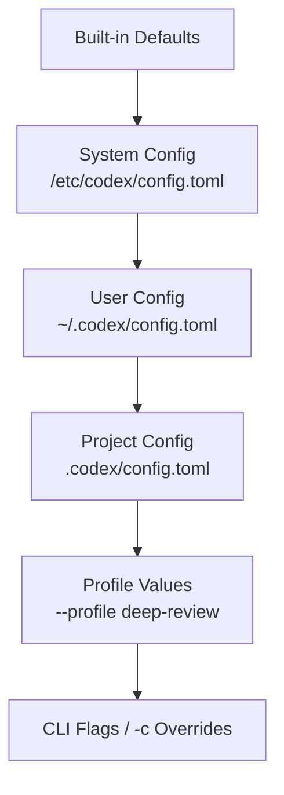
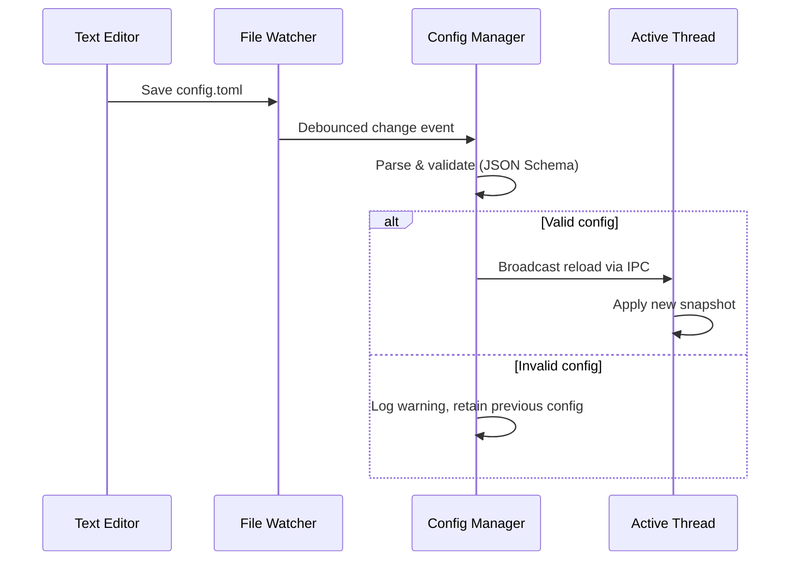

# Codex CLI Live Configuration: Hot-Reload, /debug-config, and Runtime Configuration Management


---

Configuration in Codex CLI has quietly matured from a static file you edit once into a layered, hot-reloadable system that adapts mid-session. Since v0.130.0, running app-server threads pick up `config.toml` changes without a restart [^1]. Combined with the `/debug-config` diagnostic, named profiles, and the `-c` override flag, practitioners now have fine-grained runtime control over every aspect of agent behaviour. This article maps the full configuration surface, explains the live-reload mechanism, and provides patterns for managing config across teams and CI environments.

## The Configuration Hierarchy

Codex resolves settings through six layers, each overriding the one below it [^2][^3]:



The precedence rule is simple: **later layers win**. A project-level `model = "gpt-5.4-mini"` overrides your user-level `model = "gpt-5.5"`, and a CLI flag `-c model='"gpt-5-pro"'` overrides both [^3].

### Project Root Detection

Codex walks up the directory tree looking for project root markers [^3]. By default, any directory containing `.git` is treated as a project root:

```toml
# ~/.codex/config.toml
project_root_markers = [".git", ".hg", ".sl"]
```

The nearest `.codex/config.toml` relative to your working directory loads as the project layer. For monorepos with nested services, place a `.codex/config.toml` in each service directory to scope model and permission choices appropriately.

### Trust Boundaries

Project-scoped configuration only loads for **trusted** projects [^2]. If you open an untrusted repository (one you have not previously approved), Codex skips the project config, hooks, and rules entirely — your user and system layers still apply. This prevents supply-chain attacks via malicious `.codex/config.toml` files in cloned repositories.

## Live Configuration Refresh (v0.130.0)

Prior to v0.130, editing `config.toml` mid-session required restarting Codex for changes to take effect. The v0.130.0 release shipped a **Config Manager** with a cross-platform file-system watcher (debounced), format detection, JSON Schema validation, atomic apply, and rollback [^1][^4]. Running app-server threads now detect changes and refresh their configuration snapshot automatically.

### How It Works

The live-reload mechanism follows this sequence:



If your edit introduces a syntax error or violates a constraint from `requirements.toml`, Codex retains the previous valid configuration and logs a warning — your session continues uninterrupted [^4].

### What Reloads and What Doesn't

Not all settings can change mid-session. The sandbox mode (`read-only`, `workspace-write`, `danger-full-access`) is locked at process startup and cannot be escalated without restarting Codex [^5]. Everything else — model, reasoning effort, approval policy, TUI theme, feature flags, hooks — applies on the next turn after reload.

| Category | Live-Reloadable | Requires Restart |
|----------|:-:|:-:|
| `model` | ✓ | |
| `model_reasoning_effort` | ✓ | |
| `approval_policy` | ✓ | |
| `tui.theme` | ✓ | |
| `features.*` flags | ✓ | |
| `otel.*` settings | ✓ | |
| `sandbox_mode` | | ✓ |
| `shell_environment_policy` | | ✓ |
| `project_root_markers` | | ✓ |

## The /debug-config Diagnostic

When your effective configuration diverges from what you expected, `/debug-config` is the first tool to reach for [^6]. Type it at the Codex prompt and it outputs:

- **Config layer order** — lowest precedence first, showing which files loaded
- **On/off state** — for each feature flag
- **Policy sources** — including `allowed_approval_policies`, `allowed_sandbox_modes`, `mcp_servers`, `rules`, and `enforce_residency`
- **Experimental network constraints** — when configured via `requirements.toml`

This is invaluable for enterprise deployments where `requirements.toml` constrains what developers can override. If your team's managed machine enforces `allowed_approval_policies = ["untrusted"]`, `/debug-config` shows exactly where that constraint originates.

### Complementary Diagnostics

The `/status` command provides a lighter-weight view showing the active model, approval policy, writable roots, and token usage [^6]. Use `/status` for quick confirmation; use `/debug-config` for root-cause analysis when settings feel wrong.

## Named Profiles

Profiles let you define reusable configuration presets in your user-level `config.toml` [^3]:

```toml
# ~/.codex/config.toml
model = "gpt-5.5"
model_reasoning_effort = "medium"

[profiles.deep-review]
model = "gpt-5-pro"
model_reasoning_effort = "xhigh"
service_tier = "fast"

[profiles.ci]
model = "gpt-5.4-mini"
model_reasoning_effort = "low"
service_tier = "flex"
approval_policy = "never"

[profiles.exploration]
model = "gpt-5.5"
model_reasoning_effort = "high"
web_search = "live"
```

Activate a profile at launch:

```bash
codex --profile deep-review
codex --profile ci
```

Profiles merge on top of your base configuration — only the keys explicitly set in the profile override; everything else inherits normally [^3].

### Profile Selection in CI

For `codex exec` pipelines, profiles eliminate the need for long chains of `-c` flags:

```bash
# In GitHub Actions
codex exec --profile ci "Analyse test failures and suggest fixes" \
  --output-schema ./schema.json \
  -o ./result.json < ./test-report.txt
```

## One-Off Overrides with -c

The `-c`/`--config` flag accepts arbitrary TOML key-value pairs with dot notation for nested keys [^3]:

```bash
# Override a single key
codex -c model='"gpt-5-pro"'

# Set a nested value
codex -c sandbox_workspace_write.network_access=true

# Set an array value
codex -c 'shell_environment_policy.include_only=["PATH","HOME","GOPATH"]'

# Combine with profile
codex --profile ci -c model_reasoning_effort='"high"'
```

Note the TOML quoting requirement: string values need inner quotes (`'"value"'`) because the outer quotes are consumed by the shell [^3].

## Practical Patterns

### Pattern 1: Team-Wide Defaults via .codex/config.toml

Commit a project-level configuration to enforce team conventions:

```toml
# .codex/config.toml (checked into repository)
model = "gpt-5.5"
model_reasoning_effort = "medium"
default_permissions = ":workspace"

[features]
memories = true
shell_snapshot = true
```

Individual developers override in their user-level `~/.codex/config.toml` without touching the repository.

### Pattern 2: Live-Tuning Reasoning Effort

During a complex debugging session, open `~/.codex/config.toml` in a separate editor and increase reasoning effort:

```toml
model_reasoning_effort = "xhigh"
```

Save the file. Codex picks up the change on your next prompt — no restart, no context loss, no re-reading the codebase [^1].

### Pattern 3: Enterprise Constraints with requirements.toml

Managed machines can enforce policy floors via `requirements.toml` [^2]:

```toml
# /etc/codex/requirements.toml (admin-managed)
allowed_approval_policies = ["untrusted", "on-request"]
allowed_sandbox_modes = ["read-only", "workspace-write"]
enforce_residency = "eu-west-1"
```

Developers cannot override these constraints — `/debug-config` shows them as enforced system policies. This is the mechanism for enterprise governance without restricting individual productivity on permitted settings.

### Pattern 4: Observability Profile for Production Debugging

```toml
[profiles.observe]
model = "gpt-5.5"
model_reasoning_effort = "high"
hide_agent_reasoning = false

[profiles.observe.otel]
exporter = "otlp-http"
trace_exporter = "otlp-http"
log_user_prompt = true
environment = "production-debug"
```

Activate with `codex --profile observe` when you need full telemetry export during incident triage, then switch back to your default profile for everyday work.

## Mid-Session Slash Commands vs Configuration

Codex provides slash commands that modify behaviour without touching `config.toml` [^5][^6]:

| Slash Command | Effect | Persists? |
|--------------|--------|:---------:|
| `/model gpt-5-pro` | Switch model for remainder of session | Session only |
| `/permissions` | Toggle approval preset | Session only |
| `/statusline` | Reconfigure TUI footer | Saves to config.toml |
| `/theme` | Change syntax highlighting | Saves to config.toml |
| `/keymap debug` | Inspect terminal key events | Session only |

The distinction matters: `/model` applies immediately but does not survive a restart, whereas editing `config.toml` persists and now live-reloads into running sessions [^1].

## Troubleshooting Configuration Issues

When configuration behaves unexpectedly:

1. **Run `/debug-config`** — confirms which files loaded and which constraints are enforced
2. **Check trust status** — untrusted projects skip `.codex/config.toml` entirely
3. **Validate TOML syntax** — a parse error in any layer causes that layer to be skipped silently
4. **Verify profile name** — a typo in `--profile` falls back to base config without warning
5. **Check live-reload logs** — if a config edit was rejected, Codex logs the validation error to `~/.codex/logs/`

For CI pipelines, add `codex status` (non-interactive) or `/status` (interactive) as the first step to confirm the active configuration before the agent begins work.

## Citations

[^1]: OpenAI. "Codex CLI v0.130.0 Changelog." *OpenAI Developers*, 8 May 2026. [https://developers.openai.com/codex/changelog](https://developers.openai.com/codex/changelog)

[^2]: OpenAI. "Config basics – Codex." *OpenAI Developers*, 2026. [https://developers.openai.com/codex/config-basic](https://developers.openai.com/codex/config-basic)

[^3]: OpenAI. "Advanced Configuration – Codex." *OpenAI Developers*, 2026. [https://developers.openai.com/codex/config-advanced](https://developers.openai.com/codex/config-advanced)

[^4]: GitHub Issue #3860. "Dynamic profile switching + hot-reload for Codex CLI/IDE." *openai/codex*, 2026. [https://github.com/openai/codex/issues/3860](https://github.com/openai/codex/issues/3860)

[^5]: OpenAI. "Dynamic Session Control in Codex CLI." *Codex Blog*, 13 April 2026. [https://codex.danielvaughan.com/2026/04/13/codex-cli-dynamic-session-control-mid-session-switching/](https://codex.danielvaughan.com/2026/04/13/codex-cli-dynamic-session-control-mid-session-switching/)

[^6]: OpenAI. "Slash commands in Codex CLI." *OpenAI Developers*, 2026. [https://developers.openai.com/codex/cli/slash-commands](https://developers.openai.com/codex/cli/slash-commands)
