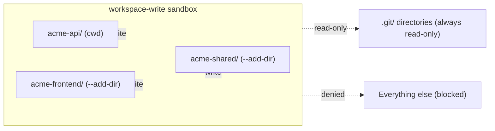
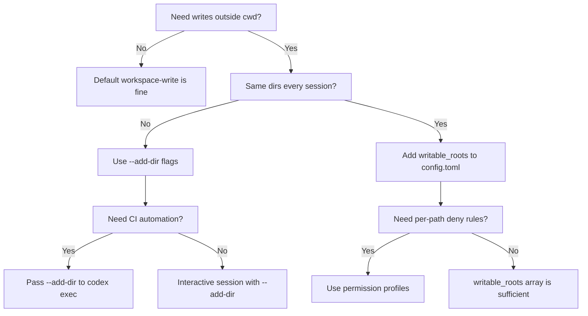

# Codex CLI Multi-Directory Workflows: Coordinating Cross-Repo Changes with --add-dir, Writable Roots, and Permission Profiles


---

Real-world product work rarely fits inside a single directory. A feature ticket that touches a React frontend, a FastAPI backend, and a shared types package requires coordinated edits across three separate trees — often three separate Git repositories. Codex CLI's default `workspace-write` sandbox restricts writes to the current working directory [^1], which is exactly the safety boundary you want until it becomes the thing blocking your agent from finishing the job.

This article covers every mechanism Codex CLI provides for safe multi-directory access: the `--add-dir` flag, `writable_roots` in `config.toml`, the newer permission profiles with `:project_roots`, and AGENTS.md hierarchical loading across directory boundaries.

## The Problem: One Workspace, Many Repos

Consider a typical polyrepo layout:

```
~/code/
  acme-frontend/    # Next.js app
  acme-api/         # FastAPI service
  acme-shared/      # Shared TypeScript types + Python models
```

You launch Codex from `acme-api/` and ask it to add a new endpoint together with the corresponding frontend component and shared type definition. Under the default `workspace-write` sandbox, Codex can read files anywhere the OS allows, but it can only write inside `~/code/acme-api/` [^1]. Any attempt to create a file in `acme-frontend/` or `acme-shared/` is blocked by the sandbox before the patch reaches the filesystem.

The naive escape hatch — `--sandbox danger-full-access` — removes all filesystem restrictions [^2]. That is a sledgehammer when you need a scalpel. The safer approach is to widen the writable boundary just enough.

## --add-dir: The CLI Flag for Ad-Hoc Multi-Directory Access

The `--add-dir` flag grants additional directories write access alongside the main workspace [^3]. It can be repeated for multiple paths:

```bash
codex --cd ~/code/acme-api \
      --add-dir ~/code/acme-frontend \
      --add-dir ~/code/acme-shared \
      "Add a GET /users/:id endpoint, the shared User type, and the frontend UserProfile component"
```

Key behaviours:

- **Does not change the working directory.** The agent's `cwd` remains `acme-api/`. The additional directories are mounted as writable roots within the sandbox [^3].
- **Each path must exist** before Codex starts. Non-existent paths are silently ignored.
- **Scope narrowly.** Granting write access to `/home` or `/etc` defeats the purpose of sandboxing [^4].
- **Works with `codex exec` too.** Non-interactive automation can pass `--add-dir` identically, enabling CI scripts that span repositories.



### Platform-Specific Sandbox Enforcement

The writable-root boundary is enforced by platform-native mechanisms, not just prompt instructions [^5]:

- **macOS:** Seatbelt SBPL profiles enumerate each writable path explicitly.
- **Linux:** Bubblewrap bind-mounts only the specified directories as read-write.
- **Windows:** DACL grants restrict token access to the listed paths.

This means an agent cannot circumvent the restriction by running `mv` or `ln -s` — the kernel-level sandbox blocks it.

## writable_roots in config.toml: Persistent Multi-Directory Access

If you routinely work across the same set of directories, baking them into your configuration avoids repetitive flags:

```toml
# ~/.codex/config.toml

sandbox_mode = "workspace-write"

[sandbox_workspace_write]
writable_roots = [
  "/Users/you/code/acme-frontend",
  "/Users/you/code/acme-shared",
]
network_access = false
```

The `writable_roots` array accepts absolute paths [^6]. They are merged with the current working directory at startup — any directory in the list becomes writable for every session launched under this configuration.

### Project-Scoped Configuration

For team-shared setups, place the configuration in the project's `.codex/config.toml`:

```toml
# ~/code/acme-api/.codex/config.toml

[sandbox_workspace_write]
writable_roots = [
  "../acme-frontend",
  "../acme-shared",
]
```

Relative paths are resolved from the project root [^7]. This approach commits the multi-directory boundary into the repository, so every team member gets the same access scope without remembering flags.

## Permission Profiles: Fine-Grained Filesystem Control

Codex v0.124+ introduced named permission profiles that replace the flat `sandbox_mode` + `writable_roots` pattern with a richer policy language [^8]. Profiles let you define per-path access levels, deny specific file patterns, and scope permissions relative to detected project roots.

```toml
# ~/.codex/config.toml

default_permissions = "polyrepo"

[permissions.polyrepo.filesystem]
":project_roots" = { "." = "write", "**/*.env" = "none", "**/.git/**" = "read" }
"/Users/you/code/acme-frontend" = "write"
"/Users/you/code/acme-shared" = "write"
glob_scan_max_depth = 3

[permissions.polyrepo.network]
enabled = false
```

The `:project_roots` placeholder is resolved dynamically based on `project_root_markers` (defaulting to `[".git", ".hg", ".sl"]`) [^9]. This means you can define a single profile that works across any project without hardcoding paths for the primary workspace.

### Denying Sensitive Paths

The `"none"` access level prevents both reads and writes, which is useful for ensuring the agent never touches secrets files even when the parent directory is writable:

```toml
[permissions.polyrepo.filesystem]
":project_roots" = { "." = "write" }
"**/*.env" = "none"
"**/.env.local" = "none"
"**/secrets/**" = "none"
```

### Built-In Profiles

Codex ships three built-in profiles [^8]:

| Profile | Behaviour |
|---|---|
| `:read-only` | No writes, no command execution |
| `:workspace` | Writes within detected project roots |
| `:danger-no-sandbox` | Unrestricted access |

Custom profiles (without the leading colon) layer on top of these defaults.

## AGENTS.md Across Directory Boundaries

When Codex operates across multiple directories, each directory can carry its own `AGENTS.md`. Codex concatenates instruction files from the project root downward to the current working directory [^10], but `--add-dir` directories have their own project roots and their own AGENTS.md hierarchies.

### Practical Pattern: Polyrepo AGENTS.md

Place a root-level `AGENTS.md` in each repository describing its conventions:

```
~/code/acme-api/AGENTS.md        → Python/FastAPI conventions
~/code/acme-frontend/AGENTS.md   → TypeScript/Next.js conventions
~/code/acme-shared/AGENTS.md     → Shared type generation rules
```

When Codex works across all three via `--add-dir`, it discovers and loads each repository's `AGENTS.md` independently. The agent sees the combined context and can respect per-repository conventions — using `pytest` for the backend and `vitest` for the frontend, for instance.

### The Override Mechanism

`AGENTS.override.md` at any level temporarily replaces the base `AGENTS.md` at that level without deleting it [^10]. This is particularly useful in polyrepo setups where you want to inject cross-cutting instructions:

```
~/code/acme-api/AGENTS.override.md
```

```markdown
# Cross-Repo Sprint Rules (temporary)

When modifying shared types in acme-shared/, always update the
corresponding Pydantic model in acme-api/models/ AND the Zod
schema in acme-frontend/schemas/.
```

Remove the override file to restore normal guidance.

## Worked Example: End-to-End Feature Across Three Repos

```bash
# Launch Codex with all three repos writable
codex --cd ~/code/acme-api \
      --add-dir ~/code/acme-frontend \
      --add-dir ~/code/acme-shared \
      --sandbox workspace-write
```

Inside the session:

```
You: Add a "user preferences" feature:
     1. Shared type UserPreferences in acme-shared/types/
     2. GET/PUT /users/:id/preferences endpoints in acme-api/
     3. PreferencesPanel component in acme-frontend/components/
     4. Tests for all three
```

Codex reads the AGENTS.md from each repository, generates the shared type first (since both downstream repos depend on it), then creates the API endpoints and frontend component. The sandbox allows writes to all three directories but blocks any attempt to modify files outside them.

### Reviewing Changes Across Repos

After the agent finishes, review changes per repository:

```bash
cd ~/code/acme-shared && git diff
cd ~/code/acme-api && git diff
cd ~/code/acme-frontend && git diff
```

Each repository maintains its own Git history. Codex does not attempt cross-repo commits — that remains a human decision [^11].

## Non-Interactive Automation with codex exec

The `--add-dir` flag works identically in non-interactive mode [^12], enabling CI pipelines that span repositories:

```bash
codex exec \
  --cd ~/code/acme-api \
  --add-dir ~/code/acme-frontend \
  --add-dir ~/code/acme-shared \
  --sandbox workspace-write \
  "Update all OpenAPI client stubs from the latest acme-api spec"
```

Combine with `--output-schema` for structured reporting:

```bash
codex exec \
  --cd ~/code/acme-api \
  --add-dir ~/code/acme-frontend \
  --output-schema '{"type":"object","properties":{"files_changed":{"type":"array","items":{"type":"string"}},"repos_affected":{"type":"array","items":{"type":"string"}}}}' \
  "Synchronise shared types and regenerate all downstream stubs"
```

## Known Limitations and Caveats

1. **Diff panel scope.** The TUI diff panel currently shows changes relative to the primary `cwd` repository. Changes in `--add-dir` directories may not appear in the inline diff viewer [^11]. Use `git diff` in each repo after the session.

2. **Linux --add-dir bug (pre-v0.122).** Versions before v0.122 had a bug where `--add-dir` did not correctly propagate to the Bubblewrap sandbox on some Linux distributions. The workaround was to use `writable_roots` in `config.toml` instead [^13]. This has been addressed in subsequent releases.

3. **AGENTS.md size limit.** Combined instruction files across all directories are capped at `project_doc_max_bytes` (32 KiB by default) [^10]. With three verbose AGENTS.md files, you may hit this limit. Keep instructions concise or raise the cap.

4. **No cross-repo Git operations.** Codex treats each repository's `.git/` directory as read-only [^5]. The agent cannot create branches or commits spanning multiple repos. Orchestrate that from your shell or CI script.

5. **Context window pressure.** Reading files from three repositories consumes context rapidly. Consider using `/compact` proactively or configuring `model_auto_compact_token_limit` when working across large codebases [^14].

## Decision Framework



## Summary

Codex CLI provides a graduated set of tools for multi-directory work, from the quick `--add-dir` flag for ad-hoc sessions, through persistent `writable_roots` for habitual patterns, to full permission profiles for enterprise-grade filesystem policies. The key principle: widen the sandbox boundary just enough for the task, never more.

For polyrepo teams, the combination of per-repo AGENTS.md files, project-scoped `.codex/config.toml` with relative `writable_roots`, and `AGENTS.override.md` for cross-cutting sprint rules creates a configuration surface that scales from solo developer to large engineering organisation without sacrificing the safety guarantees that make agent-assisted development trustworthy.

## Citations

[^1]: [Sandbox — Codex Concepts, OpenAI Developers](https://developers.openai.com/codex/concepts/sandboxing) — workspace-write mode restricts writes to the primary workspace directory.
[^2]: [Sandbox — Codex Concepts, OpenAI Developers](https://developers.openai.com/codex/concepts/sandboxing) — `danger-full-access` removes all filesystem and network restrictions.
[^3]: [Features — Codex CLI, OpenAI Developers](https://developers.openai.com/codex/cli/features) — `--add-dir` grants additional directories write access alongside the main workspace.
[^4]: [Command line options — Codex CLI, OpenAI Developers](https://developers.openai.com/codex/cli/reference) — safety guidance on scoping writable directories narrowly.
[^5]: [Sandbox — Codex Concepts, OpenAI Developers](https://developers.openai.com/codex/concepts/sandboxing) — platform-native enforcement via Seatbelt, Bubblewrap, and Windows DACL.
[^6]: [Configuration Reference — Codex, OpenAI Developers](https://developers.openai.com/codex/config-reference) — `sandbox_workspace_write.writable_roots` accepts an array of absolute paths.
[^7]: [Config basics — Codex, OpenAI Developers](https://developers.openai.com/codex/config-basic) — project-scoped `.codex/config.toml` configuration layering.
[^8]: [Advanced Configuration — Codex, OpenAI Developers](https://developers.openai.com/codex/config-advanced) — named permission profiles with filesystem and network policies.
[^9]: [Advanced Configuration — Codex, OpenAI Developers](https://developers.openai.com/codex/config-advanced) — `:project_roots` placeholder and `project_root_markers` configuration.
[^10]: [Custom instructions with AGENTS.md — Codex, OpenAI Developers](https://developers.openai.com/codex/guides/agents-md) — hierarchical AGENTS.md discovery and `project_doc_max_bytes` limit.
[^11]: [Multi-repo support — GitHub Issue #11956, openai/codex](https://github.com/openai/codex/issues/11956) — diff panel limitations and cross-repo change review.
[^12]: [Non-interactive mode — Codex, OpenAI Developers](https://developers.openai.com/codex/noninteractive) — `codex exec` supports the same flags as interactive mode.
[^13]: [--add-dir write access bug — GitHub Issue #18448, openai/codex](https://github.com/openai/codex/issues/18448) — Linux sandbox propagation bug and `writable_roots` workaround.
[^14]: [Context compaction — Codex, OpenAI Developers](https://developers.openai.com/codex/config-reference) — `model_auto_compact_token_limit` configuration for managing context window pressure.
