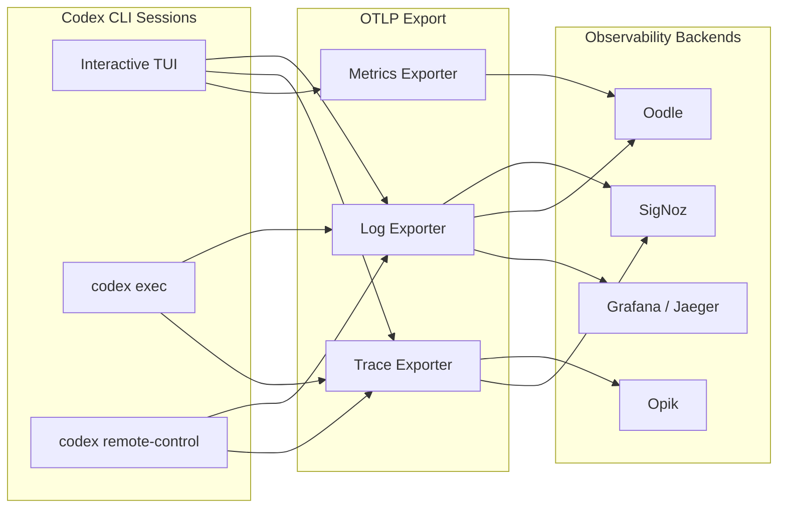

# Codex CLI Observability Dashboards: Production Monitoring with SigNoz, Oodle, and Opik


---

Running Codex CLI in a team of one requires no observability. Running it across a dozen developers, each spawning interactive sessions, CI pipelines, and background `codex exec` jobs, demands answers to questions that terminal output cannot provide: who is consuming tokens, which models are cost-effective, where are agent loops stalling, and how does approval friction map to session duration? Since v0.117, Codex has shipped opt-in OpenTelemetry export[^1]. With v0.130 (8 May 2026), that surface expanded to include separate trace and metrics exporters, configurable span attributes, and TLS mutual authentication for enterprise endpoints[^2]. Three third-party platforms — SigNoz, Oodle, and Opik — now offer pre-built Codex integrations that turn raw OTLP events into actionable dashboards. This article walks through all three, compares what each provides, and shows how to wire the configuration for a production deployment.

## What Codex Emits

Before choosing a backend, it helps to understand the telemetry surface. Codex emits structured OpenTelemetry log events covering the full session lifecycle[^1]:

- **Conversation starts** with model, sandbox mode, and approval policy metadata
- **API request/response pairs** including token counts (input, output, cached, reasoning)
- **Tool decisions** (shell commands, file writes, MCP calls) with timing data
- **Tool results** including exit codes and truncated output
- **User prompts** (opt-in via `log_user_prompt`)

As of v0.130, the interactive TUI, `codex exec`, and `codex remote-control` all emit telemetry. The `codex mcp-server` entrypoint still has gaps tracked in Issue #12913[^3].



## The v0.130 Configuration Reference

Codex's `[otel]` section in `config.toml` supports three independent exporter channels — logs, traces, and metrics — each configurable with separate endpoints, headers, and TLS settings[^4].

### Minimal Setup: Logs Only

```toml
[otel]
environment = "production"
log_user_prompt = false

exporter = { otlp-http = {
  endpoint = "https://otel-collector.internal:4318/v1/logs",
  protocol = "binary",
  headers = { "Authorization" = "Bearer ${OTEL_TOKEN}" }
}}
```

### Full Setup: Logs, Traces, and Metrics to Separate Endpoints

```toml
[otel]
environment = "production"
log_user_prompt = false

# Log events (conversation starts, tool decisions, prompts)
exporter = { otlp-http = {
  endpoint = "https://logs.observability.internal/v1/logs",
  protocol = "binary",
  headers = { "x-api-key" = "${OTEL_API_KEY}" }
}}

# Distributed traces (span-level timing)
trace_exporter = { otlp-http = {
  endpoint = "https://traces.observability.internal/v1/traces",
  protocol = "binary",
  headers = { "x-api-key" = "${OTEL_API_KEY}" }
}}

# Metrics (token counters, latency histograms)
metrics_exporter = { otlp-http = {
  endpoint = "https://metrics.observability.internal/v2/otlp/metrics",
  protocol = "binary",
  headers = { "x-api-key" = "${OTEL_API_KEY}" }
}}
```

### Enterprise TLS Configuration

For environments behind TLS-inspecting proxies or requiring mutual TLS:

```toml
[otel]
exporter = { otlp-grpc = {
  endpoint = "https://otel.corp.internal:4317",
  headers = { "x-team" = "platform-engineering" },
  tls.ca-certificate = "/etc/ssl/corp-ca.pem",
  tls.client-certificate = "/etc/ssl/codex-client.pem",
  tls.client-private-key = "/etc/ssl/codex-client-key.pem"
}}
```

This resolves a long-standing friction point where developers behind corporate proxies could not export telemetry without custom certificate handling[^4].

## SigNoz: Open-Source Dashboards with a Pre-Built Codex Template

SigNoz is an open-source observability platform built natively on OpenTelemetry[^5]. It offers a dedicated Codex monitoring integration and a pre-built dashboard template — making it the lowest-friction option for teams that want production dashboards without vendor lock-in.

### Configuration

```toml
[otel]
environment = "production"
log_user_prompt = true

exporter = { otlp-grpc = {
  endpoint = "https://ingest.eu.signoz.cloud:443",
  headers = { "signoz-ingestion-key" = "${SIGNOZ_KEY}" }
}}
```

For self-hosted SigNoz, point the endpoint at your collector (`http://signoz-otel-collector:4317`) and remove the ingestion key header[^5].

### The Codex Dashboard Template

SigNoz ships a pre-built dashboard with 13 panels covering four monitoring dimensions[^6]:

| Dimension | Panels | What It Shows |
|-----------|--------|---------------|
| **Usage & Cost** | Total tokens, cached tokens, cache utilisation | Token burn rate and cache efficiency |
| **Performance** | P95 command duration, request success rate | Where sessions stall or fail |
| **Adoption** | Conversation frequency, user distribution, environment breakdown | Which developers use Codex and from where |
| **Model & Tool** | Model distribution, tokens per model, tool type usage | Cost allocation by model and workflow type |

The User Decisions panel — a pie chart of acceptance versus rejection rates for agent-proposed commands — gives engineering managers a proxy for trust calibration across the team[^6].

### When to Choose SigNoz

SigNoz is strongest when your organisation already runs an OpenTelemetry collector, wants self-hosted options, or needs logs, traces, and metrics in a single pane. The open-source tier provides full functionality; SigNoz Cloud adds managed infrastructure and the pre-built Codex dashboard template[^5].

## Oodle: Session-Level Agent Observability

Oodle positions itself as an AI agent observability platform — distinct from general-purpose OTLP backends, it structures data around agent sessions rather than generic service spans[^7]. For Codex, this means turn-by-turn session reconstruction.

### Configuration

```toml
[otel]
environment = "production"
log_user_prompt = true

exporter = { otlp-http = {
  endpoint = "https://logs.oodle.example/ingest/otel/v1/logs",
  protocol = "binary",
  headers = {
    "X-API-KEY" = "${OODLE_API_KEY}",
    "X-OODLE-INSTANCE" = "${OODLE_INSTANCE_ID}"
  }
}}

metrics_exporter = { otlp-http = {
  endpoint = "https://metrics.oodle.example/v2/otlp/metrics/${OODLE_INSTANCE_ID}",
  protocol = "binary",
  headers = {
    "X-API-KEY" = "${OODLE_API_KEY}",
    "X-OODLE-INSTANCE" = "${OODLE_INSTANCE_ID}"
  }
}}
```

Oodle also supports one-click setup through its Settings → Integrations → AI Agent Observability tile[^7].

### The Session Timeline

Oodle's differentiator is the Sessions interface. Each session displays:

- **User email, model, prompt count, duration, tool calls, token totals, and error count** in a summary row
- **Expandable turn-by-turn event timeline** with raw JSON payloads
- **Grouped views by conversation ID** for multi-turn reconstruction

The Grafana-embedded charts dashboard adds aggregate views: token consumption trends, WebSocket success/failure rates, tool invocation activity, and latency measurements including end-to-end duration, time-to-first-token, and time-to-first-message[^7].

### Unique Metrics

Oodle captures infrastructure performance signals that other platforms miss: startup prewarm duration, shell snapshot timing, and WebSocket request patterns — useful for diagnosing latency that originates in the harness rather than the model[^7].

### When to Choose Oodle

Oodle is strongest when you need session-level forensics — debugging why a specific developer's session stalled, auditing what a CI agent touched, or correlating tool call patterns with token spend. Its agent-native data model avoids the impedance mismatch of fitting agent telemetry into generic APM schemas.

## Opik: Trace-First LLM Observability

Opik, from Comet, takes a trace-first approach. Where SigNoz and Oodle consume log events, Opik ingests distributed traces — making it the natural choice for teams that want span-level visibility into the agent loop's internal timing[^8].

### Configuration

```toml
[otel]
trace_exporter = "otlp-http"
log_user_prompt = false

[otel.trace_exporter.otlp-http]
endpoint = "https://www.comet.com/opik/api/v1/private/otel/v1/traces"
protocol = "binary"
headers = {
  "Authorization" = "Bearer ${OPIK_API_KEY}",
  "Comet-Workspace" = "my-workspace",
  "projectName" = "codex-production"
}
```

For self-hosted Opik, adjust the endpoint to your deployment URL and remove the workspace header[^8].

### Trace Analysis

Opik records every step from prompt chains to tool calls, letting you search and filter by custom tags. Each trace shows the full span tree — model inference, tool execution, sandbox overhead, and approval wait times — with wall-clock timing at every level[^8].

### When to Choose Opik

Opik is strongest when you already use Comet for ML experiment tracking, want trace-level (not just session-level) visibility, or need to compare Codex performance across model versions using Opik's evaluation framework.

## Comparison Matrix

| Capability | SigNoz | Oodle | Opik |
|------------|--------|-------|------|
| **Primary signal** | Logs + traces + metrics | Logs + metrics | Traces |
| **Pre-built Codex dashboard** | ✅ 13-panel template | ✅ Grafana-embedded | ❌ Manual setup |
| **Session reconstruction** | Partial (via trace correlation) | ✅ Native turn-by-turn | ✅ Via span trees |
| **Self-hosted option** | ✅ Open-source | ❌ Cloud only | ✅ Open-source |
| **mTLS support** | ✅ Via collector | ✅ | ✅ |
| **Token cost tracking** | ✅ | ✅ | ❌ (traces only) |
| **WebSocket/infra metrics** | ❌ | ✅ | ❌ |
| **ML experiment correlation** | ❌ | ❌ | ✅ |
| **Codex-specific setup docs** | ✅ | ✅ | ✅ |
| **Price** | Free tier + Cloud paid | Paid | Free tier + Cloud paid |

## Dual-Export Pattern

You do not need to pick just one. Codex's separate `exporter`, `trace_exporter`, and `metrics_exporter` channels let you route different signals to different backends:

```toml
[otel]
environment = "production"
log_user_prompt = true

# Session logs → SigNoz for dashboards and alerting
exporter = { otlp-grpc = {
  endpoint = "https://ingest.eu.signoz.cloud:443",
  headers = { "signoz-ingestion-key" = "${SIGNOZ_KEY}" }
}}

# Distributed traces → Opik for span-level debugging
trace_exporter = { otlp-http = {
  endpoint = "https://www.comet.com/opik/api/v1/private/otel/v1/traces",
  protocol = "binary",
  headers = {
    "Authorization" = "Bearer ${OPIK_KEY}",
    "Comet-Workspace" = "engineering"
  }
}}

# Metrics → Oodle for infrastructure performance
metrics_exporter = { otlp-http = {
  endpoint = "https://metrics.oodle.example/v2/otlp/metrics/${OODLE_ID}",
  protocol = "binary",
  headers = { "X-API-KEY" = "${OODLE_KEY}" }
}}
```

This three-backend configuration routes each signal to the platform best suited to consume it, without duplication at the Codex level[^4].

## Profile-Based Observability

Use named profiles to switch observability configurations by context:

```toml
[profile.dev.otel]
environment = "development"
exporter = "none"

[profile.ci.otel]
environment = "ci"
exporter = { otlp-http = {
  endpoint = "https://ingest.signoz.cloud:443/v1/logs",
  headers = { "signoz-ingestion-key" = "${SIGNOZ_KEY}" }
}}
log_user_prompt = true

[profile.production.otel]
environment = "production"
exporter = { otlp-grpc = {
  endpoint = "https://otel-collector.internal:4317"
}}
trace_exporter = { otlp-http = {
  endpoint = "https://opik.internal/v1/traces",
  protocol = "binary"
}}
```

Then invoke the relevant profile: `codex -p ci exec "Run the test suite"` or `codex -p production`[^4].

## Practical Deployment Checklist

1. **Start with log export only.** The `exporter` channel captures 90% of what you need for cost tracking and adoption metrics. Add `trace_exporter` and `metrics_exporter` when you need span-level debugging or infrastructure performance data.

2. **Keep `log_user_prompt = false` by default.** Enable it only in environments where prompt text is acceptable in your telemetry pipeline. Enterprise compliance teams should review prompt logging against data classification policies.

3. **Use profiles to disable export in development.** Local sessions do not need to hit production OTLP endpoints. Set `exporter = "none"` in your default or `dev` profile.

4. **Batch latency is real.** Codex batches OTLP events asynchronously and flushes on shutdown. Expect a 10–30 second delay before data appears in your backend[^5]. Do not rely on real-time alerting for individual session events.

5. **Monitor the `codex exec` gap.** As of v0.130, `codex exec` emits logs and traces but not all metrics. If your cost accounting depends on metrics counters from CI pipelines, supplement with log-derived token counts until Issue #12913 is fully resolved[^3].

6. **Test TLS before rollout.** Corporate proxy environments commonly break OTLP export. Use the mTLS configuration with explicit CA certificate paths if you see TLS handshake failures.

## What Comes Next

The v0.130 release notes mention configurable span attributes and W3C tracestate fields[^2], enabling teams to inject custom metadata (team ID, cost centre, sprint) into every exported span. ⚠️ The exact `[otel.span_attributes]` and `[otel.tracestate]` configuration syntax is documented in the release notes but not yet reflected in the official configuration reference page[^4]. Early adopters should consult the v0.130.0 GitHub release for the current schema.

## Citations

[^1]: [OpenAI Codex Advanced Configuration — OTEL section](https://developers.openai.com/codex/config-advanced)
[^2]: [Codex CLI Changelog — v0.130.0, 8 May 2026](https://developers.openai.com/codex/changelog)
[^3]: [GitHub Issue #12913 — codex exec and codex mcp-server OTEL telemetry gaps](https://github.com/openai/codex/issues/12913)
[^4]: [OpenAI Codex Configuration Reference — OTEL keys](https://developers.openai.com/codex/config-reference)
[^5]: [SigNoz — OpenAI Codex Observability & Monitoring](https://signoz.io/docs/codex-monitoring/)
[^6]: [SigNoz — OpenAI Codex Dashboard Template](https://signoz.io/docs/dashboards/dashboard-templates/codex-dashboard/)
[^7]: [Oodle — OpenAI Codex Agent Observability](https://docs.oodle.ai/ai-agent-observability/codex)
[^8]: [Opik (Comet) — OpenAI Codex Integration](https://www.comet.com/docs/opik/integrations/openai-codex)
