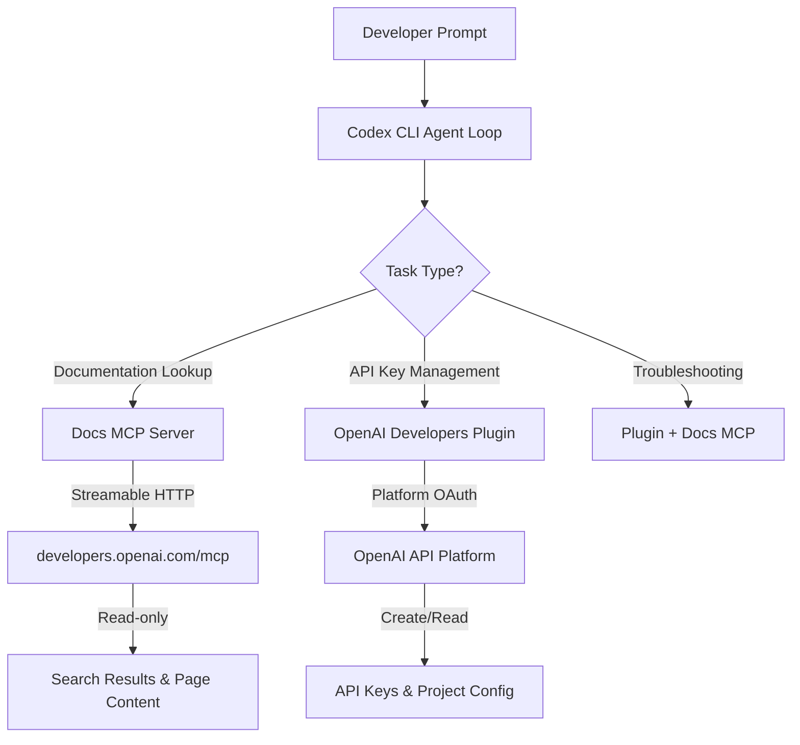

# The OpenAI Developers Plugin and Docs MCP: Building on the OpenAI Platform from Inside Codex CLI


---

On 7 May 2026, OpenAI released the **OpenAI Developers plugin** for Codex — a first-party plugin that connects your Codex CLI sessions directly to the OpenAI platform for API key management, documentation retrieval, and API troubleshooting [^1]. Alongside it sits the **Docs MCP server**, a streamable HTTP endpoint that gives any MCP-compatible agent read-only access to the full `developers.openai.com` documentation corpus [^2].

Together, these two components solve a problem every developer building on the OpenAI API has faced: context-switching between your editor, the docs site, the API dashboard, and Stack Overflow whenever you hit an authentication error or forget a parameter name. With the plugin installed, Codex can look up the correct Responses API schema, create a project API key, and diagnose a 429 rate-limit error — all without leaving the terminal.

This article walks through installation, configuration, and five practical workflows for developers building applications on the OpenAI platform.

## Architecture: Plugin vs Docs MCP

The OpenAI Developers plugin and the Docs MCP server are complementary but independent components. Understanding the boundary matters for security and configuration.



The **Docs MCP server** is documentation-only — it cannot call the OpenAI API on your behalf [^2]. It provides search and page-content retrieval across `developers.openai.com` and `platform.openai.com`. The **plugin** goes further: it authenticates against the OpenAI platform and can create project API keys, inspect organisation settings, and diagnose API failures [^1].

The bundled **OpenAI Docs Skill** (`SKILL.md`) instructs the agent to prefer Docs MCP tools for OpenAI questions before falling back to web search, ensuring answers come from canonical sources rather than potentially stale blog posts [^3].

## Installation

### Docs MCP Server (Standalone)

If you only need documentation access — perhaps you already manage API keys through the dashboard — add the MCP server directly:

```bash
codex mcp add openaiDeveloperDocs --url https://developers.openai.com/mcp
```

Or add it to your user-level configuration:

```toml
# ~/.codex/config.toml
[mcp_servers.openaiDeveloperDocs]
url = "https://developers.openai.com/mcp"
```

This works in any MCP-compatible tool, not just Codex CLI. The same endpoint can be added to VS Code, Cursor, or the Agents SDK [^2].

### Full Plugin (Docs MCP + Platform Access + Troubleshooting)

For the complete experience, install the plugin through the CLI's marketplace browser:

```bash
codex
# then type:
/plugins
# search for "OpenAI Developers", select Install
```

The plugin will prompt you to connect the bundled OpenAI Platform app. Complete the OAuth flow to grant Codex permission to manage API keys under your **Default Organisation** and **Default Project** [^1].

After installation, start a new thread — plugins do not activate in existing sessions [^1].

### Verifying the Installation

Confirm both components are active:

```bash
# Check MCP servers
codex
/mcp
# Should list openaiDeveloperDocs with status "connected"

# Check plugin
/plugins
# Should show "OpenAI Developers" with a green status indicator
```

## Configuration Profiles

For teams building on the OpenAI API, create a dedicated profile that loads the Docs MCP alongside your project's AGENTS.md:

```toml
# ~/.codex/config.toml

[profiles.openai-dev]
model = "gpt-5.5"
model_reasoning_effort = "high"
approval_policy = "unless-allow-listed"

[profiles.openai-dev.mcp_servers.openaiDeveloperDocs]
url = "https://developers.openai.com/mcp"
```

Launch with:

```bash
codex --profile openai-dev
```

For CI pipelines that need documentation access but should never create API keys, use the standalone MCP server without the plugin. This provides the documentation benefits without platform write access.

## Five Practical Workflows

### 1. Scaffolding a New Agents SDK Project

Rather than tabbing between the Agents SDK quickstart guide and your editor, ask Codex directly:

```
Set up a new Python project using the OpenAI Agents SDK with a
single agent that has web search and code interpreter tools.
Use the latest API patterns from the official docs.
```

With the Docs MCP active, Codex will pull the current Agents SDK guide, verify the correct import paths, and scaffold a working project using the Responses API — not a hallucinated version of a deprecated Completions API pattern [^4].

### 2. API Key Provisioning During Development

When your application needs an API key and you have the full plugin installed:

```
Create a new project API key for my local development environment
and save it to .env as OPENAI_API_KEY
```

The plugin creates the key under your Default Organisation and Default Project, then the agent writes it to your `.env` file [^1]. This eliminates the dashboard round-trip that breaks flow during initial project setup.

> **Security note:** The plugin creates keys in your Default Project. For production applications, create keys manually through the dashboard with appropriate project scoping and rate limits.

### 3. Diagnosing API Errors In-Session

When you hit an API error during development, paste the error directly:

```
I'm getting this error from the Responses API:

Error code: 400 - {'error': {'message': "Invalid parameter:
tools[0].type must be one of 'function', 'file_search',
'web_search_preview', 'computer_use_preview', 'mcp'",
'type': 'invalid_request_error'}}

What's wrong and how do I fix it?
```

The plugin identifies common OpenAI API failures and routes you to the correct documentation page [^1]. In this case, it would pull the current tool types from the Responses API reference and show you the correct schema [^5].

### 4. Migrating from Completions to Responses API

For teams still using the Chat Completions API, combine the Docs MCP with a migration AGENTS.md:

```markdown
# AGENTS.md

## Migration Context
We are migrating from the Chat Completions API to the Responses API.
Use the OpenAI Docs MCP to verify all API schemas before making changes.
Do NOT use deprecated endpoints or parameters.

## Conventions
- All API calls must use the Responses API (`/v1/responses`)
- Use the `input` parameter, not `messages`
- Tool definitions follow the Responses API schema
```

Then run:

```bash
codex --profile openai-dev "Migrate src/api/client.py from Chat Completions to the Responses API. Verify every parameter against the official docs."
```

### 5. Building Custom MCP Servers with Docs as Reference

When building your own MCP server, the Docs MCP becomes invaluable for getting the protocol right:

```
Build a custom MCP server in Python using FastMCP that exposes
our internal knowledge base. Follow the official OpenAI MCP server
building guide for the correct schema, especially the search and
fetch tool compatibility schema for ChatGPT deep research.
```

The agent will pull the MCP server building guide from `developers.openai.com` and implement the correct `search` and `fetch` tool schemas that ChatGPT expects [^6].

## AGENTS.md Template for OpenAI API Projects

For repositories that build on the OpenAI platform, this AGENTS.md template ensures Codex uses authoritative documentation:

```markdown
# AGENTS.md

## Project
This project builds on the OpenAI API (Responses API, Agents SDK).

## Documentation Policy
- ALWAYS use the OpenAI Docs MCP tools to verify API schemas,
  parameter names, and endpoint URLs before writing API calls
- NEVER rely on training data for API specifics — the docs are
  the single source of truth
- Flag any API parameter or endpoint that the Docs MCP cannot
  confirm with ⚠️

## Models
- Production: gpt-5.5
- Development/testing: gpt-5.4-mini
- Cost-sensitive batch: codex-mini-latest

## Testing
- Run `pytest tests/` after any API integration change
- Verify API key is set: `echo $OPENAI_API_KEY | head -c 8`

## Security
- Never commit API keys or tokens
- Use .env files for local development
- Use environment variables in CI/CD
```

## Security Considerations

The OpenAI Developers plugin has platform write access — it can create API keys. Three precautions:

1. **Do not install the plugin in CI/CD environments.** Use the standalone Docs MCP server for documentation access in pipelines. The MCP server is read-only and cannot modify your account [^2].

2. **Audit key creation.** Any API key the plugin creates appears in your OpenAI dashboard under Default Organisation → Default Project. Review these periodically.

3. **Project scoping.** The plugin creates keys under the Default Project. If your organisation uses multiple projects with different rate limits and budgets, create production keys manually through the dashboard with appropriate project assignment [^1].

For enterprise teams using `requirements.toml` for managed configuration, you can enforce the Docs MCP while blocking the full plugin:

```toml
# requirements.toml (managed by IT/security)
[mcp_servers.openaiDeveloperDocs]
url = "https://developers.openai.com/mcp"

# Plugin installation governed by marketplace allowlists
```

## Comparison: Docs MCP vs Plugin vs Web Search

| Capability | Docs MCP | Plugin | Web Search |
|---|---|---|---|
| Documentation lookup | ✅ Authoritative | ✅ Via bundled skill | ⚠️ May return stale results |
| API key creation | ❌ | ✅ | ❌ |
| Error diagnosis | ❌ | ✅ | ⚠️ Generic answers |
| Cross-tool compatible | ✅ VS Code, Cursor, etc. | ❌ Codex only | ✅ |
| Write access to platform | ❌ | ✅ | ❌ |
| CI/CD safe | ✅ | ❌ | ✅ |
| Authentication required | ❌ | ✅ OAuth | ❌ |

## Limitations and Known Issues

- **Documentation scope.** The Docs MCP indexes `developers.openai.com` and `platform.openai.com`. It does not cover the OpenAI Cookbook, GitHub issues, or community forums. For cookbook examples, web search remains necessary.

- **Plugin scope.** The plugin operates under your Default Organisation and Default Project. Multi-organisation setups require manual dashboard configuration for non-default projects [^1].

- **Latency.** The Docs MCP server adds a network round-trip per documentation query. For offline or air-gapped environments, it will not function. Consider caching results in your AGENTS.md for stable, frequently-referenced API patterns.

- **No API execution.** Neither the Docs MCP nor the plugin will make OpenAI API calls on your behalf beyond key management. Your application code handles all actual API requests [^2].

## Getting Started Checklist

1. Add the Docs MCP server: `codex mcp add openaiDeveloperDocs --url https://developers.openai.com/mcp`
2. Optionally install the full plugin via `/plugins` for API key management
3. Create an `openai-dev` profile in `config.toml`
4. Add the AGENTS.md documentation policy template to your repository
5. Test with: `codex --profile openai-dev "What tools does the Responses API support? Use the docs MCP to verify."`

For teams building on the OpenAI platform, the combination of the Docs MCP and the Developers plugin eliminates the most common source of wasted time in API development: context-switching to verify parameter names, schema shapes, and endpoint URLs. The documentation comes to you.

## Citations

[^1]: OpenAI, "OpenAI Developers plugin for Codex," developers.openai.com, May 2026. [https://developers.openai.com/learn/developers-codex-plugin](https://developers.openai.com/learn/developers-codex-plugin)

[^2]: OpenAI, "Docs MCP," developers.openai.com, 2026. [https://developers.openai.com/learn/docs-mcp](https://developers.openai.com/learn/docs-mcp)

[^3]: OpenAI, "Agent Skills – Codex," developers.openai.com, 2026. [https://developers.openai.com/codex/skills](https://developers.openai.com/codex/skills)

[^4]: OpenAI, "Use Codex with the Agents SDK," developers.openai.com, 2026. [https://developers.openai.com/codex/guides/agents-sdk](https://developers.openai.com/codex/guides/agents-sdk)

[^5]: OpenAI, "Responses API Reference," developers.openai.com, 2026. [https://developers.openai.com/api/docs/guides/responses](https://developers.openai.com/api/docs/guides/responses)

[^6]: OpenAI, "Building MCP servers for ChatGPT Apps and API integrations," developers.openai.com, 2026. [https://developers.openai.com/api/docs/mcp](https://developers.openai.com/api/docs/mcp)
