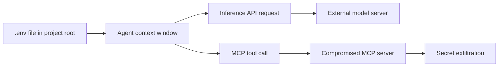
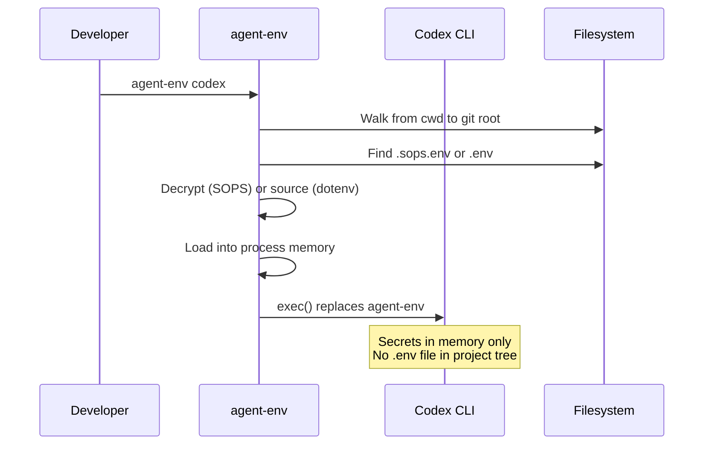
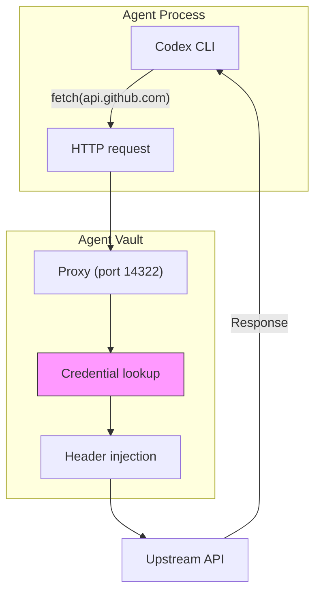
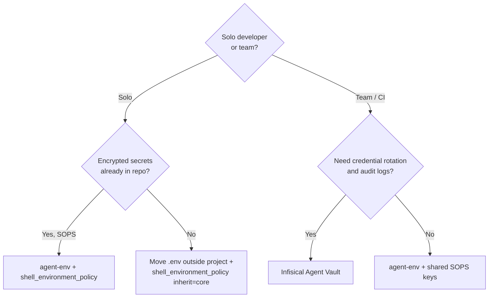

# Codex CLI Secrets Defence: Preventing .env Leakage with shell_environment_policy, agent-env, and Infisical Agent Vault


---

AI coding agents read your project files to provide context-aware assistance. That same context-gathering behaviour means they can silently ingest `.env` files containing API keys, database credentials, and tokens — then transmit them to inference servers you do not control [^1]. Knostic's Spring 2026 research demonstrated concrete exfiltration paths via MCP integrations [^2], and Infisical documented how Cursor, Claude Code, and Codex all traverse working directories without respecting `.gitignore` rules [^1].

Codex CLI is better positioned than most competitors because its sandbox and `shell_environment_policy` configuration provide defence-in-depth at the process level. This article examines the threat model, Codex CLI's built-in protections, and two complementary tools — `agent-env` and Infisical Agent Vault — that eliminate plaintext secrets from the agent's reach entirely.

## The Threat Model



Three distinct leakage vectors exist:

1. **Context inclusion** — The agent reads `.env` as part of project traversal and sends its contents to the model provider as input tokens [^1].
2. **MCP amplification** — Once secrets are in memory, a compromised or malicious MCP server can extract them through tool call parameters [^2].
3. **Subprocess inheritance** — Commands spawned by the agent inherit the parent shell's environment, potentially exposing credentials to arbitrary processes.

Claude Code loads `.env` files automatically without disclosure [^3]. Cursor's `.cursorignore` mechanism is opt-in and inconsistent [^1]. Codex CLI's sandbox, by contrast, applies environment filtering *before* any subprocess executes.

## Codex CLI's Built-in Defence: shell_environment_policy

The `[shell_environment_policy]` section in `~/.codex/config.toml` controls precisely which environment variables reach agent-spawned subprocesses [^4]. The policy executes in sequence: baseline inheritance, then include/exclude filtering, then explicit overrides.

### Configuration Reference

```toml
[shell_environment_policy]
# Baseline: 'all' inherits everything, 'core' inherits PATH/HOME/TERM only,
# 'none' starts with an empty environment
inherit = "core"

# Glob patterns to exclude — applied after baseline
exclude = [
  "*_API_KEY",
  "*_SECRET",
  "*_TOKEN",
  "PASSWORD",
  "AWS_*",
  "OPENAI_API_KEY",
  "ANTHROPIC_API_KEY",
  "DATABASE_URL",
]

# Explicit variables to inject (overrides everything above)
[shell_environment_policy.set]
NODE_ENV = "development"
LANG = "en_GB.UTF-8"
```

### How It Defends

| Policy setting | Effect |
|---|---|
| `inherit = "core"` | Strips all variables except `PATH`, `HOME`, `TERM`, `USER` [^4] |
| `exclude` globs | Catches credentials that match common naming patterns |
| `ignore_default_excludes = false` (default) | Codex automatically strips variables containing `KEY`, `SECRET`, or `TOKEN` in their names before your custom excludes run [^4] |

Even if a `.env` file has been sourced into your shell, the sandbox will not pass those variables to commands Codex executes — provided `inherit` is set to `core` or `none`.

### Limitations

`shell_environment_policy` protects *subprocesses*. It does not prevent Codex from *reading* a `.env` file as a text file and including its contents in the model context. For that, you need either filesystem-level deny rules or — better — to remove plaintext secrets from the project directory entirely.

## Removing Secrets from the Filesystem: agent-env

`agent-env` is a lightweight wrapper that loads secrets from encrypted SOPS files or standard `.env` files into memory, then replaces itself with the agent process via `exec` [^5]. After the exec, `agent-env` ceases to exist — only the agent process remains, with secrets available solely as in-memory environment variables.

### Installation and Usage

```bash
# Install via Homebrew
brew install agent-env/tap/agent-env

# Run Codex CLI with secrets injected from an encrypted SOPS file
agent-env codex

# Or with an explicit env file outside the project
agent-env --file ~/.secrets/myproject.env codex
```

### How It Works



Key properties:

- **Auto-detection** — Checks for a `^sops:` header to determine format; SOPS files are decrypted via `sops exec-env`, dotenv files sourced with `set -a` [^5].
- **No shell history exposure** — Secrets never appear in command arguments.
- **Git-root-aware** — Walks the directory tree from `cwd` upward, stopping at the git root, with global fallbacks in `~/.config/agent-env/`.

### Combining with shell_environment_policy

When using `agent-env`, configure Codex to inherit the full environment so the injected secrets reach subprocesses that legitimately need them (e.g., `npm test` requiring `DATABASE_URL`):

```toml
[shell_environment_policy]
inherit = "all"
exclude = [
  "OPENAI_API_KEY",     # Never pass your Codex API key to subprocesses
  "ANTHROPIC_API_KEY",
]
```

This setup means secrets are in memory (injected by `agent-env`) but the `.env` file is no longer in the project tree — Codex cannot read it as file context.

## Defence in Depth: Infisical Agent Vault

For teams requiring enterprise-grade secrets management, Infisical Agent Vault operates as a credential broker that never exposes secrets to the agent process at all [^6]. Instead, it intercepts outbound HTTP requests and injects credentials at the network layer.

### Architecture



The agent makes normal API calls. Agent Vault intercepts them transparently, attaches the correct credentials (API keys, bearer tokens, basic auth), and forwards upstream [^6]. The agent never sees, stores, or logs the underlying secret.

### Setup with Codex CLI

```bash
# Install Agent Vault
curl --proto '=https' --proto-redir '=https' --tlsv1.2 \
  -fsSL https://get.agent-vault.dev | sh

# Start the vault server (daemonised)
agent-vault server -d

# Add a credential
agent-vault vault credential add \
  --name "github-api" \
  --host "api.github.com" \
  --header "Authorization: Bearer ghp_xxxxx"

# Launch Codex through the vault proxy
agent-vault run -- codex
```

The `agent-vault run` command:
1. Creates a scoped session automatically.
2. Sets `HTTPS_PROXY` and `HTTP_PROXY` environment variables.
3. Configures CA trust for the proxy's TLS interception certificate.
4. Launches Codex transparently [^6].

### Security Properties

| Property | Mechanism |
|---|---|
| Credentials never in agent memory | Proxy-layer injection only [^6] |
| AES-256-GCM encryption at rest | Vault storage layer |
| Argon2id master password | Key derivation for local vaults |
| Unmatched host policy | `deny` blocks requests to unexpected destinations |
| Request logging | Method, host, path, status — never bodies or headers [^6] |

### Container and CI Integration

For containerised Codex workloads (Docker, Daytona, E2B), the TypeScript SDK handles session creation:

```typescript
import { AgentVault, buildProxyEnv } from "@infisical/agent-vault-sdk";

const av = new AgentVault({
  token: process.env.AGENT_VAULT_TOKEN!,
  address: "http://localhost:14321",
});

const session = await av.vault("default").sessions.create({
  vaultRole: "proxy"
});
const env = buildProxyEnv(
  session.containerConfig!,
  "/etc/ssl/agent-vault-ca.pem"
);
// Pass `env` to container spawn
```

## Decision Framework



| Approach | Complexity | Agent sees secrets? | Rotation support | Audit trail |
|---|---|---|---|---|
| `shell_environment_policy` only | Low | File readable, subprocess filtered | Manual | None |
| `agent-env` wrapper | Low | No file; memory-only in subprocess | Manual (re-encrypt) | None |
| Infisical Agent Vault | Medium | Never — proxy injection | Automatic | Full request logs |

## Hardening Checklist

1. **Set `inherit = "core"`** in `shell_environment_policy` as baseline.
2. **Remove `.env` from project directories** — use `agent-env` or a vault.
3. **Add filesystem deny rules** in your AGENTS.md or `config.toml`:
   ```toml
   [sandbox]
   deny_read = [".env", ".env.*", "*.pem", "*.key"]
   ```
4. **Audit MCP servers** — any MCP integration can become an exfiltration vector if compromised [^2].
5. **Pin `unmatched_host_policy = "deny"`** in Agent Vault for production workloads.
6. **Test with `codex exec`** — run a test prompt that requests environment variables and verify nothing sensitive appears in output.

## Conclusion

The `.env` leakage problem is structural: AI coding agents are designed to gather comprehensive context, and secrets stored as plaintext files in the working directory are indistinguishable from legitimate context. Codex CLI's `shell_environment_policy` provides meaningful subprocess-level defence that competitors lack by default, but it does not prevent file-level reads. The layered approach — `shell_environment_policy` for subprocess isolation, `agent-env` or Agent Vault for eliminating plaintext secrets from the filesystem — closes both vectors without degrading the development workflow.

---

## Citations

[^1]: Infisical, "Your AI Coding Agent is Reading Your .env File," May 2026. [https://infisical.com/blog/your-ai-coding-agent-is-reading-your-env-file](https://infisical.com/blog/your-ai-coding-agent-is-reading-your-env-file)

[^2]: Knostic, "From .env to Leakage: Mishandling of Secrets by Coding Agents," 2026. [https://www.knostic.ai/blog/claude-cursor-env-file-secret-leakage](https://www.knostic.ai/blog/claude-cursor-env-file-secret-leakage)

[^3]: Knostic, "Claude Code Automatically Loads .env Secrets, Without Telling You," 2026. [https://www.knostic.ai/blog/claude-loads-secrets-without-permission](https://www.knostic.ai/blog/claude-loads-secrets-without-permission)

[^4]: OpenAI, "Configuration Reference — Codex," 2026. [https://developers.openai.com/codex/config-reference](https://developers.openai.com/codex/config-reference)

[^5]: agent-env, "Universal secret injection for AI coding agents," 2026. [https://agent-env.com/](https://agent-env.com/)

[^6]: Infisical, "Agent Vault: The Open Source Credential Proxy and Vault for Agents," 2026. [https://github.com/Infisical/agent-vault](https://github.com/Infisical/agent-vault)

[^7]: OpenAI, "Agent Approvals & Security — Codex," 2026. [https://developers.openai.com/codex/agent-approvals-security](https://developers.openai.com/codex/agent-approvals-security)
