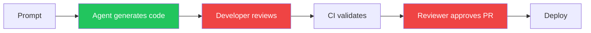
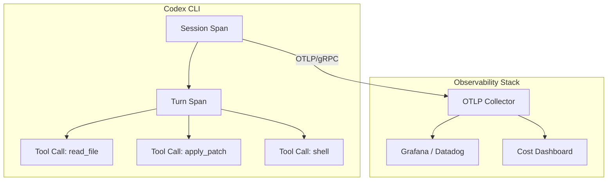

# Measuring Codex CLI's Impact on Your Team: DORA Metrics, Token Telemetry, and the AI Productivity Paradox


---

Your team adopted Codex CLI three months ago. Pull requests are up. Developers report feeling faster. But your DORA metrics haven't moved — or they've got worse. Welcome to the AI productivity paradox, and the reason you need a measurement strategy that goes beyond vibes.

## The Paradox: Faster Individuals, Flat Delivery

The 2025 DORA State of AI-Assisted Software Development report confirmed what many engineering leaders suspected: AI coding tools boost individual throughput but leave organisational delivery flat [^1]. The headline numbers are striking:

- **21% more tasks** completed per developer
- **98% more pull requests** merged
- **441% increase** in median time spent in PR review
- **54% increase** in bugs per developer [^2]

Farrag's systematic literature review (arXiv:2605.01160, May 2026) formalised this as the **Productivity-Reliability Paradox (PRP)**: controlled studies show 20–56% individual speed gains, yet large-scale telemetry across 10,000+ developers shows a 98% increase in merged pull requests coinciding with a 91% increase in review time and flat organisational delivery [^3].

The binding constraint, Farrag concludes, is "specification discipline, not model capability" [^3]. In practical terms: Codex CLI can generate code faster than your team can review it, and without deliberate governance the downstream bottleneck absorbs every upstream gain.

## Why Traditional Metrics Mislead

The instinct is to measure what's easy: lines generated, PRs opened, time-to-first-commit. These **input metrics** will almost always look positive with Codex CLI — that's the easy half of the paradox.

What matters is the full pipeline:



The green stage (generation) accelerates. The red stages (human review, PR approval) often slow down — because there's more code to review, more PRs in the queue, and reviewers must verify agent-generated output with less contextual familiarity than if they'd written it themselves.

A robust measurement framework tracks **both sides** of this equation.

## The Three-Layer Measurement Framework

### Layer 1: DORA Delivery Metrics (Organisational)

The four classic DORA metrics remain your north star for whether Codex CLI adoption is translating into actual delivery improvement [^1]:

| Metric | What to watch for | Codex CLI risk |
|--------|-------------------|----------------|
| **Deployment Frequency** | Should increase or hold steady | May increase superficially via trivial deployments |
| **Lead Time for Changes** | First commit to production | Review bottleneck may increase lead time |
| **Change Failure Rate** | Percentage of deployments causing incidents | Agent-generated code may introduce subtle bugs |
| **Mean Time to Recovery** | Time to restore service after failure | Codex exec can accelerate triage — watch for improvement |

Track these **before and after** adoption, with at least four weeks of baseline. The DORA report found that organisations with mature DevOps practices are far more likely to convert AI-driven productivity gains into measurable delivery improvements [^1].

### Layer 2: Codex-Specific Telemetry (Team)

Codex CLI ships with built-in telemetry that most teams ignore. Three data sources matter:

#### The Analytics Dashboard

The enterprise governance dashboard tracks active users by product surface — CLI, IDE extension, cloud, desktop, and Code Review — with workspace and per-user breakdowns including credit and token usage [^4]. Key views:

- **User ranking tables** with sortable metrics (credits, threads, tokens, streaks)
- **Code Review activity** (PRs reviewed, comments, priority issues flagged)
- **Date-range controls** for daily and weekly comparison

Data lags up to 12 hours, which is fine for trend analysis [^4].

#### The Analytics API

For automated reporting and integration with your existing BI tooling, the Analytics API provides structured metrics at `https://api.chatgpt.com/v1/analytics/codex` [^4]:

```bash
# Pull weekly workspace usage for the past 30 days
curl -s "https://api.chatgpt.com/v1/analytics/codex/workspace?period=weekly&lookback=30d" \
  -H "Authorization: Bearer $CHATGPT_ADMIN_TOKEN" \
  | jq '.data[] | {week: .period, active_users: .active_users, total_tokens: .total_tokens}'
```

The API supports daily or weekly UTC buckets, per-client breakdowns, and up to 90-day lookback periods with cursor-based pagination [^4].

#### Reasoning Token Tracking

Since v0.130, `codex exec --json` reports reasoning-token usage per turn [^5]. This is crucial for cost attribution:

```bash
# Extract reasoning tokens from a codex exec session
codex exec --json "Refactor the auth module to use dependency injection" 2>/dev/null \
  | jq 'select(.type == "usage") | {input: .input_tokens, output: .output_tokens, reasoning: .reasoning_tokens}'
```

Reasoning tokens are part of the output charge but reveal how much "thinking" the model does per task — a proxy for task complexity [^5].

### Layer 3: Code Quality Signals (Individual)

The Compliance API deliberately excludes lines-of-code and acceptance-rate metrics to avoid perverse incentives [^4]. Instead, measure quality through your existing tooling:

| Signal | Tool | What it tells you |
|--------|------|-------------------|
| **Code churn** | GitClear, git log analysis | Lines reverted within 14 days — Farrag's pilot saw churn drop from 12–18% to 6–10% with specification governance [^3] |
| **Review cycle time** | GitHub/GitLab analytics | Time from PR open to merge — the bottleneck indicator |
| **Bug density** | Issue tracker correlation | Bugs per PR, segmented by agent-assisted vs manual |
| **Test coverage delta** | Coverage tools | Whether agent-generated code ships with adequate tests |

## Building the Measurement Pipeline

Here's a practical `codex exec` recipe that generates a weekly team health report:

```bash
codex exec --json \
  --output-schema '{"type":"object","properties":{"week":{"type":"string"},"prs_opened":{"type":"integer"},"prs_merged":{"type":"integer"},"median_review_hours":{"type":"number"},"agent_assisted_prs":{"type":"integer"},"bugs_opened":{"type":"integer"},"deployment_count":{"type":"integer"},"change_failure_rate":{"type":"number"}},"required":["week","prs_opened","prs_merged","median_review_hours"]}' \
  "Analyse the past week's git log and GitHub PR data for this repository. Count PRs opened, merged, median review time in hours, how many PRs mention codex or agent in their description, bugs opened in the issue tracker, deployment count from CI, and change failure rate."
```

For continuous tracking, wire this into a Monday morning automation:

```toml
# .codex/config.toml — weekly metrics profile
[profile.metrics]
model = "gpt-5.4-mini"
approval_policy = "never"
reasoning_effort = "low"
```

## The OTEL Export Path

For teams running observability stacks, Codex CLI exports spans via OTLP/gRPC [^6]:

```toml
# ~/.codex/config.toml
[telemetry]
otlp_endpoint = "http://otel-collector:4317"
otlp_protocol = "grpc"
```

This feeds Codex session data — including tool calls, model latency, and token counts — into Grafana, Datadog, or your SIEM of choice. The span hierarchy maps each turn to its tool invocations, giving you per-task cost attribution without manual tracking [^6].



## What the Data Should Change

Once you have the pipeline running, use the data to make three decisions:

### 1. Identify the Review Bottleneck

If median review time is climbing while PR count increases, you have the classic PRP pattern. Responses:

- Enable Guardian `auto_review` to pre-screen low-risk changes [^7]
- Configure PostToolUse hooks to run linters and type-checkers before the PR is even opened
- Set `approval_policy = "unless-allow-listed"` to auto-approve file reads and test runs

### 2. Right-Size Model Selection

If reasoning tokens per task are consistently low for routine work, you're overspending. Use profile-based model routing:

```toml
[profile.routine]
model = "gpt-5.4-mini"
reasoning_effort = "low"

[profile.architecture]
model = "gpt-5.5"
reasoning_effort = "high"
```

The Analytics API's per-user token data reveals which developers and task types consume disproportionate resources [^4].

### 3. Detect Quality Degradation Early

The DORA report found a 54% increase in bugs per developer with AI tool adoption [^2]. If your bug density is climbing:

- Tighten AGENTS.md testing requirements
- Add PostToolUse hooks that enforce minimum test coverage
- Reduce `approval_policy` permissiveness until quality stabilises

## The Specification Discipline Lever

Farrag's pilot study found that specification-driven development — writing structured specs before handing tasks to the agent — produced measurable improvements [^3]:

- Median lead time: 8–12 days → 6–9 days
- Late-stage hotfixes: 3–5 per sprint → 1–2
- Code churn: 12–18% → 6–10%
- Developer confidence (Likert 1–5): 3.1 → 3.9

In Codex CLI terms, this translates to:

1. **Use Plan Mode** (`/plan`) for any task touching more than two files
2. **Write PLANS.md** before executing complex changes
3. **Configure AGENTS.md** with explicit testing and review requirements
4. **Require structured output** from `codex exec` for repeatable tasks

## What Not to Measure

The Compliance API's deliberate exclusion of lines-of-code and acceptance-rate metrics is a design decision worth respecting [^4]. Measuring generated lines incentivises verbosity. Measuring acceptance rates incentivises rubber-stamping.

Instead, focus on:

- **Cycle time** (commit to production) — the metric that captures the full pipeline
- **Code churn** — the metric that captures quality
- **Reasoning tokens per task** — the metric that captures cost efficiency
- **Review time per PR** — the metric that captures the bottleneck

## Practical Checklist

Before claiming Codex CLI improved your team's productivity, verify:

- [ ] You have at least four weeks of pre-adoption baseline DORA data
- [ ] The Analytics API is feeding your BI dashboard
- [ ] OTEL export is configured and spans are flowing
- [ ] You're tracking review cycle time, not just PR count
- [ ] Code churn is measured at 14-day and 30-day windows
- [ ] Model costs are attributed per team or per task type
- [ ] You've checked whether deployment frequency genuinely increased, or just PR count

The AI productivity paradox isn't a reason to avoid Codex CLI. It's a reason to measure properly — so you can prove the gains are real, catch the regressions early, and tune your configuration based on evidence rather than enthusiasm.

## Citations

[^1]: Google DORA, "State of AI-Assisted Software Development 2025," [https://dora.dev/dora-report-2025/](https://dora.dev/dora-report-2025/)

[^2]: Faros AI, "DORA Report 2025 Key Takeaways: AI Impact on Dev Metrics," [https://www.faros.ai/blog/key-takeaways-from-the-dora-report-2025](https://www.faros.ai/blog/key-takeaways-from-the-dora-report-2025)

[^3]: Farrag, S.E., "The Productivity-Reliability Paradox: Specification-Driven Governance for AI-Augmented Software Development," arXiv:2605.01160, May 2026, [https://arxiv.org/abs/2605.01160](https://arxiv.org/abs/2605.01160)

[^4]: OpenAI, "Governance — Codex," OpenAI Developers, [https://developers.openai.com/codex/enterprise/governance](https://developers.openai.com/codex/enterprise/governance)

[^5]: OpenAI, "Codex CLI Changelog v0.130," [https://developers.openai.com/codex/changelog](https://developers.openai.com/codex/changelog)

[^6]: OpenAI, "Debugging Codex CLI Sessions with the OpenAI Traces Dashboard and OTLP Export," Codex CLI documentation, [https://developers.openai.com/codex/cli/features](https://developers.openai.com/codex/cli/features)

[^7]: OpenAI, "Agent Approvals and Security," Codex documentation, [https://developers.openai.com/codex/agent-approvals-security](https://developers.openai.com/codex/agent-approvals-security)
