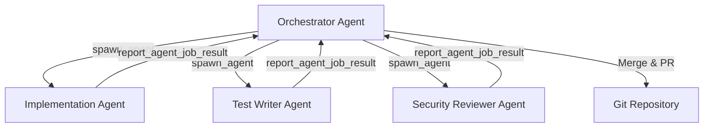

# Anthropic's 2026 Agentic Coding Trends Report: What It Means for Codex CLI Practitioners


---

Anthropic published their *2026 Agentic Coding Trends Report* in late April, drawing on case studies from Rakuten, TELUS, Zapier, CRED, and others to map eight structural shifts in how software gets built [^1]. The report is vendor-neutral in framing but Claude-centric in examples. This article translates its eight trends into concrete Codex CLI configuration, workflow patterns, and honest assessments of where OpenAI's tooling already delivers — and where gaps remain.

## The Eight Trends at a Glance

The report organises its findings into three tiers [^2]:

**Foundation trends** — structural changes to development work:
1. SDLC cycle times compress from weeks to hours
2. Multi-agent teams replace single-agent architectures
3. Extended task horizons allow agents to work autonomously for days

**Capability trends** — what agents can now do:
4. Human oversight scales through active collaboration, not full delegation
5. Agentic coding expands to legacy systems and non-technical users

**Impact trends** — measurable business outcomes:
6. Productivity gains exceed simple time savings (27% represents entirely new work)
7. Non-engineering teams build their own AI workflows
8. Security requires architecture-first design, not retrofitted bolting-on

The headline statistics are striking: engineers use AI in 60% of their work but fully delegate only 0–20% of tasks [^1]; TELUS reports 500,000+ hours saved across 13,000+ custom solutions [^3]; Zapier shows 89% AI adoption organisation-wide with 800+ internal agents [^3]; and Rakuten's autonomous implementation achieved 99.9% numerical accuracy over a seven-hour session in a 12.5-million-line codebase [^2].

## Trend 1 — Compressed SDLC: Where Codex CLI Already Delivers

The report argues that the traditional weeks-long intent-to-release cycle now compresses to hours when agents handle implementation. Codex CLI's `codex exec` non-interactive mode is the most direct realisation of this pattern [^4]. A single command can take a specification, generate code, run tests, and produce a structured JSON result:

```bash
codex exec \
  --approval-policy auto-edit \
  --output-schema '{"type":"object","properties":{"files_changed":{"type":"integer"},"tests_passed":{"type":"boolean"}}}' \
  "Implement the rate limiter described in docs/RFC-042.md and verify all tests pass"
```

The key enabler the report identifies — repository conventions including ADRs, golden path templates, and standardised build entrypoints — maps directly to Codex CLI's AGENTS.md hierarchy [^5]. A well-structured AGENTS.md with build commands, test commands, and architectural constraints is the single highest-leverage investment for compressed cycles.

## Trend 2 — Multi-Agent Teams: Codex CLI's MultiAgentV2

The report's second trend — specialist agents coordinated by an orchestrator — is precisely what Codex CLI's subagent system provides [^6]. The `[agents]` configuration section supports custom agent roles with dedicated instructions, model overrides, and MCP server assignments:

```toml
# ~/.codex/config.toml
[agents]
max_threads = 6
max_depth = 2

# Custom agent role definitions reference standalone TOML files
[agents.security-reviewer]
description = "Reviews code changes for security vulnerabilities and OWASP compliance"
config_file = ".codex/agents/security-reviewer.toml"
nickname_candidates = ["Sentinel", "Guardian", "Watcher"]

[agents.test-writer]
description = "Generates comprehensive test suites for new or modified code"
config_file = ".codex/agents/test-writer.toml"
nickname_candidates = ["Tester", "Verifier", "Prober"]
```

Each agent TOML file specifies its own `developer_instructions`, `model`, `model_reasoning_effort`, and `sandbox_mode` [^6]. The three built-in agents — `default`, `worker`, and `explorer` — cover common patterns, but the report's recommendation of specialist roles (implementation, testing, security review) demands custom definitions.



For batch processing — the report mentions CSV-driven migration campaigns — Codex CLI provides `spawn_agents_on_csv` with configurable `max_concurrency` and per-worker timeouts defaulting to 1,800 seconds [^6].

## Trend 3 — Extended Task Horizons: Goals and Compaction

The report's third trend — agents working autonomously for days — maps to Codex CLI's `/goal` system [^7]. Persisted goals survive session boundaries with five lifecycle states: `pursuing`, `paused`, `achieved`, `unmet`, and `budget_limited`. Token budgets provide a soft stop when costs exceed thresholds:

```bash
# Start a long-horizon migration task
codex --profile deep
# Then in the TUI:
# /goal "Migrate all 47 REST endpoints from Express 4 to Hono v5"
```

The honest assessment: Codex CLI's compaction system introduces drift risk on very long sessions. The report's recommendation of checkpoint-based state persistence (event-sourced logs with derived state) is not natively supported — you need to combine `/goal` with explicit AGENTS.md checkpointing instructions and `PreCompact`/`PostCompact` hooks to reinject critical state after compaction [^8].

## Trend 4 — Scaled Oversight: The Verification Lattice

The report's five-layer verification lattice aligns remarkably well with Codex CLI's layered security model [^9]:

| Report Layer | Codex CLI Equivalent |
|---|---|
| Deterministic (build, lint, typecheck) | `PostToolUse` hooks running `make test`, `eslint`, `tsc` |
| Semantic (contract, snapshot tests) | `PostToolUse` hooks with test runners |
| Security (SAST, dep scan, secret scan) | Snyk MCP server, `PreToolUse` hooks for file restrictions |
| Agentic (review agents for spec adherence) | `auto_review` approval policy with custom review instructions |
| Human (escalations only) | `suggest` approval mode for high-risk operations |

The `auto_review` subagent — Codex CLI's Guardian — provides the agentic review layer with 96.1% malicious behaviour detection and a 200x reduction in approval interruptions [^10]. Configure it with risk-based escalation:

```toml
[approval_policy]
sandbox_approval = "auto-approve"
mcp_elicitations = "auto-approve"
request_permissions = "auto-review"
skill_approval = "auto-review"

[approval_policy.auto_review]
instructions = """
Approve routine file edits and test runs. Escalate to human if:
- Changes touch authentication, billing, or PII handling
- New dependencies are introduced
- Network access is requested outside the sandbox
"""
```

## Trend 5 — New Surfaces and Users: Beyond the Terminal

The report notes agentic coding expanding to non-technical users through constrained templates and approval workflows. Codex CLI addresses this through three complementary surfaces [^11]:

- **CLI** — full power for senior engineers
- **Codex App** — visual task management with worktrees for less terminal-fluent team members
- **IDE Extension** — embedded in VS Code, Cursor, and JetBrains for developers who prefer IDE-centric workflows

For legacy systems — the report specifically mentions COBOL and Fortran — Codex CLI's model-agnostic architecture means you configure AGENTS.md with language-specific conventions and the model handles the rest. The practical constraint is test coverage: without golden fixture test suites (which the report recommends), agents working on legacy code produce unverifiable changes.

## Trend 6 — Measuring What Matters: The 27% New Work Finding

The report's most provocative finding is that 27% of AI-assisted work consists of tasks that would not have been done otherwise [^1]. This directly challenges teams measuring AI impact through time-saved metrics alone.

Codex CLI's Analytics API provides three endpoints for measurement [^12]:

```bash
# Usage data
curl -H "Authorization: Bearer $OPENAI_ADMIN_KEY" \
  "https://api.openai.com/v1/organization/codex/analytics/usage?start_date=2026-05-01"

# Code review metrics
curl -H "Authorization: Bearer $OPENAI_ADMIN_KEY" \
  "https://api.openai.com/v1/organization/codex/analytics/code_reviews"
```

Combined with OpenTelemetry export for per-session token tracking [^13], teams can distinguish between acceleration (doing the same work faster) and expansion (doing new work that was previously unjustifiable).

## Trend 7 — Non-Engineering Teams: Skills and Plugins

The report highlights Zapier's 800+ internal agents and 89% cross-organisation adoption [^3]. Codex CLI's skills system — reusable instruction sets packaged as SKILL.md files [^14] — enables non-engineers to invoke pre-built workflows without understanding the underlying tooling. The plugin marketplace distributes these as installable bundles [^15].

The honest gap: Codex CLI remains terminal-first. For non-technical users, the Codex App is the better entry point, with the CLI serving as the underlying engine for teams that build custom integrations.

## Trend 8 — Security-First Architecture: Not Retrofitted

The report's final trend — security as architecture rather than afterthought — is where Codex CLI's design philosophy most directly aligns. The kernel-level sandbox (Seatbelt on macOS, Bubblewrap/Landlock on Linux, DACL on Windows) provides OS-enforced isolation that other coding agents lack [^16]. The five-layer security model maps to the report's threat categories:

```toml
# Defence-in-depth profile
[sandbox]
mode = "workspace-write"
network = false

[permissions]
deny_read = [".env*", "**/*.pem", "**/credentials*"]
deny_write = [".git/**", "node_modules/**"]

[approval_policy]
sandbox_approval = "auto-review"
request_permissions = "suggest"
```

Enterprise teams can enforce these constraints across all developers through cloud-managed `requirements.toml` files [^17], ensuring that security architecture is non-negotiable rather than opt-in.

## What Codex CLI Practitioners Should Do Now

The report's trends are not predictions — they describe patterns already emerging in production teams. For Codex CLI practitioners, the practical response is:

1. **Invest in AGENTS.md** — the single highest-leverage artefact for every trend in the report
2. **Define custom agent roles** — move beyond the built-in `default`/`worker`/`explorer` triad to specialist agents matching your team's review, testing, and security needs
3. **Configure the verification lattice** — layer `PostToolUse` hooks, `auto_review`, and human escalation into a coherent pipeline
4. **Measure expansion, not just acceleration** — use the Analytics API to track new work enabled, not just time saved
5. **Treat security as configuration, not hope** — deploy `requirements.toml` enterprise policies before scaling agent adoption

The gap between the report's vision and today's tooling is smaller than you might expect. The gap between the vision and most teams' configuration is enormous.

## Citations

[^1]: Anthropic, *2026 Agentic Coding Trends Report*, April 2026. [https://resources.anthropic.com/2026-agentic-coding-trends-report](https://resources.anthropic.com/2026-agentic-coding-trends-report)

[^2]: HiveTrail, "We Read Anthropic's 2026 Agentic Coding Trends Report. Here's What It Actually Means for Engineering Teams," May 2026. [https://hivetrail.com/blog/anthropic-2026-agentic-coding-report/](https://hivetrail.com/blog/anthropic-2026-agentic-coding-report/)

[^3]: Sola Fide, "Anthropic's 2026 Agentic Coding Trends Report: 8 Shifts Reshaping Software Development," May 2026. [https://solafide.ca/blog/anthropic-2026-agentic-coding-trends-reshaping-software-development](https://solafide.ca/blog/anthropic-2026-agentic-coding-trends-reshaping-software-development)

[^4]: OpenAI, "Non-interactive mode – Codex," May 2026. [https://developers.openai.com/codex/noninteractive](https://developers.openai.com/codex/noninteractive)

[^5]: OpenAI, "Custom instructions with AGENTS.md – Codex," May 2026. [https://developers.openai.com/codex/guides/agents-md](https://developers.openai.com/codex/guides/agents-md)

[^6]: OpenAI, "Subagents – Codex," May 2026. [https://developers.openai.com/codex/subagents](https://developers.openai.com/codex/subagents)

[^7]: OpenAI, "Features – Codex CLI," May 2026. [https://developers.openai.com/codex/cli/features](https://developers.openai.com/codex/cli/features)

[^8]: OpenAI, "Advanced Configuration – Codex," May 2026. [https://developers.openai.com/codex/config-advanced](https://developers.openai.com/codex/config-advanced)

[^9]: OpenAI, "Agent approvals & security – Codex," May 2026. [https://developers.openai.com/codex/agent-approvals-security](https://developers.openai.com/codex/agent-approvals-security)

[^10]: OpenAI, "Changelog – Codex," May 2026. [https://developers.openai.com/codex/changelog](https://developers.openai.com/codex/changelog)

[^11]: OpenAI, "Codex – OpenAI Developers," May 2026. [https://developers.openai.com/codex](https://developers.openai.com/codex)

[^12]: OpenAI, "Governance – Codex," May 2026. [https://developers.openai.com/codex/governance](https://developers.openai.com/codex/governance)

[^13]: OpenAI, "Configuration Reference – Codex," May 2026. [https://developers.openai.com/codex/config-reference](https://developers.openai.com/codex/config-reference)

[^14]: OpenAI, "Agent Skills – Codex," May 2026. [https://developers.openai.com/codex/skills](https://developers.openai.com/codex/skills)

[^15]: OpenAI, "Plugins – Codex," May 2026. [https://developers.openai.com/codex/plugins](https://developers.openai.com/codex/plugins)

[^16]: OpenAI, "Sandbox – Codex," May 2026. [https://developers.openai.com/codex/concepts/sandboxing](https://developers.openai.com/codex/concepts/sandboxing)

[^17]: OpenAI, "Managed configuration – Codex," May 2026. [https://developers.openai.com/codex/managed-configuration](https://developers.openai.com/codex/managed-configuration)
