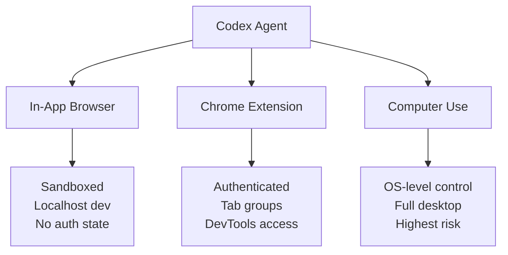
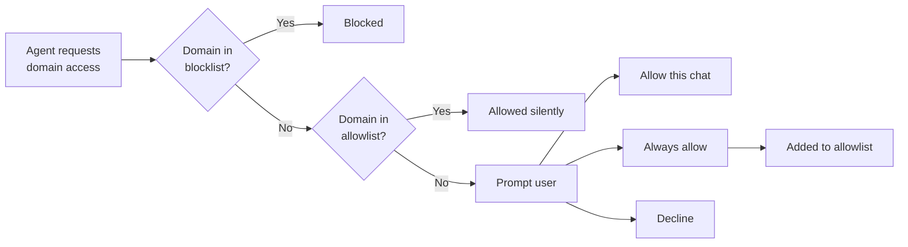

# The Codex Chrome Extension: Parallel Browser Workflows, DevTools Integration, and Domain Access Control


---

## Introduction

On 7 May 2026, OpenAI shipped the Codex Chrome Extension — a plugin that gives the Codex agent direct access to your authenticated browser sessions on macOS and Windows[^1]. Unlike the sandboxed in-app browser bundled with the Codex desktop application, the extension operates inside your active Chrome profile, inheriting cookies, sessions, and authenticated states[^2]. For developers, this unlocks a class of workflows that previously required manual context-switching: testing authenticated web apps, scraping internal dashboards, and running DevTools inspections — all while Codex works in background tab groups without hijacking your primary browsing[^3].

This article covers the extension's architecture, permission model, developer-centric use cases, and practical configuration for teams.

---

## Architecture: Three Browser Modes

Codex now distinguishes between three distinct browser execution environments[^2]:



| Mode | Auth Context | Isolation | Use Case |
|------|-------------|-----------|----------|
| In-app browser | None (sandboxed) | Full | `localhost` testing, public pages |
| Chrome Extension | User's profile | Tab-group scoped | SaaS tools, internal dashboards, authenticated testing |
| Computer Use | OS-level | None | Desktop apps, cross-application workflows |

Codex intelligently routes between these modes based on the task[^4]. A request to test a local Next.js app uses the in-app browser; a request to update a Salesforce record routes through Chrome; a request to interact with a native IDE falls through to Computer Use.

---

## Installation and Setup

Installation starts inside the Codex desktop app rather than the Chrome Web Store directly[^1]:

1. Open **Plugins** in the Codex sidebar
2. Add the **Chrome** plugin
3. Follow the guided flow to install the extension from the Chrome Web Store
4. Accept Chrome's permission prompts
5. Verify the toolbar icon shows **Connected**

The extension requires Chrome to be running (or allows Codex to launch it) and operates exclusively within the Chrome profile where it was installed[^1].

### File URL Access

For workflows involving local file uploads, enable **Allow access to file URLs** in `chrome://extensions` → Codex → Details[^1].

---

## Tab Group Isolation

The extension's most developer-relevant design decision is its tab group architecture. Each Codex conversation thread gets its own Chrome tab group[^3]. Tabs opened by a thread remain grouped together, providing:

- **Workflow isolation** — multiple concurrent Codex threads don't pollute each other's browser state
- **Auditability** — completed task tabs remain available for review after the agent finishes
- **Background operation** — Codex works in its tab groups while you browse in your own tabs

This matters for teams running parallel investigation tasks. You can have one thread auditing a staging environment, another reviewing a Grafana dashboard, and a third testing an authenticated API explorer — all running concurrently in separate tab groups.

---

## DevTools Integration

The extension can access Chrome DevTools for inspection, debugging, and testing[^3][^4]. Practical developer applications include:

### DOM Inspection and Validation

```
@Chrome open staging.example.com/dashboard and verify the user
table renders all 50 rows. Check the Network tab for failed API calls.
```

### Console Error Monitoring

Codex can monitor the DevTools console for errors during a test run, capture stack traces, and correlate them with recent code changes.

### End-to-End Flow Testing

For single-page applications requiring authenticated state, the extension can navigate multi-step flows (login → dashboard → settings → export) while capturing screenshots and DOM state at each step[^4].

### Performance Profiling

The agent can open the Performance tab, record a trace, and report on long tasks or layout shifts — useful for pre-merge performance regression checks.

---

## Domain Access Control

The extension implements a per-host permission model that balances usability with security[^1][^5]:



### Configuration Options

Domain policies are managed in **Computer Use settings** within the Codex app:

- **Allowlist** — domains Codex can access without prompting (e.g., `staging.internal.com`, `grafana.internal.com`)
- **Blocklist** — domains Codex must never access (e.g., `banking.example.com`, `hr-portal.corp.com`)

### Elevated Risk Toggles

Two optional settings reduce friction at the cost of increased exposure[^1]:

1. **Always allow browser content** — eliminates per-domain confirmation prompts entirely
2. **Browser history access** — includes browsing history (URLs, titles) in the agent's context window

Both are disabled by default and should remain so in enterprise environments unless covered by additional policy controls.

---

## Developer Workflow Patterns

### Pattern 1: Authenticated API Testing

```
@Chrome navigate to api-explorer.internal.com, authenticate with SSO,
then test the /users endpoint with the payload from my clipboard.
Report the response status and body.
```

The extension inherits your SSO session, eliminating the need to configure service accounts or API tokens for exploratory testing.

### Pattern 2: Cross-Service Context Gathering

```
Gather context from three sources:
1. @Chrome open the Jira board and summarise the current sprint's blocked tickets
2. @Chrome open Datadog and check error rates for the payments service (last 4h)
3. Read the local diff in ./src/payments/

Then suggest which blocked ticket my local changes might unblock.
```

### Pattern 3: Visual Regression Verification

```
@Chrome open staging.example.com/checkout on desktop and mobile viewports.
Compare against the screenshots in ./test/baselines/ and flag any
visual differences above 2% pixel deviation.
```

### Pattern 4: Internal Documentation Lookup

```
@Chrome search our Confluence space for "rate limiting configuration"
and extract the current production limits table.
```

---

## Security Considerations for Teams

### Data Handling

OpenAI does not store a separate record of Chrome actions from the extension. Browser activity is stored only when it becomes part of the Codex conversation context[^1]. However, any data the agent reads from authenticated pages enters the model context and is subject to OpenAI's standard data handling policies.

### Recommendations for Enterprise Deployment

| Control | Recommendation |
|---------|---------------|
| Blocklist | Add all financial, HR, and PII-heavy domains |
| Allowlist | Limit to development and staging environments |
| History access | Keep disabled |
| Always allow | Keep disabled; use per-session grants |
| Chrome profile | Use a dedicated development profile |
| Chrome Enterprise policies | Deploy `ExtensionInstallAllowlist` to control installation[^6] |

### MCP Server Alternative

For teams uncomfortable with granting browser-session access to an AI agent, the `chrome-devtools-mcp` server provides a more constrained alternative[^7]:

```bash
codex mcp add chrome-devtools -- npx chrome-devtools-mcp@latest
```

This grants DevTools inspection capabilities without full page interaction, offering a middle ground between the sandboxed in-app browser and full extension access.

---

## Limitations

- **Chrome only** — no Firefox or Safari support as of May 2026[^1]
- **Single profile** — operates within the profile where installed; switching profiles requires reinstallation
- **No headless mode** — Chrome must be running with a visible window (cannot be driven from `codex exec` in CI)
- **Platform support** — macOS and Windows only; Linux support is not yet available[^3]
- **Rate awareness** — the extension does not automatically throttle requests to external services; aggressive automation may trigger rate limits or CAPTCHAs

---

## Relationship to Codex CLI

The Chrome Extension is a feature of the **Codex desktop app** (the GUI application), not the **Codex CLI** (the terminal tool). The CLI's browser capabilities remain limited to the `$playwright-interactive` skill and MCP-based DevTools servers. However, teams using both tools can share domain policies through their organisation's Codex configuration, and the extension's tab-group pattern may inform future CLI browser integration designs.

---

## Conclusion

The Codex Chrome Extension represents a pragmatic evolution in agentic browser access. By operating within existing authenticated sessions rather than requiring separate credential provisioning, it dramatically reduces the setup friction for browser-based developer workflows. The tab-group isolation model and per-host permission system provide reasonable guardrails, though enterprise teams should invest in blocklist configuration before broad rollout.

For developers already embedded in browser-heavy workflows — debugging production dashboards, testing authenticated flows, or gathering context from internal tools — the extension eliminates a significant manual context-switching tax.

---

## Citations

[^1]: OpenAI, "Codex Chrome extension – Codex app", OpenAI Developers, May 2026. https://developers.openai.com/codex/app/chrome-extension

[^2]: eigent.ai, "Codex for Chrome (2026): Capabilities, Architecture, and Use Case", May 2026. https://www.eigent.ai/blog/codex-for-chrome

[^3]: MacRumors, "OpenAI's Codex Now Works in Chrome With New Extension", 7 May 2026. https://www.macrumors.com/2026/05/07/openai-codex-chrome-extension/

[^4]: Dataconomy, "OpenAI Launches Codex Extension For Google Chrome", 8 May 2026. https://dataconomy.com/2026/05/08/openai-launches-codex-extension-for-google-chrome/

[^5]: MarkTechPost, "OpenAI Adds Chrome Extension to Codex, Letting Its AI Agent Access LinkedIn, Salesforce, Gmail, and Internal Tools via Signed-In Sessions", 8 May 2026. https://www.marktechpost.com/2026/05/08/openai-adds-chrome-extension-to-codex-letting-its-ai-agent-access-linkedin-salesforce-gmail-and-internal-tools-via-signed-in-sessions/

[^6]: Google, "ExtensionInstallAllowlist: Configure extension installation allow list", Chrome Enterprise. https://chromeenterprise.google/policies/extension-install-allowlist/

[^7]: Google, "Chrome DevTools for agents", Chrome for Developers, 2026. https://developer.chrome.com/docs/devtools/agents
