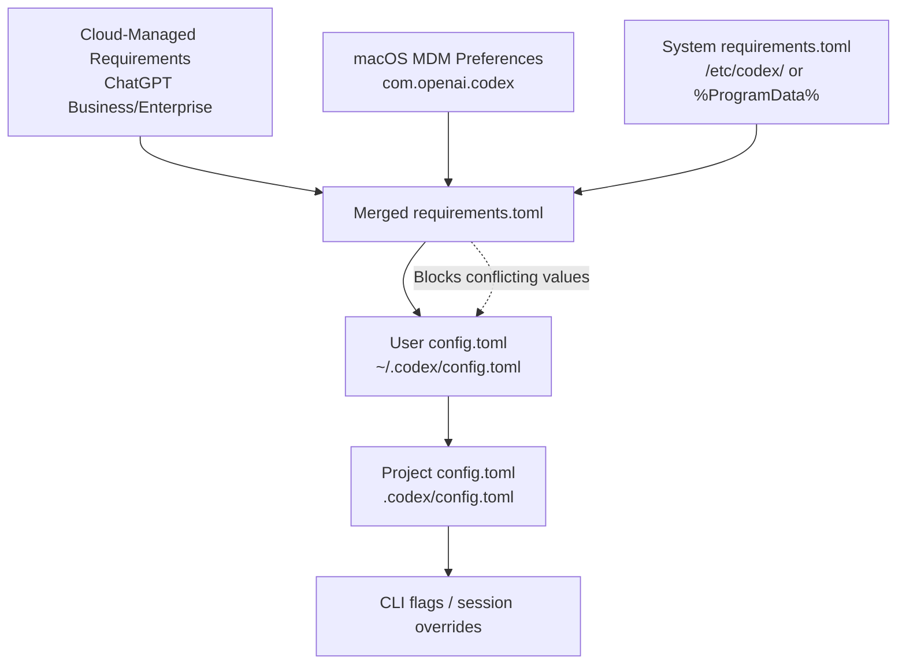

# Codex CLI Enterprise Managed Configuration: Cloud Policies, Group-Based Enforcement, and Compliance Governance


---

Enterprise teams adopting Codex CLI face a governance challenge that individual developers never encounter: how do you enforce security policies across hundreds of engineers without breaking their workflow? OpenAI's managed configuration system — cloud-fetched `requirements.toml`, group-based policy deployment, MDM integration, and the Analytics/Compliance APIs — provides the answer. This article is the practitioner's reference for deploying and operating these controls.

## The Three-Layer Enforcement Model

Codex CLI resolves requirements through a strict precedence hierarchy where the earliest layer wins on a per-field basis[^1]:



When a user's `config.toml` conflicts with an enforced requirement, Codex silently falls back to a compatible value and surfaces a notification explaining the override[^2]. This means developers retain flexibility on non-security settings whilst admins maintain hard constraints on what matters.

## Cloud-Managed Requirements

For ChatGPT Business and Enterprise workspaces, the primary enforcement mechanism is **cloud-fetched requirements**[^1]. When a user signs in with their workspace credentials, Codex fetches the applicable policy from OpenAI's service before the first turn.

### Configuring Policies

Admins author policies at the [Codex managed-config page](https://chatgpt.com/codex/settings/managed-configs) using standard `requirements.toml` syntax[^2]:

```toml
# Enforce read-only sandbox for all users
allowed_sandbox_modes = ["read-only"]

# Allow workspace-write only on designated devboxes
[[remote_sandbox_config]]
hostname_patterns = ["*.devbox.example.com"]
allowed_sandbox_modes = ["read-only", "workspace-write"]

# Lock down approval policy
allowed_approval_policies = ["untrusted", "on-request"]

# Restrict web search to cached mode
allowed_web_search_modes = ["cached"]

# MCP server allowlist — empty array disables all
[mcp_servers]
"github-mcp" = { command = "github-mcp-server", args = ["--readonly"] }
"linear-mcp" = { command = "linear-mcp-server" }
```

### Group-Based Policy Assignment

Different teams need different constraints. The managed-config page supports **group-specific rules** where the first matching rule wins[^2]. A typical enterprise deploys:

| Group | Sandbox | Web Search | MCP Servers |
|-------|---------|------------|-------------|
| Security Engineers | `workspace-write` | `live` | All approved |
| Backend Developers | `workspace-write` | `cached` | GitHub, Linear |
| Contractors | `read-only` | `disabled` | None |
| Data Scientists | `workspace-write` | `live` | Jupyter MCP only |

### Caching and Resilience

Cloud requirements are cached locally after first fetch[^2]. If the service is temporarily unreachable on subsequent launches, Codex continues with the cached policy. If no cache exists and the fetch fails, enforcement for that layer is skipped — a deliberate "best-effort" design that prioritises developer productivity over hard blocks[^2].

## macOS MDM Integration

For organisations using device management, Codex supports policy deployment via MDM preference domains[^2]:

```xml
<!-- Jamf Pro / Kandji / Fleet configuration profile -->
<key>com.openai.codex</key>
<dict>
    <key>requirements_toml_base64</key>
    <string>YWxsb3dlZF9zYW5kYm94X21vZGVzID0gWyJyZWFkLW9ubHkiXQo=</string>
    <key>config_toml_base64</key>
    <string>bW9kZWwgPSAiZ3B0LTUuNCIK</string>
</dict>
```

The `requirements_toml_base64` key enforces hard constraints, whilst `config_toml_base64` sets managed defaults that users can override during sessions (reapplied on restart)[^2]. This integrates cleanly with Jamf Pro, Fleet, and Kandji without requiring custom preprocessing scripts.

For Linux and Windows deployments without MDM, place the file at the system path:

- **Linux/macOS:** `/etc/codex/requirements.toml`
- **Windows:** `%ProgramData%\OpenAI\Codex\requirements.toml`

## Enforceable Constraints Reference

The full set of fields enforceable through `requirements.toml`[^1][^2]:

| Field | Type | Purpose |
|-------|------|---------|
| `allowed_approval_policies` | `string[]` | Restrict approval modes (`untrusted`, `on-request`, `never`) |
| `approvals_reviewer` | `string` | Force `user` or `auto_review` |
| `allowed_sandbox_modes` | `string[]` | Restrict sandbox (`read-only`, `workspace-write`, `danger-full-access`) |
| `allowed_web_search_modes` | `string[]` | Restrict web search (`disabled`, `cached`, `live`) |
| `mcp_servers` | `table` | Allowlist MCP servers by name and command identity |
| `managed_hooks` | `table` | Deploy organisation-wide hooks |
| `command_rules` | `array` | Restrict shell commands to `prompt` or `forbidden` |
| `remote_sandbox_config` | `array` | Per-hostname sandbox overrides |

### Command Rules

Command rules use decision values of `prompt` (require user approval) or `forbidden` (block entirely) — `allow` is deliberately unavailable in requirements to prevent admins from bypassing the approval system[^2]:

```toml
[[command_rules]]
pattern = "rm -rf *"
decision = "forbidden"

[[command_rules]]
pattern = "curl *"
decision = "prompt"
```

## RBAC and Workspace Access

Enterprise admins control Codex access through ChatGPT workspace settings with two independent toggles[^3]:

- **Codex local** (enabled by default): CLI, desktop app, and IDE extension
- **Codex cloud** (requires GitHub connection): hosted code review and cloud sandboxes

A dedicated "Codex Admin" group with limited membership manages policies and analytics without granting broader workspace permissions[^3]. Device code authentication supports non-interactive CLI environments (CI runners, shared development servers) where browser-based OAuth is impractical[^3].

## Governance: Analytics and Compliance APIs

### Analytics API

The Analytics API provides adoption and usage visibility at `https://api.chatgpt.com/v1/analytics/codex`[^4]:

```bash
# Fetch weekly usage for the workspace
curl -H "Authorization: Bearer $PLATFORM_API_KEY" \
  "https://api.chatgpt.com/v1/analytics/codex/workspaces/${WORKSPACE_ID}/usage?start_time=2026-05-04T00:00:00Z&end_time=2026-05-11T00:00:00Z&group_by=day"
```

Three core endpoints[^4]:

| Endpoint | Returns |
|----------|---------|
| `/usage` | Threads, turns, credits, tokens by client surface |
| `/code_reviews` | PR reviews, comments by priority (P0/P1/P2) |
| `/code_review_responses` | Developer reactions to Codex review comments |

Query parameters include `start_time`, `end_time`, `group_by` (day/week), and cursor-based pagination. The API supports a 90-day lookback window with keys scoped to `codex.enterprise.analytics.read`[^4].

### Compliance API

For audit and legal workflows, the Compliance API exports detailed activity logs retained for 30 days[^4]:

- Prompt text and generated responses
- Workspace, user, timestamp, and model identifiers
- Token usage and request metadata

This integrates with eDiscovery, DLP, and SIEM systems. A typical deployment routes Compliance API exports to Splunk or Datadog for correlation with other development activity signals[^4].

### Dashboard

The self-serve analytics dashboard visualises[^4]:

- Active users by product surface (CLI, IDE, cloud, desktop, Code Review)
- Credit and token consumption with workspace vs personal breakdowns
- User ranking tables with sortable engagement metrics
- Code Review activity: PRs reviewed, priority issues flagged, comments generated

Data exports in CSV or JSON format, with up to 12 hours of lag for recent activity[^4].

## Deployment Checklist

A practical sequence for rolling out managed configuration:

```mermaid
flowchart LR
    A[Define security posture] --> B[Author requirements.toml]
    B --> C[Create group policies]
    C --> D[Deploy via cloud/MDM]
    D --> E[Configure Analytics API]
    E --> F[Route Compliance to SIEM]
    F --> G[Verify with pilot group]
    G --> H[Gradual workspace rollout]
```



1. **Define your security posture** — Which sandbox modes are acceptable? Which MCP servers are approved? What approval policy floor do you require?
2. **Author `requirements.toml`** — Start restrictive; loosen per-group as trust evidence accumulates
3. **Create group policies** — Map your organisational structure to Codex groups with appropriate constraints
4. **Deploy** — Cloud-managed for Business/Enterprise; MDM profiles for device-managed fleets; `/etc/codex/` for Linux servers
5. **Enable Analytics** — Configure API key with `codex.enterprise.analytics.read` scope; connect to your BI tooling
6. **Route Compliance** — Point Compliance API exports to your SIEM/DLP pipeline
7. **Verify** — Test with a pilot group; confirm enforcement notifications appear correctly; validate audit log completeness

## Common Pitfalls

**Empty `mcp_servers` table disables all servers.** If you define `[mcp_servers]` without entries, no MCP server will load — even ones users configure locally[^2]. Either omit the section entirely or explicitly list approved servers.

**Cloud requirements cache can go stale.** If you update a policy and a developer doesn't restart their CLI, the cached policy persists. Consider communicating policy changes with a restart advisory.

**Group rule ordering matters.** First matching group rule wins. Place more specific groups (e.g., "Security Engineers") before broader groups (e.g., "All Developers") in your managed-config page[^2].

**`allow` is not a valid command rule decision.** Requirements deliberately restrict to `prompt` or `forbidden` — attempting to use `allow` will be rejected[^2].

## When to Use What

| Scenario | Mechanism |
|----------|-----------|
| SaaS team on ChatGPT Enterprise | Cloud-managed requirements |
| Corporate macOS fleet | MDM preference profiles |
| Linux CI runners/shared servers | System `/etc/codex/requirements.toml` |
| Per-project conventions (non-security) | Project `.codex/config.toml` |
| Individual preferences | User `~/.codex/config.toml` |

## Citations

[^1]: [Managed configuration – Codex | OpenAI Developers](https://developers.openai.com/codex/enterprise/managed-configuration)
[^2]: [Configuration Reference – Codex | OpenAI Developers](https://developers.openai.com/codex/config-reference)
[^3]: [Admin Setup – Codex | OpenAI Developers](https://developers.openai.com/codex/enterprise/admin-setup)
[^4]: [Governance – Codex | OpenAI Developers](https://developers.openai.com/codex/enterprise/governance)
