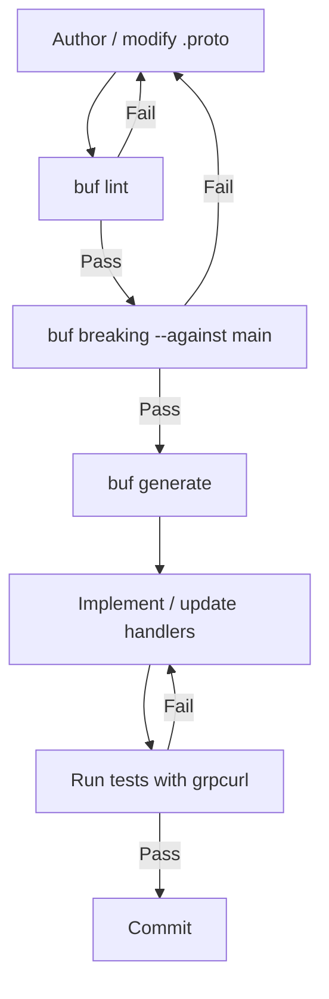

# Codex CLI for gRPC and Protocol Buffer Development: Schema-First Workflows with buf, Code Generation, and Contract Safety


---

Protocol Buffers and gRPC remain the backbone of inter-service communication in serious distributed systems. The schema-first discipline they enforce — define the contract, generate the stubs, implement the logic — maps naturally onto how Codex CLI operates: give it a structured specification, constrain its workspace, and let the agent handle the mechanical work. This article walks through a complete gRPC development workflow driven by Codex CLI, from `.proto` authoring through code generation, service implementation, breaking-change detection, and integration testing.

## Why gRPC Workflows Suit Agentic Coding

gRPC development is inherently mechanical after the design phase. Once the `.proto` schema is locked, the remaining steps — running `buf generate`, wiring up handler stubs, writing integration tests with `grpcurl` or `buf curl` — follow predictable patterns. That predictability makes gRPC an ideal candidate for agent-assisted development [^1].

Proto files also double as rich context for the agent. Because every RPC method, message, and field carries a name, type, and (ideally) a comment, the `.proto` file gives Codex CLI more structured information than a typical REST endpoint description would [^2]. Teams that annotate their proto files with `google.api.http` options and field-level comments hand Codex a self-documenting specification that reduces hallucination risk.

## Project Layout and AGENTS.md

A typical proto-first project follows the Buf recommended layout [^3]:

```
.
├── .codex/
│   └── config.toml
├── AGENTS.md
├── buf.yaml
├── buf.gen.yaml
├── proto/
│   └── myservice/
│       └── v1/
│           └── myservice.proto
├── gen/                  # generated code — never edit
├── cmd/
│   └── server/
│       └── main.go
└── internal/
    └── handler/
        └── myservice.go
```

The `AGENTS.md` file encodes the rules Codex CLI must follow:

```markdown
## Build & Generation

- Run `buf generate` after any `.proto` change.
- Never hand-edit files under `gen/`.
- Run `buf lint` before committing any proto change.
- Run `buf breaking --against .git#branch=main` before committing.

## Proto Conventions

- Package names use `myorg.myservice.v1` format.
- Field names use snake_case; enum values use UPPER_SNAKE_CASE.
- Every RPC method and message field must have a comment.
- Use `google.protobuf.FieldMask` for partial updates.
- Reserve removed field numbers; never reuse them.

## Implementation

- Service handlers live in `internal/handler/`.
- All RPC handlers must propagate gRPC status codes explicitly.
- Use ConnectRPC for HTTP/1.1 compatibility where needed.
- Tests use `grpcurl` against a test server, not mock stubs.
```

## buf.yaml and buf.gen.yaml Configuration

The `buf.yaml` (v2) declares the module, linting rules, and breaking-change policy [^3]:

```yaml
version: v2
modules:
  - path: proto
lint:
  use:
    - STANDARD
  except:
    - PACKAGE_VERSION_SUFFIX
breaking:
  use:
    - FILE
```

The `FILE` category is the most conservative breaking-change ruleset — it catches field renumbering, type changes, and moved definitions across files [^4].

Code generation targets live in `buf.gen.yaml`:

```yaml
version: v2
plugins:
  - remote: buf.build/protocolbuffers/go
    out: gen
    opt: paths=source_relative
  - remote: buf.build/connectrpc/go
    out: gen
    opt: paths=source_relative
```

This configuration generates both standard Go protobuf types and ConnectRPC service interfaces [^5]. ConnectRPC produces handlers that work over gRPC, gRPC-Web, and its own Connect protocol simultaneously, making the generated code usable from browsers, CLI tools, and other microservices without a proxy [^6].

## Schema Authoring with Codex CLI

Codex CLI excels at drafting `.proto` files from natural-language requirements. A well-structured prompt gives the agent everything it needs:

```
Create a proto3 service definition in proto/billing/v1/billing.proto for a billing
service with these RPCs:
- CreateInvoice (customer_id, line_items, currency) → invoice with id and status
- GetInvoice (invoice_id) → full invoice
- ListInvoices (customer_id, page_token, page_size) → paginated list
- VoidInvoice (invoice_id) → updated invoice

Follow the proto conventions in AGENTS.md. Add google.api.http annotations for
REST transcoding. Include field-level comments.
```

Codex reads `AGENTS.md`, picks up the naming conventions and comment requirements, and generates a complete `.proto` file. The agent then runs `buf lint` as a verification step — if the linter reports violations, Codex iterates until the schema is clean.

## The Generation and Implementation Loop

After the schema is accepted, the workflow follows a tight loop:



Codex CLI can execute this entire loop in a single session. After generating stubs, it creates handler implementations in `internal/handler/` that satisfy the generated interfaces. Because the generated code provides concrete types for every request and response message, the agent's implementations are type-safe from the start.

A typical prompt for the implementation phase:

```
Implement the BillingServiceHandler in internal/handler/billing.go.
Use the generated types from gen/billing/v1.
Store invoices in-memory for now — we'll add Postgres later.
Every RPC must return appropriate gRPC status codes for not-found
and validation errors.
Run buf generate first, then implement, then run the tests.
```

## Breaking-Change Detection as a Safety Net

One of the highest-value applications of Codex CLI in gRPC development is automated breaking-change detection. The `buf breaking` command compares the current proto schema against a reference (typically the `main` branch) and flags wire-incompatible changes [^4].

Embedding this in a `PostToolUse` hook ensures every proto edit passes the check automatically:

```toml
# .codex/config.toml
[hooks.PostToolUse.buf_breaking]
command = "buf breaking --against .git#branch=main"
match_commands = ["buf generate"]
on_failure = "stop"
```

With this hook, Codex CLI runs `buf breaking` after every `buf generate` invocation. If a breaking change is detected — a removed field, a changed type, a renumbered enum — the agent stops and reports the violation rather than continuing with incompatible code [^7].

The four breaking-change categories in buf provide granular control [^4]:

| Category | Detects |
|----------|---------|
| `WIRE` | Binary encoding incompatibilities |
| `WIRE_JSON` | Binary and JSON encoding incompatibilities |
| `PACKAGE` | Generated source-code breakage per package |
| `FILE` | Generated source-code breakage across files |

Most teams start with `FILE` (the default) and relax to `PACKAGE` only when they have strong CI governance around their proto registry.

## Integration Testing with grpcurl and buf curl

Rather than mocking generated clients, testing gRPC services against a real server with `grpcurl` produces higher-confidence results [^8]. Codex CLI can spin up a test server, wait for readiness, and exercise each RPC:

```bash
# Start the server in the background
go run ./cmd/server &
SERVER_PID=$!
sleep 2

# Test CreateInvoice
grpcurl -plaintext -d '{
  "customer_id": "cust_001",
  "line_items": [{"description": "Widget", "amount_cents": 1500}],
  "currency": "GBP"
}' localhost:8080 billing.v1.BillingService/CreateInvoice

# Test ListInvoices with pagination
grpcurl -plaintext -d '{"customer_id": "cust_001", "page_size": 10}' \
  localhost:8080 billing.v1.BillingService/ListInvoices

kill $SERVER_PID
```

For teams using the Buf ecosystem, `buf curl` offers a streamlined alternative that understands the Connect protocol natively [^9]. The advantage is simpler invocation — `buf curl` resolves service descriptors from the local module without requiring server reflection.

Codex CLI can be instructed to write these integration tests as shell scripts or Go test functions, then execute them as verification:

```
Write integration tests for all four BillingService RPCs.
Start a test server, exercise each endpoint with grpcurl,
and assert on the response structure and status codes.
Run the tests and fix any failures.
```

## Non-Interactive Automation with codex exec

For CI pipelines, `codex exec` drives the entire proto workflow without human interaction [^10]:

```bash
codex exec "Lint all proto files, check for breaking changes against main, \
  regenerate code, and run the integration test suite. \
  Report any failures as a structured summary."
```

This pattern fits naturally into a GitHub Actions step or GitLab CI job. The exit code reflects success or failure, and the structured output can be parsed for PR comments.

## Schema Evolution Patterns

Proto schema evolution is where agent-assisted development pays the largest dividends. Common evolution tasks — adding optional fields, deprecating RPCs, introducing new service versions — are formulaic but error-prone when done manually.

A schema evolution prompt:

```
Add a `due_date` field (google.protobuf.Timestamp) to the Invoice message.
Add a `MarkInvoiceOverdue` RPC that accepts an invoice_id and returns
the updated invoice. Reserve field number 7 which was previously used
for the removed `discount` field. Ensure no breaking changes against main.
Regenerate code and update the handler.
```

Codex CLI handles the mechanical steps — adding the field, reserving the old number, running `buf breaking`, regenerating, and updating the handler — while the developer focuses on the design decision of what the new field means semantically.

## ConnectRPC for Browser and CLI Compatibility

ConnectRPC deserves special mention because it eliminates the traditional pain point of gRPC in web environments [^6]. The generated Connect handlers serve three protocols simultaneously:

- **gRPC** (HTTP/2, binary) — for service-to-service calls
- **gRPC-Web** — for browser clients behind an Envoy proxy
- **Connect protocol** — for direct browser calls over HTTP/1.1 or HTTP/2, testable with plain `curl`

This means a single `buf generate` pass with the ConnectRPC plugin produces handlers that work everywhere. Codex CLI can then generate both a Go client for service-to-service calls and a TypeScript client (via `buf.build/connectrpc/es`) for the frontend, all from the same `.proto` source.

## Practical AGENTS.md Recipes for Proto Teams

Teams working heavily with Protocol Buffers benefit from proto-specific AGENTS.md sections. Here are patterns that work well:

**Versioning enforcement:**

```markdown
## Proto Versioning
- Every service lives under a versioned package (v1, v2, etc.).
- New major versions get a new directory: proto/billing/v2/.
- Cross-version imports are forbidden — migrate consumers first.
```

**Review checklist:**

```markdown
## Proto Review Checklist
Before committing any .proto change, verify:
1. `buf lint` passes with zero warnings.
2. `buf breaking --against .git#branch=main` passes.
3. Every new field has a comment explaining its purpose.
4. No field numbers have been reused (check `reserved` statements).
5. Generated code compiles without errors.
```

## Current Limitations

⚠️ Codex CLI does not natively understand the Protobuf wire format. Its proto file generation relies on pattern matching from training data rather than formal schema validation. Always run `buf lint` and `buf breaking` as verification gates — never trust the agent's output without mechanical checks.

⚠️ Streaming RPCs (server-streaming, client-streaming, bidirectional) require more careful testing than unary calls. `grpcurl` supports streaming, but the interaction patterns are harder to express in a single prompt. Consider breaking streaming RPC implementation into separate focused sessions.

## Citations

[^1]: [OpenAI Codex CLI Best Practices — "Codex produces higher-quality outputs when it can verify its work"](https://developers.openai.com/codex/learn/best-practices)
[^2]: [Building MCP Servers from Protobuf — "the same proto file contains everything needed to generate gRPC services, REST endpoints, OpenAPI specs, and MCP tools"](https://www.enterprisedb.com/blog/building-mcp-servers-protobuf-part3-enhance-ai-interactions-proto-comments)
[^3]: [Buf CLI Quickstart — buf.yaml v2 configuration and project layout](https://buf.build/docs/cli/quickstart/)
[^4]: [Buf Breaking Change Detection — FILE, PACKAGE, WIRE, WIRE_JSON categories](https://buf.build/docs/breaking/usage/)
[^5]: [ConnectRPC Go Plugin — buf.build/connectrpc/go code generation](https://connectrpc.com/docs/go/getting-started/)
[^6]: [ConnectRPC — "a slim library for building browser and gRPC-compatible HTTP APIs"](https://github.com/connectrpc/connect-go)
[^7]: [Codex CLI Configuration Reference — hooks and PostToolUse lifecycle](https://developers.openai.com/codex/config-reference)
[^8]: [grpcurl — "Like cURL, but for gRPC: Command-line tool for interacting with gRPC servers"](https://github.com/fullstorydev/grpcurl)
[^9]: [buf curl — "Call your gRPC endpoints with the simplicity of buf"](https://buf.build/blog/buf-curl)
[^10]: [Codex CLI Reference — codex exec for non-interactive automation](https://developers.openai.com/codex/cli/reference)
