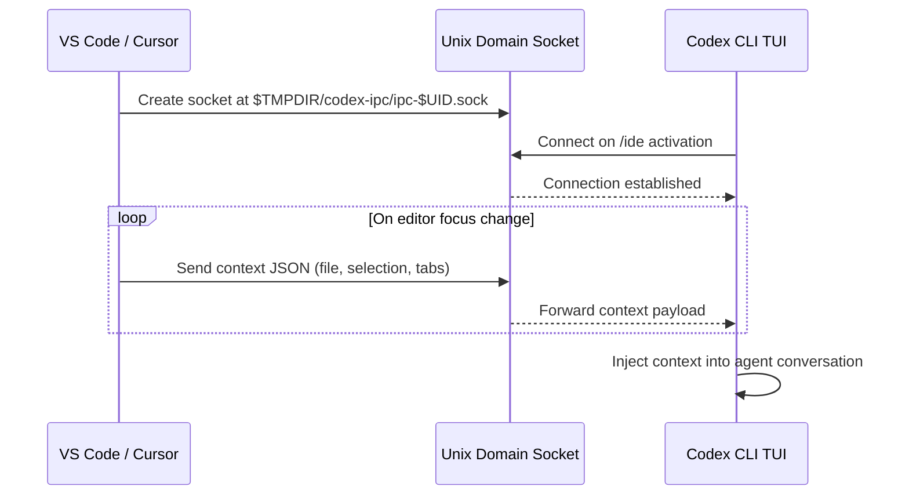
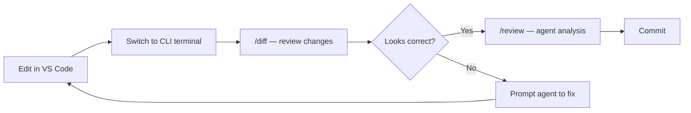

# Codex CLI /ide Context Injection: Bridging Your Terminal and Editor Through IPC


---

Terminal-native developers have long faced an awkward choice: use the Codex IDE extension for editor context, or use the CLI for its richer TUI, Vim keybindings, and scripting power. With v0.129.0 (7 May 2026), that choice disappears. The `/ide` slash command bridges the CLI and your editor through a Unix domain socket, letting the TUI pull file selections, open tabs, and cursor positions directly from VS Code or Cursor — without leaving the terminal[^1].

This article examines the IPC architecture, walks through setup and workflow patterns, and addresses the practical limitations you should know before relying on this bridge in production.

## Why the Bridge Matters

The Codex CLI and IDE extension share the same agent engine and the same `~/.codex/config.toml`[^2]. But until v0.129.0, they operated in isolated context bubbles. The IDE extension knew which file you were editing; the CLI did not. Developers who preferred the terminal had to manually `/mention` files or paste selections — friction that compounded across long sessions.

The `/ide` command collapses that gap. When active, the CLI receives a continuous feed of editor state: which file is focused, what text is selected, and which tabs are open[^3]. This means prompts like "refactor the selected function" work identically whether typed in the IDE sidebar or the terminal TUI.

## Architecture: Unix Domain Sockets and JSON-RPC

The bridge uses a Unix domain socket for inter-process communication between the Codex extension running inside the editor and the CLI process running in a terminal[^3].

### Socket Path Convention

The socket is created at a deterministic, user-scoped path:

```
$TMPDIR/codex-ipc/ipc-$UID.sock
```

On macOS, this resolves to something like:

```bash
/var/folders/kl/22qv4d_10pl1bj15h68pmy2w0000gn/T/codex-ipc/ipc-501.sock
```

The `$UID` suffix ensures per-user isolation, though multi-user Linux hosts with shared `/tmp` have exposed edge cases around this — more on that in the limitations section[^4].

### Context Payload

When the CLI connects, it receives structured JSON describing the editor state:

```json
{
  "file": "src/handlers/auth.ts",
  "selection": {
    "start": { "line": 27, "character": 0 },
    "end": { "line": 42, "character": 0 },
    "active": { "line": 42, "character": 0 },
    "anchor": { "line": 27, "character": 0 }
  }
}
```

The `active` and `anchor` fields distinguish cursor direction — useful when the agent needs to understand whether you selected top-down or bottom-up through a block of code[^3].



### Rust Implementation

The client-side IPC logic lives in `codex-rs/tui/src/ide_context/ipc.rs` within the open-source Codex repository[^3]. The TUI spawns a background task that maintains the socket connection and updates a shared context store. When you type a prompt, the agent automatically includes the latest editor context alongside your message — no explicit `/mention` needed.

## Setup and Prerequisites

### Requirements

| Component | Minimum Version |
|-----------|----------------|
| Codex CLI | v0.129.0-alpha.15 or later |
| VS Code | 1.96+ with Codex extension |
| Cursor | Any version with Codex extension |
| Windsurf | Any version with Codex extension |
| JetBrains | Rider, IntelliJ, PyCharm, WebStorm with Codex plugin |

Both the CLI and the editor must be working within the same project directory[^3][^5].

### Activating the Bridge

1. Open your project in VS Code (or Cursor) with the Codex extension installed and authenticated.
2. In a separate terminal, launch the CLI from the same project root:

```bash
cd ~/projects/my-service
codex
```

3. Inside the TUI, type:

```
/ide
```

If the connection succeeds, the status line displays:

```
IDE context is on. Connected to your IDE
```

The extension creates the socket on startup; the CLI merely connects as a client. If you start the CLI before the editor, run `/ide` again once the extension is active.

## Workspace-Aware /diff

The v0.129.0 release also upgraded `/diff` to be workspace-aware, routing through workspace commands rather than a simple `git diff`[^1]. When IDE context is active, `/diff` understands which environment you are working in and scopes its output accordingly. This matters for multi-environment sessions — for example, when you have both a local checkout and a cloud Codex environment open simultaneously.

```bash
# In the TUI, after making edits:
/diff
```

The output now includes untracked files alongside staged and unstaged changes, rendered with the TUI's syntax-highlighted pager[^6]. Combined with `/review`, this creates a tight inspect-and-iterate loop:



## Practical Workflow Patterns

### Pattern 1: Selection-Driven Refactoring

Select a function in VS Code, switch to the CLI, and type:

```
Refactor the selected code to use early returns instead of nested if/else
```

The agent sees the exact selection boundaries from the IPC context and scopes its changes accordingly — no need to specify the file or line numbers.

### Pattern 2: IDE Context with Vim Mode

v0.129.0 also introduced modal Vim editing in the TUI composer (`/vim`)[^1]. Combined with `/ide`, you get an efficient workflow: navigate and select in VS Code's GUI, then compose and iterate in the terminal with Vim keybindings.

```toml
# ~/.codex/config.toml
[tui]
vim_mode_default = true
```

### Pattern 3: Resume with Editor State

The redesigned resume/fork picker in v0.129.0 preserves IDE context across session boundaries[^1]. When you `/resume` a previous session, the agent retains awareness of which files were open in the editor at the time of the last interaction — provided the editor is still running with the same project.

### Pattern 4: Auto-Context in the IDE Extension

The IDE extension offers an `/auto-context` slash command that automatically includes recent files and IDE context in every prompt[^7]. When paired with the CLI bridge, this creates a dual-surface workflow: the extension feeds context passively, whilst the CLI gives you full TUI control over the conversation.

## Known Limitations and Edge Cases

### Multi-User Linux Hosts

On shared Linux servers accessed via VS Code Remote-SSH, the socket path `/tmp/codex-ipc/ipc-$UID.sock` can cause `EACCES` permission errors when different users create sockets in the same directory[^4]. The recommended workaround is to ensure the `codex-ipc` directory is created with per-user permissions, or to use `$XDG_RUNTIME_DIR` instead of `/tmp`.

### Mixed Reception on Auto-Context Quality

A community poll on the IDE Context feature showed 44% of respondents actively use it, 14% have disabled it, and 41% were unaware it existed[^8]. The primary criticism is that automatic context inclusion can produce lower-quality outputs when the agent fixates on open but irrelevant files rather than the files that actually changed in the conversation. For best results, be deliberate: close unrelated tabs before running `/ide`, or use explicit `/mention` for precision-critical prompts.

### JetBrains Support

Whilst the IDE extension supports JetBrains IDEs (Rider, IntelliJ, PyCharm, WebStorm), the IPC socket bridge has been primarily tested with VS Code and Cursor[^5]. JetBrains users should verify socket creation and test the connection before relying on `/ide` in production workflows.

### No Configuration Keys (Yet)

The `/ide` bridge has no corresponding entries in `config.toml`[^9]. You cannot currently configure the socket path, set auto-connect behaviour, or filter which context fields are transmitted. This is likely to change in future releases as the feature matures beyond its current implicit-convention approach.

### Windows Considerations

On Windows, the IPC mechanism uses named pipes rather than Unix domain sockets. The sandbox grants the sandbox user access to the desktop runtime binary cache as of v0.130.0[^1], but the `/ide` bridge on Windows should be considered less mature than on macOS or Linux.

## Troubleshooting

If `/ide` reports no connection:

1. **Verify the socket exists:**

```bash
ls -la ${TMPDIR:-/tmp}/codex-ipc/
```

2. **Check the extension is active:** Look for the Codex icon in the VS Code sidebar. If greyed out, re-authenticate.

3. **Confirm matching project roots:** The CLI and editor must share the same working directory. A mismatch silently prevents context injection.

4. **Restart the extension:** Sometimes the socket is not recreated after an extension update. Reload the VS Code window (`Cmd+Shift+P` > "Developer: Reload Window").

## What Comes Next

The `/ide` bridge in v0.129.0 is a foundation. The absence of `config.toml` keys and the ongoing socket-path issues on multi-user hosts suggest this is early-stage infrastructure that OpenAI intends to harden. The v0.130.0 release already extended related plumbing — multi-environment `view_image` resolution and live config refresh on app-server threads both point towards a future where CLI, IDE, and cloud surfaces share context seamlessly[^1].

For now, the pragmatic approach is to adopt `/ide` for local development where you control the environment, and fall back to explicit `/mention` in shared or remote contexts where socket isolation is uncertain.

## Citations

[^1]: OpenAI, "Changelog — Codex," developers.openai.com, May 2026. [https://developers.openai.com/codex/changelog](https://developers.openai.com/codex/changelog)

[^2]: OpenAI, "CLI — Codex," developers.openai.com, 2026. [https://developers.openai.com/codex/cli](https://developers.openai.com/codex/cli)

[^3]: nikkie-ftnext, "Codex CLI 0.129.0 /ide support — how does IPC work?", hatenablog.com, May 2026. [https://nikkie-ftnext.hatenablog.com/entry/codex-cli-0-129-0-ide-slash-command-how-work-know-inter-process-communication](https://nikkie-ftnext.hatenablog.com/entry/codex-cli-0-129-0-ide-slash-command-how-work-know-inter-process-communication)

[^4]: GitHub Issue #17765, "VS Code Remote-SSH extension uses global /tmp/codex-ipc on multi-user Linux hosts," openai/codex, 2026. [https://github.com/openai/codex/issues/17765](https://github.com/openai/codex/issues/17765)

[^5]: OpenAI, "IDE extension — Codex," developers.openai.com, 2026. [https://developers.openai.com/codex/ide](https://developers.openai.com/codex/ide)

[^6]: OpenAI, "Slash commands in Codex CLI," developers.openai.com, 2026. [https://developers.openai.com/codex/cli/slash-commands](https://developers.openai.com/codex/cli/slash-commands)

[^7]: OpenAI, "Slash commands — Codex IDE," developers.openai.com, 2026. [https://developers.openai.com/codex/ide/slash-commands](https://developers.openai.com/codex/ide/slash-commands)

[^8]: GitHub Discussion #11730, "IDE Context feature," openai/codex, 2026. [https://github.com/openai/codex/discussions/11730](https://github.com/openai/codex/discussions/11730)

[^9]: OpenAI, "Configuration Reference — Codex," developers.openai.com, 2026. [https://developers.openai.com/codex/config-reference](https://developers.openai.com/codex/config-reference)
