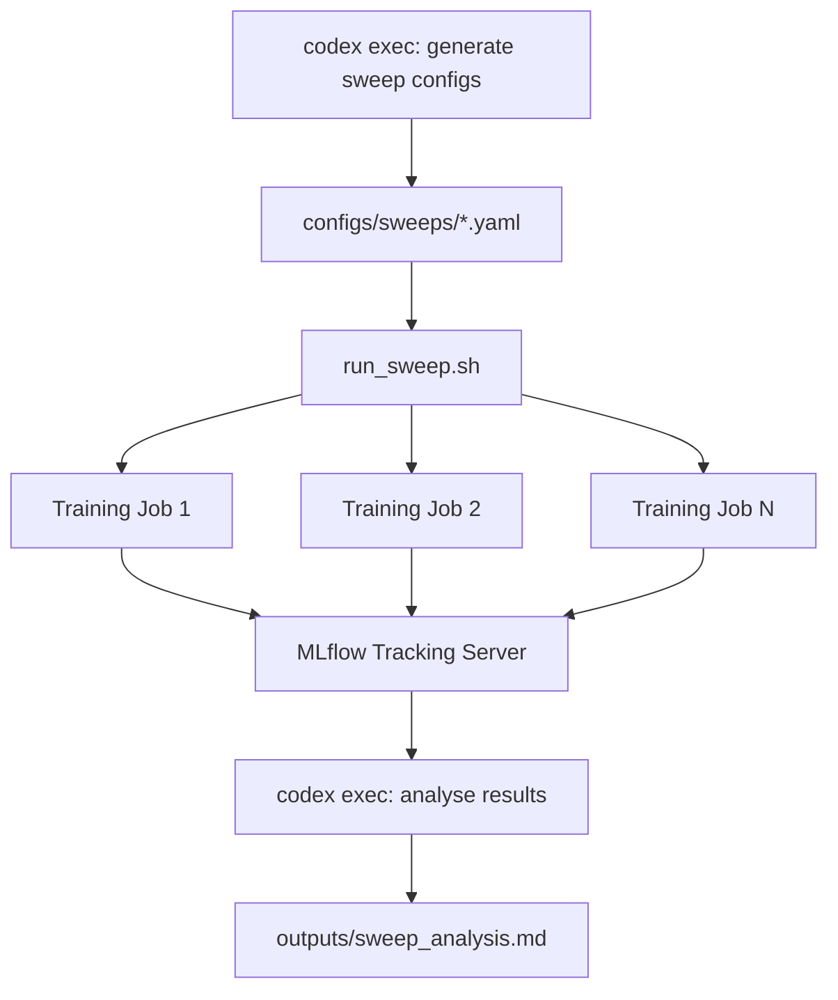

# Codex CLI for ML Engineering: Training Scripts, Experiment Tracking, and MLOps Pipeline Automation


---

## Introduction

Machine learning engineering sits at the intersection of software development and experimental science. Training scripts must be correct code *and* reproducible experiments. Pipelines must handle data versioning, model artefacts, hyperparameter searches, and deployment — all while keeping an audit trail that satisfies both researchers and compliance teams.

Codex CLI's MCP integration, sandbox isolation, and `codex exec` automation make it a natural fit for this workflow. Two MCP servers — MLflow and Hugging Face Hub — now provide first-class bridges between the agent and the ML ecosystem. Combined with AGENTS.md conventions tailored for ML repositories, Codex CLI can assist with everything from writing PyTorch training loops to orchestrating end-to-end MLOps pipelines in CI.

This article covers the practical integration points: configuring MCP servers for ML tools, writing effective AGENTS.md files for ML repositories, automating experiment workflows with `codex exec`, and building reproducible training pipelines with agent assistance.

---

## MCP Servers for the ML Ecosystem

### MLflow MCP Server

MLflow 3.5.1 introduced an official MCP server that exposes experiment tracking, trace analysis, and evaluation tools directly to coding agents[^1]. The server runs locally and connects to any MLflow tracking URI — local file store, remote server, or Databricks managed instance.

Install and configure it in `~/.codex/config.toml`:

```toml
[mcp_servers.mlflow]
command = "uv"
args = ["run", "--with", "mlflow[mcp]>=3.5.1", "mlflow", "mcp", "run"]

[mcp_servers.mlflow.env]
MLFLOW_TRACKING_URI = "http://localhost:5000"
MLFLOW_MCP_TOOLS = "all"
```

The `MLFLOW_MCP_TOOLS` environment variable controls which tool groups are exposed[^1]:

| Value | Scope |
|-------|-------|
| `genai` | Tracing and evaluation tools (default) |
| `ml` | Traditional ML experiment workflows |
| `all` | Complete toolset |

With this configured, Codex can search traces, log feedback scores, set experiment tags, and retrieve assessment details — all without leaving the terminal session[^1].

### Hugging Face Hub MCP Server

The Hugging Face MCP server connects Codex to the Hub's model registry, dataset catalogue, and Spaces ecosystem[^2]. Seven built-in tools cover model search (filtered by task, library, and licence), repository metadata retrieval, dataset exploration, image generation, and semantic search across Spaces[^2].

```toml
[mcp_servers.huggingface]
command = "npx"
args = ["-y", "@huggingface/mcp-server"]

[mcp_servers.huggingface.env]
HF_TOKEN = "hf_..."
```

This lets Codex search for pre-trained models matching specific task types, inspect model cards and licence metadata, and find community Spaces with relevant tools — all as part of a natural coding conversation[^2].

---

## AGENTS.md for ML Repositories

A well-structured AGENTS.md is the highest-leverage investment for any ML repository using Codex CLI[^3]. ML projects have domain-specific conventions that general-purpose agents routinely get wrong: random seed management, GPU memory patterns, experiment naming, and the boundary between code changes and hyperparameter changes.

```markdown
# AGENTS.md

## Repository Structure
- `src/models/` — Model architecture definitions (PyTorch nn.Module subclasses)
- `src/data/` — Dataset classes, transforms, and data loaders
- `src/training/` — Training loops, optimisers, schedulers
- `configs/` — Hydra/OmegaConf YAML experiment configs
- `scripts/` — Entry-point scripts (train.py, evaluate.py, export.py)
- `tests/` — Unit tests; run with `pytest tests/ -x`

## Conventions
- All experiments MUST set `torch.manual_seed()` and `torch.cuda.manual_seed_all()`
- Use `torch.amp.autocast` for mixed-precision training, never manual `.half()` casts
- Log all hyperparameters to MLflow at experiment start with `mlflow.log_params()`
- Model checkpoints go to `outputs/checkpoints/` — never commit to git
- Use Hydra for configuration; do not hard-code hyperparameters in training loops

## Build and Test
- Install: `pip install -e ".[dev]"`
- Lint: `ruff check src/ tests/`
- Type check: `pyright src/`
- Test: `pytest tests/ -x --timeout=60`
- Train (smoke test): `python scripts/train.py --config-name=smoke_test`
```

The key insight is specificity. Telling Codex "use mixed-precision training" is vague; telling it to use `torch.amp.autocast` with the device type from the config prevents the agent from generating deprecated patterns like `torch.cuda.amp.autocast`, which PyTorch 2.x deprecated[^4].

---

## Writing Training Scripts with Codex CLI

### The Plan-First Pattern for Model Architecture

Complex model architectures benefit from Codex CLI's plan mode. Start by asking the agent to plan before writing:

```
codex "Plan a Vision Transformer implementation for image classification.
Target: CIFAR-100, patch size 16, embedding dim 768, 12 heads, 12 layers.
Use torch.nn.MultiheadAttention. Plan first, do not write code yet."
```

The agent will outline the class hierarchy, parameter counts, and forward pass structure. Review the plan, then approve implementation. This avoids the common failure mode where agents generate plausible-looking but architecturally incorrect transformer code[^3].

### Generating Data Pipelines

Data loading code is highly formulaic — exactly the kind of work where Codex CLI excels. A well-scoped prompt with explicit constraints produces reliable results:

```
codex "Write a PyTorch Dataset class for the Oxford Pets dataset.
Requirements:
- Download via torchvision.datasets if available, otherwise use HuggingFace datasets
- Apply standard ImageNet normalisation
- Support train/val/test splits with a fixed random seed
- Include a DataLoader factory function with configurable batch size and num_workers
- Add type hints throughout"
```

The AGENTS.md conventions ensure the agent follows project-specific patterns (seed management, normalisation constants) without restating them in every prompt.

### Debugging Training Runs

When a training run produces unexpected loss curves or gradient issues, Codex CLI's ability to read files and run commands in a single session is particularly valuable:

```
codex "The training loss plateaus at 2.3 after epoch 5.
Read src/training/trainer.py and configs/experiment_v3.yaml.
Check for:
1. Learning rate schedule misconfiguration
2. Gradient clipping values
3. Weight decay application to bias and norm layers
4. Data augmentation that might be too aggressive
Run the smoke test to verify any fixes."
```

The agent can inspect the code, correlate configuration values, identify the issue, propose a fix, and run the smoke test — all within a single interactive session.

---

## Experiment Tracking with MLflow MCP

With the MLflow MCP server active, Codex can interact with your experiment tracking system directly. This enables three powerful workflows.

### Querying Past Experiments

```
Ask Codex: "Search MLflow for all runs in experiment 'cifar100-vit'
where val_accuracy > 0.82. Show me the hyperparameters of the top 3."
```

The agent calls the `search_traces` tool to query the MLflow backend, retrieves filtered results, and presents them in a structured format — without you writing a single MLflow API call[^1].

### Logging from Agent-Written Code

When Codex generates training code, the AGENTS.md convention to "log all hyperparameters to MLflow at experiment start" ensures the agent includes proper MLflow integration:

```python
import mlflow

def train(config: TrainConfig) -> None:
    mlflow.set_experiment(config.experiment_name)
    with mlflow.start_run(run_name=config.run_name):
        mlflow.log_params(config.to_dict())

        for epoch in range(config.epochs):
            train_loss = train_epoch(model, train_loader, optimiser)
            val_metrics = evaluate(model, val_loader)

            mlflow.log_metrics({
                "train_loss": train_loss,
                "val_accuracy": val_metrics.accuracy,
                "val_f1": val_metrics.f1,
            }, step=epoch)

        mlflow.pytorch.log_model(model, "model")
```

### Automated Experiment Analysis

```bash
codex exec "Query MLflow experiment 'cifar100-vit'. Compare the last 10 runs.
Identify which hyperparameter changes correlated with accuracy improvements.
Write a summary to outputs/experiment_analysis.md" \
  --sandbox workspace-write
```

This uses `codex exec` to run the analysis non-interactively, suitable for scheduled post-training analysis in CI[^5].

---

## Hugging Face Hub Integration

The Hugging Face MCP server turns model discovery and dataset selection into a conversational workflow.

### Model Selection

```
Ask Codex: "Search Hugging Face for image classification models
fine-tuned on CIFAR-100 with an Apache-2.0 licence.
Compare the top 3 by parameter count and reported accuracy."
```

The agent uses the Hub's model search tool to find candidates, retrieves model card metadata, and presents a comparison table — replacing manual Hub browsing[^2].

### Dataset Exploration

```
Ask Codex: "Find Hugging Face datasets for medical image segmentation.
Filter for datasets with at least 10,000 samples and a train/test split.
Show licence and citation information."
```

### Incorporating Pre-Trained Weights

When the agent identifies a suitable pre-trained model, it can generate the integration code following your repository's conventions:

```python
from transformers import AutoModel, AutoConfig

def load_pretrained_backbone(model_name: str, num_classes: int) -> nn.Module:
    """Load a HuggingFace model as a feature extractor with a custom head."""
    config = AutoConfig.from_pretrained(model_name)
    backbone = AutoModel.from_pretrained(model_name, config=config)

    # Freeze backbone parameters
    for param in backbone.parameters():
        param.requires_grad = False

    classifier = nn.Linear(config.hidden_size, num_classes)
    return nn.Sequential(backbone, classifier)
```

---

## MLOps Pipeline Automation with `codex exec`

The non-interactive `codex exec` command turns Codex CLI into an MLOps automation tool. Combined with CI/CD systems, it can orchestrate training, evaluation, and deployment pipelines.

### Automated Model Evaluation in CI

```yaml
# .github/workflows/model-eval.yml
name: Model Evaluation
on:
  push:
    paths:
      - 'src/models/**'
      - 'configs/**'

jobs:
  evaluate:
    runs-on: ubuntu-latest
    steps:
      - uses: actions/checkout@v4
      - uses: openai/codex-action@v1
        with:
          codex-args: >
            exec "Run the smoke test suite for all modified model
            configurations. Report any accuracy regressions compared
            to the baseline in configs/baseline.yaml.
            Write results to outputs/eval_report.md"
            --sandbox workspace-write
```

This triggers an agent-driven evaluation whenever model code or configurations change, catching regressions before they reach the main branch[^5][^6].

### Hyperparameter Sweep Orchestration

```bash
codex exec "Read configs/sweep.yaml which defines a hyperparameter grid.
For each combination, generate a Hydra override file in configs/sweeps/.
Create a shell script that launches each run sequentially with proper
MLflow experiment tagging. Do not execute the training runs." \
  --sandbox workspace-write
```

The agent generates the sweep infrastructure — configuration files and orchestration scripts — while leaving the actual GPU-intensive training to your existing compute platform[^5].



### Model Export and Deployment Preparation

```bash
codex exec "Load the best checkpoint from outputs/checkpoints/.
Export to ONNX format with dynamic batch size.
Validate the exported model matches PyTorch outputs within 1e-5 tolerance.
Generate a Dockerfile for TorchServe deployment." \
  --sandbox workspace-write
```

---

## Sandbox Considerations for ML Workloads

ML workflows often require network access (downloading pre-trained weights, datasets, and package dependencies) and write access beyond the workspace (pip caches, model caches in `~/.cache/huggingface`). Configure sandbox permissions accordingly:

```toml
# .codex/config.toml for ML repositories
sandbox_mode = "workspace-write"

[profiles.ml-download]
sandbox_mode = "danger-full-access"
```

Use the restrictive `workspace-write` mode for code generation and analysis tasks. Switch to the `ml-download` profile only when the agent genuinely needs to download models or datasets[^7]:

```bash
codex --profile ml-download "Download the ViT-B/16 checkpoint from HuggingFace
and save it to models/pretrained/"
```

⚠️ Running training jobs that require GPU access through Codex CLI's sandbox is not recommended. The sandbox does not pass through GPU devices. Use Codex CLI for generating, reviewing, and orchestrating training code; run the actual training on your compute infrastructure.

---

## Practical Patterns

### The Experiment Notebook Pattern

Use Codex CLI to generate structured experiment notes alongside code changes:

```bash
codex "I'm starting experiment v4: replacing the ResNet-50 backbone with
ViT-B/16. Before writing any code:
1. Create experiments/v4-vit-backbone.md with hypothesis, expected outcomes,
   and rollback criteria
2. Update configs/experiment_v4.yaml with the new architecture config
3. Modify src/models/classifier.py to support both backbones via config
4. Add a unit test verifying the new model produces correct output shapes"
```

This enforces the discipline of documenting the *why* before the *what* — a pattern that experiment tracking tools alone cannot enforce.

### The Reproducibility Audit

```bash
codex exec "Audit src/training/ for reproducibility issues. Check for:
- Missing random seed settings (torch, numpy, random, PYTHONHASHSEED)
- Non-deterministic operations without torch.use_deterministic_algorithms()
- Data loader workers without worker_init_fn
- CUDA non-determinism flags
Write findings to outputs/reproducibility_audit.md" \
  --sandbox workspace-write
```

### The Configuration Drift Detector

```bash
codex exec "Compare configs/production.yaml against the MLflow run that
produced the currently deployed model (tag: 'deployed=true').
Report any configuration drift." \
  --sandbox workspace-write
```

With the MLflow MCP server active, the agent can query the tracking server for the deployed run's parameters and compare them against the current configuration files — catching drift that accumulates when code changes outpace experiment tracking.

---

## Current Limitations

Several constraints are worth noting for ML engineering workflows:

- **No GPU passthrough**: The Codex CLI sandbox does not expose GPU devices. Training, inference, and profiling must run outside the sandbox[^7].
- **Large file handling**: Model checkpoints and datasets can exceed the context window. Use `codex exec` with file path references rather than attempting to read binary files.
- **MCP tool concurrency**: While Codex supports parallel MCP calls[^8], the MLflow MCP server processes requests sequentially. High-frequency logging during training should use the MLflow Python SDK directly, not the MCP bridge.
- **Notebook support**: Codex CLI can read and edit `.ipynb` files, but executing notebook cells requires a running Jupyter kernel outside the agent's sandbox.

---

## Conclusion

ML engineering workflows map naturally onto Codex CLI's strengths: structured code generation guided by AGENTS.md conventions, experiment tracking through MCP server integration, and pipeline orchestration via `codex exec`. The MLflow and Hugging Face Hub MCP servers bridge the gap between the coding agent and the ML ecosystem, turning model search, experiment analysis, and deployment preparation into conversational workflows.

The key pattern is separation of concerns: use Codex CLI for everything that is fundamentally *code* — writing training scripts, configuring experiments, generating pipeline infrastructure, and auditing reproducibility. Leave the GPU-intensive *compute* — actual training and inference — to your existing infrastructure. The agent generates and orchestrates; the cluster executes.

---

## Citations

[^1]: MLflow, "MLflow MCP Server," MLflow Documentation, 2026. [https://mlflow.org/docs/latest/genai/mcp/](https://mlflow.org/docs/latest/genai/mcp/)

[^2]: Hugging Face, "Hugging Face MCP Server," Hugging Face Hub Documentation, 2026. [https://huggingface.co/docs/hub/agents-mcp](https://huggingface.co/docs/hub/agents-mcp)

[^3]: OpenAI, "Best practices – Codex," OpenAI Developers Documentation, 2026. [https://developers.openai.com/codex/learn/best-practices](https://developers.openai.com/codex/learn/best-practices)

[^4]: PyTorch, "Automatic Mixed Precision," PyTorch Documentation, 2026. [https://docs.pytorch.org/docs/stable/amp.html](https://docs.pytorch.org/docs/stable/amp.html)

[^5]: OpenAI, "Non-interactive mode – Codex," OpenAI Developers Documentation, 2026. [https://developers.openai.com/codex/noninteractive](https://developers.openai.com/codex/noninteractive)

[^6]: OpenAI, "codex-action — GitHub Action for Codex CLI," GitHub, 2026. [https://github.com/openai/codex-action](https://github.com/openai/codex-action)

[^7]: OpenAI, "Agent approvals & security – Codex," OpenAI Developers Documentation, 2026. [https://developers.openai.com/codex/agent-approvals-security](https://developers.openai.com/codex/agent-approvals-security)

[^8]: OpenAI, "Model Context Protocol – Codex," OpenAI Developers Documentation, 2026. [https://developers.openai.com/codex/mcp](https://developers.openai.com/codex/mcp)
