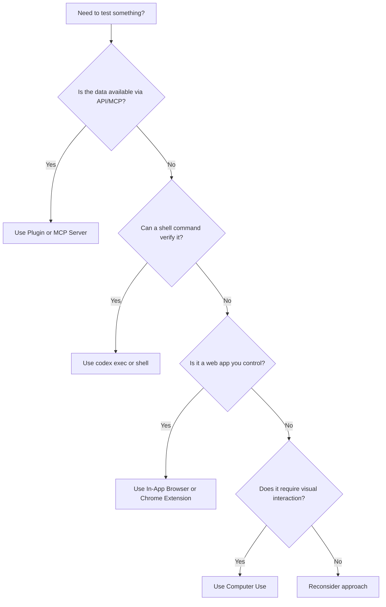
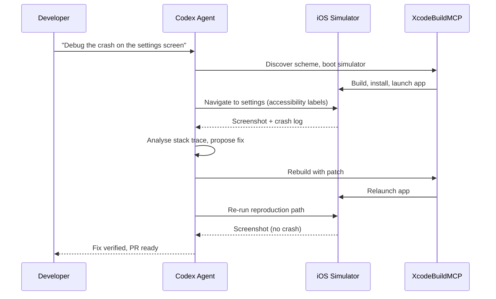

# Codex Computer Use for QA Testing: Automated GUI Verification, Desktop App Testing, and Visual Bug Detection


---

Since April 2026, Codex has been able to see, click, and type across any macOS application — turning it from a code-only agent into a full desktop control surface [^1]. This article examines how to use Codex Computer Use specifically for QA testing: running automated passes through desktop and web applications, catching visual bugs, generating structured bug reports, and integrating the results back into your development workflow.

## What Computer Use Actually Does

Computer Use is a Codex App plugin that grants the agent access to macOS screen recording and accessibility APIs [^2]. Once enabled, Codex can:

- **Take screenshots** of any allowed application window
- **Click, type, and navigate** through menus, forms, and buttons
- **Inspect clipboard state** in target applications
- **Read on-screen text** and visual layout to identify discrepancies

Critically, it operates *alongside* your normal work. Codex creates its own screen context, so you can continue using your IDE whilst the agent runs a QA pass in a staging browser or desktop application [^1].

## The Decision Framework: When to Use Computer Use

Computer Use is not the default tool for everything. OpenAI documents a clear priority order [^3]:



Choose Computer Use when **the interface itself is the evidence or the control surface** [^3]. Appropriate scenarios include:

- **Desktop application QA** — testing macOS or Electron apps with no API
- **iOS Simulator debugging** — reproducing touch-flow bugs visually [^4]
- **GUI-only workflows** — verifying settings, preferences, or configuration panels
- **Visual regression detection** — catching layout shifts, overlapping elements, or rendering artefacts
- **Browser flows requiring authentication** — testing logged-in states that Playwright cannot easily reach

## Setting Up Computer Use for QA

### 1. Install the Plugin

Open the Codex desktop app, navigate to **Settings → Plugins**, and install the **Computer Use** plugin. macOS will prompt for two system permissions [^2]:

| Permission | Purpose |
|---|---|
| **Screen Recording** | Allows Codex to capture screenshots of target applications |
| **Accessibility** | Allows Codex to click, type, and navigate within windows |

### 2. Understand the Two-Layer Permission Model

Computer Use enforces a deliberate two-layer approval system [^2] [^3]:

1. **System-level**: the macOS permissions above grant *capability*
2. **Product-level**: Codex asks for explicit approval before accessing each individual application

This means granting Screen Recording does not give Codex blanket access to every app. Each target application requires a separate approval prompt, with an optional "Always allow" toggle for trusted apps.

### 3. Prepare Your Testing Environment

Before launching a QA pass, ensure:

- The target application is running and visible (or the Simulator is booted)
- Test data and accounts are in the expected state
- Feature flags are set correctly for the environment under test

## Running a QA Pass

### The Starter Prompt Pattern

OpenAI recommends a structured prompt template for QA passes [^5]:

```
@Computer Test my app in [staging/localhost:3000/Simulator].

Test these flows:
- User registration with email
- Dashboard data loading after login
- Settings modal export format selection

For every bug you find, include:
- Repro steps
- Expected result
- Actual result
- Severity (P0-P3)

Keep going past non-blocking issues and end with a short triage summary.
```

### Key Prompting Principles

**Be explicit about setup.** Include environment details, account state, and feature flags. Codex cannot infer that your staging server requires a specific test account [^5].

**Specify issue types.** Tell Codex whether to focus on functional bugs, layout problems, copy errors, visual regressions, or all of the above [^5].

**Define continuation behaviour.** By default, a P0 crash might halt the agent. If you want it to document the crash and continue testing other flows, say so explicitly.

**Reference existing test plans.** If your repository contains a `test-plan.md` or a Notion export of your QA checklist, attach it to the prompt for consistent coverage [^5].

### Following Up in the Same Thread

After the QA pass completes, you can chain further actions within the same Codex thread [^5]:

- Ask Codex to fix the identified bugs in code
- Generate GitHub or Linear issue drafts from the bug report
- Narrow the scope to re-test only the failing flows
- Request screenshots as evidence for each reported issue

## iOS Simulator Debugging

Computer Use integrates with the **XcodeBuildMCP** server to create a complete iOS debugging loop [^4]:



The workflow follows six phases [^4]:

1. **Discovery** — identify the Xcode project, enumerate schemes, find or boot the correct Simulator
2. **Build and launch** — compile the app with log capture enabled
3. **Reproduction** — navigate the exact user path, preferring accessibility labels over screen coordinates
4. **Evidence gathering** — capture screenshots, Simulator logs, and LLDB stack frames if a crash occurs
5. **Code fix** — implement a minimal, targeted change
6. **Verification** — rerun the exact reproduction path to confirm the fix

Best practice: prefer accessibility identifiers over raw coordinates for stable, repeatable interactions. If controls lack stable labels, ask Codex to add `accessibilityIdentifier` values as part of the fix [^4].

## Safety Boundaries

Computer Use intentionally restricts certain operations [^2] [^3]:

| Restriction | Rationale |
|---|---|
| Cannot automate terminal applications | Prevents recursive agent execution |
| Cannot automate Codex itself | Prevents self-modification loops |
| Cannot authenticate as administrator | Blocks privilege escalation |
| Cannot approve security/privacy prompts | Keeps human in the loop for system changes |
| Cannot bypass sandbox policies | File edits and shell commands remain sandboxed |

### Hard Stops for QA Testing

Stop and reconsider if your QA pass would require [^3]:

- **Signed-in account actions** — actions taken through your logged-in browser session may count as *your* actions (e.g. submitting forms, purchasing)
- **Destructive operations** — deleting files, changing global settings, modifying permissions
- **Irreversible submissions** — form submission to production, account deletion, consent approval
- **Prompt injection risk** — on-screen text from untrusted sources attempting to redirect the agent

## Combining Computer Use with CLI Workflows

Computer Use runs in the Codex desktop app, not the CLI. However, you can combine both surfaces in a practical QA workflow:

### Pattern: Visual QA + Automated Fix + CI Verification

```bash
# 1. Run visual QA pass in Codex App (Computer Use)
#    → generates bug-report.md with screenshots

# 2. Fix the bugs using Codex CLI
codex exec "Fix the P0 and P1 bugs documented in bug-report.md. \
Run the test suite after each fix."

# 3. Push and verify in CI
git add -A && git commit -m "fix: address QA findings from computer use pass"
git push
```

### Pattern: Codex CLI Builds, Computer Use Verifies

Use `codex exec` to generate or modify code, then switch to the Codex App with Computer Use to visually verify the result:

1. `codex exec "Add a dark mode toggle to the settings page"`
2. Open the Codex App: `@Computer Open the app, navigate to Settings, toggle dark mode on and off. Screenshot both states.`
3. Review the screenshots and iterate

## Current Limitations

- **macOS only** — Computer Use is not yet available on Windows or Linux [^2]
- **Geographic restrictions** — excluded from the European Economic Area, United Kingdom, and Switzerland at launch [^2]
- **No terminal automation** — Codex cannot operate terminal applications through Computer Use [^2]
- **Intel Mac issues** — some users report the Computer Use plugin remains unavailable on macOS Intel (x86_64) despite correct configuration [^6]
- **Approval friction** — per-app approval prompts can interrupt long QA passes; use "Always allow" for trusted test applications
- **Intermediate difficulty** — OpenAI rates QA testing with Computer Use as intermediate, with approximately 30 minutes per QA pass [^5]

## Comparison: Computer Use vs. Playwright MCP vs. Chrome Extension

| Capability | Computer Use | Playwright MCP | Chrome Extension |
|---|---|---|---|
| Desktop app testing | Yes | No | No |
| iOS Simulator | Yes (via XcodeBuildMCP) | No | No |
| Web app testing | Yes | Yes | Yes |
| Authenticated sessions | Yes (with caution) | Limited | Yes (uses your session) |
| DOM inspection | No (visual only) | Yes | Yes (DevTools) |
| Headless CI | No | Yes | No |
| Platform | macOS only | Cross-platform | Chrome on any OS |
| Structured assertions | No | Yes | No |

The key insight: Computer Use fills the gap where **no programmatic API exists**. For web applications with accessible DOM, Playwright MCP or the Chrome Extension remain more reliable and automatable. Computer Use excels at desktop apps, Simulator flows, and any GUI that cannot be reached through structured tools.

## Practical Recommendations

1. **Start observational.** First QA pass should be read-only: "Open the app, inspect the settings modal, report which export format is selected. Do not change values." [^3]
2. **Progress gradually.** Move from observation → small reversible actions → full flow testing → combined fix-and-verify workflows [^3].
3. **One bug per run.** For maximum trust and reviewability, address one bug per Computer Use session rather than asking the agent to fix everything it finds [^4].
4. **Attach test plans.** If your team maintains QA checklists, attach them to the prompt. Computer Use follows explicit flows more reliably than it discovers edge cases independently.
5. **Combine surfaces.** Use Computer Use for visual verification and the CLI for code changes — each surface plays to its strengths.

## Citations

[^1]: OpenAI. "Codex for (almost) everything." *openai.com*, April 2026. [https://openai.com/index/codex-for-almost-everything/](https://openai.com/index/codex-for-almost-everything/)

[^2]: OpenAI. "Computer Use — Codex App." *OpenAI Developers*, 2026. [https://developers.openai.com/codex/app/computer-use](https://developers.openai.com/codex/app/computer-use)

[^3]: LaoZhang AI Blog. "Codex Computer Use: When to Use It, How to Start Safely, and When Another Route Is Better." 2026. [https://blog.laozhang.ai/en/posts/codex-computer-use](https://blog.laozhang.ai/en/posts/codex-computer-use)

[^4]: OpenAI. "Debug in iOS Simulator — Codex Use Cases." *OpenAI Developers*, 2026. [https://developers.openai.com/codex/use-cases/ios-simulator-bug-debugging](https://developers.openai.com/codex/use-cases/ios-simulator-bug-debugging)

[^5]: OpenAI. "QA Your App with Computer Use — Codex Use Cases." *OpenAI Developers*, 2026. [https://developers.openai.com/codex/use-cases/qa-your-app-with-computer-use](https://developers.openai.com/codex/use-cases/qa-your-app-with-computer-use)

[^6]: GitHub Issue #18404. "Computer Use plugin remains unavailable on macOS Intel (x86_64)." *openai/codex*, 2026. [https://github.com/openai/codex/issues/18404](https://github.com/openai/codex/issues/18404)
