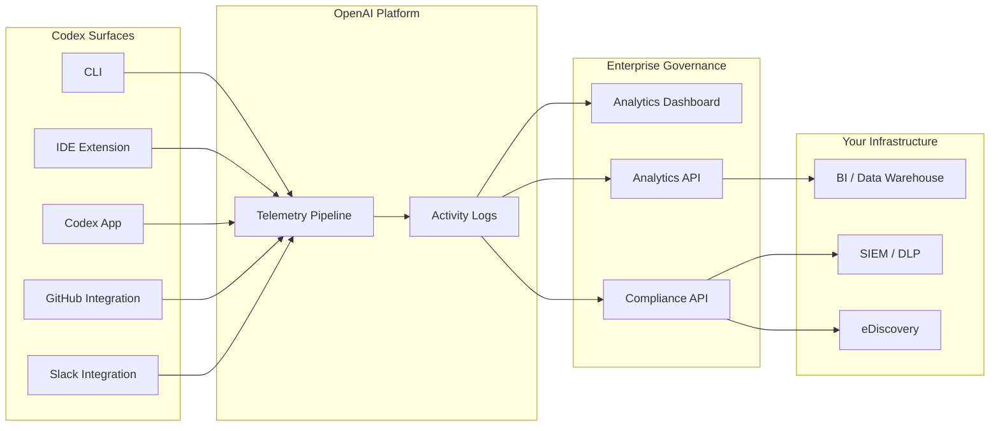
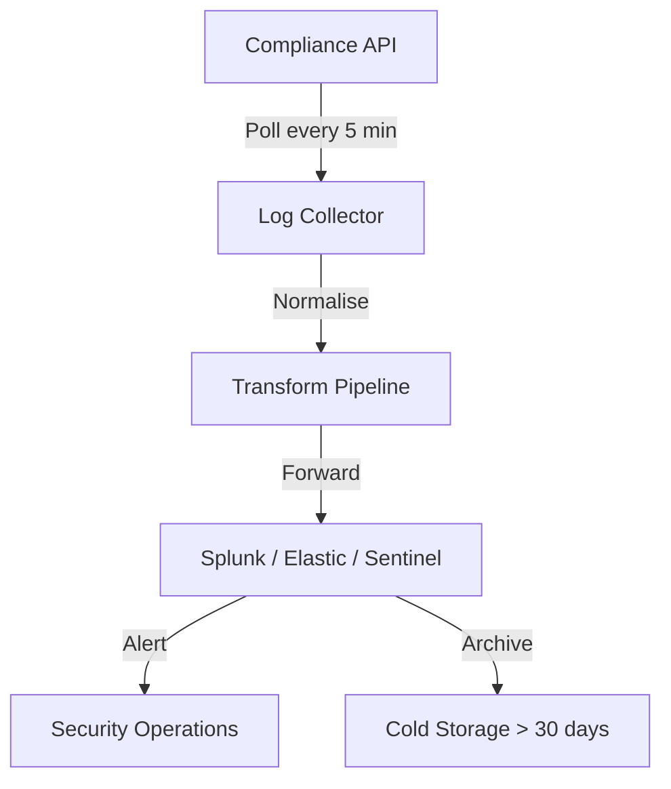

# Codex Enterprise Analytics and Compliance APIs: Usage Dashboards, Code Review Metrics, and Audit Integration


---

With Codex now generally available across CLI, IDE extension, App, GitHub, and Slack surfaces [^1], enterprise teams face a familiar question: *how do we measure and govern what our agents are actually doing?* OpenAI's answer ships as two complementary APIs — the **Analytics API** for adoption and productivity metrics, and the **Compliance API** for auditable records — backed by a self-serve dashboard in the ChatGPT workspace admin panel [^2].

This article covers the API endpoints, authentication, data shapes, and practical integration patterns that platform engineers need to wire Codex telemetry into existing BI pipelines and security tooling.

## Architecture Overview



All five Codex surfaces feed a unified telemetry pipeline. The Analytics API exposes aggregated metrics; the Compliance API provides per-interaction audit logs. Both sit behind the same `api.chatgpt.com` base URL and use workspace-scoped API keys [^2].

## Prerequisites: Admin Roles

OpenAI recommends three ownership roles for a governance rollout [^3]:

| Role | Responsibilities |
|------|-----------------|
| **Workspace Owner** | Enables Codex surfaces, manages RBAC groups |
| **Security Owner** | Configures approval policies, managed `requirements.toml` |
| **Analytics Owner** | Integrates Analytics and Compliance APIs into data pipelines |

Create a dedicated **Codex Admin** group rather than granting broad access — the admin setup guide explicitly warns against giving governance permissions to a wide audience [^3].

## The Analytics Dashboard

Before writing any code, the self-serve dashboard in the ChatGPT workspace admin panel provides immediate visibility [^2]:

- **Active users by surface** — CLI, IDE extension, cloud, desktop, and Code Review, each broken out separately
- **Credit and token consumption** — per-workspace and per-user, with daily trending
- **Product activity** — threads and turns by client type
- **User ranking tables** — sortable by credits consumed, threads opened, text tokens used, and streak length
- **Code Review metrics** — PRs reviewed, issues by priority level (P0/P1/P2), and developer sentiment on review comments

Data export is available in CSV or JSON. Dashboard data can lag by up to 12 hours [^2].

## Analytics API Reference

### Base URL and Authentication

```
https://api.chatgpt.com/v1/analytics/codex
```

All requests require an API key scoped to `codex.enterprise.analytics.read` [^2]. Pass it as a Bearer token:

```bash
curl -H "Authorization: Bearer $CODEX_ANALYTICS_KEY" \
  "https://api.chatgpt.com/v1/analytics/codex/workspaces/$WORKSPACE_ID/usage?start_time=2026-05-01T00:00:00Z&end_time=2026-05-11T00:00:00Z&group_by=day"
```

### Endpoints

The API exposes three primary endpoints, each returning daily or weekly UTC-aligned buckets [^2]:

#### `GET /workspaces/{workspace_id}/usage`

Returns threads, turns, credits, and per-client breakdowns.

**Parameters:**

| Parameter | Type | Description |
|-----------|------|-------------|
| `start_time` | ISO 8601 | Window start (required) |
| `end_time` | ISO 8601 | Window end (required) |
| `group_by` | `day` \| `week` | Bucket granularity |
| `limit` | integer | Page size |
| `page` | string | Cursor for pagination |

This endpoint is your primary adoption signal. Track `threads` and `turns` per surface to understand where developers are spending time — CLI versus IDE versus cloud.

#### `GET /workspaces/{workspace_id}/code_reviews`

Returns PR review throughput and issue classification by priority [^2].

Issues are bucketed into three priority levels:

- **P0** — Critical issues (security vulnerabilities, data loss risks)
- **P1** — Important issues (missing tests, documentation gaps)
- **P2** — Advisory issues (style, minor refactoring suggestions)

Track the P0-to-P2 ratio over time to gauge whether Codex reviews are producing actionable signal or noise.

#### `GET /workspaces/{workspace_id}/code_review_responses`

Returns developer engagement with review comments — reactions (positive, negative, other), replies, and overall engagement rates [^2].

This is the feedback loop that matters. A high negative-reaction rate on P1 issues suggests your `AGENTS.md` review guidelines need tuning; a low engagement rate suggests developers are ignoring reviews entirely.

### Pagination

Results are time-ordered with cursor-based pagination. The lookback window supports up to 90 days [^2].

## Compliance API Reference

The Compliance API serves a fundamentally different purpose: auditable, per-interaction records for security, legal, and governance workflows [^2] [^4].

### What Gets Exported

Each compliance record includes:

- Prompt text and generated responses
- Workspace ID, user ID, and timestamp
- Model identifier (e.g. `gpt-5.5`, `gpt-5.4`, `codex-auto-review`)
- Token usage and request metadata
- Session and thread identifiers

### Access Patterns

The Compliance Platform supports two complementary access patterns [^4]:

1. **Compliance Logs Platform** — immutable, append-only log events for auditing. This is the primary pattern for SIEM integration.
2. **Stateful Compliance API** — query state at the time of request. ⚠️ Note: the legacy stateful route was deprecated on 5 March 2026 and will be removed on 5 June 2026 [^4]. Migrate to the new conversation logs system before this deadline.

### Data Retention

Activity logs are retained for 30 days [^4]. If your compliance requirements mandate longer retention, you must export and store logs in your own infrastructure.

### Scope

The Compliance API covers ChatGPT-authenticated Codex usage only. API-key-authenticated usage (e.g. direct Responses API calls) follows your organisation's separate API data settings [^2].

## Integration Patterns

### Pattern 1: BI Pipeline with the Analytics API

Pull daily usage into your data warehouse for engineering productivity dashboards:

```bash
#!/usr/bin/env bash
# daily-codex-metrics.sh — run via cron at 06:00 UTC

WORKSPACE_ID="ws_abc123"
YESTERDAY=$(date -u -d "yesterday" +%Y-%m-%dT00:00:00Z)
TODAY=$(date -u +%Y-%m-%dT00:00:00Z)

# Fetch usage metrics
curl -s -H "Authorization: Bearer $CODEX_ANALYTICS_KEY" \
  "https://api.chatgpt.com/v1/analytics/codex/workspaces/$WORKSPACE_ID/usage?start_time=$YESTERDAY&end_time=$TODAY&group_by=day" \
  -o /tmp/codex-usage.json

# Fetch code review metrics
curl -s -H "Authorization: Bearer $CODEX_ANALYTICS_KEY" \
  "https://api.chatgpt.com/v1/analytics/codex/workspaces/$WORKSPACE_ID/code_reviews?start_time=$YESTERDAY&end_time=$TODAY&group_by=day" \
  -o /tmp/codex-reviews.json

# Load into warehouse (example: BigQuery)
bq load --source_format=NEWLINE_DELIMITED_JSON \
  engineering.codex_usage /tmp/codex-usage.json
bq load --source_format=NEWLINE_DELIMITED_JSON \
  engineering.codex_reviews /tmp/codex-reviews.json
```

### Pattern 2: SIEM Integration with the Compliance API

Forward compliance logs to your security platform for threat detection and policy enforcement:



OpenAI lists 13 pre-built Compliance API integrations from leading eDiscovery and DLP vendors [^4]. Before building a custom connector, check whether your existing tooling already supports the OpenAI Compliance Platform natively.

### Pattern 3: Codex CLI OpenTelemetry + Analytics API

The CLI's built-in OpenTelemetry exporter [^5] sends per-session traces to your own collector, whilst the Analytics API provides the workspace-level aggregate view. Combine both for full-stack observability:

```toml
# ~/.codex/config.toml — CLI-side telemetry
[otel]
environment = "production"
exporter = "otlp-http"
```

```toml
# config.toml — disable analytics collection on specific machines
[analytics]
enabled = false
```

The `analytics.enabled` flag in `config.toml` controls whether a specific machine contributes to the workspace analytics pipeline [^5]. This is useful for CI runners or shared environments where you want OTel traces but not inflated user counts.

## Enterprise Governance Checklist

For teams rolling out Codex governance, here is a recommended sequence:

1. **Assign the three admin roles** — workspace owner, security owner, analytics owner [^3]
2. **Enable the Analytics Dashboard** — immediate visibility, no code required [^2]
3. **Scope an API key** to `codex.enterprise.analytics.read` [^2]
4. **Wire the Analytics API** into your existing BI pipeline (daily cron is sufficient for most teams)
5. **Connect the Compliance API** to your SIEM/DLP platform — use a vendor integration if available [^4]
6. **Set retention policy** — export and archive compliance logs beyond the 30-day window [^4]
7. **Deploy managed `requirements.toml`** to enforce sandbox modes, command restrictions, and model constraints [^6]
8. **Review Code Review engagement** weekly — tune `AGENTS.md` review guidelines based on reaction data from the `code_review_responses` endpoint [^2]
9. **Migrate off the legacy stateful Compliance route** before the 5 June 2026 deprecation deadline [^4]

## Limitations and Caveats

- **Dashboard lag**: analytics data can trail real-time by up to 12 hours [^2].
- **Compliance scope**: only ChatGPT-authenticated sessions are captured. Direct API-key usage is governed separately [^2].
- **Retention**: 30-day compliance log retention is non-negotiable on the platform side [^4]. Plan your archival strategy accordingly.
- **Lookback window**: the Analytics API supports a maximum 90-day lookback [^2]. Historical analysis beyond that requires your own data store.
- ⚠️ **Deprecation deadline**: the legacy stateful Compliance API route is removed on 5 June 2026 [^4]. If you are still using it, migrate immediately.

## What This Means for CLI Users

For individual developers, the governance layer is invisible — the CLI works exactly as before. But the `analytics.enabled` and `otel.*` configuration keys in `config.toml` [^5] give you control over what telemetry your machine emits. In enterprise environments with managed `requirements.toml` policies [^6], these settings may be enforced centrally, and the `codex features` subcommand will reflect any governance constraints applied to your profile.

The Analytics API's per-surface breakdown is particularly useful for platform teams evaluating CLI adoption against the App and IDE extension. If your organisation is investing in `AGENTS.md` conventions and hooks, the Code Review engagement endpoint tells you whether those investments are producing measurable quality improvements.

---

## Citations

[^1]: OpenAI, "Codex is now generally available," *openai.com*, May 2026. [https://openai.com/index/codex-now-generally-available/](https://openai.com/index/codex-now-generally-available/)

[^2]: OpenAI, "Governance – Codex," *OpenAI Developers*, 2026. [https://developers.openai.com/codex/enterprise/governance](https://developers.openai.com/codex/enterprise/governance)

[^3]: OpenAI, "Admin Setup – Codex," *OpenAI Developers*, 2026. [https://developers.openai.com/codex/enterprise/admin-setup](https://developers.openai.com/codex/enterprise/admin-setup)

[^4]: OpenAI, "Compliance APIs for Enterprise Customers," *OpenAI Help Center*, 2026. [https://help.openai.com/en/articles/9261474-compliance-apis-for-enterprise-customers](https://help.openai.com/en/articles/9261474-compliance-apis-for-enterprise-customers)

[^5]: OpenAI, "Configuration Reference – Codex," *OpenAI Developers*, 2026. [https://developers.openai.com/codex/config-reference](https://developers.openai.com/codex/config-reference)

[^6]: OpenAI, "Managed Configuration – Codex," *OpenAI Developers*, 2026. [https://developers.openai.com/codex/enterprise/managed-configuration](https://developers.openai.com/codex/enterprise/managed-configuration)
