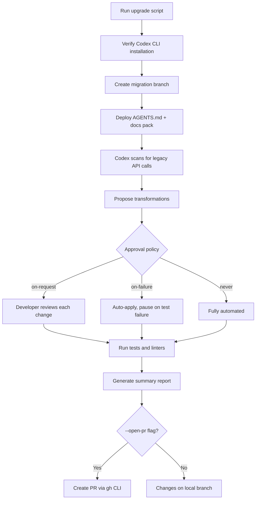

# The Completions-to-Responses Migration Pack: Automating OpenAI API Migration with Codex CLI


---

OpenAI's Chat Completions API served the industry well from the GPT-3.5 era onwards, but it was never designed for reasoning models, multi-turn agentic workflows, or built-in tool orchestration[^1]. The Responses API, introduced in early 2025 and now the sole wire protocol for Codex CLI itself[^2], addresses all of these gaps. Chat Completions support inside Codex was removed in February 2026[^3], and the broader API deprecation timeline is well underway.

For teams maintaining applications that still call `/v1/chat/completions`, OpenAI has released an official open-source toolkit: the **completions-responses-migration-pack**[^4]. It uses Codex CLI as a local coding agent to scan a repository, propose transformations, run tests, and open a clean pull request — all from a single shell command.

This article walks through the migration pack's architecture, the key API differences it addresses, and practical patterns for integrating it into CI pipelines.

## Why Migrate Now

The Responses API is not merely a renamed endpoint. It introduces a fundamentally different interaction model:

| Aspect | Chat Completions | Responses API |
|--------|------------------|---------------|
| Input format | `messages` array | `input` string/array + `instructions` |
| Response structure | `choices[0].message.content` | `output_text` or typed `output` Items |
| Multi-turn state | Manual message array management | `previous_response_id` chaining |
| Tool definitions | Externally tagged, non-strict by default | Internally tagged, strict by default |
| Built-in tools | None | `web_search_preview`, `file_search`, `code_interpreter`, `computer_use`, MCP |
| Structured outputs | `response_format` parameter | `text.format` parameter |
| Reasoning summaries | Not available | Native support |

GPT-5 models specifically benefit from the Responses API: the model orchestrates tools as part of its reasoning logic, which legacy endpoints cannot preserve — potentially causing repeated tool calls and degraded performance[^5]. Empirical data shows 40-80% better cache utilisation compared to Chat Completions[^1], and a 3% improvement on SWE-bench with reasoning models[^1].

## How the Migration Pack Works

The toolkit is a Bash script that orchestrates Codex CLI in non-interactive mode. The flow is straightforward:



### Quick Start

The one-liner fetches and runs the script directly:

```bash
/bin/bash -c "$(curl -fsSL https://raw.githubusercontent.com/openai/completions-responses-migration-pack/main/scripts/completions-to-responses-upgrade.sh)"
```

For production use, pin to a release tag and verify the checksum:

```bash
TAG=v0.1.0
curl -fsSL -o upgrade.sh \
  "https://raw.githubusercontent.com/openai/completions-responses-migration-pack/${TAG}/scripts/completions-to-responses-upgrade.sh"
shasum -a 256 upgrade.sh | grep "$(curl -fsSL \
  "https://raw.githubusercontent.com/openai/completions-responses-migration-pack/${TAG}/assets/SHA256SUMS" \
  | awk '{print $1}')"
bash upgrade.sh --repo /path/to/repo --no-interactive --write
```

### Approval Policies

The `--approval` flag controls how much autonomy Codex has during migration:

| Policy | Behaviour | Best for |
|--------|-----------|----------|
| `on-request` | Prompts heuristically for approval | First migration on an unfamiliar codebase |
| `on-failure` | Auto-applies changes, pauses only when tests fail | Trusted codebases with good test coverage |
| `never` | Fully automated execution | CI/CD pipelines with post-merge review |
| `untrusted` | Maximum caution — approval for every action | Regulated environments |

## Key Transformations

The migration pack handles several distinct transformation categories.

### Endpoint and Client Updates

```python
# Before
response = client.chat.completions.create(
    model="gpt-4o",
    messages=[
        {"role": "system", "content": "You are helpful."},
        {"role": "user", "content": "Explain caching."}
    ],
    max_tokens=500
)
print(response.choices[0].message.content)

# After
response = client.responses.create(
    model="gpt-5",
    instructions="You are helpful.",
    input="Explain caching.",
    max_output_tokens=500
)
print(response.output_text)
```

The parameter mapping is systematic: `messages` splits into `instructions` (for system content) and `input` (for user content), `max_tokens` becomes `max_output_tokens`, and the response access pattern changes from `choices[0].message.content` to `output_text`[^1].

### Tool/Function Calling

Function definitions shift from externally tagged unions to internally tagged ones:

```python
# Before (externally tagged)
tools = [{"type": "function", "function": {"name": "get_weather", "parameters": {...}}}]

# After (internally tagged, strict by default)
tools = [{"type": "function", "name": "get_weather", "parameters": {...}}]
```

The migration pack detects this pattern and restructures tool definitions automatically. It also enforces strict mode by default, which the Responses API requires unless explicitly opted out[^1].

### Multi-Turn Conversation State

The most significant architectural change is conversation state management. Chat Completions requires manually accumulating and resending the full message array. The Responses API offers server-side state via `previous_response_id`:

```python
res1 = client.responses.create(
    model="gpt-5",
    input="What is the capital of France?",
    store=True
)

res2 = client.responses.create(
    model="gpt-5",
    input="What is its population?",
    previous_response_id=res1.id,
    store=True
)
```

The migration pack sets `store: false` by default as a security-conscious choice — teams using zero-data-retention (ZDR) policies should keep this setting[^4]. For applications that benefit from server-side state, enable `store: true` explicitly post-migration.

### Structured Outputs

The schema location moves:

```python
# Before
response_format={"type": "json_schema", "json_schema": {"name": "output", "schema": {...}}}

# After
text={"format": {"type": "json_schema", "name": "output", "schema": {...}}}
```

## CI/CD Integration

The migration pack is designed for pipeline use. A GitHub Actions workflow might look like:


```yaml
name: API Migration
on:
  workflow_dispatch:
    inputs:
      approval_policy:
        type: choice
        options: [on-failure, on-request, never]
        default: on-failure

jobs:
  migrate:
    runs-on: ubuntu-latest
    steps:
      - uses: actions/checkout@v4

      - name: Install Codex CLI
        run: npm install -g @openai/codex

      - name: Run migration
        env:
          OPENAI_API_KEY: ${{ secrets.OPENAI_API_KEY }}
        run: |
          TAG=v0.1.0
          curl -fsSL -o upgrade.sh \
            "https://raw.githubusercontent.com/openai/completions-responses-migration-pack/${TAG}/scripts/completions-to-responses-upgrade.sh"
          bash upgrade.sh \
            --repo . \
            --no-interactive \
            --write \
            --approval ${{ inputs.approval_policy }} \
            --open-pr
```


For teams that prefer dry-run validation before any changes:

```bash
bash upgrade.sh --repo . --no-interactive --dry-run
```

This generates a summary report of all proposed changes without modifying files — useful as a pre-migration audit step[^4].

## What the Pack Does Not Handle

Several migration concerns fall outside the toolkit's scope:

- **Custom streaming parsers**: Applications with bespoke SSE parsing logic need manual review. The Responses API emits semantic events (e.g., `response.output_text.delta`) rather than mutating a single content string, which is a fundamental architectural difference[^1].
- **`n` parameter usage**: Chat Completions supports `n > 1` for parallel generations. The Responses API returns a single output — applications relying on multiple completions need restructuring[^1].
- **Temperature constraints for GPT-5**: The pack enforces that `temperature` is either omitted or set to `1` for GPT-5 models, but does not refactor application logic that depends on variable temperature[^4].
- **Cache optimisation**: While the Responses API offers better cache utilisation, achieving optimal caching with `previous_response_id` requires understanding your application's conversation topology. Community feedback has noted that reasoning components can create unexpected cache breaks when state is not carefully managed[^6].

## Practical Recommendations

1. **Run dry-run first** on every repository. The summary report identifies the transformation scope before any files change.
2. **Pin to a release tag** in CI. The `main` branch moves; tagged releases have SHA256 checksums for integrity verification.
3. **Start with `on-failure` approval** for codebases with comprehensive test suites. Drop to `on-request` for legacy code with sparse coverage.
4. **Review `store` settings** post-migration. The pack defaults to `store: false` for security, but applications requiring multi-turn state need explicit `store: true`.
5. **Test streaming paths separately**. The event-driven model in Responses is semantically different from Chat Completions streaming and warrants dedicated integration tests.

## The Broader Pattern

The migration pack is more than a one-off utility — it demonstrates a repeatable pattern for using Codex CLI as an automated codemod engine. The approach — deploy an `AGENTS.md` with migration rules, run `codex exec` against a repository, validate with tests, open a PR — generalises to any large-scale code transformation task. Framework upgrades, API version bumps, and deprecation sweeps all fit the same template.

For Codex CLI practitioners, the migration pack's architecture is worth studying: it shows how to structure prompts, approval policies, and validation hooks for production-grade automated refactoring at scale.

## Citations

[^1]: OpenAI, "Migrate to the Responses API," [developers.openai.com/api/docs/guides/migrate-to-responses](https://developers.openai.com/api/docs/guides/migrate-to-responses), 2026.
[^2]: OpenAI, "Deprecating chat/completions support in Codex," GitHub Discussion #7782, [github.com/openai/codex/discussions/7782](https://github.com/openai/codex/discussions/7782), 2026.
[^3]: OpenAI, "Codex Changelog," [developers.openai.com/codex/changelog](https://developers.openai.com/codex/changelog), 2026.
[^4]: OpenAI, "completions-responses-migration-pack," GitHub Repository, [github.com/openai/completions-responses-migration-pack](https://github.com/openai/completions-responses-migration-pack), 2026.
[^5]: OpenAI, "Introducing GPT-5.5," [openai.com/index/introducing-gpt-5-5](https://openai.com/index/introducing-gpt-5-5/), April 2026.
[^6]: OpenAI Developer Community, "Codex OpenAI Completions to Responses Migration Pack," [community.openai.com/t/codex-openai-completions-responses-migration-pack/1357034](https://community.openai.com/t/codex-openai-completions-responses-migration-pack/1357034), 2026.
