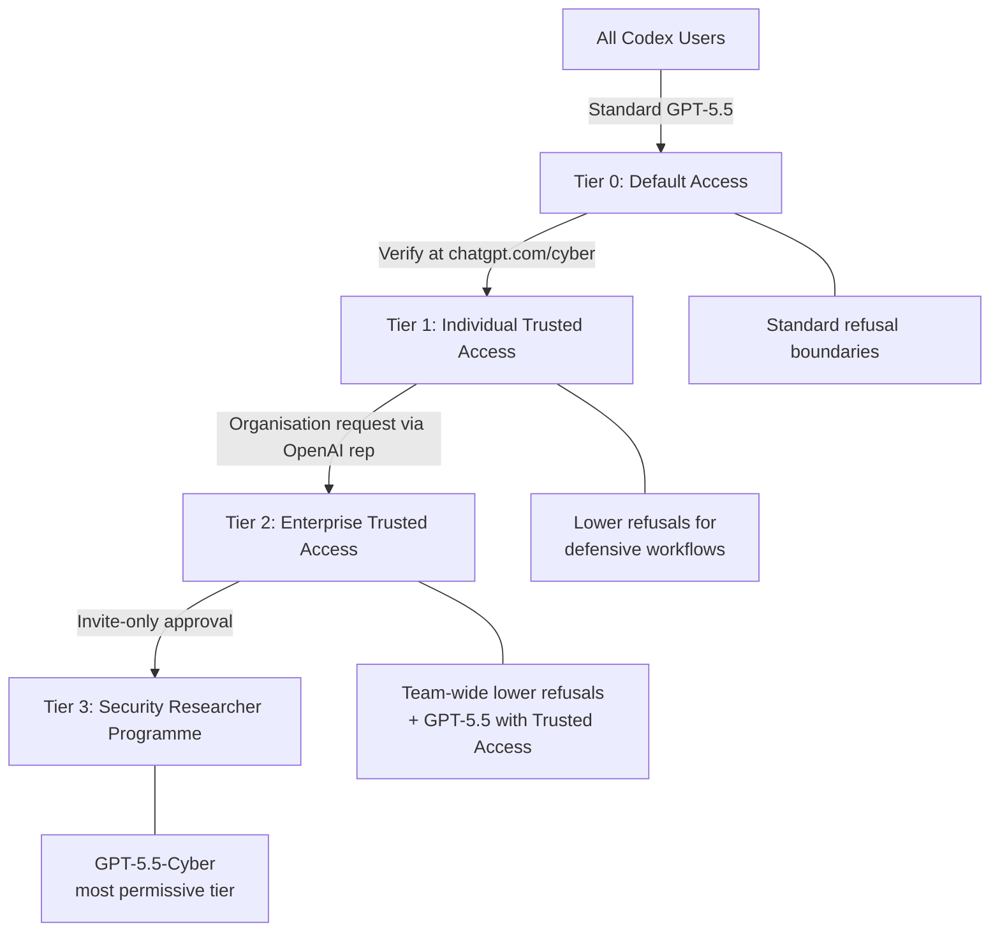
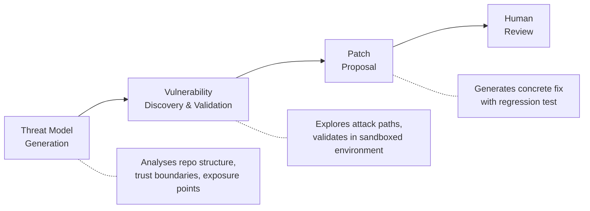

# GPT-5.5-Cyber and Codex CLI: Trusted Access, Defensive Workflows, and the Security-Permissive Model Tier


---

On 7 May 2026, OpenAI announced GPT-5.5-Cyber — a variant of its frontier model with deliberately reduced guardrails for vetted cyber defenders [^1]. The model ships alongside an expanded Trusted Access for Cyber programme that adds identity-verified tiers, mandatory Advanced Account Security from 1 June 2026, and a Codex Security plugin that brings vulnerability workflows into the CLI [^2]. This article explains how the model fits into Codex CLI, what it unlocks for security teams, and how to configure it without tripping over the cyber-safety classifier.

## What GPT-5.5-Cyber Actually Is

GPT-5.5-Cyber is **not** a capability uplift. OpenAI is explicit: "The initial preview of cyber-permissive models like GPT-5.5-Cyber is not intended to significantly increase cyber capability beyond GPT-5.5 — it's primarily trained to be more permissive on security-related tasks" [^3]. In practice, that means fewer classifier-triggered refusals when you ask it to write exploit proof-of-concepts, analyse malware samples, reverse-engineer stripped binaries, or draft detection rules from attack telemetry.

The standard GPT-5.5 model already sits at the frontier of cyber capability. The UK AI Safety Institute evaluated it at a 71.4% average pass rate on expert-level capture-the-flag exercises — outperforming Mythos Preview (68.6%), GPT-5.4 (52.4%), and Opus 4.7 (48.6%) [^4]. It completed a 32-step simulated corporate attack chain in 2 of 10 attempts, with an estimated human completion time of roughly 20 hours [^4]. GPT-5.5-Cyber takes that same engine and lowers the refusal boundary for authorised defensive work.

### What Remains Blocked

Even with the most permissive tier, GPT-5.5-Cyber still refuses requests that could contribute to real-world harm — credential theft tooling, functional malware intended for deployment, and social-engineering kits are explicitly excluded [^1]. The model is positioned for defensive operations: vulnerability triage, patch validation, detection engineering, malware analysis, and authorised red-teaming [^3].

## The Trusted Access for Cyber Programme

Access to GPT-5.5-Cyber runs through OpenAI's three-tier identity framework [^2]:



| Tier | Access | Model | Verification |
|------|--------|-------|-------------|
| 0 — Default | All Codex users | GPT-5.5 (standard) | None |
| 1 — Individual | Verified defenders | GPT-5.5 with Trusted Access | Identity at `chatgpt.com/cyber` |
| 2 — Enterprise | Organisation-wide | GPT-5.5 with Trusted Access | OpenAI representative request |
| 3 — Researcher | Approved security researchers | GPT-5.5-Cyber | Invite-only programme |

**Deadline**: From 1 June 2026, individual members accessing the most cyber-capable models must enable Advanced Account Security — multi-factor authentication with hardware key support [^5].

## Configuring Codex CLI for Defensive Workflows

### Model Selection

Once your account has Trusted Access, specify the model in `~/.codex/config.toml` or the project-level `.codex/config.toml`:

```toml
# Default model for security work
model = "gpt-5.5"

# Named profile for security-intensive sessions
[profiles.security]
model = "gpt-5.5"
model_reasoning_effort = "high"
```

If your account is approved for Tier 3, GPT-5.5-Cyber becomes available through the same model selector. The model name routes through your account's verified permissions — there is no separate API key or endpoint [^3].

Launch a security-focused session:

```bash
codex -p security "Analyse the authentication bypass in src/auth/oauth.rs"
```

### Sandbox Configuration for Security Tools

Security workflows often need network access for package vulnerability databases, CVE feeds, and SAST tool downloads. Configure a permission profile that grants controlled network access while keeping file writes sandboxed:

```toml
[profiles.security]
model = "gpt-5.5"
model_reasoning_effort = "high"

[permissions.security.filesystem]
allow = [":project_roots"]

[permissions.security.network.domains]
"nvd.nist.gov" = "allow"
"cve.org" = "allow"
"osv.dev" = "allow"
"github.com" = "allow"
```

### AGENTS.md for Security Teams

Place security-specific instructions in your repository's `AGENTS.md`:

```markdown
# Security Review Conventions

## Vulnerability Triage
- Always check NVD and OSV databases before classifying severity
- Use CVSS v4.0 scoring; include the vector string in findings
- Distinguish between theoretical and exploitable vulnerabilities
- Validate findings by writing a minimal proof-of-concept test

## Patch Validation
- Every proposed fix must include a regression test
- Run the existing test suite after applying patches
- Document the attack vector, root cause, and fix rationale

## Detection Engineering
- Write Sigma rules for detectable attack patterns
- Include MITRE ATT&CK technique IDs in rule metadata
- Test rules against at least one synthetic log sample
```

## Five Defensive Workflows in Codex CLI

### 1. Vulnerability Triage from SAST Output

Feed static analysis results into Codex for intelligent triage. Most SAST tools produce noise — Codex can assess exploitability in context:

```bash
semgrep --config auto --json src/ | \
  codex exec "Triage these SAST findings. For each, assess exploitability \
  given the codebase context, classify as Critical/High/Medium/Low/False-Positive, \
  and propose a fix for anything Critical or High." \
  --sandbox workspace-write \
  -p security
```

### 2. Patch Validation

After a vulnerability is fixed, verify the patch actually closes the attack vector:

```bash
codex exec "The commit at HEAD fixes CVE-2026-41892 (SQL injection in \
  src/api/users.rs). Write a proof-of-concept test that demonstrates the \
  vulnerability is no longer exploitable, then run it." \
  --sandbox workspace-write \
  -p security
```

### 3. Detection Rule Engineering

Generate detection rules from threat intelligence:

```bash
codex exec "Read the incident report at docs/incidents/2026-05-03-lateral-movement.md. \
  Write Sigma detection rules covering the TTPs described. Include MITRE ATT&CK \
  technique IDs. Output to detections/sigma/." \
  --sandbox workspace-write \
  -p security
```

### 4. Dependency Vulnerability Assessment

Combine Codex with supply-chain tools to assess exploitability of dependency vulnerabilities:

```bash
osv-scanner --json . | \
  codex exec "Review these dependency vulnerabilities. For each, determine whether \
  our code actually calls the affected function path. Classify as Exploitable, \
  Potentially Exploitable, or Not Reachable. Output a markdown report." \
  --sandbox workspace-write \
  -p security \
  -o reports/dependency-assessment.md
```

### 5. Malware Analysis and Reverse Engineering

For Tier 3 users with GPT-5.5-Cyber, the model's reduced refusal boundary enables deeper analysis workflows:

```bash
codex exec "Analyse the suspicious binary at samples/unknown.elf. \
  Identify packing, extract strings, map system calls, and classify \
  behaviour against MITRE ATT&CK. Do not execute the binary — \
  static analysis only." \
  --sandbox workspace-write \
  -p security
```

## Codex Security Plugin

The Codex Security plugin — released alongside the Trusted Access expansion — brings OpenAI's cloud-based vulnerability scanner into CLI and app sessions [^6]. It operates through three stages:



The plugin builds a codebase-specific threat model that captures what the system does, what it trusts, and where it is most exposed [^6]. Over the last 30 days of its research preview, Codex Security scanned more than 1.2 million commits, identifying 792 critical and 10,561 high-severity findings [^7]. Its false-positive rate has dropped by more than 50% since initial rollout, with one repository seeing an 84% reduction in noise [^7].

The plugin connects directly to GitHub repositories. After enabling a repository, it scans commit history, validates potential vulnerabilities in an isolated environment, and surfaces proposed fixes for human review. Critically, it learns from feedback — when you adjust finding criticality, it refines the threat model for subsequent scans [^6].

## The Cyber-Safety Classifier: Avoiding False Positives

Standard Codex sessions route through a cyber-safety classifier. When it detects patterns that resemble offensive security activity, requests are rerouted from GPT-5.3-Codex to the less capable GPT-5.2 model [^8]. The symptoms are unmistakable: slower responses and a banner reading "Your conversations have multiple flags for possible cybersecurity risk. Responses may take longer."

For security professionals, false positives are a daily friction. The Trusted Access programme exists precisely to address this — verified accounts receive lower classifier sensitivity. If you are still hitting false positives after verification:

1. Use `/feedback` in the CLI to report the rerouting event
2. Check that your account verification is current at `chatgpt.com/cyber`
3. Consider requesting Enterprise Trusted Access for team-wide coverage
4. Structure prompts to explicitly state defensive intent ("For our authorised penetration test of internal application X...")

## GPT-5.5-Cyber vs GPT-5.5 with Trusted Access: Which Do You Need?

Most security teams should start with **GPT-5.5 with Trusted Access** (Tier 1 or 2). It covers the vast majority of defensive workflows — vulnerability triage, secure code review, detection engineering, and patch validation — with reduced refusal rates [^3].

GPT-5.5-Cyber (Tier 3) is for teams that routinely need:

- Authorised red-teaming and penetration testing with realistic exploit proof-of-concepts
- Binary reverse engineering of packed or obfuscated samples
- Malware analysis requiring detailed behavioural classification
- Advanced cryptographic analysis

The capability difference is in **permissiveness, not intelligence**. Both models share the same underlying weights; GPT-5.5-Cyber simply has a lower refusal threshold for dual-use security content [^3].

## Practical Considerations

**Cost**: GPT-5.5-Cyber uses the same pricing as GPT-5.5. Security workflows tend to be reasoning-heavy, so set `model_reasoning_effort = "high"` or `"xhigh"` in your security profile and budget accordingly.

**Audit trail**: Codex CLI logs every tool call and agent action. For compliance-sensitive security work, enable OpenTelemetry export to capture full session traces:

```toml
[profiles.security]
model = "gpt-5.5"
model_reasoning_effort = "high"

[otel]
logs_endpoint = "https://otel-collector.internal:4318/v1/logs"
traces_endpoint = "https://otel-collector.internal:4318/v1/traces"
```

**Team governance**: Enterprise teams can enforce security-profile defaults through `requirements.toml`, ensuring all security engineers use approved model configurations and sandbox settings [^9].

**June deadline**: Ensure all team members accessing Trusted Access models enable Advanced Account Security before 1 June 2026 [^5]. Accounts without hardware MFA will lose access to cyber-permissive tiers.

## What Comes Next

OpenAI has signalled that the Trusted Access programme will expand further — more granular access tiers, programmatic verification for CI/CD pipelines, and tighter integration between Codex Security and the CLI's hook system for automated security gates [^2]. The trajectory is clear: security workflows are becoming first-class citizens in the Codex ecosystem, not an afterthought bolted onto a general-purpose coding agent.

For security teams already using Codex CLI, the immediate action is straightforward: verify your team at `chatgpt.com/cyber`, configure a security profile in `config.toml`, and set a calendar reminder for the 1 June Advanced Account Security deadline.

---

## Citations

[^1]: OpenAI, "Scaling Trusted Access for Cyber with GPT-5.5 and GPT-5.5-Cyber," 7 May 2026. [https://openai.com/index/gpt-5-5-with-trusted-access-for-cyber/](https://openai.com/index/gpt-5-5-with-trusted-access-for-cyber/)

[^2]: OpenAI, "Trusted access for the next era of cyber defense," 2026. [https://openai.com/index/scaling-trusted-access-for-cyber-defense/](https://openai.com/index/scaling-trusted-access-for-cyber-defense/)

[^3]: Help Net Security, "OpenAI tunes GPT-5.5-Cyber for more permissive security workflows," 8 May 2026. [https://www.helpnetsecurity.com/2026/05/08/openai-gpt-5-5-cyber-model/](https://www.helpnetsecurity.com/2026/05/08/openai-gpt-5-5-cyber-model/)

[^4]: UK AI Safety Institute, "Our evaluation of OpenAI's GPT-5.5 cyber capabilities," May 2026. [https://www.aisi.gov.uk/blog/our-evaluation-of-openais-gpt-5-5-cyber-capabilities](https://www.aisi.gov.uk/blog/our-evaluation-of-openais-gpt-5-5-cyber-capabilities)

[^5]: OpenAI, "Introducing Advanced Account Security," 2026. [https://openai.com/index/advanced-account-security/](https://openai.com/index/advanced-account-security/)

[^6]: OpenAI, "Codex Security: now in research preview," March 2026. [https://openai.com/index/codex-security-now-in-research-preview/](https://openai.com/index/codex-security-now-in-research-preview/)

[^7]: The Hacker News, "OpenAI Codex Security Scanned 1.2 Million Commits and Found 10,561 High-Severity Issues," March 2026. [https://thehackernews.com/2026/03/openai-codex-security-scanned-12.html](https://thehackernews.com/2026/03/openai-codex-security-scanned-12.html)

[^8]: OpenAI Developers, "Cyber Safety — Codex," 2026. [https://developers.openai.com/codex/concepts/cyber-safety](https://developers.openai.com/codex/concepts/cyber-safety)

[^9]: OpenAI Developers, "Configuration Reference — Codex," 2026. [https://developers.openai.com/codex/config-reference](https://developers.openai.com/codex/config-reference)
