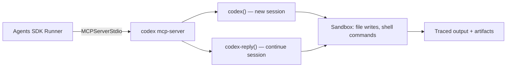
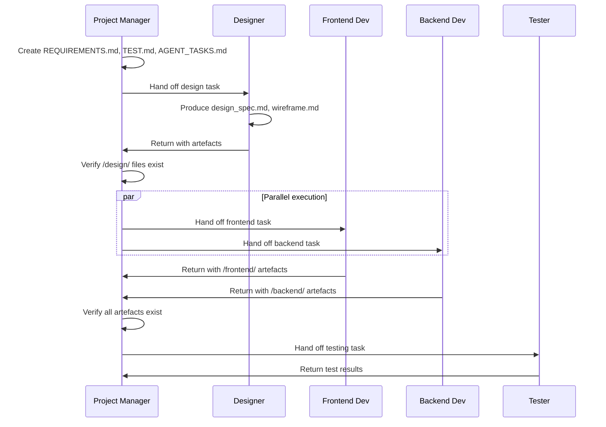
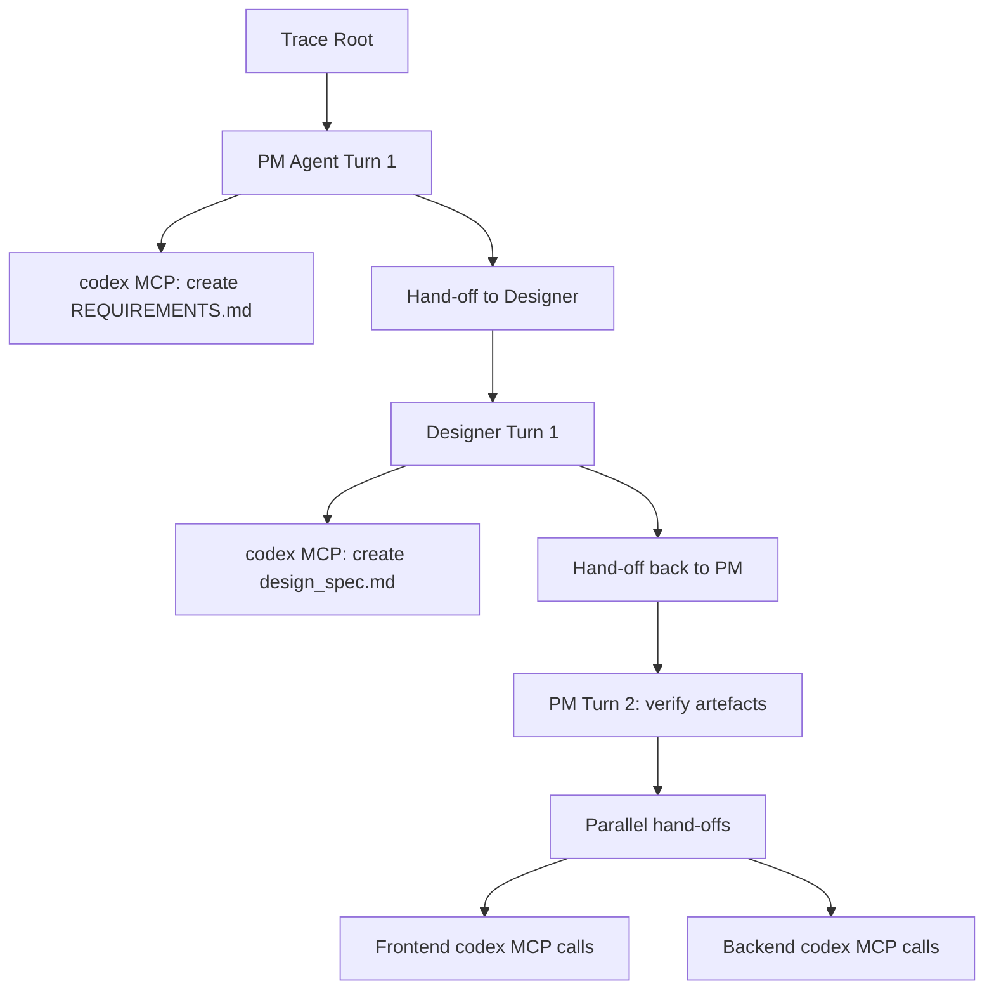

# Codex CLI as an MCP Server: Building Multi-Agent Workflows with the OpenAI Agents SDK


---

Codex CLI is primarily a terminal-based coding agent, but it has a second life as an MCP server that other agents can invoke programmatically. Combined with the OpenAI Agents SDK, this turns Codex into a sandboxed execution engine inside multi-agent workflows — complete with tracing, hand-offs, and guardrails. This article walks through the architecture, setup, and practical patterns for building these systems.

## Why Run Codex as an MCP Server?

The `codex exec` command handles single-shot non-interactive tasks well enough[^1]. But it operates in isolation — there is no session continuity, no inter-agent coordination, and no structured hand-off protocol. Running `codex mcp-server` exposes two tools over the Model Context Protocol[^2]:

- **`codex()`** — creates a new Codex session with a prompt, approval policy, sandbox mode, model override, and working directory.
- **`codex-reply()`** — continues an existing session by referencing a `threadId` returned from a previous call.

This stateful, tool-based interface lets orchestrating agents treat Codex as a controllable subprocess rather than a fire-and-forget script.



## Setup

### Prerequisites

You need Codex CLI installed (v0.129.0 or later) and the Python Agents SDK[^3]:

```bash
npm install -g codex
python -m venv .venv && source .venv/bin/activate
pip install openai openai-agents python-dotenv
```

Set your API key:

```bash
export OPENAI_API_KEY="sk-..."
```

### Launching the MCP Server

The server starts via `codex mcp-server`, but in practice you never launch it manually — the Agents SDK manages its lifecycle through `MCPServerStdio`[^4]:

```python
from agents.mcp import MCPServerStdio

async with MCPServerStdio(
    name="Codex CLI",
    params={
        "command": "npx",
        "args": ["-y", "codex", "mcp-server"],
    },
    client_session_timeout_seconds=360000,
) as codex_mcp_server:
    # Agents defined here can call codex() and codex-reply()
    ...
```

The 360,000-second timeout (100 hours) is intentional — Codex sessions can run for extended periods, and you do not want the MCP connection dropped mid-task[^4].

### Inspecting Available Tools

For debugging, the MCP Inspector lets you verify the server exposes the expected tools before wiring up agents:

```bash
npx @modelcontextprotocol/inspector codex mcp-server
```

## Single-Agent Pattern: Scoped Execution

The simplest pattern wraps a single agent around the Codex MCP server. The agent receives a task, calls `codex()` with appropriate sandbox constraints, and returns the result.

```python
from agents import Agent, Runner

developer = Agent(
    name="Developer",
    instructions=(
        "You build web applications. Save all files in the current "
        "directory. Always call codex with "
        '"approval-policy": "never" and "sandbox": "workspace-write".'
    ),
    mcp_servers=[codex_mcp_server],
)

result = await Runner.run(developer, "Build a calculator in HTML/CSS/JS")
print(result.final_output)
```

Two parameters matter here:

| Parameter | Value | Effect |
|-----------|-------|--------|
| `approval-policy` | `never` | No human approval prompts — essential for automated pipelines[^5] |
| `sandbox` | `workspace-write` | Agent can write to the working directory but nothing outside it[^5] |

For read-only analysis tasks (code review, documentation extraction), use `sandbox: read-only` instead.

## Multi-Agent Orchestration: The Gated Hand-Off Pattern

The OpenAI Cookbook demonstrates a five-agent team with the Project Manager as the orchestrating node[^6]. The key design pattern is **gated hand-offs** — the PM validates that upstream agents have produced their deliverables before advancing to the next phase.



### Defining the Orchestrator

The PM agent uses `handoffs` to delegate and enforces artefact gates in its instructions:

```python
from openai.types.shared import Reasoning
from agents import ModelSettings

project_manager = Agent(
    name="Project Manager",
    instructions="""You coordinate a development team. Process:
1. Create REQUIREMENTS.md, TEST.md, AGENT_TASKS.md using Codex MCP
   with {"approval-policy":"never","sandbox":"workspace-write"}.
2. Hand off to Designer. Verify /design/design_spec.md exists before
   proceeding.
3. Hand off to Frontend and Backend in parallel.
4. Verify /frontend/index.html AND /backend/server.js exist.
5. Hand off to Tester with all artefacts.
6. Report final status.""",
    model="gpt-5.4",
    model_settings=ModelSettings(
        reasoning=Reasoning(effort="medium")
    ),
    handoffs=[designer, frontend_dev, backend_dev, tester],
    mcp_servers=[codex_mcp_server],
)
```

### Specialised Agents

Each agent receives a tightly scoped context — only the planning documents it needs — preventing assumption drift[^6]:

```python
designer = Agent(
    name="Designer",
    instructions=(
        "Your only source of truth is AGENT_TASKS.md and "
        "REQUIREMENTS.md. Deliverables: design_spec.md and "
        "wireframe.md in /design/. Use Codex MCP with "
        '{"approval-policy":"never","sandbox":"workspace-write"}.'
    ),
    model="gpt-5.4",
    mcp_servers=[codex_mcp_server],
    handoffs=[project_manager],
)
```

The `handoffs=[project_manager]` return path is critical — without it, the Designer cannot return control to the PM after completing its work.

### Running the Workflow

```python
result = await Runner.run(
    project_manager,
    "Build a multiplayer tic-tac-toe game with WebSocket backend",
    max_turns=30,
)
```

The `max_turns` parameter caps total agent interactions across all hand-offs. Set it high enough for complex workflows but not so high that a misbehaving agent can spin indefinitely.

## Session Continuity with codex-reply

When a Codex session requires multi-turn interaction — iterating on a design, debugging a build failure, or refining generated code — use `codex-reply()` with the `threadId` from the initial response[^2]:

```python
# Agent instructions can reference this pattern:
# 1. Call codex() with the initial prompt
# 2. Read structuredContent.threadId from the response
# 3. Call codex-reply() with the threadId and follow-up prompt
```

The Agents SDK handles this automatically when an agent's instructions tell it to iterate. The thread persists within the MCP server process, maintaining full conversation context including file state.

## Tracing and Observability

Every MCP call, hand-off, and tool invocation is automatically captured in OpenAI's Traces dashboard[^7]. Each trace records:

- **Prompts and responses** for every agent turn
- **MCP server invocations** with parameters and latency
- **Hand-off sequences** showing the full delegation chain
- **File writes** and shell commands executed within the sandbox

Access traces at `https://platform.openai.com/trace` to debug failed workflows, identify bottlenecks, and audit what each agent actually did.



## Model Selection for Multi-Agent Workflows

Not every agent needs the same model. The Agents SDK lets you assign models per agent, and this matters for cost control in workflows with many turns[^8]:

| Role | Recommended Model | Rationale |
|------|------------------|-----------|
| Orchestrator/PM | `gpt-5.4` | Needs strong reasoning for gating logic |
| Specialised devs | `gpt-5.4-mini` | Fast, cost-efficient for scoped coding tasks |
| Code review | `gpt-5.3-codex` | Deep code understanding |
| Rapid iteration | `gpt-5.3-codex-spark` | 1,000+ tokens/s for quick prototyping[^9] |

## Practical Considerations

### Workspace Isolation

All agents sharing a single `codex mcp-server` process write to the same filesystem. For workflows where agents must work in isolated directories, set the `cwd` parameter in each `codex()` call to a distinct subdirectory.

### Error Handling

If a Codex session fails (sandbox violation, model error, timeout), the MCP server returns an error response. The orchestrating agent should be instructed to handle failures gracefully — retry with adjusted parameters, skip the failing task, or escalate to a human.

### Cost Implications

Each `codex()` call starts a new agent session with its own token budget. A five-agent workflow with 30 turns can consume significant tokens. Monitor costs through the Traces dashboard and consider:

- Using `gpt-5.4-mini` for agents that perform straightforward tasks
- Setting `max_turns` conservatively
- Caching results in files rather than re-generating them across agents

### Current Limitations

- **No streaming to the orchestrator**: the Agents SDK receives complete responses from Codex MCP, not streaming tokens[^4].
- **Single process**: all agents share one `codex mcp-server` process. For true parallelism across many agents, you may need multiple MCP server instances.
- **Chat Completions deprecation**: Codex's Chat Completions support is deprecated; ensure your Agents SDK version uses the Responses API[^8].
- **Thread cleanup**: long-running MCP server processes accumulate thread state in memory. For production use, implement periodic restarts or use the Python SDK's thread management instead[^10].

## When to Use This vs. Alternatives

| Approach | Best For |
|----------|----------|
| `codex exec` | Single-shot CI tasks, scripts, cron jobs |
| `codex mcp-server` + Agents SDK | Multi-agent workflows with hand-offs and tracing |
| `openai-codex` Python SDK | Programmatic embedding in Python applications with fine-grained thread control |
| Native subagents | Codex-to-Codex delegation within a single CLI session |

The MCP server approach sits in a sweet spot: more controllable than `codex exec`, more composable than the Python SDK, and with built-in observability through the Agents SDK's tracing infrastructure.

## Citations

[^1]: [Non-interactive mode — Codex CLI | OpenAI Developers](https://developers.openai.com/codex/noninteractive) — codex exec documentation
[^2]: [Use Codex with the Agents SDK | OpenAI Developers](https://developers.openai.com/codex/guides/agents-sdk) — official guide for Codex + Agents SDK integration
[^3]: [Agents SDK | OpenAI API](https://developers.openai.com/api/docs/guides/agents) — Agents SDK installation and setup
[^4]: [Building Consistent Workflows with Codex CLI & Agents SDK | OpenAI Cookbook](https://developers.openai.com/cookbook/examples/codex/codex_mcp_agents_sdk/building_consistent_workflows_codex_cli_agents_sdk) — full cookbook example with code
[^5]: [Agent Approvals & Security — Codex | OpenAI Developers](https://developers.openai.com/codex/agent-approvals-security) — approval policy and sandbox mode documentation
[^6]: [Building Consistent Workflows with Codex CLI & Agents SDK | OpenAI Cookbook](https://cookbook.openai.com/examples/codex/codex_mcp_agents_sdk/building_consistent_workflows_codex_cli_agents_sdk) — multi-agent orchestration patterns
[^7]: [Integrations and observability | OpenAI API](https://developers.openai.com/api/docs/guides/agents/integrations-observability) — tracing and observability documentation
[^8]: [Models — Codex | OpenAI Developers](https://developers.openai.com/codex/models) — available models and configuration
[^9]: [Introducing GPT-5.3-Codex-Spark | OpenAI](https://openai.com/index/introducing-gpt-5-3-codex-spark/) — Codex-Spark model announcement
[^10]: [SDK — Codex | OpenAI Developers](https://developers.openai.com/codex/sdk) — openai-codex Python SDK documentation
