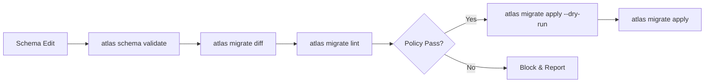
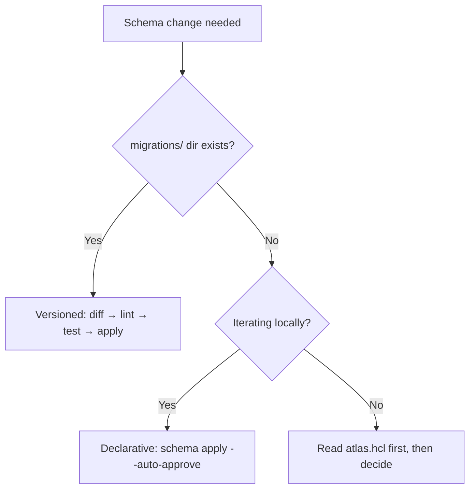

# Database Schema Migrations with Codex CLI: Atlas Agent Skills, Policy-as-Code, and the Deterministic Safety Layer


---

AI coding agents are remarkably good at generating application code. Database migrations are a different beast. A misplaced `DROP COLUMN` in production is not a linting warning — it is data loss. Atlas, the schema-as-code tool from Ariga, now ships an Agent Skill specifically designed for Codex CLI that packages the entire migration lifecycle into a deterministic, policy-guarded workflow [^1]. This article walks through the skill's architecture, installation, day-to-day usage, and — critically — the policy-as-code layer that makes agent-driven migrations safe for production.

## Why Agent-Driven Migrations Need Guardrails

When Codex CLI generates a TypeScript handler, the worst outcome is a failing test. When it generates a migration, the worst outcome is irreversible data corruption. The challenge is twofold: agents must produce *correct* SQL, and organisations must *block* dangerous SQL before it reaches a live database [^2].

Traditional AGENTS.md instructions help, but they are suggestions the model may or may not follow. Atlas takes a different approach: deterministic tooling that *computes* the migration from a schema diff, then *validates* the result against machine-readable policies before it can be applied [^3].



## Atlas Agent Skill: Anatomy

The Atlas skill follows the SKILL.md open standard adopted by Codex CLI, Claude Code, Cursor, and GitHub Copilot [^1]. It consists of three components:

| Component | Path | Purpose |
|-----------|------|---------|
| `SKILL.md` | `.codex/skills/atlas/SKILL.md` | Metadata header + full workflow instructions |
| References | `.codex/skills/atlas/references/` | ORM-specific configs, dev-database dialect URLs |
| `agents/openai.yaml` | Optional | UI hints, implicit invocation policy, tool dependencies |

The SKILL.md frontmatter tells Codex *when* to activate:

```yaml
---
name: atlas
description: >
  Database schema management and migrations with Atlas CLI.
  Use when: generating migrations, diffing schemas, linting or
  testing migrations, applying schema changes, inspecting databases,
  working with atlas.hcl, schema.hcl, or ORM schemas.
---
```

Codex uses progressive disclosure loading: it reads only the skill name and description into the manifest (capped at roughly 2% of context window), loading the full SKILL.md body only when a task matches the trigger description [^4]. This means the Atlas skill consumes zero context tokens during a JavaScript refactoring session but activates automatically when you ask Codex to "add an email column to the users table".

## Installation

### Project-Level (Recommended)

```bash
mkdir -p .codex/skills/atlas/references
```

Place the SKILL.md and references files in the skill directory. Atlas provides a pre-built skill you can copy directly [^1]:

```bash
# Download the official Atlas skill
curl -sL https://atlasgo.io/skills/codex/SKILL.md \
  -o .codex/skills/atlas/SKILL.md
curl -sL https://atlasgo.io/skills/codex/references/schema-sources.md \
  -o .codex/skills/atlas/references/schema-sources.md
```

Commit the skill to version control so every team member gets consistent migration workflows [^5].

### User-Level (Personal)

For use across all repositories:

```bash
mkdir -p ~/.codex/skills/atlas/references
# Same curl commands, targeting ~/.codex/skills/atlas/
```

Codex scans from the current working directory upward to the repository root, then falls back to `~/.codex/skills/` and `/etc/codex/skills/` [^4].

## Core Configuration: atlas.hcl

The skill teaches Codex to read `atlas.hcl` before issuing any command. A typical environment block:

```hcl
env "dev" {
  url = getenv("DATABASE_URL")
  dev = "docker://postgres/17/dev?search_path=public"
  migration {
    dir = "file://migrations"
  }
  schema {
    src = "file://schema.hcl"
  }
}
```

Two critical details the skill encodes:

1. **Never hardcode credentials.** The agent uses `getenv()` exclusively — database URLs never enter the LLM context [^5].
2. **Schema scope matters.** `docker://postgres/17/dev?search_path=public` is schema-scoped (single schema); `docker://postgres/17/dev` is database-scoped (multiple schemas, extensions). Wrong scope causes `ModifySchema is not allowed` errors or silently drops database-level objects [^5].

## The Seven-Stage Migration Lifecycle

The skill encodes a deterministic workflow that the agent follows for every schema change:

### 1. Inspect

```bash
atlas schema inspect --env dev
```

Reads the current database state. The agent uses this to understand what exists before proposing changes.

### 2. Edit

The agent modifies the schema source — HCL files, ORM models (GORM, Drizzle, Django, SQLAlchemy, Ent, Sequelize, TypeORM), or raw SQL [^1].

### 3. Validate

```bash
atlas schema validate --env dev
```

Checks syntax and semantic correctness before any migration is generated.

### 4. Generate

```bash
atlas migrate diff --env dev "add_user_email"
```

Atlas *computes* the migration SQL from the diff between desired state and current state. This is deterministic — the agent does not write SQL by hand [^3].

### 5. Lint

```bash
atlas migrate lint --env dev --latest 1
```

Runs the generated migration through Atlas's built-in analysers: destructive change detection, backward-incompatibility checks, naming convention enforcement, and any custom policies [^3].

### 6. Test

```bash
atlas migrate test --env dev
```

Executes the migration against a disposable dev database to verify it applies cleanly.

### 7. Deploy

```bash
atlas migrate apply --env dev --dry-run   # Preview
atlas migrate apply --env dev             # Apply
```

The skill instructs the agent to *always* run `--dry-run` first and present the plan for human review before applying [^5].

## Policy-as-Code: The Deterministic Safety Layer

This is what separates agent-driven Atlas migrations from "the LLM wrote some SQL and we hope it's fine". Atlas policies are machine-readable rules enforced by the CLI — if a migration violates a policy, it *cannot pass* regardless of what the agent generates [^3].

### Destructive Change Detection

Atlas automatically flags irreversible operations like `DROP COLUMN` or `DROP TABLE`. Teams can configure strict enforcement:

```hcl
lint {
  destructive {
    error = true
  }
}
```

Or allowlist specific patterns for staged deletions (tables prefixed with `drop_`, for instance) [^3].

### Backward-Incompatibility Analysis

Column renames, type changes, and constraint additions that would break running application code are flagged before the migration executes [^3].

### Naming Convention Enforcement

Custom rules codify internal standards:

```hcl
lint {
  naming {
    index  = "^idx_.*$"
    foreign_key = "^fk_.*$"
    table  = "^[a-z][a-z0-9_]*$"
  }
}
```

These become living, programmatic gatekeepers rather than wiki pages nobody reads [^3].

### CI/CD Integration and Approval Workflows

Atlas generates execution plans during CI, comments them on pull requests, and stores artefacts in the Atlas Registry. Apply-time policies offer three modes [^3]:

| Mode | Behaviour |
|------|-----------|
| Error-Only | Proceeds unless errors detected |
| Warning-Sensitive | Pauses on warnings for review |
| Strict | Requires manual sign-off for every migration |

### Database Ownership

Atlas extends governance to access control through ownership policies — essentially `CODEOWNERS` for your database — mapping schema objects to GitHub users or teams [^3].

## ORM Integration

The skill's `references/schema-sources.md` file documents how to configure external schema sources for popular ORMs:

```hcl
# GORM (Go)
data "external_schema" "gorm" {
  program = [
    "go", "run",
    "ariga.io/atlas-provider-gorm",
    "load", "--path", "./models",
  ]
}

# Drizzle (TypeScript)
data "external_schema" "drizzle" {
  program = ["npx", "drizzle-kit", "export"]
}

# Django (Python)
data "external_schema" "django" {
  program = [
    "python", "manage.py",
    "atlas-provider-django", "--dialect", "postgres",
  ]
}
```

This means the agent can work with your existing ORM models — it edits the model, then Atlas computes the correct migration from the ORM's schema output [^1].

## Workflow Decision Tree

The skill includes a decision tree the agent follows:



Versioned migrations (with a `migrations/` directory) suit production workflows where every change must be reviewed and tracked. Declarative mode (`atlas schema apply`) suits rapid local iteration where the database is disposable [^5].

## Combining Atlas with Codex CLI Hooks

For additional safety, pair the Atlas skill with Codex CLI hooks. A `PreToolUse` hook can intercept shell commands and block any direct `psql` or `mysql` calls, forcing all database changes through Atlas [^6]:

```json
{
  "hooks": {
    "PreToolUse": [
      {
        "tool": "shell",
        "command": "python3 .codex/hooks/block-direct-sql.py"
      }
    ]
  }
}
```

The hook script inspects the proposed command, denies anything that bypasses Atlas, and returns a reason explaining the approved workflow.

## Practical Example: Adding a Column

A typical interaction:

> **You:** Add a `last_login` timestamp column to the users table, nullable, with a default of now().

Codex activates the Atlas skill, then:

1. Runs `atlas schema inspect --env dev` to read current state
2. Edits `schema.hcl` to add the column definition
3. Runs `atlas schema validate --env dev` — passes
4. Runs `atlas migrate diff --env dev "add_users_last_login"` — generates migration SQL
5. Runs `atlas migrate lint --env dev --latest 1` — no policy violations
6. Runs `atlas migrate apply --env dev --dry-run` — shows the execution plan
7. Asks for confirmation before applying

At no point does the agent write raw SQL. At no point can a destructive change slip past the linting stage.

## Current Limitations

- **Sandbox constraints.** Codex CLI's sandbox does not expose Docker by default, so the dev-database URL (`docker://postgres/17/dev`) requires either sandbox relaxation or a pre-running container accessible via TCP [^4].
- **MCP coverage gaps.** `PreToolUse` hooks do not reliably fire for all MCP tool calls, so the "block direct SQL" hook may miss commands routed through an MCP database server [^6].
- **No automatic apply.** The skill deliberately requires human confirmation for `migrate apply` without `--dry-run`. This is by design, but means fully autonomous CI pipelines need the `codex exec` non-interactive mode with appropriate approval policies.
- **Credential isolation.** While the skill prevents credentials entering LLM context via `getenv()`, the agent process itself has access to environment variables. Organisations handling sensitive databases should use Codex CLI's managed configuration to restrict environment variable exposure.

## Citations

[^1]: [Database Schema Migration Skill for AI Agents — Atlas Guides](https://atlasgo.io/guides/ai-tools/agent-skills)
[^2]: [Agents on (Guard)Rails: Deterministic Safety for Database Operations — AI Native Dev](https://ainativedev.io/talk/agents-on-guardrails-deterministic-safety-for-database-operations)
[^3]: [Policy as Code for Database Migrations — Atlas Blog, April 2026](https://atlasgo.io/blog/2026/04/29/policy-as-code)
[^4]: [Skills — Codex CLI, OpenAI Developers](https://developers.openai.com/codex/skills)
[^5]: [OpenAI Codex with Atlas — Atlas Guides](https://atlasgo.io/guides/ai-tools/codex-instructions)
[^6]: [Hooks — Codex CLI, OpenAI Developers](https://developers.openai.com/codex/hooks)
