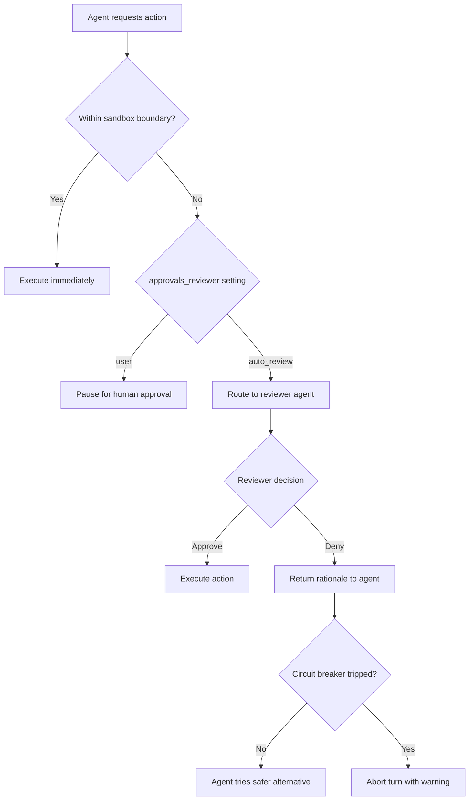
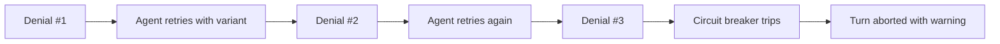

# Codex CLI Auto-Review Internals: Circuit Breakers, Denial Handling, and Custom Policy Authoring


---

On 11 May 2026, OpenAI published a dedicated auto-review documentation page covering the reviewer lifecycle, trigger conditions, and failure behaviour in detail that was previously scattered across changelog entries and source comments[^1]. This article distils those internals into a practitioner's guide: how the reviewer agent decides, what happens when it says no, how the circuit breaker protects you from runaway denial loops, and how to author custom policies that fit your codebase.

## What Auto-Review Actually Is (and Is Not)

Auto-review is a **reviewer substitution**, not a permission expansion. When you set `approvals_reviewer = "auto_review"` in your `config.toml`, approval escalations that would normally pause for a human instead route to a separate reviewer agent[^2]. The primary agent continues operating under identical sandbox constraints — the reviewer cannot widen `writable_roots`, enable network access, or weaken any protection[^1].

This distinction matters because teams sometimes assume auto-review unlocks a more permissive mode. It does not. It changes *who* evaluates boundary-crossing requests, not *what* the agent is allowed to do.

```toml
# Enable auto-review — requires an interactive approval policy
approval_policy = "on-request"
approvals_reviewer = "auto_review"
sandbox_mode = "workspace-write"
```

With `approval_policy = "never"`, there is nothing to review, so auto-review never activates[^1].

## Trigger Conditions

The reviewer evaluates escalation requests that fall outside the active sandbox boundary. Routine actions already permitted inside the sandbox bypass review entirely[^1]. The five categories that trigger review are:

1. **Shell/exec calls** requiring elevated permissions beyond the current sandbox mode
2. **Network requests** blocked by the sandbox's network policy
3. **File edits** outside allowed `writable_roots`
4. **MCP/app tool calls** marked for approval in granular policy
5. **Browser Use domain access** requests via the Computer Use plugin



## The Reviewer's Information Model

The reviewer agent receives a **compact transcript** plus the specific escalation request[^1]. This includes user messages, assistant updates, relevant tool interactions, and the proposed action. Crucially, the primary agent's **private chain-of-thought reasoning is excluded** — only retained conversation items and tool evidence are visible to the reviewer[^1].

This design prevents the reviewer from being manipulated by reasoning that was crafted to justify a dangerous action. The reviewer judges the *action* against the *evidence*, not the agent's internal justification for it.

## What the Reviewer Blocks

The reviewer is trained to prevent four categories of harmful behaviour[^1]:

| Category | Examples |
|----------|----------|
| **Data exfiltration** | Transmitting secrets, credentials, or private data to untrusted endpoints |
| **Credential probing** | Token, cookie, or session enumeration and theft attempts |
| **Security degradation** | Broad or persistent weakening of security posture |
| **Destructive actions** | Irreversible damage with high blast radius |

The default policy lives in the open-source Codex repository at `codex-rs/core/src/guardian/policy.md`[^1]. Risk classification follows a four-level scheme: **low**, **medium**, **high**, and **critical**. Low and medium actions can proceed when policy allows; critical actions are always denied; high-risk actions require sufficient user authorisation and no matching deny rule[^3].

## Denial Handling: Not a Standard Error

When the reviewer denies an action, the system does not treat it as a routine sandbox error. Three things happen[^1]:

1. The reviewer's **rationale** is returned to the primary agent, explaining *why* the action was denied.
2. A **strong anti-circumvention instruction** is injected, telling the agent not to attempt workarounds or policy evasion.
3. The agent is required to find a **materially safer alternative** or escalate to the user.

This anti-circumvention design is deliberate. Without it, a sufficiently capable agent might attempt to achieve the same outcome through a sequence of individually benign actions. The injected instruction makes the intent of the denial explicit.

## The Circuit Breaker

The most operationally significant detail in the May 11 documentation is the **rejection circuit breaker**[^1]. It activates under two conditions:

- **3 consecutive denials** within a single turn
- **10 denials within 50 recent reviews** in a single turn

When either threshold is hit, the turn is **aborted with a warning**. This prevents the agent from burning tokens in a denial loop where it repeatedly proposes variations of a blocked action.



In practice, the circuit breaker is your signal that the sandbox boundary needs adjusting rather than the agent's prompt. If you're seeing it trip regularly, you almost certainly need to widen `writable_roots` or add command prefixes to your sandbox policy — not teach the reviewer to be more lenient[^1].

## The `/approve` Override

Users can run `/approve` in the TUI to select a recently denied action for a **single retry**[^1]. This creates a narrow, developer-scoped approval marker that:

- Applies to **one specific action** only
- Is **single-use** — it does not create a permanent exemption
- Still **undergoes auto-review** on the retry — the reviewer sees the user's explicit authorisation as additional context

This mechanism exists for the legitimate case where a developer understands the risk and wants to proceed. It is deliberately inconvenient — requiring manual TUI interaction — to prevent it from being automated into an approval rubber-stamp.

## Custom Policy Authoring

The default reviewer policy covers general-purpose security concerns. For domain-specific requirements, you can replace it entirely via `config.toml`[^1]:

```toml
[auto_review]
policy = """
## Security Review Policy

### Always Deny
- Any `curl` or `wget` to domains outside *.internal.example.com
- Any modification to files matching **/migrations/*.sql without
  a corresponding test file change
- Any `docker push` to registries other than registry.example.com

### Always Allow
- Read operations against any path
- `cargo test`, `cargo clippy`, and `cargo fmt` invocations
- Git operations limited to the current worktree

### Require Justification
- Database schema changes (CREATE TABLE, ALTER TABLE, DROP)
- Changes to CI/CD pipeline files (.github/workflows/*)
- Modifications to authentication or authorisation modules
"""
```

The policy is Markdown text — the reviewer agent interprets it as natural language instructions. There is no schema or DSL. This makes it easy to write but means you should test policies thoroughly before deploying them to a team.

### Enterprise Override with Managed Configuration

For organisations on ChatGPT Business or Enterprise plans, the `guardian_policy_config` key in managed requirements takes precedence over any local `[auto_review].policy`[^4]. This ensures that organisation-wide security policies cannot be overridden by individual developers:

```toml
# In managed requirements (deployed via MDM or cloud config)
guardian_policy_config = """
All actions that modify infrastructure-as-code files (*.tf, *.pulumi.*)
require explicit user approval regardless of risk level.
"""
```

The reviewer still uses its built-in template and output contract — `guardian_policy_config` only replaces the tenant-specific section of the policy[^4].

## The Optimisation Strategy: Strengthen the Sandbox First

The auto-review documentation includes a counter-intuitive recommendation: rather than teaching the reviewer to approve noisy escalations, **strengthen the sandbox boundary first**[^1]. This means:

1. **Add narrow `writable_roots`** for intentional scratch directories instead of granting broad write access
2. **Use precise command prefixes** (`["cargo", "test"]`) over broad patterns (`["python"]`)
3. **Analyse `~/.codex/sessions` transcripts** to identify recurring approval patterns before changing policy

```toml
# Before: broad sandbox, noisy auto-review
sandbox_mode = "workspace-write"
# Agent frequently triggers review for /tmp writes

# After: targeted sandbox, quiet auto-review
sandbox_mode = "workspace-write"

[sandbox_workspace_write]
writable_roots = [".", "/tmp/codex-scratch"]
```

This approach reduces reviewer load, cuts token costs (the reviewer agent consumes tokens for every evaluation), and produces a more predictable security posture.

## Practical Session Analysis

Before tuning your auto-review policy, audit what the reviewer is actually seeing. Session transcripts in `~/.codex/sessions/` contain the full approval history. A quick analysis pattern:

```bash
# Find all auto-review denials in recent sessions
codex exec "Analyse the last 10 session transcripts in ~/.codex/sessions/ \
  and list every auto-review denial with the action type, the reviewer's \
  rationale, and whether the agent found a successful alternative. \
  Output as a markdown table." \
  --output-schema denial-report.schema.json \
  -o denial-report.json
```

This gives you a data-driven view of where your policy and sandbox configuration need adjustment.

## Fundamental Limits

The documentation is refreshingly honest about what auto-review cannot guarantee[^1]:

- It **only evaluates actions requesting boundary crossing** — actions within the sandbox are never reviewed
- It **can still make mistakes**, particularly in adversarial contexts where prompts are crafted to mislead
- It **complements** sandbox design and organisation-specific monitoring — it does not replace them

Auto-review improves baseline security for long-running agentic work, but it is not a deterministic safety guarantee. The correct mental model is defence in depth: sandbox constraints as the hard boundary, auto-review as an intelligent filter on the boundary, and human oversight for high-stakes decisions.

## Summary

The May 11 documentation expansion transforms auto-review from a feature flag into a well-specified system with clear operational semantics. The circuit breaker prevents token waste, `/approve` provides a controlled escape hatch, custom policies adapt the reviewer to domain-specific concerns, and the "strengthen the sandbox first" principle keeps the overall system predictable.

For teams adopting auto-review, the path is: start with the default policy, run for a week, analyse denial transcripts, tighten the sandbox where possible, and only then customise the policy for domain-specific rules.

## Citations

[^1]: OpenAI, "Auto-review — Codex," OpenAI Developers, May 2026. [https://developers.openai.com/codex/auto-review](https://developers.openai.com/codex/auto-review)

[^2]: OpenAI, "Agent approvals & security — Codex," OpenAI Developers, 2026. [https://developers.openai.com/codex/agent-approvals-security](https://developers.openai.com/codex/agent-approvals-security)

[^3]: OpenAI, "Configuration Reference — Codex," OpenAI Developers, 2026. [https://developers.openai.com/codex/config-reference](https://developers.openai.com/codex/config-reference)

[^4]: OpenAI, "Managed configuration — Codex," OpenAI Developers, 2026. [https://developers.openai.com/codex/enterprise/managed-configuration](https://developers.openai.com/codex/enterprise/managed-configuration)

[^5]: OpenAI, "Changelog — Codex," OpenAI Developers, May 2026. [https://developers.openai.com/codex/changelog](https://developers.openai.com/codex/changelog)

[^6]: OpenAI, "Advanced Configuration — Codex," OpenAI Developers, 2026. [https://developers.openai.com/codex/config-advanced](https://developers.openai.com/codex/config-advanced)
