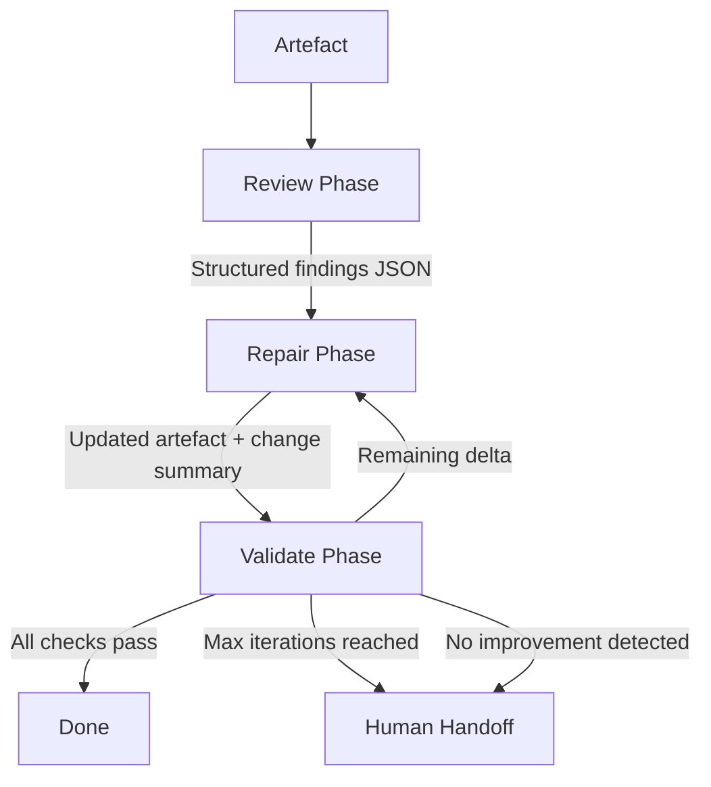

# Iterative Repair Loops with Codex CLI: The Review-Repair-Validate Pattern for Self-Correcting Agent Workflows


---

Single-pass agent runs are fragile. Hand an agent a migration task or a documentation refresh, and the first attempt will typically get 70–80% of the way there — then stall on edge cases that only surface when you actually run the tests. The fix is not a better prompt; it is a better loop.

On 11 May 2026, OpenAI published a cookbook entry formalising what practitioners have been building in shell scripts for months: the **iterative repair loop** — a three-phase cycle of Review, Repair, and Validate that drives agent output towards correctness through structured feedback rather than hope [^1]. This article breaks the pattern down, maps it onto `codex exec`, and shows how to wire it into CI pipelines today.

## Why Single-Pass Fails

A single `codex exec` invocation treats the agent as a function: prompt in, artefact out. That works for bounded tasks — generating a commit message, summarising a diff — but falls apart when:

- The task has **implicit validation criteria** (tests must pass, linter must be clean, API contracts must hold).
- The artefact is **large enough** that the agent cannot hold every constraint in working memory simultaneously.
- **Feedback is only available after execution** — you cannot know whether the migration compiles until you compile it.

The industry consensus in 2026 is that agents perform significantly better inside a structured harness than in raw chat mode [^2]. The iterative repair loop is the simplest such harness worth building.

## The Three-Phase Architecture



Each phase is a separate `codex exec` invocation with its own prompt and `--output-schema`, connected by machine-readable JSON rather than prose [^1].

### Phase 1: Review

The review phase inspects the current artefact **without editing or executing anything**. It returns structured findings — an array of issues, each with a severity, description, and suggested fix direction [^1].

```bash
codex exec \
  --output-schema ./schemas/review-findings.json \
  -o ./state/findings.json \
  "Review $ARTEFACT against these business rules: $RULES. \
   Return structured findings. Do not edit any files."
```

The schema enforces machine-readable output:

```json
{
  "type": "object",
  "properties": {
    "findings": {
      "type": "array",
      "items": {
        "type": "object",
        "properties": {
          "artifact": { "type": "string" },
          "issue_type": { "type": "string" },
          "severity": { "type": "string", "enum": ["critical", "major", "minor"] },
          "description": { "type": "string" },
          "suggested_fix_direction": { "type": "string" }
        },
        "required": ["artifact", "issue_type", "severity", "description", "suggested_fix_direction"],
        "additionalProperties": false
      }
    }
  },
  "required": ["findings"],
  "additionalProperties": false
}
```

Keeping the review read-only is critical. If the reviewer can also edit, you lose the separation between judgement and action that makes the loop auditable [^1].

### Phase 2: Repair

The repair phase receives the findings and the latest validation feedback (empty on the first pass), then makes **focused, bounded edits** to a copied artefact [^1]. It works on a copy so that you can diff against the original and roll back if needed.

```bash
cp "$ARTEFACT" "$ARTEFACT.repair"

codex exec \
  --sandbox workspace-write \
  --output-schema ./schemas/repair-summary.json \
  -o ./state/repair-summary.json \
  "You are repairing $ARTEFACT.repair. \
   Findings: $(cat ./state/findings.json) \
   Previous validation feedback: $(cat ./state/validation-feedback.json 2>/dev/null || echo 'none') \
   Apply focused fixes. Do not rewrite sections that are already correct."
```

The repair summary captures what changed and what remains unresolved, giving the validate phase precise context:

```json
{
  "type": "object",
  "properties": {
    "changes_made": {
      "type": "array",
      "items": { "type": "string" }
    },
    "unresolved_items": {
      "type": "array",
      "items": { "type": "string" }
    },
    "updated_artifact_path": { "type": "string" }
  },
  "required": ["changes_made", "unresolved_items", "updated_artifact_path"],
  "additionalProperties": false
}
```

### Phase 3: Validate

Validation executes real checks — test suites, linters, type checkers, contract validators — and produces evidence-based feedback rather than opinions [^1]. This is where the loop earns its keep: failures become data for the next repair pass.

```bash
codex exec \
  --sandbox workspace-write \
  --output-schema ./schemas/validation-result.json \
  -o ./state/validation-feedback.json \
  "Run the following validation cases against $(cat ./state/repair-summary.json | jq -r .updated_artifact_path):
   1. Does the artefact avoid stale API patterns?
   2. Can a reader run the code without hidden manual steps?
   3. Did the update preserve the original teaching flow?
   Report each case as pass/fail with evidence. \
   Set overall_passed to true only if all cases pass."
```

## Wiring the Loop in Bash

The outer loop is deliberately simple — a bounded `while` with convergence detection:

```bash
#!/usr/bin/env bash
set -euo pipefail

MAX_ITERATIONS=5
ARTEFACT="./notebooks/demo.ipynb"
RULES="$(cat ./business-rules.json)"
mkdir -p ./state

# Initial review
codex exec \
  --output-schema ./schemas/review-findings.json \
  -o ./state/findings.json \
  "Review $ARTEFACT against: $RULES. Return structured findings only."

for i in $(seq 1 "$MAX_ITERATIONS"); do
  echo "=== Repair iteration $i ==="

  # Repair
  cp "$ARTEFACT" "${ARTEFACT}.repair"
  codex exec \
    --sandbox workspace-write \
    --output-schema ./schemas/repair-summary.json \
    -o ./state/repair-summary.json \
    "Repair ${ARTEFACT}.repair using findings: $(cat ./state/findings.json) \
     and feedback: $(cat ./state/validation-feedback.json 2>/dev/null || echo 'first pass')"

  # Validate
  codex exec \
    --sandbox workspace-write \
    --output-schema ./schemas/validation-result.json \
    -o ./state/validation-feedback.json \
    "Validate $(jq -r .updated_artifact_path ./state/repair-summary.json). \
     Run all checks. Report pass/fail with evidence."

  # Check termination
  if jq -e '.overall_passed == true' ./state/validation-feedback.json > /dev/null 2>&1; then
    echo "All validations passed on iteration $i"
    exit 0
  fi

  # Convergence check: if remaining_delta unchanged, stop
  if [ "$i" -gt 1 ]; then
    PREV_DELTA=$(jq -r '.remaining_delta // empty' ./state/validation-feedback.json.prev 2>/dev/null || echo "")
    CURR_DELTA=$(jq -r '.remaining_delta // empty' ./state/validation-feedback.json)
    if [ "$PREV_DELTA" = "$CURR_DELTA" ] && [ -n "$CURR_DELTA" ]; then
      echo "No improvement detected — handing off to human review"
      exit 1
    fi
  fi
  cp ./state/validation-feedback.json ./state/validation-feedback.json.prev
done

echo "Max iterations reached — handing off to human review"
exit 1
```

## Business Rules as a Contract

The cookbook introduces the idea of a **business rules contract** — a JSON or TOML document that codifies domain-specific constraints the agent must respect [^1]. This separates policy from execution and makes the loop reusable across artefacts:

```toml
# repair-rules.toml
preferred_model = "gpt-5.5"
preferred_embedding_model = "text-embedding-3-large"

[modernise]
replacements = [
  "client.chat.completions.create -> client.responses.create",
  "legacy function-calling schemas -> current tools schema",
]

[reader_experience]
rules = [
  "Make fresh-environment setup explicit",
  "Keep examples runnable with local data",
  "Remove manual result-file placeholders",
]
```

Feed this into each phase prompt so that Review knows what to look for, Repair knows what standards to apply, and Validate knows what to check against.

## CI/CD Integration with GitHub Actions

The repair loop maps naturally onto a GitHub Actions workflow triggered by pull requests or scheduled runs:


```yaml
name: iterative-repair
on:
  schedule:
    - cron: '0 6 * * 1'  # Weekly Monday 06:00 UTC
  workflow_dispatch:

jobs:
  repair-loop:
    runs-on: ubuntu-latest
    env:
      CODEX_API_KEY: ${{ secrets.CODEX_API_KEY }}
    steps:
      - uses: actions/checkout@v4

      - name: Install Codex CLI
        run: npm install -g @openai/codex@0.130.0

      - name: Run repair loop
        run: ./scripts/repair-loop.sh ./docs/api-guide.md

      - name: Create PR if changes exist
        if: success()
        run: |
          git diff --quiet || {
            git checkout -b repair/$(date +%Y%m%d)
            git add -A
            git commit -m "chore: automated repair loop pass"
            gh pr create \
              --title "Automated repair: docs/api-guide.md" \
              --body "$(cat ./state/repair-summary.json | jq -r '.changes_made | join("\n- ")')"
          }
```


The `codex-action@v1` GitHub Action can also wrap `codex exec` invocations with built-in authentication and caching [^3].

## Audit Trails and Observability

Each iteration writes a `record.json` containing the review findings, repair summary, and validation results [^1]. In production, pipe these into your observability stack via Codex's built-in OpenTelemetry support:

```toml
# config.toml
[otel]
environment = "repair-loop"
exporter = "otlp-http"
trace_exporter = "otlp-http"

[otel.exporter.otlp-http]
endpoint = "https://otel.example.com/v1/logs"
```

Each `codex exec` invocation emits a trace span under `session_loop`, giving you per-phase latency, token consumption, and failure rates in your existing dashboards [^4].

## Stop Conditions and Convergence

Production loops need four stop conditions [^1]:

1. **Validation passes** — the happy path.
2. **Max iterations reached** — a safety cap (3–5 is typical).
3. **No improvement detected** — remaining delta is identical to the previous iteration.
4. **Issues flagged for human review** — some findings are genuinely ambiguous and should not be auto-repaired.

The convergence check is non-negotiable. Without it, you burn tokens on an agent spinning its wheels. The cookbook's demonstration showed most artefacts converging within two to three iterations, with diminishing returns beyond three [^1].

## Beyond Documentation: Generalisable Applications

The Review-Repair-Validate pattern applies anywhere you have an artefact, a set of rules, and a machine-checkable definition of "correct":

| Domain | Artefact | Validation | Typical Iterations |
|--------|----------|------------|-------------------|
| API migration | Source files | `npm test` + type checker | 2–3 |
| Documentation refresh | Markdown/notebooks | Link checker + code execution | 1–3 |
| Dependency upgrades | `package.json` + source | Full CI suite | 2–4 |
| Regulatory compliance | Policy documents | Clause-matching validator | 1–2 |
| Configuration drift | Terraform/Helm | `terraform plan` + policy engine | 2–3 |

## Comparison with the Ralph Wiggum Loop

The community "Ralph loop" — a bare `while` that re-runs the same prompt until a check passes — is a degenerate case of this pattern [^5]. It works, but collapses all three phases into a single prompt. The structured approach offers three advantages:

1. **Auditability** — you can inspect what the reviewer found separately from what the repairer changed.
2. **Phase-specific models** — use a cheaper model (e.g. `gpt-5.4-mini`) for validation and reserve `gpt-5.5` for repair [^6].
3. **Composability** — swap the validate phase for a different checker without touching the repair logic.

## Current Limitations

- **`codex exec resume` does not accept `--output-schema`** — you cannot resume a previous repair session with structured output constraints [^7]. Each phase must be a fresh invocation.
- **Token cost scales linearly** with iterations. A three-phase, three-iteration loop uses roughly 9x the tokens of a single pass. Profile-based model routing (`gpt-5.4-mini` for review, `gpt-5.5` for repair) mitigates this.
- **Non-determinism** — two runs against the same artefact may produce different findings. Pin `model_reasoning_summary = "concise"` and set a fixed seed if reproducibility matters.
- **No built-in loop primitive** — the outer loop is your responsibility. Codex does not natively orchestrate multi-phase repair cycles; you wire it in Bash, Python, or CI YAML.

## Getting Started in Five Minutes

1. **Create the schemas** — three JSON Schema files (review, repair, validate) in a `schemas/` directory.
2. **Write the business rules** — a TOML or JSON file listing what "correct" means for your artefact.
3. **Adapt the Bash loop** — copy the script above, point it at your artefact, and set `MAX_ITERATIONS=3`.
4. **Run locally first** — `./repair-loop.sh ./path/to/artefact` to verify convergence.
5. **Promote to CI** — wrap in a GitHub Actions workflow with `codex-action@v1` or a cron job.

The pattern is deliberately low-ceremony. The value is not in the tooling; it is in separating judgement from action and feeding real validation evidence back into the repair step.

## Citations

[^1]: OpenAI, "Build iterative repair loops with Codex," OpenAI Cookbook, 11 May 2026. [https://developers.openai.com/cookbook/examples/codex/build_iterative_repair_loops_with_codex](https://developers.openai.com/cookbook/examples/codex/build_iterative_repair_loops_with_codex)

[^2]: Kilo.ai, "Beyond Autocomplete: Best Agentic Coding Workflow in 2026," 2026. [https://kilo.ai/articles/beyond-autocomplete](https://kilo.ai/articles/beyond-autocomplete)

[^3]: OpenAI, "GitHub Action — Codex," OpenAI Developers, 2026. [https://developers.openai.com/codex/github-action](https://developers.openai.com/codex/github-action)

[^4]: OpenAI, "Advanced Configuration — Codex," OpenAI Developers, 2026. [https://developers.openai.com/codex/config-advanced](https://developers.openai.com/codex/config-advanced)

[^5]: d4b.dev, "Ralph Wiggum loops with Codex: run iterative agent passes until done," 4 March 2026. [https://www.d4b.dev/blog/2026-03-04-ralph-loops-with-codex](https://www.d4b.dev/blog/2026-03-04-ralph-loops-with-codex)

[^6]: OpenAI, "Models — Codex," OpenAI Developers, 2026. [https://developers.openai.com/codex/models](https://developers.openai.com/codex/models)

[^7]: GitHub Issue #14343, "Add --output-schema support to codex exec resume," openai/codex, 2026. [https://github.com/openai/codex/issues/14343](https://github.com/openai/codex/issues/14343)
