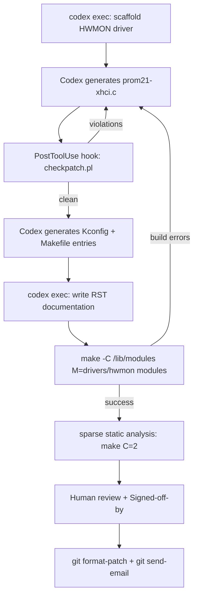

# Linux Kernel Development with Codex CLI: From Module Scaffolding to LKML Submission


---

On 8 May 2026, a patch series appeared on the Linux kernel mailing list introducing `prom21-xhci`, a hardware monitoring driver for AMD Promontory 21 chipset temperature sensors [^1]. Its commit message carried a line that would have been unthinkable two years earlier: `Assisted-by: Codex:GPT-5.5`. A human developer — Jihong Min — reviewed, signed off, and submitted the code, but an AI agent did a substantial share of the heavy lifting. The patch is now under active review by HWMON and USB maintainers.

This article examines how Codex CLI can be configured for Linux kernel development: the AGENTS.md patterns that enforce kernel coding style, the sandbox settings that let the agent invoke cross-compilation toolchains, the hooks that run `checkpatch.pl` before every commit, and the attribution rules that Linux 7.0's new AI policy demands.

## The Linux Kernel's AI Policy

Linux 7.0, released on 12 April 2026, merged `Documentation/process/coding-assistants.rst` into Linus Torvalds's tree [^2]. The policy is short and precise:

1. **Only humans sign off.** AI agents MUST NOT add `Signed-off-by` tags. The human submitter certifies the Developer Certificate of Origin and bears full legal responsibility [^2].
2. **Attribution is mandatory.** Every patch that received AI assistance must include an `Assisted-by` tag in the commit trailer [^2]:

```
Assisted-by: Codex:GPT-5.5 [checkpatch] [sparse]
```

The format is `AGENT_NAME:MODEL_VERSION [TOOL1] [TOOL2]`. List only specialised analysis tools (coccinelle, sparse, smatch, clang-tidy) — not basic utilities like `gcc` or `make` [^2].

3. **Human review is non-negotiable.** The submitter must thoroughly review all AI-generated code, verify licensing compliance (GPL-2.0-only with correct SPDX identifiers), and take full accountability [^2].

These rules align well with Codex CLI's design philosophy: the agent generates and iterates; the developer reviews, tests, and owns the result.

## Configuring AGENTS.md for Kernel Work

Kernel C is not application C. Tabs are 8 characters wide, functions return early, `goto` is the standard error-handling pattern, and the coding style document runs to thousands of words [^3]. An AGENTS.md file in a kernel tree should encode the rules that `checkpatch.pl` enforces, plus the conventions it cannot check:

```markdown
# AGENTS.md — Linux Kernel Module Development

## Coding Style
- Follow Documentation/process/coding-style.rst strictly
- Indentation: hard tabs, 8-character width
- Line length: 100 columns maximum (was 80 before kernel 6.1)
- Braces: opening brace on same line as statement (except functions)
- Use `goto` for centralised error cleanup; do not nest conditionals
- Prefer kernel API functions over libc equivalents (kzalloc, not malloc)

## Build Commands
- `make -C /lib/modules/$(uname -r)/build M=$(pwd) modules`
- `make -C /lib/modules/$(uname -r)/build M=$(pwd) clean`
- For cross-compilation: `make ARCH=arm64 CROSS_COMPILE=aarch64-linux-gnu-`

## Validation
- Run `scripts/checkpatch.pl --strict` on every patch before committing
- Run `sparse` with `make C=2` for static analysis
- Run `smatch` where available for additional bug detection

## Commit Messages
- Subject line: subsystem prefix, imperative mood, under 72 characters
- Body: explain *why*, not *what*
- Include `Assisted-by: Codex:GPT-5.5` in trailers
- NEVER add `Signed-off-by` — only the human developer does this

## Prohibited Actions
- Do not modify files outside the module directory
- Do not add new dependencies without documenting them in Kconfig
- Do not use `printk(KERN_DEBUG ...)` in production paths — use `dev_dbg()`
- Do not export symbols unless explicitly required by another module
```

Place this at the root of your working tree. Codex loads it automatically and applies the constraints throughout the session [^4].

## Sandbox Configuration for Kernel Builds

Kernel module compilation requires access to the host kernel headers, the `make` toolchain, and optionally cross-compilation toolchains. The default Codex CLI sandbox (`workspace` profile) restricts filesystem writes to the current directory and blocks network access — both of which are correct defaults for kernel work [^5].

However, the agent needs *read* access to `/lib/modules`, `/usr/src`, and the toolchain paths. On Linux, Codex CLI uses Bubblewrap (bwrap) for filesystem isolation [^6]. A project-scoped `config.toml` grants the necessary read paths:

```toml
[permissions.kernel-dev]
filesystem = [
  { path = "/lib/modules", access = "read-only" },
  { path = "/usr/src", access = "read-only" },
  { path = "/usr/bin", access = "read-only" },
  { path = "/usr/lib", access = "read-only" },
]
network = "off"
```

For cross-compilation targeting ARM64 or RISC-V, add the toolchain sysroot:

```toml
  { path = "/opt/cross/aarch64-linux-gnu", access = "read-only" },
```

Network access remains disabled — kernel module builds should never reach the network, and keeping it off prevents accidental data exfiltration from kernel source trees [^5].

## Hooks: Running checkpatch.pl Automatically

The single most valuable integration for kernel work is a `PostToolUse` hook that runs `checkpatch.pl` after every file edit. This catches style violations *during* generation rather than at commit time, when the agent's context may have moved on.

Create `.codex/hooks.json` in your project:

```json
{
  "hooks": [
    {
      "event": "PostToolUse",
      "match": { "tool": "apply_patch" },
      "command": "scripts/checkpatch.pl --no-tree --strict -f ${CODEX_CHANGED_FILE} 2>&1 | head -40",
      "systemMessage": "checkpatch found style violations. Fix them before proceeding.",
      "continue": true
    }
  ]
}
```

This feeds `checkpatch.pl` output back into the agent's context as a system message, triggering an immediate correction pass [^7]. The `--no-tree` flag allows checking individual files rather than git diffs, and `--strict` enables additional opinionated checks that maintainers increasingly expect [^3].

For a pre-commit gate, add a second hook:

```json
    {
      "event": "PreToolUse",
      "match": { "tool": "shell", "command_prefix": "git commit" },
      "command": "git diff --cached | scripts/checkpatch.pl --strict -",
      "systemMessage": "Commit blocked: checkpatch errors in staged changes. Fix before committing.",
      "continue": false
    }
```

Setting `continue: false` prevents the commit if `checkpatch.pl` returns errors [^7].

## The prom21-xhci Case Study

The `prom21-xhci` submission demonstrates a practical kernel development workflow with Codex CLI [^1]. The driver comprises two patches:

1. **USB/xHCI PCI glue driver** (`xhci-pci-prom21.c`) — creates a Promontory 21-specific xHCI PCI binding layer, delegates USB host operations to the common `xhci-pci` driver, and establishes an auxiliary hwmon child device for sensor support.

2. **Hardware monitoring driver** (`prom21-xhci.c`) — implements an auxiliary hwmon driver exposing temperature via the `temp1_input` sysfs interface, with proper runtime power management that returns `-ENODATA` for suspended parent devices.

The submission follows kernel conventions precisely: separate Kconfig entries (`USB_XHCI_PCI_PROM21` and `SENSORS_PROM21_XHCI`), a 99-line RST documentation file at `Documentation/hwmon/prom21-xhci.rst`, and integration into the existing Makefile structure [^1].



The human developer reviewed every line, added the `Signed-off-by` tag, and submitted via `git send-email` to the LKML. Maintainers Mario Limonciello and Guenter Roeck provided review feedback on register access documentation and runtime PM behaviour — standard kernel review, regardless of how the initial code was produced [^1].

## Sashiko: The Kernel's Own AI Reviewer

Submissions like `prom21-xhci` now pass through Sashiko, Google's AI-powered code review system donated to the Linux Foundation in March 2026 [^8]. Named after the Japanese embroidery technique meaning "decorative reinforcement stitching," Sashiko uses a nine-stage protocol to review every kernel patch before a maintainer sees it.

In testing against 1,000 recent upstream issues, Sashiko detected 53 per cent of bugs — all of which had been missed by human reviewers [^8]. Greg Kroah-Hartman publicly endorsed the system, noting that AI-generated reports had crossed a quality threshold: "something happened a month ago, and the world switched" [^9].

For Codex CLI users, this means AI-generated kernel code faces AI-powered review. The practical implication: `checkpatch.pl` compliance and `sparse` cleanliness are table stakes. Sashiko looks deeper — at locking patterns, error-path resource leaks, and use-after-free risks. Configuring Codex's AGENTS.md to emphasise these patterns reduces review friction:

```markdown
## Common Kernel Bug Patterns to Avoid
- Always check return values from kzalloc, devm_kzalloc, platform_get_resource
- Release resources in reverse acquisition order in error paths
- Use `devm_` managed variants where possible to prevent resource leaks
- Never hold a spinlock across sleeping functions (kmalloc with GFP_KERNEL, mutex_lock)
- Validate all user-space inputs in ioctl handlers
```

## Model Selection for Kernel Work

Kernel development demands precise, low-level reasoning about register layouts, memory ordering, and API contracts. GPT-5.5 is the recommended model for this workload, offering the strongest performance on systems-level C code [^10]. For simpler scaffolding tasks — generating Kconfig entries or Makefile boilerplate — o4-mini provides adequate results at lower cost [^10].

Configure model routing in `.codex/config.toml`:

```toml
model = "gpt-5.5"
model_reasoning_effort = "high"
```

The `high` reasoning effort is justified for kernel work: incorrect code in kernel space causes panics, data corruption, or security vulnerabilities rather than mere application errors [^10].

## Practical Workflow: Writing a Kernel Module

A typical session for developing a new HWMON driver with Codex CLI:

```bash
# 1. Scaffold the module
codex exec --full-auto \
  "Create a Linux kernel HWMON driver for reading temperature from \
   PCI device 1022:15E6. Follow the devm_hwmon pattern. \
   Include Kconfig, Makefile changes, and RST documentation."

# 2. Build and check
make -C /lib/modules/$(uname -r)/build M=$(pwd) modules
make -C /lib/modules/$(uname -r)/build M=$(pwd) C=2

# 3. Interactive refinement
codex
# > "The sparse check reports a __user annotation warning on line 47.
# >  Fix it and re-run sparse."

# 4. Format patches with correct trailers
git format-patch -2 --subject-prefix="PATCH v1" \
  --add-header="Assisted-by: Codex:GPT-5.5 [checkpatch] [sparse]"
```

The `--full-auto` flag in step 1 runs without interactive approval — appropriate for initial scaffolding where the human review happens after generation [^11]. The interactive session in step 3 allows targeted fixes with the full agent context available.

## Current Limitations

- **No in-kernel testing from sandbox.** Codex CLI's Bubblewrap sandbox cannot load kernel modules into a running kernel. Module insertion (`insmod`/`modprobe`) requires root privileges and kernel ring access outside the sandbox boundary. Use a VM or dedicated test machine for runtime verification [^6].

- **Limited hardware context.** Codex has no access to hardware datasheets or register maps beyond what you paste into the session. For register-level work, attach the relevant datasheet sections as context via `/read` or paste excerpts into the prompt.

- **Cross-compilation toolchain paths.** The default sandbox does not expose cross-compilation toolchains. Each target architecture requires explicit path allowlisting in `config.toml`.

- **`Assisted-by` tag automation.** Codex CLI does not yet automatically append `Assisted-by` trailers to commits. Use `git commit --trailer "Assisted-by: Codex:GPT-5.5"` or configure a `prepare-commit-msg` git hook to inject it [^2]. ⚠️

## Citations

[^1]: Jihong Min, "[PATCH v1 0/2] hwmon/usb: prom21-xhci: Add temperature monitoring for AMD Promontory 21 xHCI controllers," LKML, 8 May 2026. [https://lore.kernel.org/lkml/20260508143910.14673-1-hurryman2212@gmail.com/](https://lore.kernel.org/lkml/20260508143910.14673-1-hurryman2212@gmail.com/)

[^2]: Linux Kernel Documentation, "AI Coding Assistants," kernel.org, merged April 2026. [https://docs.kernel.org/process/coding-assistants.html](https://docs.kernel.org/process/coding-assistants.html)

[^3]: Linux Kernel Documentation, "Linux kernel coding style," kernel.org. [https://docs.kernel.org/process/coding-style.html](https://docs.kernel.org/process/coding-style.html)

[^4]: OpenAI, "AGENTS.md — Codex CLI," OpenAI Developers, 2026. [https://developers.openai.com/codex/agents-md](https://developers.openai.com/codex/agents-md)

[^5]: OpenAI, "Agent approvals & security — Codex CLI," OpenAI Developers, 2026. [https://developers.openai.com/codex/agent-approvals-security](https://developers.openai.com/codex/agent-approvals-security)

[^6]: OpenAI, "Sandbox — Codex CLI," OpenAI Developers, 2026. [https://developers.openai.com/codex/concepts/sandboxing](https://developers.openai.com/codex/concepts/sandboxing)

[^7]: OpenAI, "Hooks — Codex CLI," OpenAI Developers, 2026. [https://developers.openai.com/codex/hooks](https://developers.openai.com/codex/hooks)

[^8]: Tihomir Manushev, "The Linux Kernel Now Has an AI Code Reviewer — And It Is Finding Bugs Humans Missed," Medium, March 2026. [https://medium.com/@tihomir.manushev/the-linux-kernel-now-has-an-ai-code-reviewer-and-it-is-finding-bugs-humans-missed-b94b00ff361b](https://medium.com/@tihomir.manushev/the-linux-kernel-now-has-an-ai-code-reviewer-and-it-is-finding-bugs-humans-missed-b94b00ff361b)

[^9]: The Register, "Linux kernel czar says AI bug reports aren't slop anymore," 26 March 2026. [https://www.theregister.com/2026/03/26/greg_kroahhartman_ai_kernel/](https://www.theregister.com/2026/03/26/greg_kroahhartman_ai_kernel/)

[^10]: OpenAI, "Models — Codex CLI," OpenAI Developers, 2026. [https://developers.openai.com/codex/models](https://developers.openai.com/codex/models)

[^11]: OpenAI, "Non-interactive mode — Codex CLI," OpenAI Developers, 2026. [https://developers.openai.com/codex/noninteractive](https://developers.openai.com/codex/noninteractive)
