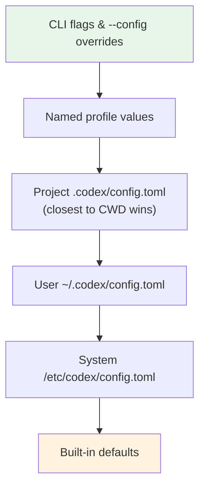
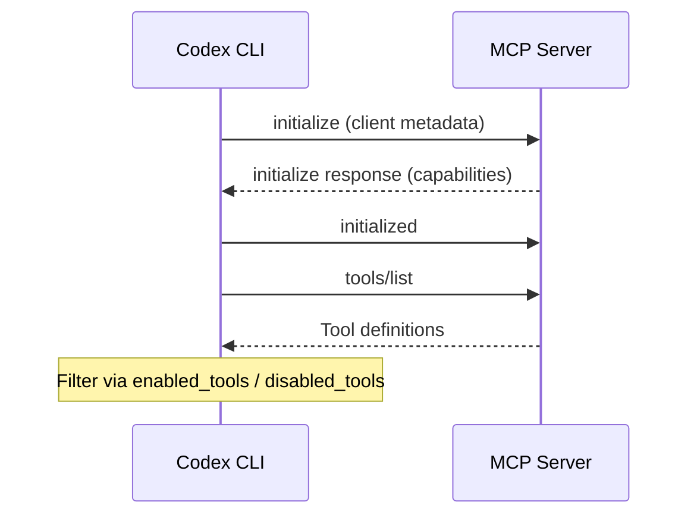

# What Happens When You Type `codex`: The Complete Startup Sequence from Binary to First Model Call


---

Every Codex CLI session begins the same way: you type `codex` and press Enter. What follows is a carefully orchestrated startup sequence that resolves configuration from six layers, discovers instruction files, connects to MCP servers, compiles Starlark security rules, initialises a platform-specific sandbox, and constructs the first Responses API request — all before the TUI renders its first frame. Understanding this sequence is essential for diagnosing slow starts, debugging configuration conflicts, and building reliable automation around the CLI.

## Phase 1: Binary Resolution and Self-Update Check

The Rust binary ships as a single executable installed via `npm install -g @openai/codex`[^1]. On launch, it parses global flags (`--model`, `--profile`, `--sandbox`, `--config`) before dispatching to the appropriate subcommand — interactive TUI by default, or `exec`, `resume`, `fork`, `cloud`, `sandbox`, or `remote-control` for alternative entry points[^2].

Unless `check_for_update_on_startup` is set to `false` in `config.toml`, the binary performs a non-blocking version check against the npm registry[^3]. This runs asynchronously and never delays the main startup path.

## Phase 2: Configuration Layer Resolution

Codex resolves configuration through a strict six-level precedence hierarchy, evaluated top-down with the first match winning[^4]:



Project-level configuration files walk from the Git repository root down to the current working directory, with the closest file taking precedence[^4]. Crucially, project config only loads when the project's `.codex/` directory is **trusted** — untrusted projects skip all project-scoped layers, including hooks and rules[^5].

Named profiles defined under `[profiles.<name>]` in `config.toml` bundle model, approval policy, sandbox mode, and provider settings into reusable presets activated via `codex --profile <name>`[^6].

## Phase 3: Authentication

Codex checks for valid credentials using the resolved provider configuration. Three authentication methods are supported[^7]:

| Method | Trigger | Token Storage |
|--------|---------|--------------|
| ChatGPT OAuth | `codex login` (default) | `~/.codex/` or keyring |
| API key | `OPENAI_API_KEY` env var | Environment variable |
| Amazon Bedrock | `model_provider = "amazon-bedrock"` | AWS credential chain |

For custom providers, the `env_key` field specifies which environment variable holds the API key, and the optional `[auth]` block supports command-backed token retrieval with configurable refresh intervals[^6].

If authentication fails at this stage, the CLI exits with a clear error rather than proceeding to model calls that would fail.

## Phase 4: Instruction Chain Assembly

Codex builds its instruction chain once per session by discovering and concatenating AGENTS.md files[^8]. The discovery walks two scopes:

**Global scope** (`$CODEX_HOME`, defaulting to `~/.codex/`):
1. Check for `AGENTS.override.md` — if present, skip `AGENTS.md`
2. Fall back to `AGENTS.md`

**Project scope** (Git root → current working directory):
1. At each directory level, check `AGENTS.override.md` then `AGENTS.md`
2. Check any filenames listed in `project_doc_fallback_filenames`
3. Include at most one file per directory

Files concatenate root-to-leaf with blank-line separators. Since language models weight recent context more heavily, deeper (more specific) files naturally take precedence[^8]. The combined content is capped at `project_doc_max_bytes` (32 KiB by default) — exceeding this silently drops later-discovered files[^8].

Each discovered file becomes its own user-role message prefixed with `# AGENTS.md instructions for <directory>`[^9].

## Phase 5: Skills Discovery

Skills use a progressive-disclosure loading strategy to conserve context budget[^10]:

1. **Scan** — Codex locates skill directories across repository, user, admin, and system roots
2. **Index** — Read `SKILL.md` frontmatter (`name` and `description` only) from each skill
3. **Inject** — Prepend the skill index into the system prompt, capped at ~2% of the model context window or 8,000 characters[^10]
4. **Defer** — Full `SKILL.md` instructions load only when the model selects a skill during conversation

This means skills add minimal startup overhead. A repository with fifty installed skills still contributes only a compact index to the initial prompt.

## Phase 6: MCP Server Initialisation

Codex reads `[mcp_servers.<name>]` blocks from the merged configuration and spawns STDIO servers or connects to HTTP endpoints[^11]:

```toml
[mcp_servers.example]
command = "npx"
args = ["-y", "@example/mcp-server"]
startup_timeout_sec = 10    # default
tool_timeout_sec = 60       # default
required = false            # default
enabled = true              # default
```

Each server follows the MCP handshake protocol: `initialize` request with client metadata, then `initialized` notification[^11]. Servers that exceed `startup_timeout_sec` are logged as warnings and skipped — unless `required = true`, which causes startup to abort[^11].

After handshake, tool discovery occurs: the server advertises its available tools, and Codex filters them through `enabled_tools` (allowlist) and `disabled_tools` (denylist)[^11]. The resulting tool definitions join the model's tool schema for the session.



## Phase 7: Rules Compilation

Codex scans `rules/` directories under every active config layer[^12]:

- Team/managed config locations (enterprise)
- User layer: `~/.codex/rules/`
- Project-local: `<repo>/.codex/rules/` (trusted projects only)

All `*.rules` files are parsed using Starlark — a Python-like language designed for safe, side-effect-free evaluation[^12]. Each rule file can include inline unit tests (`match` and `not_match` examples) that Codex validates at load time, catching misconfigured rules before they silently allow or deny commands[^12].

The compiled rules feed into the `execpolicy` engine, which evaluates every shell command against the rule set before execution. You can test rules offline with `codex execpolicy check --rules <file>`[^12].

## Phase 8: Sandbox Initialisation

The sandbox manager translates the resolved `sandbox_mode` into platform-specific enforcement[^13]:

| Platform | Mechanism | Key Constraint |
|----------|-----------|----------------|
| macOS | Apple Seatbelt (`sandbox-exec`) | Profile-based filesystem/network deny rules |
| Linux | Landlock + seccomp | Kernel ≥ 5.13 required; filesystem + syscall filtering |
| Windows | Unelevated DACL sandbox | Desktop runtime binary cache access (v0.130.0+) |

In `workspace-write` mode, the sandbox grants write access to the working directory plus any paths in `writable_roots`, blocks network access by default (unless `network_access = true`), and optionally excludes `$TMPDIR` or `/tmp`[^14]. The `shell_environment_policy` controls which environment variables are visible to spawned processes — with `inherit = "none"` stripping everything except explicitly set keys[^14].

## Phase 9: TUI Rendering and First-Prompt Dispatch

With all layers initialised, the TUI launches in alternate-screen mode (unless `--no-alt-screen` is set)[^2]. The status line renders the active model, remaining context budget, and current directory — configurable via `[tui].status_line`[^3].

If a prompt was passed as a CLI argument (`codex "Fix the failing test"`), it skips the composer and dispatches immediately. Otherwise, the composer waits for user input.

## Phase 10: First Model Request

The first model call assembles a Responses API request containing[^9][^15]:

1. **System instructions** — developer instructions, AGENTS.md chain, skill index
2. **User message** — the prompt, plus any `--image` attachments
3. **Tool definitions** — built-in tools (`apply_patch`, `shell_command`, `update_plan`, `web_search`) plus all MCP-discovered tools
4. **Configuration** — `model_reasoning_effort`, `model_reasoning_summary`, `service_tier`, and `personality` mode

The model, tool definitions, and system instructions are kept identical and consistently ordered across requests to maximise prompt-cache hit rates — cached inputs cost 90% less than uncached ones[^16].

## Diagnosing Startup Issues

| Symptom | Likely Phase | Investigation |
|---------|-------------|---------------|
| "No credentials found" | Phase 3 | Run `codex login` or set `OPENAI_API_KEY` |
| MCP server timeout | Phase 6 | Increase `startup_timeout_sec`; check `required` flag |
| AGENTS.md instructions missing | Phase 4 | Verify trust status; check `project_doc_max_bytes` |
| Rules not applying | Phase 7 | Run `codex execpolicy check`; verify trust |
| Sandbox permission denied | Phase 8 | Check kernel version (Linux); review `writable_roots` |
| Slow startup | Phase 6 | Profile MCP server init times; reduce server count |

## Conclusion

The startup sequence is deterministic: config → auth → instructions → skills → MCP → rules → sandbox → TUI → model. Each phase has clear failure modes and configuration levers. Understanding this pipeline turns mysterious "it's not working" moments into diagnosable, fixable problems — and understanding the prompt-cache implications of instruction ordering can materially reduce your API costs.

## Citations

[^1]: [Codex CLI Installation](https://developers.openai.com/codex/cli) — OpenAI Developers documentation, accessed May 2026.
[^2]: [Codex CLI Command Line Reference](https://developers.openai.com/codex/cli/reference) — OpenAI Developers documentation, accessed May 2026.
[^3]: [Codex Configuration Sample](https://developers.openai.com/codex/config-sample) — OpenAI Developers documentation, accessed May 2026.
[^4]: [Codex Config Basics](https://developers.openai.com/codex/config-basic) — OpenAI Developers documentation, accessed May 2026.
[^5]: [Codex Advanced Configuration](https://developers.openai.com/codex/config-advanced) — OpenAI Developers documentation, accessed May 2026.
[^6]: [Codex Configuration Reference](https://developers.openai.com/codex/config-reference) — OpenAI Developers documentation, accessed May 2026.
[^7]: [Codex CLI Authentication Flows](https://developers.openai.com/codex/cli) — OpenAI Developers CLI documentation, accessed May 2026.
[^8]: [Custom Instructions with AGENTS.md](https://developers.openai.com/codex/guides/agents-md) — OpenAI Developers documentation, accessed May 2026.
[^9]: [Codex Prompting Guide](https://developers.openai.com/cookbook/examples/gpt-5/codex_prompting_guide) — OpenAI Cookbook, accessed May 2026.
[^10]: [Agent Skills](https://developers.openai.com/codex/skills) — OpenAI Developers documentation, accessed May 2026.
[^11]: [Model Context Protocol](https://developers.openai.com/codex/mcp) — OpenAI Developers documentation, accessed May 2026.
[^12]: [Rules](https://developers.openai.com/codex/rules) — OpenAI Developers documentation, accessed May 2026.
[^13]: [Agent Approvals & Security](https://developers.openai.com/codex/agent-approvals-security) — OpenAI Developers documentation, accessed May 2026.
[^14]: [Codex Sandbox Internals](https://developers.openai.com/codex/config-advanced) — OpenAI Developers Advanced Configuration, accessed May 2026.
[^15]: [Codex CLI Features](https://developers.openai.com/codex/cli/features) — OpenAI Developers documentation, accessed May 2026.
[^16]: [Prompt Caching 201](https://developers.openai.com/cookbook/examples/prompt_caching_201) — OpenAI Cookbook, accessed May 2026.
