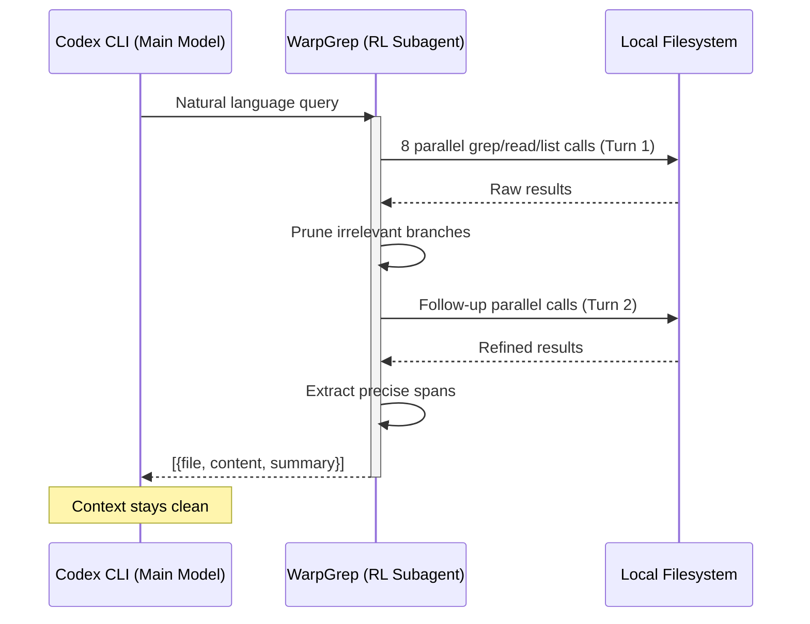

# WarpGrep and Codex CLI: Adding an RL-Trained Code Search Subagent via MCP


---

## The Search Bottleneck in Agent Workflows

Every coding agent spends a disproportionate amount of time searching. When Codex CLI tackles an unfamiliar codebase, it issues repeated `grep`, `read`, and `list` calls, each consuming context window tokens and wall-clock seconds. The main model reasons about which files to check, reads them, discards irrelevant results, and tries again. Each unsuccessful search pollutes the context with noise that degrades downstream reasoning quality [^1].

WarpGrep, built by Morph, takes a different approach: it delegates code search to a purpose-trained reinforcement-learning model that runs in an isolated context window [^2]. The main coding model never sees the search noise. It asks a natural-language question, and WarpGrep returns only the relevant `(file, [start_line, end_line])` spans. Because it ships as an MCP server, integrating it with Codex CLI is a one-line configuration change.

## How WarpGrep Works

WarpGrep is not a vector-embedding retrieval system. It is a small RL-trained language model that has learnt to operate three tools --- `grep`, `read`, and `listDir` --- in parallel across a codebase [^3]. The training reward function prioritises precision over recall: returning clean, relevant spans rather than dumping entire files into the parent agent's context.



A typical search completes in under six seconds across up to 36 tool calls spread over three turns [^4]. Compare that with the 75 seconds measured for Claude Code's Explore subagent on equivalent queries [^2].

### Key Performance Numbers

| Metric | WarpGrep v2 | Without WarpGrep |
|--------|------------|-----------------|
| SWE-bench Pro (GPT-5.3 Codex) | 59.1% | 56.0% |
| SWE-bench Pro (Opus 4.6) | 57.5% | 55.4% |
| Input tokens per task | -17% | baseline |
| Per-task cost (Opus 4.6) | \$2.51 | \$3.06 |
| Wall-clock time | -28% | baseline |
| Retrieval F1 | 0.73 | -- |

*Sources: Morph SWE-bench Pro evaluation [^2], WarpGrep v2 YC launch [^5]*

The cost reduction is counterintuitive: you are paying for an additional model call, yet the overall spend drops because the main model receives fewer irrelevant tokens and solves the task in fewer turns [^6].

## Setting Up WarpGrep as an MCP Server

WarpGrep ships as `@morphllm/morphmcp`, a stdio-transport MCP server that exposes three tools: `codebase_search` (local), `github_codebase_search` (public repos without cloning), and `edit_file` (fast partial edits, disabled by default) [^7].

### Prerequisites

1. A Morph API key from [morphllm.com/dashboard](https://morphllm.com/dashboard/api-keys) [^3]
2. [ripgrep](https://github.com/BurntSushi/ripgrep) installed locally (WarpGrep delegates pattern matching to `rg`) [^3]
3. Node.js 18+ for the `npx` transport

### Quick Install via CLI

```bash
codex mcp add morph-mcp \
  --env MORPH_API_KEY=$MORPH_API_KEY \
  -- npx -y @morphllm/morphmcp
```

This writes the server definition into `~/.codex/config.toml` automatically [^8].

### Manual Configuration

If you prefer editing TOML directly:

```toml
[mcp_servers.morph-mcp]
command = "npx"
args = ["-y", "@morphllm/morphmcp"]

[mcp_servers.morph-mcp.env]
MORPH_API_KEY = "$MORPH_API_KEY"
```

#### Optional Environment Variables

| Variable | Default | Purpose |
|----------|---------|---------|
| `WORKSPACE_MODE` | `"true"` | Auto-detects workspace root |
| `DISABLED_TOOLS` | `"edit_file"` | Comma-separated list of tools to suppress |
| `MORPH_WARP_GREP_TIMEOUT` | `30000` | Search timeout in milliseconds |
| `MORPH_API_URL` | `api.morphllm.com` | Override for enterprise proxies |

*Source: Morph MCP quickstart docs [^7]*

### Verifying the Integration

After adding the server, confirm Codex can see it:

```bash
codex mcp list
```

You should see `morph-mcp` with `codebase_search` and `github_codebase_search` in its tool inventory. In an interactive session, ask Codex to "search the codebase for the authentication middleware" and observe the WarpGrep tool call in the approval flow.

## Scoping WarpGrep to a Project

For repositories where WarpGrep is particularly valuable --- large monorepos, unfamiliar codebases during onboarding --- scope the MCP server to the project rather than installing it globally:

```toml
# .codex/config.toml (project-scoped, requires project trust)
[mcp_servers.morph-mcp]
command = "npx"
args = ["-y", "@morphllm/morphmcp"]

[mcp_servers.morph-mcp.env]
MORPH_API_KEY_CMD = "op read 'op://Dev/Morph/credential'"
```

Note the use of `MORPH_API_KEY_CMD` with a secret manager rather than a plaintext key in a committed file. Codex's `shell_environment_policy` should be configured to exclude the resolved key from the agent's shell environment [^9].

## Using WarpGrep in Subagent Definitions

WarpGrep pairs well with custom subagent definitions. Define a search-specialist agent that delegates complex codebase exploration:

```toml
# ~/.codex/agents/searcher.toml
name = "searcher"
description = "Codebase exploration specialist. Use when you need to find implementations, trace call chains, or locate configuration across a large repository."
model = "gpt-5.4-mini"
model_reasoning_effort = "low"

developer_instructions = """
You are a search specialist. Use the codebase_search tool to answer questions about code structure, locate implementations, and trace dependencies. Return precise file paths and line ranges. Do not modify any files.
"""

[mcp_servers.morph-mcp]
command = "npx"
args = ["-y", "@morphllm/morphmcp"]

[mcp_servers.morph-mcp.env]
MORPH_API_KEY = "$MORPH_API_KEY"
```

The parent agent can then delegate search tasks to this subagent, which runs in its own context window with WarpGrep --- effectively creating a two-level search isolation pattern [^10].

## WarpGrep vs SWE-grep: The RL Search Landscape

WarpGrep is not the only RL-trained search subagent. Cognition's SWE-grep, bundled with Windsurf, uses a similar multi-turn RL architecture with policy gradient training [^6]. The key differences:

| Dimension | WarpGrep v2 | SWE-grep |
|-----------|------------|----------|
| Availability | MCP server, SDK, API | Windsurf-only |
| Agent support | Codex CLI, Claude Code, Cursor, VS Code Copilot | Windsurf |
| Pricing | \$0.80/M tokens (input + output) | Bundled with Windsurf subscription |
| Speed | Sub-6s end-to-end | 2,800+ tok/s on Cerebras |
| Output format | `(file, [start, end])` spans | Full files |
| Published SWE-bench lift | +2.1 to +3.7 points | Not published |

*Source: Morph comparison page [^6]*

For Codex CLI users, WarpGrep is the practical choice because SWE-grep has no MCP server or API access outside Windsurf. If Cognition releases an open integration, the comparison may shift.

## Practical Workflow Patterns

### Pattern 1: Onboarding to an Unfamiliar Codebase

Ask Codex CLI to explain a codebase with WarpGrep available:

```
Explain the authentication flow in this repository, from login endpoint to token validation.
```

Without WarpGrep, Codex would issue serial `grep` calls, read multiple files, and potentially exhaust its context window on a large project. With WarpGrep, the search completes in a single tool call, returning only the relevant spans.

### Pattern 2: codex exec with WarpGrep for CI Triage

```bash
git log --oneline -10 | codex exec \
  --profile ci \
  "Which of these recent commits might have introduced the failing test in tests/auth/test_token_refresh.py? Search the codebase for related changes."
```

The WarpGrep MCP server is available in `codex exec` as long as the profile includes the MCP configuration [^11].

### Pattern 3: GitHub Search Without Cloning

WarpGrep's `github_codebase_search` tool searches public repositories remotely:

```
Search the openai/codex repository for how apply_patch handles multi-file operations.
```

This avoids cloning large upstream repositories when you need to understand a dependency's internals [^3].

## Cost Considerations

At \$0.80 per million tokens for both input and output, a typical WarpGrep search costs approximately \$0.003 [^4]. Across a full development day with 50-100 searches, the marginal cost is \$0.15-0.30. The net effect is typically cost-negative because the main model consumes fewer tokens per task [^2].

For teams concerned about spend, set a tool-level budget in your AGENTS.md:

```markdown
## Search Policy
- Use codebase_search for any query spanning more than 3 files
- Prefer direct file reads for known paths
- Limit GitHub searches to upstream dependency investigation
```

## Limitations

- **TypeScript SDK only**: The Morph SDK is TypeScript/Node.js. Python users must use the MCP server or raw API [^3].
- **Latency floor**: WarpGrep adds a minimum ~3-5 second roundtrip per search. For simple, known-path lookups, a direct `read` is faster [^4].
- **No private GitHub repos**: The `github_codebase_search` tool only works with public repositories. Private repo search requires local clones [^3].
- **Requires ripgrep**: WarpGrep delegates pattern matching to the locally installed `rg` binary. If ripgrep is missing, searches will fail silently or with opaque errors [^3].
- **Token-based pricing**: Unlike SWE-grep (bundled in Windsurf's subscription), WarpGrep charges per token. High-volume usage on very large codebases can accumulate costs [^6].

## Citations

[^1]: Morph, "WarpGrep - AI Codebase Search", [morphllm.com/products/warpgrep](https://www.morphllm.com/products/warpgrep)
[^2]: Morph, "WarpGrep v2 Launch", X post with SWE-bench Pro results, [x.com/morphllm/status/2028558718485541075](https://x.com/morphllm/status/2028558718485541075)
[^3]: Morph Documentation, "WarpGrep", [docs.morphllm.com/sdk/components/warp-grep](https://docs.morphllm.com/sdk/components/warp-grep)
[^4]: Morph Documentation, "WarpGrep as Subagent Tool", [docs.morphllm.com/sdk/components/warp-grep/tool](https://docs.morphllm.com/sdk/components/warp-grep/tool)
[^5]: Y Combinator, "Launch YC: WarpGrep v2: Code Search Subagent -> #1 on SWE-Bench Pro", [ycombinator.com/launches/PZx](https://www.ycombinator.com/launches/PZx-warpgrep-v2-code-search-subagent-1-on-swe-bench-pro)
[^6]: Morph, "SWE-grep vs WarpGrep (2026): RL Search Subagents Compared", [morphllm.com/comparisons/swe-grep-vs-warpgrep](https://www.morphllm.com/comparisons/swe-grep-vs-warpgrep)
[^7]: Morph Documentation, "MCP Integration Quickstart", [docs.morphllm.com/mcpquickstart](https://docs.morphllm.com/mcpquickstart)
[^8]: OpenAI, "Model Context Protocol - Codex", [developers.openai.com/codex/mcp](https://developers.openai.com/codex/mcp)
[^9]: OpenAI, "Codex CLI Secrets Defence", [developers.openai.com/codex/config-advanced](https://developers.openai.com/codex/config-advanced)
[^10]: OpenAI, "Subagents - Codex", [developers.openai.com/codex/subagents](https://developers.openai.com/codex/subagents)
[^11]: OpenAI, "Non-interactive mode - Codex", [developers.openai.com/codex/noninteractive](https://developers.openai.com/codex/noninteractive)
