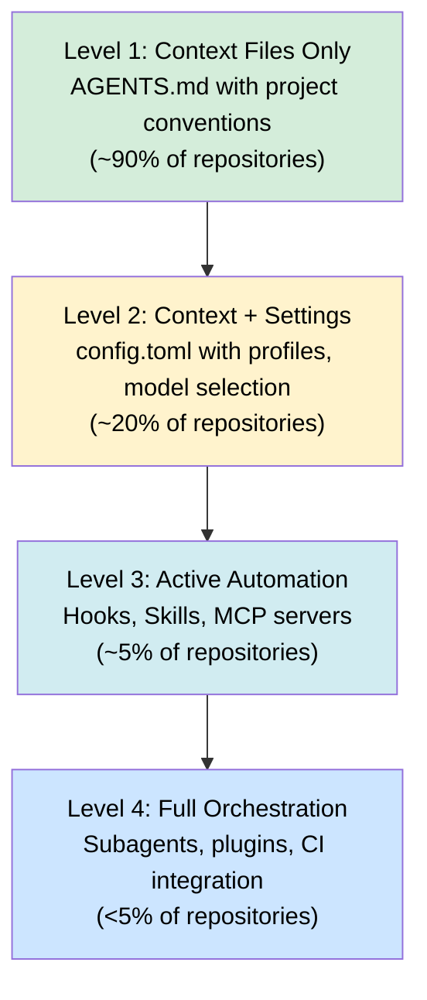

# How Developers Actually Configure Agentic Coding Tools: What 2,926 Repositories Reveal About the Codex CLI Adoption Gap


---

A new empirical study of nearly three thousand GitHub repositories has quantified something most Codex CLI practitioners have sensed intuitively: the gap between what agentic coding tools can do and what developers actually configure them to do is enormous. The paper — *Configuring Agentic AI Coding Tools: An Exploratory Study* by Galster, Mohsenimofidi, Lulla, Abubakar, Treude, and Baltes (arXiv:2602.14690) [^1] — is the first large-scale empirical baseline for agentic tool configuration practices, and it contains lessons every Codex CLI user should absorb.

## The Study at a Glance

The researchers identified eight distinct configuration mechanisms across five agentic coding tools — Claude Code, GitHub Copilot, Cursor, Gemini CLI, and Codex CLI — then analysed 2,926 GitHub repositories that met "engineered software" criteria [^1]. Their classification relied on GPT-5.2-based repository categorisation and heuristic detection of configuration artefacts.

The eight mechanisms form a spectrum from static context to executable automation:


No single tool implements all eight. Codex CLI supports Context Files (AGENTS.md), Skills, Subagents, Settings (config.toml), Hooks, and MCP Servers — six of eight — placing it amongst the most configurable options [^1].

## Three Headline Findings

### 1. Context Files Dominate Everything Else

Ninety per cent of the studied repositories contained at least one context file [^1]. The breakdown across file types reveals something striking:

| Context File | Instances | Repository Adoption |
|---|---|---|
| CLAUDE.md | 1,661 (34.2%) | 45.4% |
| AGENTS.md | 1,572 (32.3%) | 40.6% |
| copilot-instructions.md | 1,344 (27.7%) | 35.1% |
| GEMINI.md | 159 (3.3%) | — |
| .cursorrules | 73 (1.5%) | — |

AGENTS.md has emerged as the de facto interoperable standard. The most common cross-file reference pattern is CLAUDE.md → AGENTS.md, appearing in 311 repository pairs [^1]. This confirms what the OpenAI documentation recommends: treat AGENTS.md as your shared baseline and let tool-specific files extend it [^2].

### 2. Advanced Mechanisms Are Severely Underused

Here is where the adoption gap becomes stark. Across all 2,926 repositories:

- **Skills**: 601 total across just 158 repositories (5.4%), with a median of 2 per adopting repository [^1]
- **Subagents**: 452 total across 131 repositories (4.5%), median 2 per repository [^1]
- **Hooks, Commands, Settings, MCP**: Each appearing in fewer than 20% of repositories [^1]

Of the skills that do exist, 83.3% include no additional resources beyond the SKILL.md file [^1]. Only 5.7% include a `scripts/` directory with executable code, and a mere 8% include a `references/` directory [^1]. The researchers concluded that "configuration is presently used more as documentation than as automation" [^1].

### 3. Distinct Tool-Specific Cultures Are Forming

Claude Code users employ the broadest range of configuration mechanisms [^1]. Cursor repositories lean heavily on rules. Copilot repositories rarely extend beyond context files. Codex CLI repositories, despite the tool's deep configurability, show limited advanced adoption [^1].

This is not a reflection of Codex CLI's capabilities — it is a reflection of where most practitioners stop on the configuration maturity curve.

## The Codex CLI Configuration Maturity Model

Based on the research findings and current Codex CLI capabilities [^3] [^4], practitioners typically fall into one of four levels:



The research suggests most teams plateau at Level 1. The remainder of this article shows how to move deliberately through each level with Codex CLI.

## Level 1 → 2: From AGENTS.md to Configured Profiles

If your repository contains only an AGENTS.md file, you are leaving significant value on the table. A `config.toml` with named profiles immediately enables model routing, cost control, and workflow-specific behaviour [^3]:

```toml
# ~/.codex/config.toml
model = "gpt-5.5"
approval_policy = "unless-allow-listed"

[profiles.fast]
model = "codex-spark"
reasoning.effort = "low"

[profiles.deep]
model = "gpt-5.5"
reasoning.effort = "high"

[profiles.ci]
model = "gpt-5.4-mini"
approval_policy = "full-auto-with-permissions"
```

Switch profiles at launch with `codex --profile ci` or mid-session with `/profile fast` [^3]. The research found that fewer than 20% of repositories define any settings beyond defaults [^1] — meaning the vast majority of Codex users are running on stock configuration.

## Level 2 → 3: Skills and Hooks as Executable Knowledge

The finding that 83.3% of skills contain no executable resources [^1] reveals a missed opportunity. Codex CLI's skill system supports a progressive disclosure model: the agent sees only names and descriptions until it decides to invoke a skill, keeping context overhead to roughly 2% of the window [^4].

A well-structured skill for, say, database migration safety:

```
.agents/skills/
└── safe-migration/
    ├── SKILL.md
    ├── scripts/
    │   └── validate-migration.sh
    └── references/
        └── migration-checklist.md
```

```yaml
# SKILL.md
---
name: safe-migration
description: >
  Use when generating or reviewing database migration files.
  Validates backward compatibility, rollback safety, and data
  preservation. Do NOT use for seed data or test fixtures.
---

## Steps
1. Read references/migration-checklist.md for project conventions
2. Generate migration with reversible operations only
3. Run scripts/validate-migration.sh against the migration file
4. Verify rollback path exists for every schema change
```

Hooks add lifecycle automation. A `PostToolUse` hook that runs a linter after every file edit costs nothing to set up and catches issues before they compound [^5]:

```json
{
  "hooks": [
    {
      "event": "PostToolUse",
      "tools": ["write", "edit"],
      "command": "eslint --fix ${FILE_PATH} 2>/dev/null || true"
    }
  ]
}
```

## Level 3 → 4: Subagents and MCP as Force Multipliers

The research found just 131 repositories (4.5%) defining subagents [^1]. For Codex CLI, custom agent definitions in `config.toml` enable parallel workstreams with role-specific models and instructions [^6]:

```toml
[agents.reviewer]
description = "Code review specialist — focuses on correctness, security, and style"
model = "gpt-5.5"

[agents.test-writer]
description = "Test generation agent — writes integration and unit tests"
model = "gpt-5.4-mini"
```

MCP servers extend the agent's tool surface to external systems. The Codex CLI supports both `stdio` and HTTP transports [^3]:

```toml
[mcp_servers.sentry]
command = "npx"
args = ["-y", "@sentry/mcp-server"]
env = { SENTRY_AUTH_TOKEN = "..." }
```

The combination of subagents and MCP servers transforms Codex from a single-threaded assistant into an orchestrated development environment — but the research shows fewer than one in twenty repositories have reached this level [^1].

## Why the Gap Exists

The researchers identify three contributing factors [^1]:

1. **Recency**: Most agentic tool configuration mechanisms shipped in late 2025 or early 2026. The ecosystem is still learning.
2. **Documentation lag**: Advanced features are documented but lack worked examples showing the compound benefit of combining mechanisms.
3. **Perceived complexity**: Developers who are productive with Context Files alone have little immediate motivation to invest in hooks or subagents.

There is a fourth factor the paper does not address: **the configuration payoff is non-linear**. A well-configured `config.toml` saves minutes per session. Adding skills and hooks saves minutes per task. Adding subagents and MCP servers saves hours per project. The compounding effect is invisible at Level 1.

## The AGENTS.md Interoperability Play

One finding deserves special attention: AGENTS.md receives 368 incoming cross-references from other files — more than any other artefact [^1]. The most common pattern is CLAUDE.md referencing AGENTS.md (311 instances).

For multi-tool teams, this suggests a clear strategy:

1. Maintain AGENTS.md as the canonical source of project conventions
2. Use tool-specific files (CLAUDE.md, copilot-instructions.md) only for tool-specific overrides
3. Structure AGENTS.md hierarchically — root for organisation standards, subdirectories for module-specific guidance [^2]

```
repo/
├── AGENTS.md                    # Organisation conventions
├── src/
│   └── AGENTS.md                # Module-specific guidance
├── .claude/
│   └── CLAUDE.md                # Claude-specific overrides
└── .codex/
    └── config.toml              # Codex-specific settings
```

## Language-Specific Adoption Patterns

The research reveals that TypeScript repositories lead agentic tool adoption at 31.5%, followed by Python (18.7%) and Go (18.2%) [^1]. CLAUDE.md dominates across most languages, but copilot-instructions.md leads in Java, C#, and C++ repositories [^1].

For Codex CLI practitioners working in Java or enterprise stacks, this signals an opportunity: the configuration patterns that work in TypeScript and Python repositories are directly transferable, but fewer teams in enterprise language ecosystems have invested in them.

## Practical Takeaways

1. **Audit your configuration level.** Most teams are at Level 1. Moving to Level 2 (profiles + settings) takes thirty minutes and immediately improves model routing and cost management.

2. **Write executable skills, not just documentation.** The 83.3% of skills with no resources [^1] represent instructions that could be enhanced with validation scripts and reference materials.

3. **Start with one hook.** A single `PostToolUse` linter hook demonstrates the pattern and makes the case for further investment.

4. **Use AGENTS.md as your interoperable baseline.** Even if your team uses multiple tools, AGENTS.md is the convergence point [^1].

5. **Measure the gap.** Run `/debug-config` in Codex CLI to see what configuration is active. Compare against the eight mechanisms. Identify what you are leaving unused [^3].

## Study Limitations

The research analyses GitHub repositories only — enterprise and proprietary configurations are not captured [^1]. The snapshot was taken in February 2026, and the tool landscape has evolved since (v0.129 and v0.130 added compaction hooks, the `/hooks` browser, and plugin workspace sharing [^7]). Artefact presence indicates adoption but not active usage.

Despite these caveats, the data establishes a clear baseline: the agentic tool configuration ecosystem is overwhelmingly dominated by static context files, and the gap between available capabilities and actual usage represents a significant competitive advantage for teams willing to invest in deeper configuration.

---

## Citations

[^1]: Galster, M., Mohsenimofidi, S., Lulla, J.L., Abubakar, M.A., Treude, C., & Baltes, S. (2026). "Configuring Agentic AI Coding Tools: An Exploratory Study." arXiv:2602.14690. [https://arxiv.org/abs/2602.14690](https://arxiv.org/abs/2602.14690)

[^2]: OpenAI. "Custom instructions with AGENTS.md." OpenAI Developers. [https://developers.openai.com/codex/guides/agents-md](https://developers.openai.com/codex/guides/agents-md)

[^3]: OpenAI. "Configuration Reference – Codex." OpenAI Developers. [https://developers.openai.com/codex/config-reference](https://developers.openai.com/codex/config-reference)

[^4]: OpenAI. "Agent Skills – Codex." OpenAI Developers. [https://developers.openai.com/codex/skills](https://developers.openai.com/codex/skills)

[^5]: OpenAI. "Hooks – Codex." OpenAI Developers. [https://developers.openai.com/codex/hooks](https://developers.openai.com/codex/hooks)

[^6]: OpenAI. "Advanced Configuration – Codex." OpenAI Developers. [https://developers.openai.com/codex/config-advanced](https://developers.openai.com/codex/config-advanced)

[^7]: OpenAI. "Changelog – Codex." OpenAI Developers. [https://developers.openai.com/codex/changelog](https://developers.openai.com/codex/changelog)
