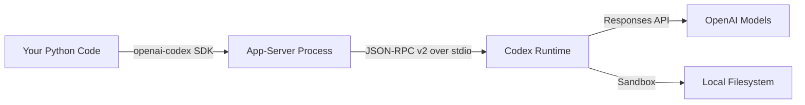
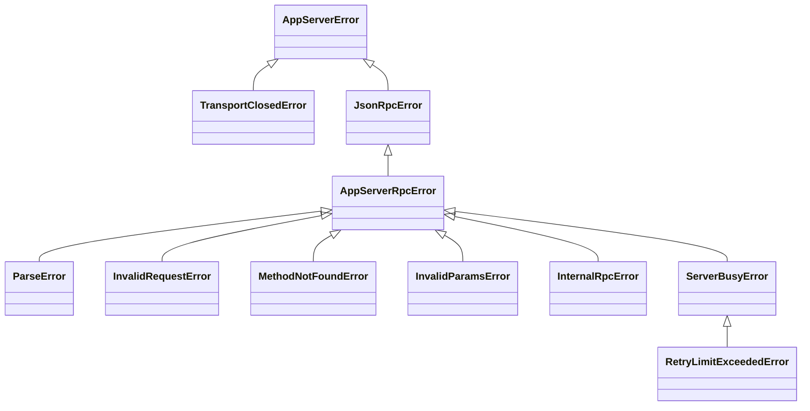

# The openai-codex Python SDK: Embedding a Programmable Agent Runtime in Your Python Applications


---

Most developers interact with Codex CLI through the TUI or `codex exec`. But a parallel effort has been landing in the `openai/codex` repository over the past week: an official **`openai-codex` Python SDK** that turns the Codex app-server into a fully programmable agent runtime you can embed in scripts, services, and orchestration platforms [^1]. The SDK reached its eighth merge commit on 12 May 2026 — renaming the package, defining the public API surface, generating types from the pinned runtime, adding approval mode controls, and wiring up an app-server integration harness [^2].

This article covers the SDK's architecture, its public API, practical patterns for embedding Codex in Python applications, and where it fits relative to `codex exec` and the MCP server surface.

## Why a Python SDK?

The `codex exec` command is excellent for one-shot pipeline tasks, but it is fundamentally a CLI tool: you compose prompts as shell strings, parse JSON Lines from stdout, and handle errors via exit codes. For anything more sophisticated — multi-turn conversations, mid-turn steering, structured output extraction, thread lifecycle management, or embedding Codex inside a larger Python service — you need a native API [^3].

The `openai-codex` package provides exactly that. It wraps the same **app-server JSON-RPC v2** protocol that powers the Codex desktop app and IDE extensions, but exposes it as a typed Python client with Pydantic models, sync and async surfaces, and first-class error handling [^1].



## Installation and Bootstrap

The SDK requires Python 3.10 or later and ships as two packages on PyPI [^1]:

- **`openai-codex`** — the client library itself
- **`openai-codex-cli-bin`** — the platform-specific Codex binary, version-locked to the SDK

```bash
pip install openai-codex
```

The runtime binary package carries the correct native binary for your platform. The SDK version and runtime version must match — the dependency is pinned exactly [^1]. At the time of writing, the latest alpha is `0.131.0a4` [^4].

For development against a local Codex build, pass an explicit binary path:

```python
from openai_codex import Codex
from openai_codex import AppServerConfig

config = AppServerConfig(codex_bin="/path/to/local/codex")
with Codex(config=config) as codex:
    ...
```

## The Public API Surface

The SDK exports a deliberately small set of classes [^1]:

| Class | Purpose |
|-------|---------|
| `Codex` | Sync client — manages the app-server lifecycle |
| `AsyncCodex` | Async mirror of `Codex` |
| `Thread` / `AsyncThread` | A single conversation session |
| `TurnHandle` / `AsyncTurnHandle` | A running turn with streaming, steering, and interrupt controls |
| `RunResult` | Collected output from a completed turn |
| `AppServerConfig` | Binary path and startup configuration |
| `ApprovalMode` | High-level approval policy (`deny_all`, `auto_review`) |

### Quickstart: One-Shot Turn

The minimal usage pattern mirrors what `codex exec` does, but from Python [^1]:

```python
from openai_codex import Codex

with Codex() as codex:
    thread = codex.thread_start(model="gpt-5.4")
    result = thread.run("Explain how the transform module works.")
    print(result.final_response)
    print(f"Tokens used: {result.usage}")
```

`Codex()` is eager: it spawns the app-server process and completes the JSON-RPC `initialize` handshake in the constructor. The context manager ensures clean shutdown [^1]. `thread.run()` is the convenience method that starts a turn, collects all streamed events, and returns a `RunResult` containing the final response text, every `ThreadItem` produced during the turn, and token usage telemetry [^5].

### Multi-Turn Conversations

Unlike `codex exec`, the SDK makes multi-turn interaction natural:

```python
from openai_codex import Codex

with Codex() as codex:
    thread = codex.thread_start(model="gpt-5.4")

    # First turn: gather context
    result = thread.run("Read src/auth.py and summarise the auth flow.")
    print(result.final_response)

    # Second turn: act on that context
    result = thread.run("Add rate limiting to the login endpoint.")
    print(f"Items produced: {len(result.items)}")
```

Each call to `thread.run()` appends to the existing conversation. The app-server maintains the full thread state, including tool call history and file edits [^3].

### Thread Lifecycle Management

The SDK exposes the full thread lifecycle [^1]:

```python
# Resume a previous session
resumed = codex.thread_resume(
    thread_id="th_abc123",
    model="gpt-5.5",
    approval_mode=ApprovalMode.auto_review,
)

# Fork from an existing session
forked = codex.thread_fork(
    thread_id="th_abc123",
    developer_instructions="Focus only on test coverage.",
)

# Archive and unarchive
codex.thread_archive("th_abc123")
codex.thread_unarchive("th_abc123")

# List threads
threads = codex.thread_list(
    search_term="auth",
    limit=10,
)

# Compact a long thread
thread.compact()
```

## Streaming and Turn Controls

For use cases that need real-time feedback — progress indicators, token-by-token rendering, or mid-turn redirection — the SDK provides `thread.turn()` instead of `thread.run()` [^1]:

```python
from openai_codex import Codex

with Codex() as codex:
    thread = codex.thread_start(model="gpt-5.4")
    turn = thread.turn("Refactor the payment module into smaller services.")

    for event in turn.stream():
        print(f"[{event.method}] {type(event.payload).__name__}")
```

The event stream yields `Notification` objects. Key event types include [^5]:

- `item/completed` — a `ThreadItem` (message, tool call, file edit) has finished
- `turn/completed` — the entire turn is done
- `token_usage/updated` — running token counts for cost tracking

### Steering and Interruption

`TurnHandle` supports two real-time controls [^1]:

```python
# Redirect the agent mid-turn (best-effort)
turn.steer("Actually, focus on the database layer first.")

# Cancel the current turn
turn.interrupt()
```

Steering is best-effort: the model may have already committed to a tool call. Interruption is immediate and terminates the turn.

## Approval Modes

Production embeddings need programmatic approval control. The SDK provides `ApprovalMode` [^6]:

```python
from openai_codex import Codex, ApprovalMode

# Deny all escalated permission requests
thread = codex.thread_start(
    approval_mode=ApprovalMode.deny_all,
    sandbox=SandboxMode.workspace_write,
)

# Let auto-review handle approvals
thread = codex.thread_start(
    approval_mode=ApprovalMode.auto_review,
)
```

`deny_all` maps to `approval_policy=never` — the agent never receives shell or network access beyond the sandbox baseline. `auto_review` delegates permission decisions to the Guardian reviewer [^6]. There is no `approve_all` mode in the SDK; granting blanket permission requires explicit CLI-level configuration, which is a deliberate safety constraint.

## Structured Output

The SDK supports JSON Schema–constrained output at the turn level [^1]:

```python
import json

schema = {
    "type": "object",
    "properties": {
        "summary": {"type": "string"},
        "risk_score": {"type": "number"},
        "files_changed": {
            "type": "array",
            "items": {"type": "string"},
        },
    },
    "required": ["summary", "risk_score", "files_changed"],
}

result = thread.run(
    "Analyse the last commit for security risks.",
    output_schema=schema,
)
report = json.loads(result.final_response)
print(f"Risk: {report['risk_score']}")
```

This is the SDK equivalent of `codex exec --output-schema`, but without the shell-quoting gymnastics [^3].

## Error Handling and Retry

The SDK defines a typed exception hierarchy rooted at `AppServerError` [^7]:



For transient overload errors, the SDK provides a `retry_on_overload` helper with exponential back-off and jitter [^7]:

```python
from openai_codex import Codex, retry_on_overload

with Codex() as codex:
    thread = codex.thread_start(model="gpt-5.4")
    result = retry_on_overload(
        lambda: thread.run("Generate the migration script."),
        max_attempts=3,
        initial_delay_s=0.25,
        max_delay_s=2.0,
    )
```

The `is_retryable_error()` function inspects JSON-RPC error data for `server_overloaded` signals, distinguishing transient load from permanent failures [^7].

## Async Parity

Every sync class has an async counterpart with identical API shape [^1]:

```python
import asyncio
from openai_codex import AsyncCodex

async def main():
    async with AsyncCodex() as codex:
        thread = await codex.thread_start(model="gpt-5.4")
        result = await thread.run("List all TODO comments in the codebase.")
        print(result.final_response)

asyncio.run(main())
```

The async client initialises lazily on context entry or first awaited API use, which avoids blocking the event loop during import [^1].

## When to Use the SDK vs. codex exec vs. MCP Server

The three programmatic surfaces serve different use cases:

| Surface | Best for | Transport | State |
|---------|----------|-----------|-------|
| `codex exec` | One-shot CI/CD tasks, shell pipelines | Shell process (stdin/stdout) | Stateless per invocation |
| `openai-codex` SDK | Multi-turn Python services, orchestration, custom UIs | JSON-RPC v2 over stdio | Full thread persistence |
| `codex mcp-server` | Multi-agent orchestration via OpenAI Agents SDK | MCP (JSON-RPC over stdio) | Thread per MCP session |

The SDK is the right choice when you need thread lifecycle control, mid-turn steering, typed error handling, or when your orchestration layer is already Python [^3]. The MCP server is better when you are composing Codex with other MCP-compatible agents via the Agents SDK [^8].

## Practical Pattern: Automated Code Review Service

Here is a more complete example combining several SDK features into an automated review pipeline:

```python
from openai_codex import AsyncCodex, ApprovalMode
from openai_codex.api import ReasoningEffort
import asyncio, json

REVIEW_SCHEMA = {
    "type": "object",
    "properties": {
        "findings": {
            "type": "array",
            "items": {
                "type": "object",
                "properties": {
                    "severity": {"type": "string", "enum": ["P0", "P1", "P2"]},
                    "file": {"type": "string"},
                    "description": {"type": "string"},
                },
                "required": ["severity", "file", "description"],
            },
        },
        "summary": {"type": "string"},
    },
    "required": ["findings", "summary"],
}

async def review_diff(diff: str) -> dict:
    async with AsyncCodex() as codex:
        thread = await codex.thread_start(
            model="gpt-5.4",
            approval_mode=ApprovalMode.deny_all,
            developer_instructions="You are a code reviewer. Focus on bugs and security.",
        )
        result = await thread.run(
            f"Review this diff and report findings:\n\n{diff}",
            effort=ReasoningEffort.high,
            output_schema=REVIEW_SCHEMA,
        )
        return json.loads(result.final_response)
```

## Current Limitations

The SDK is marked **experimental** and ships as alpha pre-releases [^1]. Several constraints apply:

- **No PyPI stable release yet** — the `0.131.0a4` alpha is the latest available version [^4]
- **stdio transport only** — the SDK spawns a local app-server process; WebSocket and Unix socket transports are not yet exposed through the Python surface [^1]
- **No approval callback** — `ApprovalMode` offers `deny_all` and `auto_review` but no programmatic approval handler where your code decides per-request [^6] ⚠️
- **Platform binary coupling** — the `openai-codex-cli-bin` package must match the SDK version exactly, and platform wheels are required for macOS (ARM64, x86_64), Linux (musl ARM64, x86_64), and Windows (ARM64, AMD64) [^4]
- **No `codex exec` feature parity** — features like `--ignore-user-config`, `--ignore-rules`, and profile selection are not yet exposed as SDK parameters ⚠️

## What Comes Next

The commit history suggests several directions [^2]:

1. **Stable release** — the eight-commit merge sequence is the kind of API surface lockdown that precedes a `1.0` or at least a non-alpha release
2. **WebSocket transport** — the app-server already supports WebSocket; the SDK client will likely gain a `ws://` transport option
3. **Richer approval callbacks** — the current `ApprovalMode` enum is explicitly described as "high-level"; a lower-level callback API would enable programmatic per-request decisions
4. **TypeScript SDK** — a `sdk/typescript` directory already exists in the repository [^9]

## Citations

[^1]: OpenAI, "openai-codex Python SDK README," `sdk/python/README.md`, openai/codex repository, May 2026. [https://github.com/openai/codex/blob/main/sdk/python/README.md](https://github.com/openai/codex/blob/main/sdk/python/README.md)

[^2]: OpenAI, Codex repository commit history, "[1/8] Pin Python SDK runtime dependency" through "[8/8] Add Python SDK Ruff formatting," merged May 2026. [https://github.com/openai/codex/commits/main](https://github.com/openai/codex/commits/main)

[^3]: OpenAI, "Non-interactive mode — Codex," OpenAI Developers, May 2026. [https://developers.openai.com/codex/noninteractive](https://developers.openai.com/codex/noninteractive)

[^4]: OpenAI, `pyproject.toml` for openai-codex, `sdk/python/pyproject.toml`, version `0.131.0a4`. [https://github.com/openai/codex/blob/main/sdk/python/pyproject.toml](https://github.com/openai/codex/blob/main/sdk/python/pyproject.toml)

[^5]: OpenAI, `_run.py` — RunResult and event collection, `sdk/python/src/openai_codex/_run.py`. [https://github.com/openai/codex/blob/main/sdk/python/src/openai_codex/_run.py](https://github.com/openai/codex/blob/main/sdk/python/src/openai_codex/_run.py)

[^6]: OpenAI, `api.py` — ApprovalMode enum and approval settings, `sdk/python/src/openai_codex/api.py`. [https://github.com/openai/codex/blob/main/sdk/python/src/openai_codex/api.py](https://github.com/openai/codex/blob/main/sdk/python/src/openai_codex/api.py)

[^7]: OpenAI, `errors.py` and `retry.py` — exception hierarchy and retry_on_overload, `sdk/python/src/openai_codex/`. [https://github.com/openai/codex/blob/main/sdk/python/src/openai_codex/errors.py](https://github.com/openai/codex/blob/main/sdk/python/src/openai_codex/errors.py)

[^8]: OpenAI, "Use Codex with the Agents SDK," OpenAI Developers, May 2026. [https://developers.openai.com/codex/guides/agents-sdk](https://developers.openai.com/codex/guides/agents-sdk)

[^9]: OpenAI, Codex repository directory listing, `sdk/typescript/`. [https://github.com/openai/codex/tree/main/sdk/typescript](https://github.com/openai/codex/tree/main/sdk/typescript)
