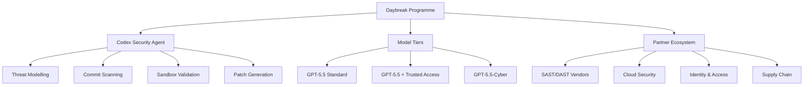
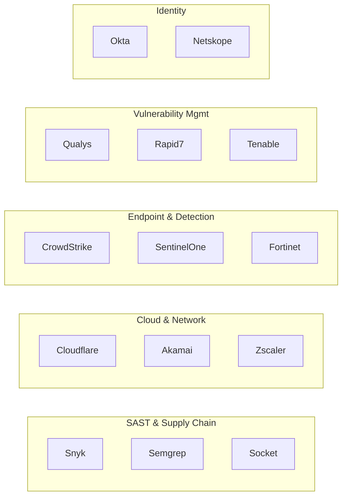

# OpenAI Daybreak and Codex Security: From Developer Tool to Enterprise Cyber Defence Platform


---

On 11 May 2026, OpenAI announced **Daybreak**, an umbrella cybersecurity initiative that bundles frontier AI models, the Codex Security application-security agent, and a partner network of over twenty security companies into a single programme aimed at embedding vulnerability detection and remediation directly into the software development lifecycle[^1]. For Codex CLI practitioners who already use the tool for day-to-day coding, Daybreak reshapes the security surface from an afterthought into an integrated loop.

This article unpacks what Daybreak is, how its components relate to each other, what the three-tier model architecture looks like, and — most importantly — how CLI-native workflows fit into the picture.

---

## What Daybreak Actually Is

Daybreak is not a product you install. It is a **programme** that ties together three layers:

1. **Codex Security** — the application-security agent that scans connected GitHub repositories, builds codebase-specific threat models, validates findings in isolated environments, and proposes patches for human review[^2].
2. **Frontier model tiers** — three variants of GPT-5.5 with progressively relaxed cyber-safety classifiers, each gated behind different verification requirements[^3].
3. **A partner ecosystem** — Cloudflare, Cisco, CrowdStrike, Palo Alto Networks, Oracle, Zscaler, Akamai, Fortinet, Intel, Qualys, Rapid7, Tenable, Trail of Bits, SpecterOps, SentinelOne, Okta, Netskope, Snyk, Gen Digital, Semgrep, and Socket[^1].

The stated goal is to shift vulnerability discovery and remediation **left** — into the development loop rather than after deployment — while giving enterprise security teams a single pane of glass backed by an agentic workflow.



---

## The Three-Stage Codex Security Pipeline

Codex Security operates through a three-stage pipeline that runs against connected GitHub repositories[^2][^4]:

### Stage 1 — Threat Modelling

When Codex Security connects to a repository, it builds a **codebase-specific threat model** capturing attacker entry points, trust boundaries, sensitive data paths, and high-impact code regions[^5]. Teams can refine this model through the Codex Security web interface, and the documentation explicitly recommends editing the threat model as a first step when scan findings seem misaligned with actual risk[^5].

A well-written threat model should document:

- Entry points and untrusted inputs
- Trust boundaries and authentication assumptions
- Sensitive data paths and privileged actions
- Priority review areas the team cares about most

### Stage 2 — Scanning and Validation

Subsequent scans review repository history commit-by-commit, building contextual understanding from the codebase[^4]. High-confidence findings are then **validated in isolated sandbox environments** before being surfaced — the auto-validation step attempts to reproduce suspected issues, and only successfully reproduced findings are marked as validated[^4]. This validation loop is critical: it directly reduces false-positive noise that plagues traditional SAST tools.

### Stage 3 — Remediation

For validated findings, Codex Security generates **concrete patches** with file locations and line context[^4]. These are not auto-applied; teams review them and raise pull requests manually. The output includes criticality rankings, validation status, and supporting evidence for each finding.

---

## The Three-Tier Model Architecture

Daybreak formalises OpenAI's tiered approach to cyber-capable models[^3][^6]:

| Tier | Model | Access | Use Case |
|------|-------|--------|----------|
| **Standard** | GPT-5.5 | All paid users | General development with baseline safety classifiers |
| **Trusted Access** | GPT-5.5 + Trusted Access for Cyber | Identity-verified defenders | Secure code review, vulnerability triage, malware analysis, patch validation |
| **Specialist** | GPT-5.5-Cyber | Invite-only programme | Red teaming, penetration testing, controlled validation with stronger verification |

The standard tier applies classifier-based monitors that detect suspicious cyber activity signals and reroute high-risk traffic to GPT-5.2 as a fallback[^3]. OpenAI states that the expected traffic impact from these mitigations is minimal for legitimate defensive work.

Individual access to the Trusted Access tier requires identity verification at `chatgpt.com/cyber`[^3]. Enterprise access is provisioned through OpenAI account representatives. The specialist GPT-5.5-Cyber tier remains invite-only for qualified security researchers.

---

## How Daybreak Relates to the CLI

Codex Security itself runs as a **cloud-hosted agent** accessed through the Codex web interface — it scans connected GitHub repositories and surfaces findings in a dashboard[^2]. There is no `codex security scan` CLI subcommand.

However, Codex CLI practitioners interact with the Daybreak ecosystem at three integration points:

### 1. Remediation via `codex exec`

When Codex Security surfaces validated findings, the natural remediation path for CLI users is `codex exec`. The OpenAI Cookbook documents a pattern for security-aware CI pipelines where `codex exec --full-auto` processes SAST scanner output and generates patches[^7]:

```bash
# Triage Codex Security findings with codex exec
codex exec --full-auto \
  "Read the Codex Security findings in findings.json. \
   For each VALIDATED finding, generate a unified diff patch. \
   Print ONLY between these markers: \
   === BEGIN_SECURITY_PATCH === \
   ... \
   === END_SECURITY_PATCH ==="
```

The marker-based extraction pattern ensures reliable parsing in CI environments[^7].

### 2. Cyber-Safety Classifier Interaction

CLI sessions using GPT-5.3-Codex or GPT-5.5 are subject to the same cyber-safety classifiers that gate Daybreak access[^3]. If a CLI prompt triggers the classifier — for example, asking Codex to analyse a binary or explain an exploit path — the request may be rerouted to a less capable model. Users who encounter false positives can report them via the `/feedback` command in the TUI[^3].

For teams with Trusted Access, configuring a dedicated profile in `config.toml` ensures the correct model tier is used for security work:

```toml
[profiles.security-audit]
model = "gpt-5.5"
reasoning_effort = "high"

[profiles.security-audit.sandbox]
permissions = ":read-only"
```

### 3. AGENTS.md Security Conventions

Codex Security's threat model output can inform the `AGENTS.md` file in your repository, creating a bridge between the cloud scanner's understanding and the CLI agent's behaviour:

```markdown
# Security Context

## Trust Boundaries
- All input from `/api/v2/` endpoints is untrusted
- Internal service-to-service calls use mTLS — treat as trusted
- File uploads are processed in an isolated worker pool

## Priority Review Areas
- Authentication middleware in `src/auth/`
- Payment processing in `src/billing/`
- File upload parsing in `src/uploads/`

## Codex Security Scan Policy
- All VALIDATED findings with criticality >= HIGH must be patched before merge
- Unvalidated findings require manual triage
```

---

## The Partner Ecosystem in Practice

The twenty-plus Daybreak partners span four categories relevant to Codex CLI workflows[^1]:



For CLI practitioners, the most immediately actionable integrations are with **Snyk**, **Semgrep**, and **Socket** — tools that already have MCP servers or CLI-native interfaces. A practical pattern is to run these scanners in CI, pipe their output to `codex exec` for triage and patch generation, and feed the results back into Codex Security's threat model for continuous refinement.

---

## Performance Track Record

OpenAI reports that since its research preview launch, Codex Security has contributed to fixing more than **3,000 critical and high-severity vulnerabilities** across the ecosystem[^8]. Over a 30-day measurement window, the agent scanned more than 1.2 million commits, identifying 792 critical findings, with false-positive rates falling by more than 50% across all scanned repositories[^9].

The predecessor agent, **Aardvark**, shipped as a research preview on 6 March 2026 and focused on automated vulnerability hunting[^9]. Codex Security builds on Aardvark's architecture but adds the threat-modelling and validation stages that distinguish it from a conventional scanner.

---

## Competitive Context

Daybreak arrives two weeks after Anthropic's **Project Glasswing**, which counts Apple, Microsoft, Google, and Amazon as adopters[^8]. The two programmes share a similar thesis — that frontier models can materially improve defensive security — but differ in execution:

| Dimension | Daybreak | Project Glasswing |
|-----------|----------|-------------------|
| Agent harness | Codex Security (GitHub-integrated) | Claude Code |
| Model gating | Three-tier (Standard / Trusted / Cyber) | ⚠️ Details not fully public |
| Partner count | 20+ named partners | 4 named adopters |
| Validation | Sandbox auto-validation before surfacing | ⚠️ Not documented publicly |

---

## Practical Takeaways for CLI Users

1. **Connect your repositories to Codex Security** if you have Pro, Enterprise, Business, or Edu access. The threat model it generates is a valuable input even if you primarily work through the CLI.

2. **Wire scan findings into `codex exec` remediation pipelines** using the marker-based extraction pattern from the OpenAI Cookbook. This closes the loop between cloud-side scanning and local-side patching.

3. **Verify your Trusted Access tier** if your work involves security-sensitive code. False-positive rerouting from the cyber-safety classifier can disrupt vulnerability analysis workflows. Register at `chatgpt.com/cyber` for individual access.

4. **Update your AGENTS.md** with security context derived from Codex Security's threat model. This ensures the CLI agent respects the same trust boundaries the scanner identified.

5. **Watch the partner integrations** — as Snyk, Semgrep, and Socket MCP servers mature, expect tighter bidirectional data flow between Daybreak findings and CLI-side remediation.

---

## Current Limitations

- Codex Security scans are **GitHub-only** — GitLab, Bitbucket, and self-hosted Git are not yet supported[^2].
- Initial scans can take **hours to days** depending on repository size and build complexity[^4].
- The tool is **language-agnostic** but effectiveness varies by language and framework[^4].
- Codex Security **does not replace** code-level validation, exploitability checks, or human threat assessment[^4].
- Daybreak partner integrations are **not yet live** as bidirectional data flows — the current model is side-by-side rather than embedded[^1].
- Broader Daybreak deployment with industry and government partners is planned for coming weeks; availability is currently limited to organisations that contact OpenAI sales[^1].

---

## Citations

[^1]: OpenAI, "Daybreak | OpenAI for cybersecurity," openai.com/daybreak/, 11 May 2026.
[^2]: OpenAI Developers, "Security — Codex," developers.openai.com/codex/security, accessed 12 May 2026.
[^3]: OpenAI Developers, "Cyber Safety — Codex," developers.openai.com/codex/concepts/cyber-safety, accessed 12 May 2026.
[^4]: OpenAI Developers, "FAQ — Codex Security," developers.openai.com/codex/security/faq, accessed 12 May 2026.
[^5]: OpenAI Developers, "Improving the threat model — Codex Security," developers.openai.com/codex/security/threat-model, accessed 12 May 2026.
[^6]: OpenAI, "Trusted access for the next era of cyber defense," openai.com/index/scaling-trusted-access-for-cyber-defense/, accessed 12 May 2026.
[^7]: OpenAI Cookbook, "Automating Code Quality and Security Fixes with Codex CLI on GitLab," developers.openai.com/cookbook/examples/codex/secure_quality_gitlab, accessed 12 May 2026.
[^8]: MacRumors, "OpenAI's New Daybreak Platform Uses GPT-5.5 to Find Software Vulnerabilities," macrumors.com, 11 May 2026.
[^9]: OpenAI, "Codex Security: now in research preview," openai.com/index/codex-security-now-in-research-preview/, March 2026.
