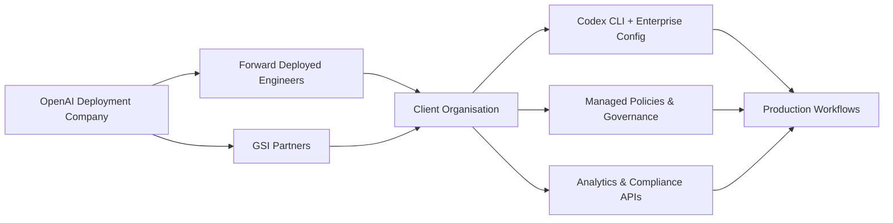
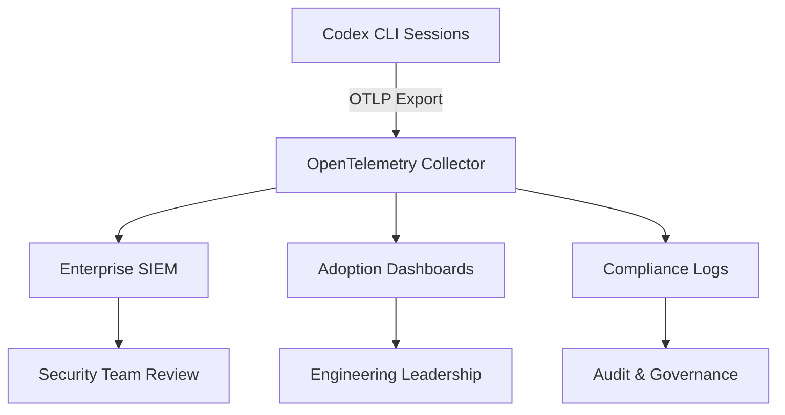

# The OpenAI Deployment Company: What \$4 Billion and 150 Forward Deployed Engineers Mean for Codex CLI in the Enterprise


---

On 11 May 2026, OpenAI announced the **OpenAI Deployment Company** — a majority-owned subsidiary backed by more than \$4 billion in initial capital from 19 investment firms, consultancies, and system integrators[^1]. Hours later, it confirmed the acquisition of **Tomoro**, a UK-based applied-AI engineering firm, absorbing roughly 150 Forward Deployed Engineers (FDEs) and deployment specialists[^2]. The same day, OpenAI published *Running Codex Safely at OpenAI*, a detailed account of how its own engineering organisation deploys Codex internally[^3].

These three announcements are a single strategic move. OpenAI is no longer content to ship a CLI and let enterprises figure the rest out. It is building the deployment scaffolding — human and technical — to embed Codex directly into enterprise workflows. This article examines what that means for Codex CLI practitioners.

## The Deployment Company Structure

The OpenAI Deployment Company is led by TPG as founding partner, with Advent, Bain Capital, and Brookfield as co-leads[^1]. Additional backers include Goldman Sachs, SoftBank Corp., Warburg Pincus, BBVA, and Emergence Capital[^4]. OpenAI retains majority ownership and control.

The model borrows explicitly from Palantir's playbook: rather than selling software licences and walking away, FDEs embed inside client organisations, connect models to legacy systems, and redesign workflows around operational realities[^5]. The Tomoro acquisition provides instant staffing — engineers who have already shipped production AI systems for Tesco, Virgin Atlantic, Mattel, Red Bull, and Supercell[^2].



## Why This Matters for Codex CLI

The Deployment Company does not exist in isolation. It arrives alongside a maturing enterprise feature set in Codex CLI itself. Consider the timeline:

| Date | Event |
|------|-------|
| February 2026 | OpenAI partners with McKinsey, BCG, Accenture, Capgemini for Frontier Alliances[^6] |
| April 2026 | Codex Labs programme launches — OpenAI engineers embedded in enterprise workshops[^7] |
| April 2026 | Codex surpasses 4 million weekly active users[^7] |
| May 8, 2026 | Codex CLI v0.130.0 ships with enterprise features: Bedrock auth, plugin discoverability controls, thread pagination[^8] |
| May 11, 2026 | *Running Codex Safely at OpenAI* published[^3] |
| May 11, 2026 | OpenAI Deployment Company announced, Tomoro acquired[^1][^2] |

The pattern is clear: OpenAI is building concentric rings of enterprise support around Codex CLI, moving from documentation to partnerships to embedded engineering teams.

## The FDE Model Applied to Codex

The Forward Deployed Engineer role has grown 800% in job postings between January and September 2025[^9]. OpenAI's version focuses on three activities:

### 1. Workflow Discovery

FDEs identify where Codex fits within an organisation's existing SDLC. This is not a generic consulting engagement — it requires understanding the specific repository structures, CI/CD pipelines, compliance requirements, and team dynamics that determine whether a `codex exec` pipeline will succeed or create noise.

### 2. Configuration Engineering

OpenAI's own internal deployment demonstrates what enterprise-grade Codex configuration looks like[^3]:

```toml
# Enterprise managed configuration example
# Cloud-managed requirements enforce organisation-wide policies

[approval]
# Pin approval policy to prevent individual override
approval_policy = "unless-allow-listed"

[sandbox]
# Restrict writable paths to workspace only
writable_roots = ["."]

[network]
# Block network access by default, require explicit approval
network_access = "off-by-default"
```

The *Running Codex Safely* blog reveals that OpenAI uses a layered approach[^3]:

- **Cloud-managed requirements** enforce organisation-wide policies that individual developers cannot override
- **macOS managed preferences** apply platform-specific constraints
- **Local requirements files** allow team-level customisation within the bounds set above
- **Starlark rules** distinguish benign shell commands from dangerous ones, allowing `ls` and `cat` without approval whilst blocking `rm -rf` or `curl | bash`

### 3. Observability Integration

OpenAI's internal deployment exports OpenTelemetry logs for every significant Codex event[^3]:

- User prompts and model responses
- Tool approval decisions (allowed, prompted, denied)
- Tool execution results
- MCP server usage patterns
- Network sandbox allow/deny events

These logs feed dashboards that track adoption velocity, tool usage patterns, sandbox friction points, and rollout coverage. For enterprises adopting Codex CLI, the FDE's job is to connect this telemetry to existing observability stacks — Grafana, Datadog, Splunk, or whatever the organisation already runs.



## The GSI Layer

The Deployment Company does not replace OpenAI's existing Global Systems Integrator partnerships. Accenture, Capgemini, CGI, Cognizant, Infosys, PwC, and TCS remain active partners for scaling Codex deployments[^7]. The relationship is complementary:

- **FDEs** handle high-complexity, high-stakes deployments where deep model expertise matters
- **GSI partners** handle breadth — rolling Codex out across thousands of developers within large organisations
- **Codex Labs** provides the initial assessment and workshop layer

⚠️ *The competitive dynamics between FDEs and GSI consultants remain unclear. Traditional consultancies previously positioned themselves as vendor-neutral integrators; the Deployment Company's Palantir-style embedded model may create tension with those relationships.*

## What This Means for Codex CLI Configuration

For practitioners, the Deployment Company signals that enterprise Codex CLI configuration is becoming a first-class discipline. OpenAI's own internal patterns suggest a maturity ladder:

### Level 1: Individual Developer

```toml
# ~/.codex/config.toml
model = "gpt-5.5"
approval_policy = "suggest"
```

Standard personal configuration. No governance constraints.

### Level 2: Team-Managed

```toml
# .codex/config.toml (repository-scoped)
model = "gpt-5.5"
approval_policy = "unless-allow-listed"

[sandbox]
writable_roots = ["."]
```

Repository-level configuration enforces team standards. AGENTS.md captures coding conventions.

### Level 3: Organisation-Managed

Cloud-managed requirements set floors that cannot be overridden locally[^3]. The enterprise governance APIs provide Analytics dashboards, programmatic Analytics API access, and Compliance API exports for audit trails[^10]. This is the layer where FDEs add the most value — bridging the gap between what the configuration system *can* do and what the organisation *needs* it to do.

### Level 4: Deployment Company Embedded

FDEs from the Deployment Company or a GSI partner are embedded within the engineering organisation. They maintain the managed configuration, tune Starlark rules based on telemetry data, manage the AGENTS.md hierarchy across monorepos, and operate the observability pipeline. Codex CLI becomes infrastructure rather than tooling.

## The Palantir Parallel — and Its Limits

The comparison to Palantir's Forward Deployed Engineer model is instructive but imperfect[^5]. Palantir's FDEs build bespoke data platforms; OpenAI's FDEs configure and integrate a product that already exists. The value proposition is different:

| Dimension | Palantir FDE | OpenAI FDE |
|-----------|-------------|------------|
| Primary deliverable | Custom platform | Configured product |
| Time to value | Months | Weeks |
| Lock-in mechanism | Platform dependency | Workflow integration |
| Scaling model | Linear (more FDEs) | Leveraged (FDE trains internal team) |

The risk for enterprises is the same in both cases: dependency on the vendor's embedded team for ongoing operation. OpenAI's mitigation — open-source CLI, documented configuration system, exportable telemetry — is stronger than Palantir's historically closed approach, but the dependency concern is legitimate.

## Practical Implications

If you are evaluating Codex CLI for enterprise deployment, the Deployment Company changes the calculation in several ways:

1. **Configuration support is now available** — organisations struggling with Starlark rules, managed configuration hierarchies, or multi-provider setups can engage FDEs directly
2. **The governance stack is production-ready** — OpenAI's own internal deployment proves the governance APIs, compliance logging, and managed configuration work at scale[^3]
3. **The GSI channel is mature** — seven major consultancies can staff Codex rollouts, with the Deployment Company handling the hardest cases
4. **Enterprise revenue pressure is real** — enterprise now makes up more than 40% of OpenAI's revenue[^11], which means enterprise feature requests will increasingly shape Codex CLI's roadmap

For individual practitioners, the most immediate takeaway is that the configuration patterns documented in *Running Codex Safely at OpenAI* represent OpenAI's own best practice. If you are setting up Codex CLI for a team, that blog post is now the authoritative reference for production configuration[^3].

## Citations

[^1]: OpenAI. "OpenAI launches the OpenAI Deployment Company to help businesses build around intelligence." *openai.com*, 11 May 2026. [https://openai.com/index/openai-launches-the-deployment-company/](https://openai.com/index/openai-launches-the-deployment-company/)

[^2]: Tomoro. "Tomoro Acquired By OpenAI Deployment Company." *tomoro.ai*, 11 May 2026. [https://tomoro.ai/insights/tomoro-acquired-by-openai-deployment-company](https://tomoro.ai/insights/tomoro-acquired-by-openai-deployment-company)

[^3]: OpenAI. "Running Codex safely at OpenAI." *openai.com*, 11 May 2026. [https://openai.com/index/running-codex-safely/](https://openai.com/index/running-codex-safely/)

[^4]: PYMNTS. "OpenAI Launches \$4 Billion Company to Accelerate Enterprise AI Adoption." *pymnts.com*, 12 May 2026. [https://www.pymnts.com/news/artificial-intelligence/2026/openai-launches-4-billion-dollar-company-accelerate-enterprise-ai-adoption/](https://www.pymnts.com/news/artificial-intelligence/2026/openai-launches-4-billion-dollar-company-accelerate-enterprise-ai-adoption/)

[^5]: Gigged.AI. "The Forward Deployed Engineer: 2026's Hottest Job Title." *gigged.ai*, 2026. [https://gigged.ai/the-forward-deployed-engineer-2026s-hottest-job-title/](https://gigged.ai/the-forward-deployed-engineer-2026s-hottest-job-title/)

[^6]: Fortune. "OpenAI partners with McKinsey, BCG, Accenture, and Capgemini to push its Frontier AI agent platform." *fortune.com*, 23 February 2026. [https://fortune.com/2026/02/23/openai-partners-with-mckinsey-bcg-accenture-and-capgemini-to-push-its-frontier-ai-agent-platform/](https://fortune.com/2026/02/23/openai-partners-with-mckinsey-bcg-accenture-and-capgemini-to-push-its-frontier-ai-agent-platform/)

[^7]: OpenAI. "Scaling Codex to enterprises worldwide." *openai.com*, April 2026. [https://openai.com/index/scaling-codex-to-enterprises-worldwide/](https://openai.com/index/scaling-codex-to-enterprises-worldwide/)

[^8]: OpenAI. "Changelog — Codex." *developers.openai.com*, 8 May 2026. [https://developers.openai.com/codex/changelog](https://developers.openai.com/codex/changelog)

[^9]: Financial Times / Indeed, cited in Gigged.AI. FDE job postings rose 800% between January and September 2025. [https://gigged.ai/the-forward-deployed-engineer-2026s-hottest-job-title/](https://gigged.ai/the-forward-deployed-engineer-2026s-hottest-job-title/)

[^10]: OpenAI. "Governance — Codex." *developers.openai.com*. [https://developers.openai.com/codex/enterprise/governance](https://developers.openai.com/codex/enterprise/governance)

[^11]: CNBC. "OpenAI revenue chief Dresser says enterprise AI adoption is 'at a tipping point'." *cnbc.com*, 11 May 2026. [https://www.cnbc.com/2026/05/11/open-ai-dresser-enterprise-business.html](https://www.cnbc.com/2026/05/11/open-ai-dresser-enterprise-business.html)
