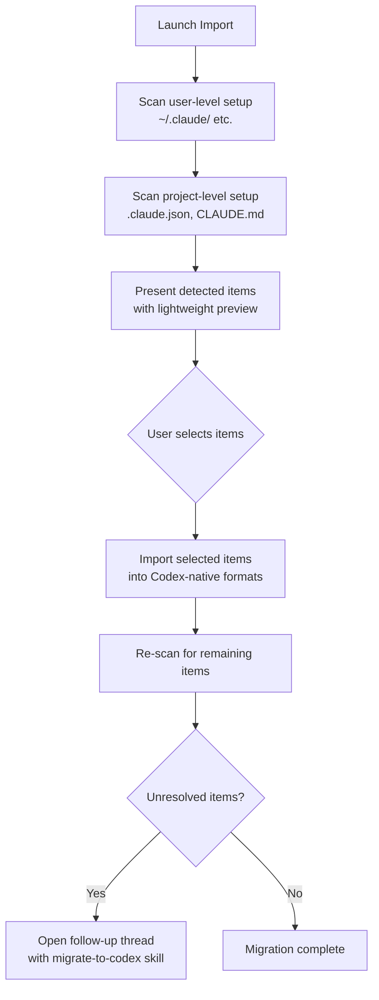

# The Codex CLI Agent Migration System: Importing Sessions, Skills, and Configuration from Claude Code and Other Agents


---

Switching between coding agents used to mean starting from scratch — rebuilding your instruction files, reconfiguring MCP servers, and losing weeks of session history. With versions 0.128.0 through 0.130.0, Codex CLI introduced a native agent migration system that detects and imports configuration, skills, hooks, MCP servers, subagents, and even recent sessions from external agents [^1]. This article walks through the architecture, the import pipeline, and the practical considerations for teams moving from Claude Code to Codex CLI without losing their operational investment.

## What the Migration System Imports

The import surface covers eight categories, each with a defined mapping from the source agent's conventions into Codex-native formats [^2]:

| Source Setup | Codex Destination | Notes |
|---|---|---|
| Instruction files (`CLAUDE.md`) | `AGENTS.md` | Terminology rewritten; operational rules preserved |
| `settings.json` | `config.toml` | Key-value mapping with TOML schema validation |
| Skills / slash commands | `.agents/skills/` | Folder-based `SKILL.md` packages |
| Recent sessions (last 30 days) | Codex threads/projects | JSONL import with compaction for oversized transcripts |
| MCP server configuration | `[mcp_servers.*]` in `config.toml` | stdio and HTTP transports; disabled servers excluded |
| Hooks | `.codex/hooks/` | Command hooks only; conditional groups and async handlers skipped |
| Slash commands | Codex skills | Commands with runtime expansion (`$ARGUMENTS`, `@file`) skipped |
| Subagents | `.codex/agents/*.toml` | Model names not migrated; sandbox modes transferred when compatible |

## How Detection Works

The migration system operates in three phases: detection, import, and follow-up [^2].



Detection scans both user-level files (machine-wide configuration in `~/.claude/`) and project-level files (repository-scoped `.claude.json` and `CLAUDE.md`) [^2]. The preview is deliberately lightweight — MCP server names, hook event names, generated skill names — so the UI remains responsive even with large configurations. The actual import recomputes everything from disk rather than trusting the preview data [^3].

## Session Import: The Headline Feature

The most significant addition in v0.128.0–0.130.0 is session history import [^1]. Codex scans the external agent's session directory for JSONL files from the past 30 days and reconstructs them as Codex rollout entries.

### Compaction for Large Sessions

Imported sessions often exceed the context window that Codex models can consume in a single turn. The import pipeline seeds token usage metadata into the reconstructed rollout, enabling auto-compaction on the first follow-up interaction [^4]. This means you can resume an imported Claude Code session with a follow-up prompt and Codex will intelligently compress the prior transcript rather than failing with a context overflow.

### Background Processing

Session imports run asynchronously after the initial API response returns [^5]. This avoids blocking the UI while large session histories are processed. Imports are serialised to prevent duplicate threads when multiple import requests arrive concurrently. A completion notification fires when background processing finishes.

### Title Preservation

Codex respects `ai-title` and `aiTitle` records from Claude Code sessions, falling back to `custom-title` and `customTitle` when present [^6]. Imported threads appear in the Codex session picker with recognisable names rather than opaque IDs.

## The migrate-to-codex Skill

For items that lack a direct one-to-one mapping, Codex opens a follow-up thread powered by the curated `migrate-to-codex` skill [^7]. This skill operates autonomously once a target is selected, working through a defined conversion order:

1. **Instructions** — `CLAUDE.md` merged into `AGENTS.md` with Codex terminology
2. **Plugins** — flagged for manual review
3. **Hooks** — converted to `.codex/hooks.json` (command hooks only)
4. **Skills and commands** — written to `.agents/skills/`
5. **Configuration** — `.codex/config.toml` populated from settings and MCP servers
6. **Subagents** — `.codex/agents/*.toml` with compatible fields transferred

The skill supports inspection flags before committing changes [^7]:

```bash
# Preview what would be detected
codex --skill migrate-to-codex -- --scan-only

# Show staged artifact paths and report rows
codex --skill migrate-to-codex -- --plan

# Check readiness and validation risks
codex --skill migrate-to-codex -- --doctor

# Dry-run the full migration
codex --skill migrate-to-codex -- --dry-run
```

After migration, a markdown report summarises every artefact with one of three statuses: `Added`, `Check before using`, or `Not Added` [^7].

## What Gets Skipped (and Why)

The migration system is deliberately conservative. It skips unsupported or ambiguous configuration rather than partially translating it into behaviour that may not match the source system [^3]. Specifically:

- **Conditional hook groups** — Codex hooks lack Claude Code's conditional dispatch model
- **Async and HTTP hooks** — only synchronous command hooks transfer
- **Runtime expansion in commands** — `$ARGUMENTS`, `$1`, `@file` references, and shell interpolation cannot be statically converted to `SKILL.md` packages
- **Source model names** — Claude Code model references (e.g. `claude-3.5-sonnet`) are dropped; users keep their configured Codex default
- **Disabled MCP servers** — servers filtered by `enabledMcpjsonServers` or `disabledMcpjsonServers` are excluded
- **Prompt templates with placeholders** — templates relying on Claude Code's argument interpolation need manual rewriting

## Practical Migration Strategy

The Blake Crosley migration guide captures a principle worth internalising: *port operating contracts, not file trees* [^8]. Rather than copying directories wholesale, map each Claude artefact to its Codex equivalent by functional purpose.

### Configuration Profiles

Claude Code's model and permission settings become Codex profiles in `config.toml`:

```toml
[profiles.careful-review]
model = "gpt-5.5"
model_reasoning_effort = "xhigh"
sandbox_mode = "workspace-write"
approval_policy = "on-request"
web_search = "live"
```

### Skills Migration (Staged)

The recommended approach is staged rollout rather than bulk import [^8]:

1. Copy or symlink one skill into `$HOME/.agents/skills`
2. Restart Codex and confirm it appears in `codex --list-skills`
3. Mark the skill as explicit-only during pilot (`$skill-name` invocation)
4. Move remaining skills only after discovery works reliably
5. Keep old paths until existing sessions stop depending on them

### MCP Server Configuration

MCP servers migrate into `config.toml` sections. Verify authentication and custom transports manually — the import captures the server definition but cannot validate credentials [^2]:

```toml
[mcp_servers.browser-automation]
command = "npx"
args = ["-y", "@anthropic/mcp-browser"]
enabled_tools = ["screenshot", "navigate"]
```

### Hooks: Narrow Scope

Only migrate deterministic checks [^8]. A sensible starting set:

| Event | Purpose |
|---|---|
| `SessionStart` | Inject date context and currentness reminders |
| `PreToolUse:Bash` | Block destructive commands and credential reads |
| `PostToolUse:apply_patch` | Shadow quality telemetry on patches |
| `Stop` | Refuse completion without required verification proof |

## Third-Party Migration Tools

The community has built several tools around this workflow:

- **ccode-to-codex** — semantic mapping that classifies migration risk as `MECHANICAL`, `MANUAL`, or `REFACTOR` for each artefact [^9]
- **cc2codex** — unofficial migration assistant focusing on session and skill transfer [^10]
- **sync-claude-skills-to-codex** — symlink-based approach for teams running both agents simultaneously [^11]

⚠️ These are community tools, not maintained by OpenAI. Validate their output before deploying to production workflows.

## Current Limitations

The migration system is functional but still evolving:

- **App-only import UI** — the Settings > General > Import flow is available in the Codex app; the CLI exposes migration through the `migrate-to-codex` skill rather than a dedicated `codex import` subcommand [^2]
- **Claude Code focus** — whilst the architecture is agent-agnostic, the session detection and configuration parsing is most mature for Claude Code. Cursor, Aider, and Gemini CLI support varies [^3]
- **No bidirectional sync** — importing is one-way; changes made in Codex do not propagate back to Claude Code
- **Hook fidelity** — Claude Code's richer hook model (conditional groups, async handlers) has no Codex equivalent, so complex hook chains need manual redesign
- **Path validation concern** — background session imports use the original path rather than the canonicalised path, creating a theoretical window for symlink substitution [^5]

## Who Should Migrate Now

If your team has invested heavily in Claude Code skills, hooks, and AGENTS.md conventions, the migration system reduces the switching cost from weeks to hours. The session import alone — preserving 30 days of context and making it resumable in Codex — removes the most painful friction point. For teams running both agents in parallel, the staged skill migration approach lets you validate equivalence before committing.

For teams with minimal Claude Code customisation, a fresh Codex setup following the [configuration guide](https://developers.openai.com/codex/config-basic) may be simpler than importing a sparse configuration.

---

## Citations

[^1]: OpenAI, "Changelog – Codex", [https://developers.openai.com/codex/changelog](https://developers.openai.com/codex/changelog) — v0.128.0–0.130.0 external agent session import entries.

[^2]: OpenAI, "Migrate to Codex", [https://developers.openai.com/codex/migrate](https://developers.openai.com/codex/migrate) — official migration guide covering import table, detection phases, and manual review items.

[^3]: stefanstokic-oai, "Support detect and import MCP, Subagents, hooks, commands from external", PR #19949, [https://github.com/openai/codex/pull/19949](https://github.com/openai/codex/pull/19949) — `codex-external-agent-migration` crate implementation details and conservative skip policy.

[^4]: stefanstokic-oai, "External agent session support", PR #19895, [https://github.com/openai/codex/pull/19895](https://github.com/openai/codex/pull/19895) — session detection, compaction handling, and token usage seeding for imported rollouts.

[^5]: alexsong-oai, "Import external agent sessions in background", PR #20284, [https://github.com/openai/codex/pull/20284](https://github.com/openai/codex/pull/20284) — background import, serialised deduplication, and path validation concern.

[^6]: alexsong-oai, "Consume ai-title from external sessions and add end marker", PR #20261, [https://github.com/openai/codex/pull/20261](https://github.com/openai/codex/pull/20261) — title preservation from Claude Code session metadata.

[^7]: OpenAI, "migrate-to-codex SKILL.md", [https://github.com/openai/skills/blob/main/skills/.curated/migrate-to-codex/SKILL.md](https://github.com/openai/skills/blob/main/skills/.curated/migrate-to-codex/SKILL.md) — curated migration skill with scan-only, plan, doctor, and dry-run modes.

[^8]: Blake Crosley, "Claude Code to Codex Migration Guide 2026", [https://blakecrosley.com/blog/claude-code-to-codex-migration](https://blakecrosley.com/blog/claude-code-to-codex-migration) — practical staged migration strategy, profile configuration, and hook scope recommendations.

[^9]: zuharz, "ccode-to-codex", [https://github.com/zuharz/ccode-to-codex](https://github.com/zuharz/ccode-to-codex) — semantic mapping with MECHANICAL/MANUAL/REFACTOR risk classification.

[^10]: ussumant, "cc2codex", [https://github.com/ussumant/cc2codex](https://github.com/ussumant/cc2codex) — unofficial migration assistant for Claude Code to Codex CLI.

[^11]: ariccb, "sync-claude-skills-to-codex", [https://github.com/ariccb/sync-claude-skills-to-codex](https://github.com/ariccb/sync-claude-skills-to-codex) — symlink-based skill sharing for dual-agent workflows.
