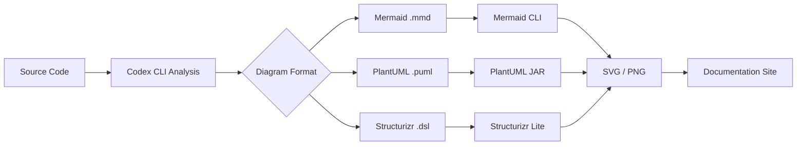
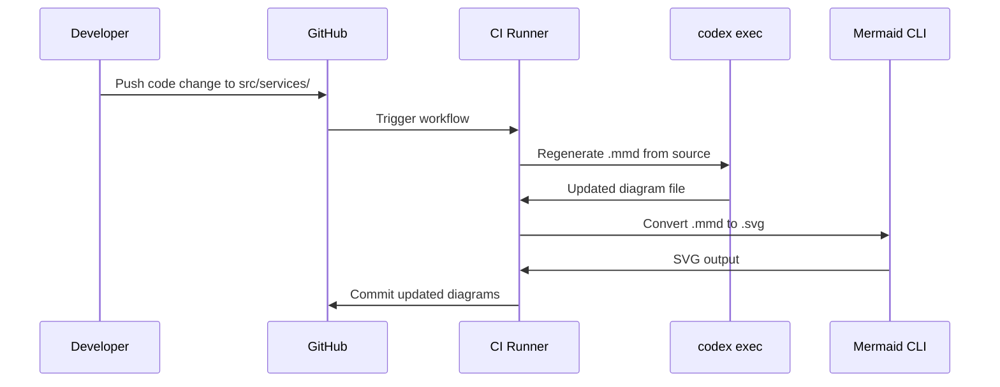

# Codex CLI for Generating Architecture Diagrams from Source Code: Mermaid, C4, and PlantUML Visualisation Workflows


---

Architecture diagrams lie. Not because anyone deliberately drew them wrong, but because code moves faster than documentation. A team refactors a service boundary, adds a new queue, or renames an internal API — and the Mermaid diagram in the wiki quietly becomes fiction. By May 2026, the tooling exists to close that gap: Codex CLI can read your source code, infer architectural relationships, and emit diagram-as-code artefacts in Mermaid, PlantUML, or Structurizr DSL format — then keep them current through CI pipelines and `codex exec` automation[^1][^2].

This article covers the end-to-end workflow: AGENTS.md conventions for diagram generation, interactive TUI sessions for exploratory architecture mapping, `codex exec` pipelines for automated diagram refresh, C4 model generation from repository analysis, and PostToolUse hooks for diagram validation.

## Why Diagram-as-Code Matters for Agent Workflows

Three properties make text-based diagrams ideal for agent-driven generation:

1. **Git-diffable** — Mermaid, PlantUML, and Structurizr DSL files are plain text, so architecture changes appear in pull request diffs alongside the code changes that caused them[^3].
2. **LLM-native syntax** — models trained on millions of Markdown files have seen Mermaid syntax extensively; GPT-5.5 and GPT-5.4 generate syntactically valid Mermaid diagrams with high reliability[^4].
3. **Renderable in CI** — the Mermaid CLI (`@mermaid-js/mermaid-cli`), PlantUML JAR, and Kroki API all accept text input and produce SVG or PNG output without a browser[^5].



## AGENTS.md Conventions for Diagram Generation

The single highest-leverage step is encoding diagram conventions in your `AGENTS.md` file. Without explicit constraints, the model will produce diagrams that are technically correct but stylistically inconsistent — mixing flowchart directions, using arbitrary node IDs, or omitting important subsystems[^6].

```markdown
## Architecture Diagrams

When generating architecture diagrams:

- Use Mermaid for inline documentation (README, ADRs, PR descriptions)
- Use PlantUML or Structurizr DSL for formal architecture documentation in `/docs/architecture/`
- Always use `flowchart TD` (top-down) for system overviews, `sequenceDiagram` for API flows
- Node IDs must match service names from `docker-compose.yml` or Kubernetes manifests
- Include external dependencies (databases, queues, third-party APIs) as cylinder or cloud shapes
- Add `%%` comments linking each node to the source file that defines the service entry point
- Re-generate diagrams when files in `/src/services/`, `/infrastructure/`, or `/api/` change
```

This convention block gives the agent enough structure to produce consistent output while leaving room for the model to discover the actual architecture from code[^6].

## Interactive Architecture Mapping

The most natural starting point is an interactive TUI session where you ask Codex CLI to analyse your codebase and produce a system-level diagram:

```bash
codex "Analyse the repository structure, identify all services and their
dependencies, then generate a Mermaid flowchart showing the system
architecture. Save it to docs/architecture/system-overview.mmd"
```

For larger codebases, decompose the task across diagram levels — mirroring the C4 model's four-layer approach[^7]:

| C4 Level | Codex CLI Prompt Pattern | Output Format |
|---|---|---|
| **Context** | "Map all external actors and systems this application interacts with" | Mermaid `flowchart` |
| **Container** | "Identify all deployable units (services, databases, queues) and their communication protocols" | Mermaid `flowchart` or PlantUML |
| **Component** | "For the `order-service`, map all internal modules and their dependencies" | Mermaid `classDiagram` or `flowchart` |
| **Code** | "Generate a class diagram for the `payment` package showing public interfaces" | Mermaid `classDiagram` |

### Model Selection for Diagram Tasks

Diagram generation benefits from strong architectural reasoning. GPT-5.5 produces the most accurate system-level diagrams due to its superior planning and multi-step reasoning capabilities[^4]. For component-level diagrams from a single service, GPT-5.4 or even Codex-Spark delivers adequate results at lower cost[^8].

```toml
# config.toml — model routing for diagram tasks
[model]
default = "gpt-5.4"

# Use GPT-5.5 for architecture-level analysis
# Switch with: /model gpt-5.5
```

## Automated Diagram Generation with codex exec

Interactive sessions produce initial diagrams. Keeping them current requires automation. The `codex exec` non-interactive mode integrates diagram generation into CI/CD pipelines[^1]:

### Single-Diagram Generation

```bash
codex exec \
  --sandbox workspace-write \
  "Analyse the repository structure and regenerate
   docs/architecture/system-overview.mmd as a Mermaid flowchart.
   Include all services from src/services/ and their database
   and message queue dependencies."
```

### Structured Output with Schema Validation

For pipelines that need machine-readable metadata alongside diagrams, use `--output-schema`[^1]:

```json
{
  "type": "object",
  "properties": {
    "diagram_path": { "type": "string" },
    "format": { "enum": ["mermaid", "plantuml", "structurizr"] },
    "services_detected": { "type": "integer" },
    "external_dependencies": {
      "type": "array",
      "items": { "type": "string" }
    },
    "staleness_risk": {
      "type": "string",
      "enum": ["low", "medium", "high"]
    }
  },
  "required": ["diagram_path", "format", "services_detected"]
}
```

```bash
codex exec \
  --output-schema ./diagram-schema.json \
  -o ./diagram-report.json \
  "Regenerate the system architecture diagram and report metadata"
```

### Multi-Diagram Batch Generation

For repositories with multiple services, use subagent fan-out to generate diagrams in parallel[^9]:

```bash
# Generate a diagram for each service directory
for svc in src/services/*/; do
  svc_name=$(basename "$svc")
  codex exec \
    --sandbox workspace-write \
    "Generate a Mermaid component diagram for the ${svc_name} service
     at ${svc}. Save to docs/architecture/components/${svc_name}.mmd" &
done
wait
```

## C4 Model Generation with Skills and MCP

### The LikeC4 Agent Skill

The community `likec4` skill by @schup provides a structured workflow for generating interactive C4 architecture diagrams from source code analysis[^10]. It outputs Structurizr DSL that can be rendered locally:

```bash
# Install the skill
codex install skill schup/likec4

# Generate C4 diagrams
codex "Use the likec4 skill to generate a complete C4 model
       for this repository, including context, container,
       and component diagrams"
```

### C4-PlantUML with Rendering

For teams that prefer PlantUML's richer UML vocabulary, the C4-PlantUML library provides C4-specific macros[^11]:

```plantuml
@startuml
!include https://raw.githubusercontent.com/plantuml-stdlib/C4-PlantUML/master/C4_Container.puml

Person(user, "Developer", "Writes and reviews code")
System_Boundary(codex_system, "Codex CLI") {
    Container(cli, "CLI Binary", "Rust", "Terminal interface")
    Container(agent_loop, "Agent Loop", "Rust", "Orchestrates tool calls")
    Container(sandbox, "Sandbox", "Landlock/Seatbelt", "Isolates file system access")
}
System_Ext(openai_api, "OpenAI API", "Responses API endpoint")

Rel(user, cli, "Runs prompts")
Rel(cli, agent_loop, "Dispatches tasks")
Rel(agent_loop, sandbox, "Executes tools within")
Rel(agent_loop, openai_api, "Sends requests")
@enduml
```

The agent can generate this syntax by analysing import graphs, service registrations, and infrastructure-as-code files. The key AGENTS.md constraint is specifying which C4 level to target — without it, the model defaults to context-level diagrams that lack actionable detail[^7].

### Structurizr DSL for Model-Based Consistency

Structurizr DSL enforces the C4 model's rules at the syntax level — you cannot create a component diagram without first defining the parent container[^12]. This makes it ideal for agent-generated diagrams because syntax errors immediately signal structural mistakes:

```
workspace {
    model {
        user = person "Developer"
        codex = softwareSystem "Codex CLI" {
            cli = container "CLI Binary" "Rust" "Terminal interface"
            agentLoop = container "Agent Loop" "Rust" "Orchestrates tool calls"
            sandbox = container "Sandbox" "Landlock/Seatbelt" "Isolates FS access"
        }
        openai = softwareSystem "OpenAI API" "Responses API"

        user -> cli "Runs prompts"
        cli -> agentLoop "Dispatches tasks"
        agentLoop -> sandbox "Executes tools within"
        agentLoop -> openai "Sends requests"
    }
    views {
        container codex {
            include *
            autolayout lr
        }
    }
}
```

The Structurizr MCP server (available on SkillsLLM) exposes workspace management tools that let the agent query and update architecture models programmatically[^13].

## PostToolUse Hooks for Diagram Validation

Generated diagrams can contain syntax errors that render correctly in some tools but fail in others. A PostToolUse hook catches these before they reach version control[^14]:

```toml
# config.toml
[[hooks]]
event = "PostToolUse"
type = "command"
command = """
if echo "$CODEX_TOOL_ARGS" | grep -q '\.mmd"'; then
  FILE=$(echo "$CODEX_TOOL_ARGS" | grep -oP '[^"]*\.mmd')
  if [ -f "$FILE" ]; then
    npx @mermaid-js/mermaid-cli -i "$FILE" -o /dev/null 2>&1 || \
      echo '{"status":"deny","reason":"Mermaid syntax error in '$FILE'"}'
  fi
fi
"""
```

This hook intercepts any file write that produces a `.mmd` file and validates it through the Mermaid CLI. If the syntax is invalid, the tool call is denied and the agent receives feedback to fix the diagram[^14].

For PlantUML validation:

```bash
java -jar plantuml.jar -checkonly "$FILE" 2>&1
```

## CI/CD Integration: Diagrams That Update Themselves

The most powerful pattern combines `codex exec` with CI triggers to regenerate diagrams whenever architectural code changes[^2][^5]:


```yaml
# .github/workflows/update-diagrams.yml
name: Update Architecture Diagrams
on:
  push:
    paths:
      - 'src/services/**'
      - 'infrastructure/**'
      - 'docker-compose.yml'
      - 'k8s/**'

jobs:
  regenerate:
    runs-on: ubuntu-latest
    steps:
      - uses: actions/checkout@v4
      - uses: openai/setup-codex@v1

      - name: Regenerate system diagram
        run: |
          codex exec \
            --sandbox workspace-write \
            --ignore-user-config \
            "Regenerate docs/architecture/system-overview.mmd based on
             the current service structure. Preserve existing node
             styling and comments."
        env:
          OPENAI_API_KEY: ${{ secrets.OPENAI_API_KEY }}

      - name: Render to SVG
        run: npx @mermaid-js/mermaid-cli -i docs/architecture/system-overview.mmd -o docs/architecture/system-overview.svg

      - name: Commit if changed
        run: |
          git diff --quiet docs/architecture/ || \
          (git add docs/architecture/ && \
           git commit -m "docs: regenerate architecture diagrams" && \
           git push)
```




## Sequence Diagrams from API Contracts

One particularly effective pattern is generating sequence diagrams from OpenAPI specifications or gRPC protobuf definitions[^15]:

```bash
codex exec \
  --sandbox workspace-write \
  "Read the OpenAPI spec at api/openapi.yaml and generate Mermaid
   sequence diagrams for every endpoint that involves more than
   two services. Save each diagram to docs/architecture/sequences/"
```

The model traces request flows through API gateway definitions, service-to-service calls defined in the spec, and database interactions inferred from response schemas. The output captures the actual documented contract rather than guessing from implementation code.

## Practical Recommendations

1. **Start with Mermaid** — it renders natively in GitHub, GitLab, and most documentation tools without extra infrastructure. Graduate to Structurizr DSL only when you need model-level consistency enforcement across multiple C4 levels[^3][^12].

2. **Pin diagram scope in AGENTS.md** — without constraints, the agent will produce sprawling diagrams that try to capture everything. Specify which directories map to which C4 levels and which external systems to include.

3. **Use `codex exec` for refresh, TUI for discovery** — interactive sessions are ideal for initial architecture mapping of an unfamiliar codebase. Once the diagram structure stabilises, switch to automated `codex exec` pipelines for maintenance.

4. **Validate before committing** — PostToolUse hooks or CI-stage validation prevents syntactically broken diagrams from reaching the documentation site.

5. **Version diagrams alongside code** — store `.mmd`, `.puml`, or `.dsl` files in the same repository as the code they describe. This makes architectural drift visible in code review.

6. **Model routing matters** — use GPT-5.5 for system-context and container-level diagrams where architectural reasoning is critical. Use GPT-5.4 or Codex-Spark for component-level and class diagrams where the scope is smaller[^4][^8].

## Current Limitations

- **No runtime analysis** — Codex CLI analyses static source code and configuration files. It cannot observe actual runtime communication patterns, message flows, or database query patterns. Diagrams reflect the designed architecture, not necessarily the deployed one.
- **Large codebase context limits** — for repositories exceeding the context window, the agent must analyse services individually and compose the overall diagram from partial views. The `codex exec resume` pattern helps but adds complexity[^1].
- **Mermaid rendering inconsistencies** — Mermaid syntax that renders correctly on GitHub may fail in the CLI renderer or vice versa. The PostToolUse validation hook mitigates this but does not eliminate it.
- **C4 level ambiguity** — without explicit AGENTS.md guidance, the model often conflates container and component levels, producing diagrams that mix abstraction layers[^7].

## Citations

[^1]: OpenAI, "Non-interactive mode — Codex," May 2026. [https://developers.openai.com/codex/noninteractive](https://developers.openai.com/codex/noninteractive)
[^2]: Cosmo Edge, "Automate Technical Diagrams with LLMs using Mermaid, PlantUML and CI/CD," 2026. [https://cosmo-edge.com/automate-technical-diagrams-llm-mermaid-plantuml-cicd/](https://cosmo-edge.com/automate-technical-diagrams-llm-mermaid-plantuml-cicd/)
[^3]: Mermaid, "Mermaid — Diagramming and charting tool," 2026. [https://mermaid.js.org/](https://mermaid.js.org/)
[^4]: OpenAI, "Models — Codex," May 2026. [https://developers.openai.com/codex/models](https://developers.openai.com/codex/models)
[^5]: Kroki, "Kroki — Creates diagrams from textual descriptions," 2026. [https://kroki.io/](https://kroki.io/)
[^6]: OpenAI, "AGENTS.md — Codex," May 2026. [https://developers.openai.com/codex/agents-md](https://developers.openai.com/codex/agents-md)
[^7]: Simon Brown, "The C4 model for visualising software architecture," 2026. [https://c4model.com/](https://c4model.com/)
[^8]: OpenAI, "Codex Changelog — Codex-Spark research preview," May 2026. [https://developers.openai.com/codex/changelog](https://developers.openai.com/codex/changelog)
[^9]: OpenAI, "Subagents — Codex," May 2026. [https://developers.openai.com/codex/subagents](https://developers.openai.com/codex/subagents)
[^10]: SkillsMP, "likec4 — Agent Skill by schup," 2026. [https://skillsmp.com/skills/schup-likec4-skill-skill-md](https://skillsmp.com/skills/schup-likec4-skill-skill-md)
[^11]: GitHub, "C4-PlantUML — PlantUML C4 Model macros," 2026. [https://github.com/plantuml-stdlib/C4-PlantUML](https://github.com/plantuml-stdlib/C4-PlantUML)
[^12]: Structurizr, "DSL — Structurizr," 2026. [https://docs.structurizr.com/dsl](https://docs.structurizr.com/dsl)
[^13]: SkillsLLM, "Structurizr MCP Server," 2026. [https://skillsllm.com/skill/structurizr](https://skillsllm.com/skill/structurizr)
[^14]: OpenAI, "Hooks — Codex," May 2026. [https://developers.openai.com/codex/hooks](https://developers.openai.com/codex/hooks)
[^15]: OpenAI, "Best practices — Codex," May 2026. [https://developers.openai.com/codex/learn/best-practices](https://developers.openai.com/codex/learn/best-practices)
