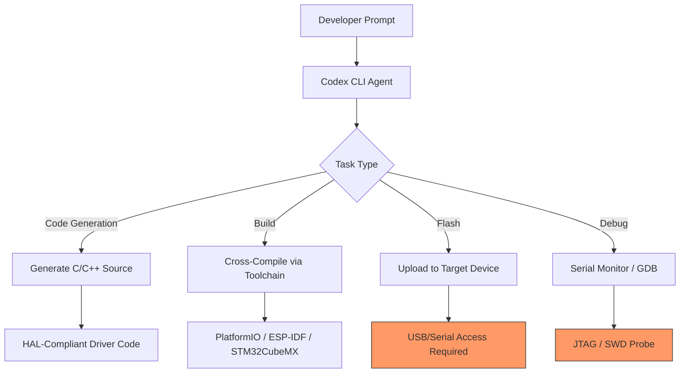
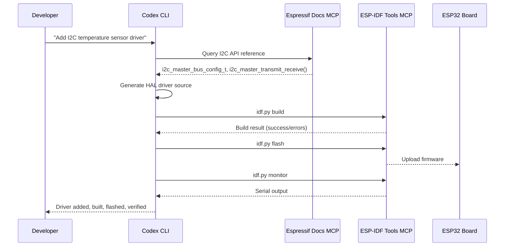

# Codex CLI for Embedded and IoT Development: Firmware Generation, Cross-Compilation, and Hardware-Aware Agent Workflows


---

Embedded systems development has traditionally resisted the agentic coding wave. The reasons are well-understood: cross-compilation toolchains sprawl across host and target architectures, register-level programming demands hardware-specific knowledge that general-purpose models lack, and the sandbox constraints of coding agents sit uneasily with toolchains that probe USB devices, flash firmware, and manipulate kernel modules. Yet in May 2026, the landscape is shifting. Espressif has shipped two purpose-built MCP servers for ESP-IDF[^1][^2], an AI-generated Linux kernel driver has reached the LKML for review[^3], and the Codex CLI's sandbox and configuration surface has matured enough to accommodate embedded workflows with careful setup.

This article examines how to configure Codex CLI for embedded and IoT projects — from AGENTS.md conventions for register-level C through MCP server integration for build-flash-monitor cycles, to the sandbox trade-offs that embedded teams must navigate.

## Why Embedded Development Needs Different Agent Conventions

A web application is forgiving: the model can run `npm test`, observe failures, and iterate. Firmware development offers no such luxury. A malformed register write can brick hardware. An incorrect clock configuration produces silent failures that surface hours later as intermittent timing faults. The agent needs guardrails that are stricter than those for application code but relaxed in specific directions — notably, access to cross-compilation toolchains and serial ports.



The orange nodes represent operations that require sandbox relaxation — a fundamental tension in embedded agent workflows.

## AGENTS.md Conventions for Embedded Projects

The single most impactful configuration for embedded Codex CLI sessions is a well-structured `AGENTS.md` that encodes hardware constraints the model cannot infer from code alone[^4]. A minimal embedded `AGENTS.md` should cover five areas:

```markdown
# AGENTS.md — Firmware Project Conventions

## Target Hardware
- MCU: ESP32-S3 (Xtensa LX7, dual-core, 240 MHz)
- Flash: 16 MB QD, PSRAM: 8 MB OPI
- Framework: ESP-IDF v6.0 via PlatformIO

## Build and Flash
- Build: `pio run -e esp32s3`
- Flash: `pio run -e esp32s3 -t upload`
- Monitor: `pio device monitor -b 115200`
- Clean: `pio run -e esp32s3 -t clean`

## Code Conventions
- All peripheral access through HAL layer in `components/hal/`
- Direct register manipulation prohibited in application code
- Volatile qualifiers required on all hardware register pointers
- ISR routines must be in IRAM — use `IRAM_ATTR` attribute
- No heap allocation in ISR context
- Maximum ISR execution time: 10 µs

## Constraints
- Do NOT modify `sdkconfig.defaults` without explicit approval
- Do NOT change partition table unless instructed
- All GPIO assignments defined in `include/pinout.h` — single source of truth
- Clock configuration locked in `components/board/clock_config.c`

## Done When
- Code compiles with zero warnings under `-Wall -Werror`
- Static analysis passes: `pio check -e esp32s3`
- Unit tests pass: `pio test -e native`
```

The `Constraints` section is critical. Without it, the model will cheerfully reorganise pin assignments, modify clock trees, or alter partition tables — changes that compile successfully but produce hardware failures the agent cannot detect[^5].

## Espressif MCP Servers: Documentation and Tooling

Espressif has released two MCP servers that transform Codex CLI into a hardware-aware development environment[^1][^2]:

### Documentation MCP Server

The hosted documentation server provides the agent with access to ESP-IDF API references, hardware technical reference manuals, and application notes. Setup is a single command[^1]:

```bash
codex mcp add espressif-docs --url "https://mcp.espressif.com/docs"
```

This gives the agent the ability to look up register definitions, peripheral driver APIs, and configuration options without requiring the developer to paste datasheet excerpts into the prompt.

### ESP-IDF Tools MCP Server

The local tools server, introduced in ESP-IDF v6.0, exposes project actions — setting targets, building, flashing, and monitoring — through a stdio-based MCP interface[^2]. It runs as part of `idf.py` and connects to any MCP-capable client:

```toml
# ~/.codex/config.toml
[mcp_servers.esp-idf-tools]
command = "idf.py"
args = ["mcp-server"]
```

Together, the two servers form a complete loop: the agent queries the documentation server for hardware reference, generates or modifies source code, then invokes the tools server to build, flash, and verify the result[^2].



## PlatformIO as the Build Orchestrator

For teams not exclusively targeting Espressif silicon, PlatformIO provides a unified build system across 1,400+ boards from STM32, Nordic, Atmel, and Teensy families[^6]. The key advantage for Codex CLI integration is that PlatformIO normalises the build-flash-monitor cycle into consistent commands regardless of the target:

```bash
# Build for any configured environment
pio run -e <environment>

# Flash to connected board
pio run -e <environment> -t upload

# Run native unit tests (on host, no hardware needed)
pio test -e native

# Static analysis
pio check -e <environment>
```

This consistency means AGENTS.md conventions transfer across hardware platforms without modification of the command surface. A Codex CLI skill for embedded development can reference `pio run` and `pio test` without knowing whether the target is an ESP32-S3 or an STM32H7.

## Sandbox Configuration for Cross-Compilation

The default Codex CLI sandbox blocks network access and restricts filesystem writes to the workspace[^7]. Cross-compilation toolchains require read access to paths outside the workspace:

| Path | Purpose |
|------|---------|
| `~/.platformio/` | PlatformIO packages, toolchains, and platform definitions |
| `~/.espressif/` | ESP-IDF toolchains when installed directly |
| `/usr/local/bin/arm-none-eabi-*` | ARM GCC cross-compiler |
| `/dev/ttyUSB*` or `/dev/cu.*` | Serial port access for flashing |

For the filesystem paths, the `--add-dir` flag grants read access[^8]:

```bash
codex --add-dir ~/.platformio --add-dir ~/.espressif
```

Serial port access requires a more significant relaxation. Flashing firmware demands write access to device nodes, which falls outside the sandbox boundary entirely. Two practical approaches exist:

1. **Approval-gated flashing**: Keep the default sandbox and approve flash commands individually. This is the safest option and works well for iterative development where flashing happens infrequently.

2. **Dedicated flash skill**: Create a skill that wraps the flash command in an explicit approval boundary, documenting the risk:

```markdown
---
name: flash-firmware
description: Flash firmware to connected board via PlatformIO. Requires serial port access.
---

## Steps
1. Confirm the build succeeded with zero warnings
2. Verify the target environment matches the connected board
3. Execute: `pio run -e {environment} -t upload`
4. Capture and report serial monitor output for 5 seconds

## Approval Required
This skill writes to hardware via serial port. Always prompt for approval.
```

⚠️ Running Codex CLI with `--full-auto` or `danger-full-access` sandbox mode in embedded projects is strongly discouraged. A model-initiated flash with incorrect firmware can brick development boards or, worse, connected production hardware.

## The prom21-xhci Precedent: AI-Generated Kernel Drivers

In May 2026, a Linux kernel driver for AMD Promontory 21 chipset temperature monitoring reached the Linux Kernel Mailing List, generated with assistance from OpenAI's Codex and GPT-5.5[^3]. The `prom21-xhci` driver provides `hwmon` thermal sensors for the xHCI controller's built-in temperature monitoring — a feature previously undocumented in public datasheets.

This submission demonstrates both the potential and the limits of AI-assisted embedded development:

**What worked**: The model correctly identified the PCI configuration space registers for temperature readout, implemented the `hwmon` sysfs interface following kernel conventions, and produced code that compiled against the mainline kernel tree.

**What required human expertise**: The driver needed manual verification against physical hardware, review of PCI register access patterns for correctness, and adjustment to follow the LKML's coding style preferences — all areas where the model's output required domain-expert oversight[^3].

For Codex CLI practitioners, the lesson is clear: the agent excels at generating boilerplate-heavy driver scaffolding and implementing well-documented peripheral interfaces. It struggles with undocumented hardware behaviour, timing-critical register sequences, and the social conventions of upstream submission.

## Embedded-Specific Workflow Patterns

### Pattern 1: Datasheet-Driven Driver Generation

```bash
# Provide the agent with datasheet context via image attachment
codex -i datasheet_page_42.png \
  "Implement a HAL driver for the SPI peripheral described in this
   register map. Follow the project's HAL conventions in components/hal/.
   Include initialisation, transmit, receive, and interrupt handler functions."
```

The `-i` flag attaches datasheet pages as images, allowing the model to read register maps, bit field definitions, and timing diagrams directly[^9].

### Pattern 2: Native Test-First Development

Embedded projects benefit enormously from test-first workflows because hardware feedback loops are slow. PlatformIO's `native` test environment runs on the host machine, allowing Codex to iterate without touching hardware:

```bash
codex exec "Write unit tests for the BMP280 pressure sensor driver in
  test/test_bmp280/. Mock the I2C HAL layer. Then implement the driver
  in components/sensors/bmp280.c until all tests pass.
  Do NOT modify existing test files." \
  --approval-mode full-auto
```

This leverages `codex exec` in full-auto mode safely because the native test environment never accesses hardware[^10].

### Pattern 3: Peripheral Configuration Auditing

```bash
codex exec "Audit sdkconfig.defaults against the pinout.h GPIO assignments.
  Report any conflicts where two peripherals claim the same pin.
  Output as JSON with fields: pin, peripheral_a, peripheral_b, conflict_type." \
  --output-schema pin-conflicts-schema.json
```

The `--output-schema` flag produces structured output suitable for CI integration, catching configuration drift before it reaches hardware[^10].

## Comparison with Specialised Embedded AI Tools

Several purpose-built tools have emerged alongside general-purpose coding agents[^11][^12]:

| Capability | Codex CLI | Embedder | PleaseDontCode |
|-----------|-----------|----------|----------------|
| **Model flexibility** | Any OpenAI model + custom providers | Proprietary | Proprietary |
| **Board support** | Via PlatformIO (1,400+) | ~30 families | ~100 boards |
| **Register-level generation** | Via datasheet images + MCP | Native register map understanding | No |
| **Build integration** | PlatformIO / ESP-IDF MCP | Built-in | Cloud compiler |
| **Sandbox isolation** | OS-level (Landlock/Seatbelt) | None documented | Cloud-based |
| **OTA deployment** | No | No | Yes (POTA) |
| **Customisable conventions** | AGENTS.md + skills + hooks | Limited | No |

Codex CLI's advantage is composability: it integrates with existing toolchains rather than replacing them. Its disadvantage is that it requires explicit configuration for embedded workflows that specialised tools handle out of the box.

## Current Limitations

Several constraints remain for embedded development with Codex CLI as of May 2026:

- **No direct hardware access from sandbox**: USB, JTAG, and SWD probes cannot be accessed without sandbox relaxation. ⚠️ There is no way to safely auto-approve hardware write operations.
- **No real-time debugging**: GDB sessions over JTAG require interactive terminal control that `codex exec` cannot provide.
- **Limited RTOS awareness**: The model understands FreeRTOS task creation patterns but frequently generates code with priority inversion risks or incorrect mutex usage in ISR context.
- **Datasheet image parsing**: While the model can read register maps from images, complex timing diagrams and state machines in datasheets are frequently misinterpreted.
- **No simulation integration**: QEMU-based firmware simulation is not integrated into any Codex CLI workflow today.

## Getting Started

For teams exploring Codex CLI for embedded work, the recommended path is:

1. **Start with native tests**: Use PlatformIO's `native` environment to let Codex iterate on driver logic without hardware.
2. **Add the Espressif Docs MCP**: Even for non-Espressif targets, the documentation patterns translate.
3. **Write a thorough AGENTS.md**: Encode pin assignments, clock configurations, and HAL conventions.
4. **Keep flashing manual**: Use approval-gated workflows for any operation that touches hardware.
5. **Build up gradually**: Move to skills and hooks as team conventions stabilise.

The embedded domain rewards caution. The best Codex CLI embedded workflows are the ones where the agent never touches hardware directly — it generates, analyses, and tests code while the developer retains control of the physical world.

## Citations

[^1]: Espressif, "Espressif Documentation MCP Server: Power Your AI Agents with Espressif Docs," Developer Portal, April 2026. [https://developer.espressif.com/blog/2026/04/doc-mcp-server/](https://developer.espressif.com/blog/2026/04/doc-mcp-server/)

[^2]: Espressif, "ESP-IDF Tools Local MCP Server: Build, Flash, and Manage Projects from Your AI Assistant," Developer Portal, April 2026. [https://developer.espressif.com/blog/2026/04/esp-idf-tools-mcp-server/](https://developer.espressif.com/blog/2026/04/esp-idf-tools-mcp-server/)

[^3]: Phoronix, "OpenAI's Coding Agent Helped Create A New AMD Temperature Driver For Linux," linux.org, May 2026. [https://www.linux.org/threads/phoronix-openais-coding-agent-helped-create-a-new-amd-temperature-driver-for-linux.66258/](https://www.linux.org/threads/phoronix-openais-coding-agent-helped-create-a-new-amd-temperature-driver-for-linux.66258/)

[^4]: OpenAI, "Custom instructions with AGENTS.md," Codex Documentation, 2026. [https://developers.openai.com/codex/guides/agents-md](https://developers.openai.com/codex/guides/agents-md)

[^5]: OpenAI, "Best practices," Codex Documentation, 2026. [https://developers.openai.com/codex/learn/best-practices](https://developers.openai.com/codex/learn/best-practices)

[^6]: PlatformIO, "Espressif IoT Development Framework," PlatformIO Documentation, 2026. [https://docs.platformio.org/en/latest/frameworks/espidf.html](https://docs.platformio.org/en/latest/frameworks/espidf.html)

[^7]: OpenAI, "Sandbox," Codex Documentation, 2026. [https://developers.openai.com/codex/concepts/sandboxing](https://developers.openai.com/codex/concepts/sandboxing)

[^8]: OpenAI, "Command line options," Codex CLI Reference, 2026. [https://developers.openai.com/codex/cli/reference](https://developers.openai.com/codex/cli/reference)

[^9]: OpenAI, "Features," Codex CLI Documentation, 2026. [https://developers.openai.com/codex/cli/features](https://developers.openai.com/codex/cli/features)

[^10]: OpenAI, "Non-interactive mode," Codex Documentation, 2026. [https://developers.openai.com/codex/noninteractive](https://developers.openai.com/codex/noninteractive)

[^11]: Embedder, "AI Firmware Engineer," 2026. [https://embedder.com/](https://embedder.com/)

[^12]: PleaseDontCode, "ESP32 & Arduino AI Firmware Builder," 2026. [https://www.pleasedontcode.com/](https://www.pleasedontcode.com/)
