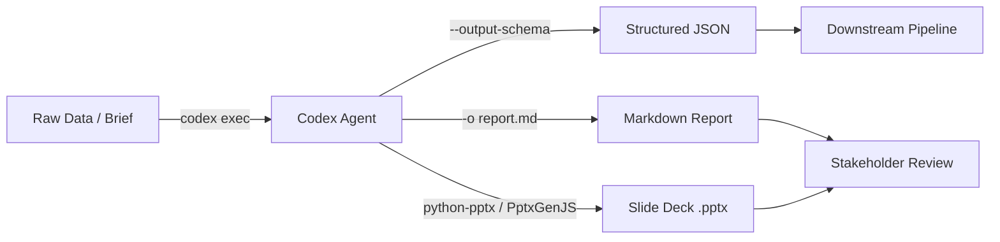

# Codex CLI for Knowledge Work: Data Analysis, Report Generation, and Slide Deck Automation Beyond Code


---

When OpenAI repositioned Codex as a tool for "(almost) everything" in April 2026, the message was clear: the same `codex exec` primitive that ships pull requests can also profile datasets, generate financial reports, and build presentation decks[^1]. Yet most Codex CLI practitioners still treat it as a pure coding assistant. This article bridges that gap with concrete workflows for three categories of knowledge work — data analysis, document generation, and slide deck automation — all driven from the terminal.

## Why the CLI for Knowledge Work?

The Codex desktop app handles many of these tasks through its GUI and plugin ecosystem. The CLI offers three advantages for practitioners who already live in the terminal:

1. **Composability** — `codex exec` participates in Unix pipelines. Pipe CSV data in via stdin, extract structured JSON via `--output-schema`, and feed it into downstream scripts[^2].
2. **Reproducibility** — every invocation is a command you can version-control, schedule in cron, or embed in CI/CD.
3. **Cost control** — non-interactive runs skip the overhead of persistent app-server sessions and can target cheaper models like `gpt-5.4-mini` for routine tasks[^3].



## Setting Up AGENTS.md for Non-Coding Projects

AGENTS.md is not limited to source code repositories. For knowledge work, create a project directory with conventions that steer the agent towards reproducible artefacts[^4]:

```markdown
# AGENTS.md

## Project Type
This is a data analysis project, not a software engineering project.

## Conventions
- Use `uv run` or the project's existing Python environment.
- Keep source data in `data/raw/` — never modify raw files.
- Write cleaned data to `data/processed/`.
- Write reports to `reports/`.
- Use pandas with matplotlib or seaborn for visualisation.
- Output all analysis as reproducible Python scripts, not one-off commands.

## Quality Gates
- Every chart must have labelled axes and a descriptive title.
- Every numeric claim must cite the specific row count or aggregation.
- Validate merged datasets for unexpected nulls or row-count changes.
```

## Workflow 1: Data Analysis with Structured Output

### Profiling a Dataset

The simplest starting point is a one-shot profile of a CSV file. The `$spreadsheet` skill — bundled with Codex by default — teaches the agent to handle CSV, TSV, and Excel files with awareness of common pitfalls like encoding issues and mixed data types[^5].

```bash
codex exec \
  "Profile data/raw/transactions.csv. Show shape, dtypes, \
   missing-value percentages, and summary statistics. \
   Output a markdown table." \
  --sandbox workspace-write \
  -o reports/profile.md
```

### Structured JSON for Pipelines

When the output feeds into another system, use `--output-schema` to enforce a contract:

```bash
cat > schema/analysis-summary.json << 'EOF'
{
  "type": "object",
  "properties": {
    "row_count": { "type": "integer" },
    "columns": { "type": "integer" },
    "missing_pct": { "type": "object" },
    "top_correlations": {
      "type": "array",
      "items": {
        "type": "object",
        "properties": {
          "pair": { "type": "string" },
          "r_value": { "type": "number" }
        }
      }
    },
    "recommendations": { "type": "array", "items": { "type": "string" } }
  },
  "required": ["row_count", "columns", "missing_pct", "recommendations"]
}
EOF

codex exec \
  "Analyse data/raw/transactions.csv. Compute correlations \
   between numeric columns. Identify the top 5 correlations \
   and recommend next analysis steps." \
  --output-schema schema/analysis-summary.json \
  -o reports/summary.json \
  --sandbox workspace-write
```

The resulting `reports/summary.json` conforms exactly to the schema, making it safe to parse downstream without defensive try/catch blocks[^6].

### Multi-Step Analysis with codex exec resume

For complex analyses that build on previous findings, chain sessions using `codex exec resume`:

```bash
# Step 1: clean and merge
codex exec \
  "Clean data/raw/transactions.csv and data/raw/customers.csv. \
   Merge on customer_id. Write the result to data/processed/merged.csv." \
  --sandbox workspace-write

# Step 2: resume the session, adding analysis
codex exec resume --last \
  "Using the merged dataset from the previous step, \
   run a cohort analysis by signup_month. \
   Generate a matplotlib chart saved to reports/cohort.png \
   and a summary table in reports/cohort.md."
```

⚠️ Note: `codex exec resume` does not currently accept `--output-schema` — this is a known CLI limitation tracked in the issue tracker[^7]. If you need structured output from resumed sessions, write the schema enforcement into the prompt itself.

## Workflow 2: Document and Report Generation

### Markdown Reports from Data

The `$doc` skill handles formatted document generation, while `$jupyter-notebook` suits exploratory walkthroughs[^5]. For a weekly report pipeline:

```bash
codex exec \
  "Read data/processed/weekly-metrics.csv. \
   Generate a markdown report with: \
   - Executive summary (3 bullet points) \
   - Key metrics table \
   - Week-over-week change analysis \
   - Seaborn trend charts saved to reports/charts/ \
   Write the report to reports/weekly-$(date +%Y-%m-%d).md." \
  --sandbox workspace-write \
  --model gpt-5.4-mini
```

Using `gpt-5.4-mini` for routine report generation cuts costs significantly — it is fast, efficient, and sufficient for tasks that do not require frontier reasoning[^3].

### Financial Analysis Patterns

Codex's official use cases include DCF valuation modelling and cash-flow forecasting[^8]. The CLI approach works well for recurring financial analysis:

```bash
codex exec \
  "Read data/raw/quarterly-financials.xlsx. \
   Build a three-statement financial model. \
   Project revenue growth at 12% CAGR for 5 years. \
   Calculate free cash flow and a DCF valuation \
   using a 10% discount rate. \
   Output the model as an editable Excel workbook \
   at reports/dcf-model.xlsx using openpyxl. \
   Include formulas, not hardcoded values." \
  --sandbox workspace-write
```

The key instruction here is "include formulas, not hardcoded values" — without it, the agent tends to pre-compute cells, producing a snapshot rather than a living model.

## Workflow 3: Slide Deck Automation

### Using the Built-in Slides Skill

The `$slides` system skill ships with Codex and uses PptxGenJS to create and manipulate `.pptx` files[^9]. Combined with the `$imagegen` skill for generating illustrations, the CLI can produce complete presentation decks:

```bash
codex exec \
  "Using the \$slides and \$imagegen skills: \
   Read reports/quarterly-review.md. \
   Create a 10-slide presentation deck at reports/quarterly.pptx. \
   - Slide 1: Title slide with company name and quarter \
   - Slides 2-4: Key metrics with charts \
   - Slides 5-7: Strategic initiatives (one per slide) \
   - Slide 8: Financial outlook \
   - Slide 9: Risks and mitigations \
   - Slide 10: Q&A placeholder \
   Match the branding from assets/brand-guide.pptx. \
   Generate one illustration per strategic initiative slide. \
   Run overflow and font validation before saving." \
  --sandbox workspace-write
```

### Validation Before Delivery

The slides skill bundles validation scripts that detect text overflow, font substitution, and layout drift[^9]. Always request validation explicitly in your prompt — the agent will render per-slide images and flag issues before the final save.

### Batch Deck Generation

For teams that produce regular client decks, combine `codex exec` with shell iteration:

```bash
for client in $(cat clients.txt); do
  codex exec \
    "Read data/clients/${client}/metrics.json. \
     Generate a branded 5-slide deck at \
     reports/decks/${client}-$(date +%Y-%m).pptx \
     using the template at assets/client-template.pptx." \
    --sandbox workspace-write \
    --model gpt-5.4-mini \
    --ephemeral
  done
```

The `--ephemeral` flag prevents session rollout files from accumulating when running batch jobs[^2].

## Choosing the Right Model

Model selection matters more for knowledge work than for typical coding tasks because the outputs are often read directly by stakeholders rather than compiled.

| Task | Recommended Model | Reasoning Effort | Rationale |
|------|------------------|-----------------|-----------|
| Data profiling | `gpt-5.4-mini` | medium | Routine; speed matters |
| Complex analysis | `gpt-5.5` | high | Multi-step reasoning, large context |
| Report drafting | `gpt-5.4` | medium | Good prose quality, cost-effective |
| Financial modelling | `gpt-5.5` | high | Formula accuracy critical |
| Slide generation | `gpt-5.4` | medium | Layout logic well within capability |
| Batch operations | `gpt-5.4-mini` | low | Volume over depth |

GPT-5.5, released April 2026, offers a dramatic improvement in long-context performance — scoring 74.0% on MRCR v2 at 512K–1M tokens versus GPT-5.4's 36.6%[^10]. This makes it the clear choice when analysing large datasets or long documents that push context boundaries.

## Scheduling Recurring Knowledge Work

For pipelines that run on a schedule, wire `codex exec` into cron or GitHub Actions:

```bash
# crontab entry: weekly Monday 06:00 UTC
0 6 * * 1 cd /data/project && \
  CODEX_API_KEY=$KEY codex exec \
  "Run the weekly analysis pipeline. \
   Profile new data in data/raw/, merge with existing processed data, \
   generate the weekly report, and update the slide deck." \
  --sandbox workspace-write \
  --model gpt-5.4-mini \
  --ephemeral \
  -o reports/weekly-$(date +\%Y-\%m-\%d).md
```

For more sophisticated scheduling, the Codex app's thread automations can run recurring tasks with context preservation across sessions[^11]. But for teams that prefer infrastructure-as-code, the CLI plus cron approach keeps everything auditable and version-controlled.

## Current Limitations

- **No runtime library installation** — the sandbox does not install Python packages on the fly. Pre-install `pandas`, `openpyxl`, `matplotlib`, and `python-pptx` in your project environment before running `codex exec`[^12].
- **`--output-schema` and `codex exec resume` cannot be combined** — plan your pipeline steps to use structured output on fresh invocations[^7].
- **Slide skill uses PptxGenJS (JavaScript)** — if your project environment is Python-only, instruct the agent to use `python-pptx` directly instead of relying on the bundled skill.
- **Image generation requires the `$imagegen` skill** — slide illustrations are not generated by default; explicitly request them.
- **Financial formulas need validation** — always open generated Excel workbooks and spot-check formula references before sharing with stakeholders.

## Conclusion

Codex CLI's `codex exec` is not just for shipping code. With the right AGENTS.md conventions, curated skills, and structured output schemas, it becomes a composable engine for data analysis, report generation, and presentation automation. The terminal-first approach offers reproducibility and cost control that GUI-based workflows cannot match — particularly for recurring pipelines that run on schedules.

The key insight is treating knowledge work artefacts the same way you treat source code: version-controlled, schema-validated, and built through reproducible commands.

## Citations

[^1]: OpenAI, "Codex for (almost) everything," openai.com, April 2026. [https://openai.com/index/codex-for-almost-everything/](https://openai.com/index/codex-for-almost-everything/)

[^2]: OpenAI, "Non-interactive mode – Codex," developers.openai.com, 2026. [https://developers.openai.com/codex/noninteractive](https://developers.openai.com/codex/noninteractive)

[^3]: OpenAI, "Models – Codex," developers.openai.com, 2026. [https://developers.openai.com/codex/models](https://developers.openai.com/codex/models)

[^4]: OpenAI, "Analyze datasets and ship reports – Codex use cases," developers.openai.com, 2026. [https://developers.openai.com/codex/use-cases/datasets-and-reports](https://developers.openai.com/codex/use-cases/datasets-and-reports)

[^5]: OpenAI, "Agent Skills – Codex," developers.openai.com, 2026. [https://developers.openai.com/codex/skills](https://developers.openai.com/codex/skills)

[^6]: OpenAI, "Command line options – Codex CLI," developers.openai.com, 2026. [https://developers.openai.com/codex/cli/reference](https://developers.openai.com/codex/cli/reference)

[^7]: GitHub, "Add --output-schema support to codex exec resume · Issue #14343," github.com/openai/codex, 2026. [https://github.com/openai/codex/issues/14343](https://github.com/openai/codex/issues/14343)

[^8]: OpenAI, "Codex use cases," developers.openai.com, 2026. [https://developers.openai.com/codex/use-cases](https://developers.openai.com/codex/use-cases)

[^9]: OpenAI, "Generate slide decks – Codex use cases," developers.openai.com, 2026. [https://developers.openai.com/codex/use-cases/generate-slide-decks](https://developers.openai.com/codex/use-cases/generate-slide-decks)

[^10]: OpenAI, "Introducing GPT-5.5," openai.com, April 2026. [https://openai.com/index/introducing-gpt-5-5/](https://openai.com/index/introducing-gpt-5-5/)

[^11]: OpenAI, "Automations – Codex app," developers.openai.com, 2026. [https://developers.openai.com/codex/app/automations](https://developers.openai.com/codex/app/automations)

[^12]: OpenAI, "Best practices – Codex," developers.openai.com, 2026. [https://developers.openai.com/codex/learn/best-practices](https://developers.openai.com/codex/learn/best-practices)
