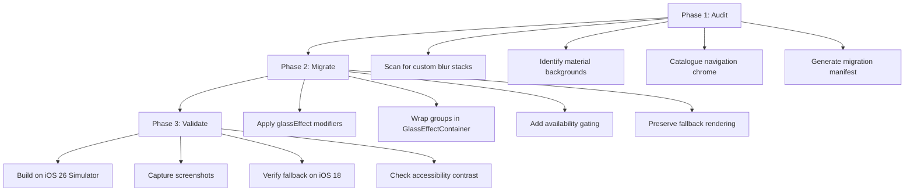
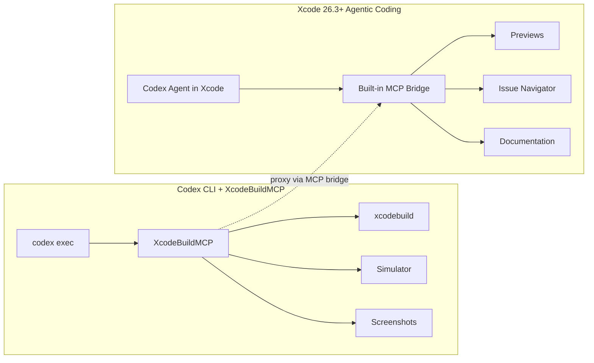

# Migrating SwiftUI Apps to Liquid Glass with Codex CLI: Agent Skills, XcodeBuildMCP, and iOS 26 Workflows


Apple's Liquid Glass design language, introduced at WWDC 2025 and shipping with iOS 26, represents the most significant visual overhaul since iOS 7's flat redesign[^1]. Every custom navigation bar, tab bar, floating button, and modal sheet is a migration target. For teams with mature SwiftUI codebases, the question is not whether to adopt Liquid Glass but how to do so systematically without breaking backward compatibility.

Codex CLI turns this into a structured, verifiable pipeline: audit existing UI, apply `glassEffect` modifiers with availability gating, build against the iOS 26 simulator via XcodeBuildMCP, and capture screenshots to confirm visual correctness — all without leaving the terminal.

## The Liquid Glass API Surface

Before configuring the agent, it helps to understand what Codex will be working with. The core SwiftUI API centres on three primitives[^2]:

### `glassEffect`

The primary modifier. Applied after layout and visual modifiers, it places a translucent glass shape behind content:

```swift
Text("Settings")
    .padding()
    .glassEffect(.regular, in: .capsule)
```

Three variants control transparency and behaviour[^3]:

| Variant | Purpose |
|---------|---------|
| `.regular` | Standard translucent glass — the default |
| `.clear` | Fully transparent until interaction triggers shimmer |
| `.identity` | No glass rendering; useful for morphing transitions |

### `GlassEffectContainer`

Groups related glass elements so SwiftUI can blend overlapping shapes, apply consistent blur and lighting, and enable smooth morphing transitions between them[^2]:

```swift
GlassEffectContainer {
    HStack {
        Button("Back") { }
            .buttonStyle(.glass)
        Spacer()
        Button("Done") { }
            .buttonStyle(.glassProminent)
    }
}
```

### Morphing Transitions with `glassEffectID`

Combined with `@Namespace`, this enables elements to morph smoothly between states — a hallmark of the Liquid Glass aesthetic[^3]:

```swift
@Namespace private var ns

// In source view:
.glassEffect(in: .capsule)
.glassEffectID("nav", in: ns)

// In destination view:
.glassEffect(in: .rect(cornerRadius: 20))
.glassEffectID("nav", in: ns)
```

## Agent Skills for iOS 26

Raw model knowledge of Liquid Glass APIs is thin — GPT-5.5 was trained before iOS 26 shipped. Agent skills bridge this gap through progressive disclosure, loading reference material only when Codex detects iOS or SwiftUI work[^4].

Two community skill sets stand out:

**dpearson2699/swift-ios-skills** provides 84 skills targeting iOS 26+, Swift 6.3, and modern Apple frameworks[^5]. The `swiftui-liquid-glass` skill covers `glassEffect`, `GlassEffectContainer`, morphing transitions, and semantic tinting. Each skill is self-contained with a `SKILL.md` and optional `references/` directory.

**AvdLee/SwiftUI-Agent-Skill** focuses on SwiftUI best practices and includes guidance on the new glass modifiers alongside layout and animation patterns[^6].

### Installation for Codex CLI

Install specific skills into your project:

```bash
# Install the Liquid Glass skill
codex skill install https://github.com/dpearson2699/swift-ios-skills/tree/main/skills/swiftui-liquid-glass

# Or install the broader SwiftUI bundle
codex skill install https://github.com/dpearson2699/swift-ios-skills/tree/main/skills/swiftui-skills
```

Skills land in `.agents/skills/` and load automatically when Codex detects relevant file types. The `SKILL.md` frontmatter controls when progressive disclosure triggers[^7].

## XcodeBuildMCP: Build and Verify from the Terminal

XcodeBuildMCP, maintained by Sentry, is the MCP server that gives Codex access to `xcodebuild`, the iOS Simulator, and screenshot capture without requiring Xcode's GUI[^8]. Since Xcode 26.3, it can also proxy tools from Xcode's built-in MCP bridge, exposing Preview rendering, the Issue Navigator, and documentation search to any MCP-compatible agent[^9].

### Configuration

Add XcodeBuildMCP to your Codex configuration:

```toml
# ~/.codex/config.toml or .codex/config.toml
[mcp_servers.xcodebuild]
command = "npx"
args = ["-y", "xcodebuildmcp@latest"]
```

This gives Codex tools for building, running simulators, capturing screenshots, and inspecting build errors — the verification loop that makes Liquid Glass migration safe.

## The Three-Phase Migration Workflow

OpenAI's official Liquid Glass use case recommends a three-phase approach: audit, migrate, validate[^10]. Here is how to execute it with Codex CLI.



### Phase 1: Audit

```bash
codex exec "Audit this SwiftUI project for Liquid Glass migration targets. \
Scan all .swift files for: custom .background(.ultraThinMaterial) usage, \
.blur() stacks on navigation elements, custom tab bar implementations, \
floating action buttons with shadows, and modal sheet backgrounds. \
Output a migration manifest as a markdown table with file, line number, \
current implementation, and recommended Liquid Glass replacement."
```

The audit phase is read-only — Codex analyses without modifying. The structured output gives you a review checkpoint before any code changes.

### Phase 2: Migrate

Apply changes file by file with availability gating:

```bash
codex exec "Migrate the navigation bar in ContentView.swift to Liquid Glass. \
Replace the custom blur stack with .glassEffect(.regular, in: .capsule). \
Wrap related controls in a GlassEffectContainer. \
Gate all iOS 26 APIs behind #available(iOS 26, *) with the existing \
rendering as the fallback. Apply .glassEffect after layout modifiers. \
Do not remove any existing functionality."
```

The critical constraint is availability gating. Every `glassEffect` call must be wrapped:

```swift
if #available(iOS 26, *) {
    toolbar
        .glassEffect(.regular, in: .rect(cornerRadius: 16))
} else {
    toolbar
        .background(.ultraThinMaterial)
        .clipShape(RoundedRectangle(cornerRadius: 16))
}
```

### Phase 3: Validate

Use XcodeBuildMCP to build and capture screenshots:

```bash
codex exec "Build this project for the iOS 26 simulator using the \
'MyApp' scheme. If the build succeeds, launch in the iPhone 16 Pro \
simulator and capture screenshots of the main navigation flow. \
Compare the glass rendering against the migration manifest. \
Then build for the iOS 18 simulator to verify fallback rendering \
compiles and runs correctly."
```

## AGENTS.md Configuration for Liquid Glass Projects

Set project-wide constraints in your repository's `AGENTS.md`:

```markdown
# iOS 26 Liquid Glass Migration Rules

## Mandatory Constraints
- ALL iOS 26 APIs must be gated with `#available(iOS 26, *)`
- Existing non-glass rendering must be preserved as the `else` branch
- Apply `.glassEffect()` AFTER layout and visual modifiers, never before
- Use `GlassEffectContainer` to group related glass elements
- Prefer `.buttonStyle(.glass)` over manual `glassEffect` on buttons
- Never nest `glassEffect` inside another `glassEffect` — glass cannot sample glass

## Testing Requirements
- Every migrated view must build on both iOS 26 and iOS 18 simulators
- Screenshot verification required for navigation bars, tab bars, and modals
- Accessibility: verify Dynamic Type and VoiceOver still function correctly

## Model Guidance
- Use the `swiftui-liquid-glass` skill for API reference
- Consult XcodeBuildMCP for build and simulator operations
```

## Xcode 26.3+ Native Agent Integration

Since February 2026, Xcode 26.3 supports agentic coding natively with both Codex and Claude agents[^9]. Agents can search documentation, explore file structures, update project settings, and verify work visually by capturing Xcode Previews. Xcode 26.5, released on 12 May 2026, added message queuing for the coding assistant, making longer migration sessions more practical[^11].

For terminal-first developers, Codex CLI with XcodeBuildMCP provides the same capabilities without the GUI dependency. The two approaches are complementary:



## Practical Considerations

**Glass cannot sample glass.** Overlapping glass elements without a `GlassEffectContainer` produce visual artefacts. Codex must be instructed to group related elements — this is the most common migration error[^2].

**Simulator vs hardware rendering.** The specular highlights and motion response that define Liquid Glass render differently in the simulator. Physical device testing remains essential for final sign-off, though simulator screenshots suffice for structural verification[^3].

**Model selection matters.** GPT-5.5 with the `swiftui-liquid-glass` skill handles straightforward migrations well. For complex custom components with animation chains, `o3` provides stronger architectural reasoning at higher cost[^12]. A practical pattern is to use GPT-5.5 for the audit phase and `o3` for complex migration decisions.

**Cost control.** A typical migration of 30-40 views consumes roughly 200-400K tokens across audit, migration, and validation phases. Using `codex exec` with `--reasoning-effort low` for the audit phase and `medium` for migration keeps costs manageable.

## Current Limitations

- **No runtime interaction testing.** XcodeBuildMCP captures static screenshots but cannot verify interactive glass behaviours like shimmer-on-tap or morphing transitions. These require manual testing or a dedicated UI testing framework.
- **Skill currency.** Community skills track Apple's betas with a lag. Verify skill content against the latest Apple documentation before relying on specific API details.
- **Sandbox constraints.** Codex CLI's sandbox cannot run the iOS Simulator directly. XcodeBuildMCP must be configured with appropriate `--add-dir` permissions or run outside the sandbox[^13].

## Citations

[^1]: [Apple Introduces a Delightful and Elegant New Software Design — Apple Newsroom, June 2025](https://www.apple.com/newsroom/2025/06/apple-introduces-a-delightful-and-elegant-new-software-design/)
[^2]: [Applying Liquid Glass to Custom Views — Apple Developer Documentation](https://developer.apple.com/documentation/SwiftUI/Applying-Liquid-Glass-to-custom-views)
[^3]: [Liquid Glass in Swift: Official Best Practices for iOS 26 & macOS Tahoe — DEV Community](https://dev.to/diskcleankit/liquid-glass-in-swift-official-best-practices-for-ios-26-macos-tahoe-1coo)
[^4]: [Skills — Codex CLI Documentation, OpenAI Developers](https://developers.openai.com/codex/skills)
[^5]: [dpearson2699/swift-ios-skills — GitHub](https://github.com/dpearson2699/swift-ios-skills)
[^6]: [AvdLee/SwiftUI-Agent-Skill — GitHub](https://github.com/AvdLee/SwiftUI-Agent-Skill)
[^7]: [Custom Instructions with AGENTS.md — Codex, OpenAI Developers](https://developers.openai.com/codex/guides/agents-md)
[^8]: [getsentry/XcodeBuildMCP — GitHub](https://github.com/getsentry/XcodeBuildMCP)
[^9]: [Xcode 26.3 Unlocks the Power of Agentic Coding — Apple Newsroom, February 2026](https://www.apple.com/newsroom/2026/02/xcode-26-point-3-unlocks-the-power-of-agentic-coding/)
[^10]: [Adopt Liquid Glass — Codex Use Cases, OpenAI Developers](https://developers.openai.com/codex/use-cases/ios-liquid-glass)
[^11]: [Xcode 26.5 Adds Two Features That Make Agentic Coding More Useful — 9to5Mac, May 2026](https://9to5mac.com/2026/05/12/xcode-26-5-adds-two-features-that-make-agentic-coding-more-useful/)
[^12]: [Model Routing May 2026 — Codex CLI Documentation, OpenAI Developers](https://developers.openai.com/codex/models)
[^13]: [Sandbox Configuration — Codex CLI Documentation, OpenAI Developers](https://developers.openai.com/codex/sandbox)
