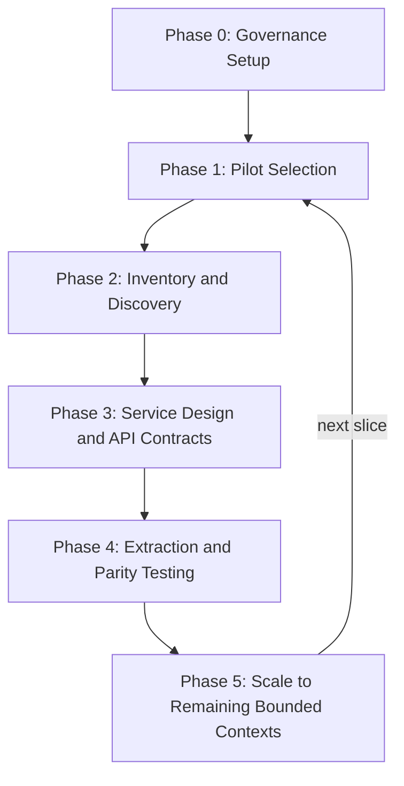
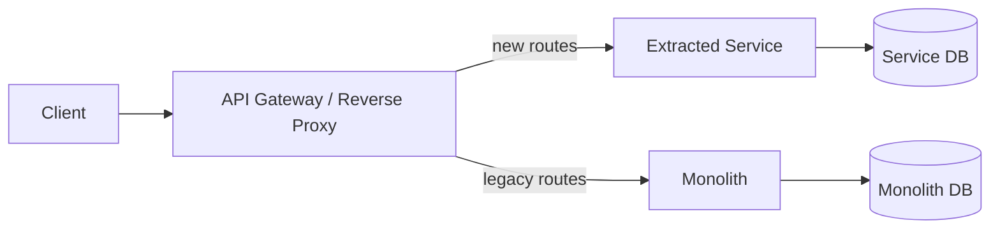
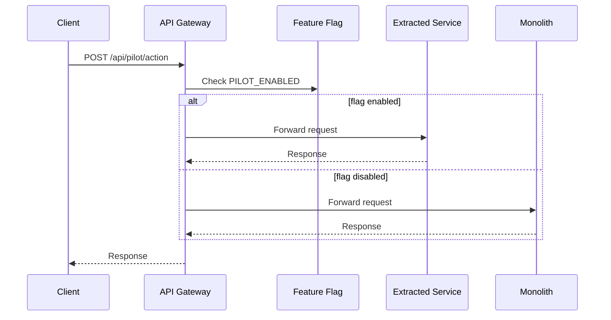

# Codex CLI for Monolith Decomposition: Strangler Fig Migration, Service Boundary Detection, and Agent-Driven Extraction


---

Monolith decomposition remains one of the highest-value, highest-risk engineering programmes an organisation undertakes. Industry surveys consistently report that over 80 per cent of successful migrations use an incremental approach — the strangler fig pattern — rather than a wholesale rewrite[^1]. Codex CLI, as of v0.130, has the primitives to accelerate every phase of that loop: dependency discovery, service boundary detection, API contract generation, parallel extraction, and parity validation. This article presents a complete, repeatable workflow.

## Why Coding Agents Change the Decomposition Calculus

Traditional monolith decomposition relies on architects manually tracing call graphs, reading framework-specific conventions, and mapping domain boundaries from thousands of files. That discovery phase alone consumes weeks. Codex CLI compresses it because the agent can read every file in the repository, follow import chains, and produce structured analysis in a single `codex exec` pass[^2].

The economic shift matters: when discovery drops from weeks to hours, teams can afford to prototype multiple decomposition strategies before committing to one. The OpenAI Code Modernization Cookbook formalises this as the **ExecPlan pattern** — a design document that the agent follows to deliver each migration phase[^3].

## The Five-Phase Decomposition Pipeline

The workflow mirrors the Cookbook's five-phase structure, adapted for monolith-to-microservices extraction[^3]:



### Phase 0: Governance Setup

Before Codex touches the codebase, establish the instruction hierarchy. Create a `.codex/AGENTS.md` at the repository root[^4]:

```markdown
# AGENTS.md — Monolith Decomposition

## Architecture Constraints
- Do NOT delete any monolith code during extraction phases.
- Every new service MUST expose an OpenAPI 3.1 contract before implementation.
- Database tables belong to exactly one service; shared tables require a facade.
- All extracted services MUST pass the existing monolith integration test suite.

## Coding Standards
- Target language: same as monolith unless migration doc specifies otherwise.
- Follow existing naming conventions discovered in the codebase.
- Generate migration scripts for any schema change.
```

This prevents the agent from making destructive changes during what is inherently a read-heavy, analysis-first process[^4].

### Phase 1: Pilot Selection

The pilot should be a vertical slice with well-defined inputs and outputs, low coupling to other modules, and high business value or high change frequency[^1][^3]. Use `codex exec` with structured output to identify candidates automatically:

```bash
codex exec \
  --output-schema pilot-candidates-schema.json \
  -o pilot-candidates.json \
  "Analyse this monolith repository. Identify the top 5 candidate modules \
   for extraction as independent microservices. For each candidate, report: \
   module name, file count, inbound dependency count, outbound dependency count, \
   estimated coupling score (0-100 where 0 is fully decoupled), \
   and a one-sentence rationale. Rank by lowest coupling score."
```

The JSON Schema forces structured, comparable output across runs[^2]:

```json
{
  "type": "object",
  "properties": {
    "candidates": {
      "type": "array",
      "items": {
        "type": "object",
        "properties": {
          "module_name": { "type": "string" },
          "file_count": { "type": "integer" },
          "inbound_dependencies": { "type": "integer" },
          "outbound_dependencies": { "type": "integer" },
          "coupling_score": { "type": "integer" },
          "rationale": { "type": "string" }
        },
        "required": ["module_name", "file_count", "coupling_score", "rationale"]
      }
    }
  }
}
```

### Phase 2: Inventory and Discovery

Once a pilot module is selected, generate the comprehensive inventory document. Resume the previous session to preserve context[^2]:

```bash
codex exec resume --last \
  "For the module ranked #1 in the previous analysis, produce a \
   pilot_overview.md document covering: \
   1. All source files in the module with line counts. \
   2. All database tables read or written by the module. \
   3. All external API calls made by the module. \
   4. All inbound call sites from the rest of the monolith. \
   5. All shared data structures or DTOs crossing the module boundary. \
   6. All scheduled jobs or background workers in the module."
```

This generates the `pilot_overview.md` artifact — the system inventory that lets engineers reason about the change without reading every line of legacy code[^3].

### Phase 3: Service Design and API Contracts

With the inventory in hand, the next pass designs the target service boundary. This is where the strangler fig pattern takes shape — the new service will sit behind a routing layer, handling requests that previously went to the monolith[^1]:



Use Codex to generate the OpenAPI contract and the facade layer:

```bash
codex exec resume --last \
  "Based on the pilot_overview.md, design the extracted service: \
   1. Write an OpenAPI 3.1 specification to modern/openapi/pilot.yaml. \
   2. Write a pilot_design.md describing the service architecture, \
      data model, and migration strategy for shared tables. \
   3. Write a routing configuration snippet showing how the API gateway \
      forwards pilot-related routes to the new service while keeping \
      all other routes pointed at the monolith."
```

The AGENTS.md constraint — "every new service MUST expose an OpenAPI 3.1 contract before implementation" — ensures the agent produces the contract first, not code[^4].

### Phase 4: Extraction and Parity Testing

This is the implementation phase. Codex subagents parallelise the work[^5]:

```toml
# .codex/config.toml — subagent configuration
[agents.extractor]
model = "gpt-5.4"
instructions = "Extract the pilot module into a standalone service following pilot_design.md."

[agents.test_writer]
model = "gpt-5.4-mini"
instructions = "Write parity tests comparing the new service's responses against the monolith for every endpoint in the OpenAPI contract."

[agents.migration_writer]
model = "gpt-5.4-mini"
instructions = "Generate database migration scripts that split shared tables into service-owned tables with foreign data wrappers for the transition period."
```

The extractor agent does the heavy lifting while the test writer and migration writer work in parallel. The parity test strategy is critical: run the legacy and new versions side by side and verify behavioural equivalence through automated tests[^3].

```bash
codex exec \
  --sandbox workspace-write \
  "Execute the extraction plan: \
   1. Create the new service directory structure under services/pilot/. \
   2. Extract the module code, resolving all import dependencies. \
   3. Create a thin adapter layer in the monolith that delegates to the \
      new service via HTTP, implementing the strangler fig facade. \
   4. Run the existing integration tests to confirm nothing breaks."
```

### Phase 5: Scale to Remaining Bounded Contexts

Once the pilot succeeds, the ExecPlan, AGENTS.md constraints, and JSON Schemas become reusable templates. Feed the next candidate from the Phase 1 ranking back into Phase 2 and repeat[^3].

## Dependency Analysis Patterns

### Static Analysis with Codex

For languages with explicit import systems (Go, Java, TypeScript), Codex can build dependency graphs directly from source:

```bash
codex exec \
  --output-schema dependency-graph-schema.json \
  -o dependency-graph.json \
  "Build a module-level dependency graph for this repository. \
   For each top-level package/module, list all other modules it imports. \
   Identify any circular dependencies. Output as an adjacency list."
```

### Augmenting with MCP Servers

For richer analysis, connect Codex to language-specific MCP servers that expose type information and call graphs[^6]. A TypeScript project might use:

```toml
# .codex/config.toml
[mcp_servers.typescript-analyzer]
command = "npx"
args = ["ts-analyzer-mcp", "--project", "tsconfig.json"]
```

This gives Codex access to the full type graph — which types are shared across module boundaries, which interfaces are implemented by multiple modules, and which functions have the most callers.

### Database Dependency Discovery

Shared database access is the single most common blocker in monolith decomposition[^7]. Use Codex to audit SQL queries across the codebase:

```bash
codex exec \
  "Scan all source files for SQL queries, ORM model definitions, and \
   database migration files. For each database table, list every module \
   that reads from it and every module that writes to it. Flag tables \
   accessed by more than one module as shared-state boundaries."
```

## The Strangler Fig Routing Layer

The routing layer is the mechanism that makes incremental migration safe. Codex can generate the configuration for common API gateways:

```bash
codex exec \
  "Given the OpenAPI contract at modern/openapi/pilot.yaml and the \
   existing monolith routes, generate: \
   1. An Nginx configuration that routes pilot endpoints to the new service \
      on port 8081 and everything else to the monolith on port 8080. \
   2. A feature flag configuration using environment variables so the \
      routing can be toggled without redeployment."
```



## Cost and Model Strategy

Monolith decomposition is token-intensive. The discovery phases process the entire codebase, often exceeding 100,000 tokens of context. A practical model routing strategy[^8]:

| Phase | Recommended Model | Rationale |
|-------|-------------------|-----------|
| Discovery and inventory | `gpt-5.5` | Needs the full 1M-token context window for large codebases |
| Service design | `gpt-5.4` | Architectural reasoning benefits from stronger model |
| Code extraction | `gpt-5.4` | Needs to understand both source and target patterns |
| Test generation | `gpt-5.4-mini` | Formulaic work; lower cost at ~30% of gpt-5.4 pricing |
| Migration scripts | `gpt-5.4-mini` | Schema transformations are well-bounded |

For a monolith with 500,000 lines of code, expect the full discovery phase to consume approximately 200,000–400,000 input tokens per pass. With prompt caching achieving 60–70 per cent hit rates in sustained sessions, the effective cost drops significantly on subsequent analysis passes[^9].

## Current Limitations

⚠️ **No runtime analysis**: Codex operates on static code. It cannot observe actual traffic patterns, hot paths, or runtime coupling. Supplement with APM data where available.

⚠️ **Schema migration risk**: While Codex can generate migration scripts, it cannot validate them against production data volumes or constraint conflicts. Always test migrations against a production-scale replica.

⚠️ **`--output-schema` and tools conflict**: As of v0.130, `--output-schema` may behave unexpectedly when MCP servers or tools are active in the same session[^10]. Run structured-output discovery phases with `--ignore-user-config` to avoid loading MCP servers.

⚠️ **Context limits on very large monoliths**: Repositories exceeding 1 million lines may require splitting analysis across multiple `codex exec` passes with manual aggregation, even with GPT-5.5's 1M-token window.

## Comparison with Specialist Tools

| Capability | Codex CLI | CARGO[^11] | Manual Architecture Review |
|-----------|-----------|-------|---------------------------|
| Dependency graph generation | ✅ Natural language driven | ✅ Automated static analysis | ❌ Manual |
| Domain boundary suggestion | ✅ Context-aware reasoning | ✅ Graph clustering | ✅ Expert judgment |
| API contract generation | ✅ OpenAPI from analysis | ❌ Not supported | ✅ Manual |
| Code extraction | ✅ Agent-driven | ❌ Analysis only | ✅ Manual |
| Parity test generation | ✅ Automated | ❌ Not supported | ❌ Manual |
| Runtime traffic analysis | ❌ Static only | ✅ Call graph analysis | ✅ With APM tools |
| Cost | Pay-per-token | Free (research) | Engineering hours |

Codex CLI is not a replacement for architectural judgment. It is a force multiplier that compresses the discovery-and-extraction cycle from weeks to days, letting architects spend their time on the decisions that matter rather than the analysis that precedes them.

## Citations

[^1]: Microservices Patterns: Strangler Application Pattern, microservices.io, https://microservices.io/patterns/refactoring/strangler-application.html
[^2]: OpenAI, "Non-interactive mode — Codex", https://developers.openai.com/codex/noninteractive
[^3]: OpenAI Cookbook, "Modernizing your Codebase with Codex", https://developers.openai.com/cookbook/examples/codex/code_modernization
[^4]: OpenAI, "Custom instructions with AGENTS.md — Codex", https://developers.openai.com/codex/guides/agents-md
[^5]: OpenAI, "Subagents — Codex", https://developers.openai.com/codex/subagents
[^6]: OpenAI, "Model Context Protocol — Codex", https://developers.openai.com/codex/mcp
[^7]: Augment Code, "15 AI-Driven Tactics to Speed Monolith-to-Microservices Migration", https://www.augmentcode.com/guides/15-ai-driven-tactics-to-speed-monolith-to-microservices-migration
[^8]: OpenAI, "Models — Codex", https://developers.openai.com/codex/models
[^9]: OpenAI, "Prompt Caching 201", https://developers.openai.com/cookbook/examples/prompt_caching_201
[^10]: GitHub Issue #15451, "--json and --output-schema are silently ignored when tools/MCP servers are active", https://github.com/openai/codex/issues/15451
[^11]: Siddiq et al., "CARGO: AI-Guided Dependency Analysis for Migrating Monolithic Applications to Microservices Architecture", ACM, https://dl.acm.org/doi/fullHtml/10.1145/3551349.3556960
