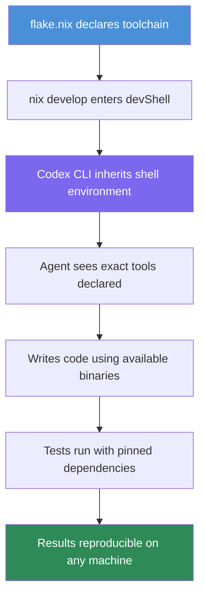

# Codex CLI on NixOS: Reproducible Agent Environments with Nix Flakes, Declarative Toolchains, and Hermetic Development Shells


---

Every senior engineer has encountered the "works on my machine" problem. With AI coding agents, the problem compounds: the agent's behaviour depends not only on the code but on the shell environment, installed toolchains, available binaries, and sandbox configuration it inherits. When two developers on the same team get different results from the same Codex CLI prompt, the culprit is almost always environmental drift.

Nix — and specifically Nix Flakes — eliminates this class of failure by making development environments declarative, reproducible, and hermetically sealed. This article covers how to install Codex CLI via Nix, build project-specific development shells that give the agent exactly the toolchain it needs, layer Nix-based sandboxing on top of Codex's own isolation, and share reproducible agent environments across teams.

## Why Nix for Agent Environments

Codex CLI already provides sandboxing via Seatbelt (macOS), Landlock/seccomp (Linux), and AppContainer (Windows) [^1]. These mechanisms restrict what the agent *can do*. Nix solves the complementary problem: ensuring the agent has a *consistent, complete* set of tools to work with.

Three properties make Nix uniquely suited to agent environments:

1. **Deterministic builds** — The same `flake.lock` produces identical outputs regardless of the host machine's state. A Codex session in a Nix devShell on your MacBook will see the same `rustc`, `node`, and `python3` versions as one running on a colleague's NixOS workstation or in CI [^2].

2. **Atomic composition** — Nix can compose conflicting dependency trees without contaminating the host. A project requiring Python 3.12 and Node 22 alongside another requiring Python 3.13 and Node 20 simply declares different devShells — no `asdf`, `nvm`, or `pyenv` gymnastics required [^3].

3. **Declarative specification** — The `flake.nix` file is the single source of truth for the project's toolchain. Codex reads it, understands it (it is a well-known format), and can even modify it when asked to add a dependency.

## Installing Codex CLI via Nix

The community maintains several Nix flakes for Codex CLI. The two most actively maintained options are `codex-cli-nix` and `codex-nix`, both packaging the native Rust binary (`codex-rs`) without Node.js runtime dependencies [^4] [^5].

### Quick trial without installation

```bash
nix run github:sadjow/codex-cli-nix
```

### Declarative installation via Home Manager

```nix
# flake.nix
{
  inputs = {
    nixpkgs.url = "github:NixOS/nixpkgs/nixos-unstable";
    home-manager.url = "github:nix-community/home-manager";
    codex-nix.url = "github:SecBear/codex-nix";
  };

  outputs = { nixpkgs, home-manager, codex-nix, ... }: {
    homeConfigurations."dev" = home-manager.lib.homeManagerConfiguration {
      pkgs = nixpkgs.legacyPackages.x86_64-linux;
      modules = [{
        home.packages = [
          codex-nix.packages.x86_64-linux.default
        ];
      }];
    };
  };
}
```

### NixOS system-level installation

```nix
{ inputs, pkgs, ... }:
{
  environment.systemPackages = [
    inputs.codex-nix.packages.${pkgs.system}.default
  ];
}
```

Both community flakes run hourly CI checks that detect new Codex releases, fetch updated hashes, and auto-merge version bumps after tests pass [^4]. This means your pinned flake is always one `nix flake update` away from the latest Codex CLI release — yet remains exactly reproducible until you choose to update.

### The numtide collection

For teams running multiple AI coding agents, the `numtide/llm-agents.nix` flake packages over forty terminal-based AI tools — including Codex CLI, Claude Code, Goose, and GitHub Copilot CLI — in a single flake with daily updates [^6]:

```bash
nix run github:numtide/llm-agents.nix#codex -- --help
```

## Building Project-Specific Agent Environments

The real power emerges when you combine Codex with a project-level `flake.nix` that declares the exact toolchain the agent needs. Consider a Rust web service that also uses `sqlx` for database migrations:

```nix
# flake.nix
{
  inputs = {
    nixpkgs.url = "github:NixOS/nixpkgs/nixos-unstable";
    rust-overlay.url = "github:oxalica/rust-overlay";
    codex-nix.url = "github:SecBear/codex-nix";
  };

  outputs = { nixpkgs, rust-overlay, codex-nix, ... }:
    let
      system = "x86_64-linux";
      pkgs = import nixpkgs {
        inherit system;
        overlays = [ rust-overlay.overlays.default ];
      };
      rustToolchain = pkgs.rust-bin.stable."1.82.0".default.override {
        extensions = [ "rust-src" "rust-analyzer" ];
      };
    in {
      devShells.${system}.default = pkgs.mkShell {
        buildInputs = [
          rustToolchain
          pkgs.sqlx-cli
          pkgs.postgresql_16
          pkgs.cargo-watch
          pkgs.cargo-nextest
          codex-nix.packages.${system}.default
        ];

        shellHook = ''
          export DATABASE_URL="postgresql://localhost:5432/myapp_dev"
          echo "Codex agent environment ready: Rust $(rustc --version), sqlx $(sqlx --version)"
        '';
      };
    };
}
```

Entering this environment is a single command:

```bash
nix develop
codex "Add a new users table migration with email, created_at, and a unique index on email"
```

The agent now has access to `rustc` 1.82.0, `sqlx-cli`, `cargo-nextest`, and a running PostgreSQL — precisely what it needs to write the migration, compile the project, and run the tests. No global installation drift, no version mismatches, no "I need to install sqlx first" loops.



## Layering Nix Sandboxing on Top of Codex

Codex CLI's built-in sandbox restricts filesystem writes and network access [^1]. For teams that want defence-in-depth — or need to run agents in environments where Codex's sandbox mode is set to a permissive profile — Nix offers an additional isolation layer.

### agent-sandbox.nix

The `agent-sandbox.nix` project uses bubblewrap (Linux) and `sandbox-exec` (macOS) to create hermetic agent environments with deny-default policies [^7]:

```nix
{ mkSandbox, pkgs }:
mkSandbox {
  name = "codex-sandboxed";
  allowedPackages = with pkgs; [
    codex-cli
    git
    rustc
    cargo
    nodejs_22
  ];
  stateDirs = [
    "~/.codex"        # Codex configuration
    "~/.config/codex"  # Codex config directory
  ];
  restrictNetwork = {
    allowedDomains = [
      "api.openai.com"
      "github.com"
    ];
  };
}
```

This creates a sandboxed wrapper where the agent can only execute binaries from the declared `allowedPackages`, write to the current working directory and explicitly declared state paths, and make network requests only to `api.openai.com` and `github.com`.

The key distinction from Codex's native sandbox is *declarative completeness*: the Nix sandbox specifies not just what is forbidden but what is permitted, from the binary level upward [^7].

### Flox: agent-friendly Nix without the learning curve

For teams that find raw Nix flakes intimidating, Flox wraps Nix's package manager in imperative commands that align naturally with how LLMs interact with tools [^8]:

```bash
flox init
flox install python312 nodejs_22 rustc cargo codex-cli
flox activate
codex "Refactor the authentication module to use OAuth2 PKCE flow"
```

Flox environments are pinnable, shareable via FloxHub, and — critically — their manifest format is something Codex can read and modify. The `FLOX.md` convention lets you instruct the agent how to manage its own environment:

```markdown
<!-- FLOX.md -->
This project uses Flox for environment management.
- To add a package: `flox install <package>`
- To search: `flox search <query>`
- Never install packages globally or modify the host system.
```

## Sandbox Configuration Interaction

When running Codex CLI inside a Nix devShell, the agent's sandbox inherits the shell's `$PATH` and environment variables. This creates an important interaction with Codex's `--add-dir` flag and sandbox modes [^9].

### Exposing Nix store paths to the sandbox

Codex's `workspace-write` sandbox mode restricts writes to the current directory tree. However, Nix-managed tools live in `/nix/store`, which the agent needs read access to. On Linux (Landlock), Codex already permits reads from standard system paths including `/nix/store` [^1]. On macOS (Seatbelt), the default profile grants read access to `/nix` [^1].

If you are using a custom sandbox configuration, ensure `/nix/store` is in the read-allow list:

```toml
# .codex/config.toml
[sandbox_workspace_write]
read_dirs = ["/nix/store", "/nix/var"]
```

### Multi-project coordination

For monorepos or multi-project setups, combine Nix's per-directory devShells with Codex's `--add-dir`:

```bash
nix develop ./services/api
codex --add-dir ../shared-libs "Update the shared auth library to support PKCE"
```

## Reproducible CI Pipelines

The same `flake.nix` that drives local development can power CI, eliminating the "CI has different versions" problem entirely.

### GitHub Actions with Nix


```yaml
# .github/workflows/codex-review.yml
name: Agent Code Review
on: [pull_request]

jobs:
  review:
    runs-on: ubuntu-latest
    steps:
      - uses: actions/checkout@v4
      - uses: cachix/install-nix-action@v30
        with:
          nix_path: nixpkgs=channel:nixos-unstable
      - uses: cachix/cachix-action@v15
        with:
          name: my-project
          authToken: '${{ secrets.CACHIX_AUTH_TOKEN }}'
      - name: Run Codex review in Nix shell
        env:
          OPENAI_API_KEY: ${{ secrets.OPENAI_API_KEY }}
        run: |
          nix develop --command codex exec \
            --approval-policy on-request \
            --sandbox workspace-write \
            --json \
            "Review the PR diff for security issues and API contract violations"
```


The Cachix binary cache ensures CI runners do not rebuild the toolchain from source — pre-built binaries are fetched in seconds [^10].

## Team Configuration Patterns

### Shared flake with per-role devShells

Large teams can define multiple devShells in a single flake, each tailored to a specific role:

```nix
devShells.${system} = {
  default = mkShell { buildInputs = [ commonTools codex ]; };
  backend = mkShell { buildInputs = [ commonTools codex rustToolchain postgresql ]; };
  frontend = mkShell { buildInputs = [ commonTools codex nodejs_22 playwright ]; };
  sre = mkShell { buildInputs = [ commonTools codex kubectl helm terraform ]; };
};
```

A backend engineer enters `nix develop .#backend` and gets a Codex environment with Rust, PostgreSQL, and the project's exact dependency versions. The frontend engineer enters `nix develop .#frontend` and gets Node, Playwright, and nothing else. The agent's behaviour is scoped to the tools available.

### Pinning Codex CLI versions across the team

To ensure every team member runs the same Codex CLI version, pin the flake input:

```bash
nix flake lock --update-input codex-nix
git add flake.lock
git commit -m "pin: codex-cli to v0.130.0"
```

The `flake.lock` file captures the exact commit hash of the Codex flake input. Until someone runs `nix flake update`, every `nix develop` invocation produces the identical binary [^2].

## Current Limitations

- **Nix learning curve** — Nix's functional language and store model require upfront investment. Flox and Devbox lower the barrier but add a layer of abstraction [^8].
- **macOS sandbox interaction** — Codex's Seatbelt sandbox and Nix's `sandbox-exec`-based tools both use the same macOS sandbox API. Running both simultaneously requires careful profile composition to avoid conflicts ⚠️.
- **Flake stability** — Nix Flakes remain officially "experimental" despite being the de facto standard for modern NixOS configurations since 2024 [^2]. The command interface may change.
- **Binary cache cold starts** — Without a Cachix cache or similar binary cache, first-time `nix develop` invocations compile toolchains from source, which can take 20-60 minutes depending on the toolchain complexity.
- **Windows** — Nix runs on WSL2 on Windows but not natively. Teams using Codex CLI's native Windows sandbox (AppContainer) cannot layer Nix isolation without WSL2 [^1].

## Conclusion

Nix Flakes transform Codex CLI from a tool that *happens* to work in your environment into one that *always* works in a precisely defined environment. The combination is particularly powerful for teams: a single `flake.nix` ensures every developer, CI runner, and on-call engineer gets identical agent behaviour — the same model, the same tools, the same sandbox constraints.

The investment is front-loaded: writing and maintaining a `flake.nix` requires familiarity with Nix's functional language. But the payoff — reproducible agent sessions, declarative toolchain management, and defence-in-depth sandboxing — compounds over every session the team runs.

## Citations

[^1]: OpenAI, "Sandbox – Codex," OpenAI Developers, 2026. [https://developers.openai.com/codex/concepts/sandboxing](https://developers.openai.com/codex/concepts/sandboxing)

[^2]: NixOS Wiki, "Flakes," 2026. [https://wiki.nixos.org/wiki/Flakes](https://wiki.nixos.org/wiki/Flakes)

[^3]: Flox, "Agentic Development Environments with Nix and Flox," Flox Blog, 2026. [https://flox.dev/blog/next-level-agentic-development-with-flox/](https://flox.dev/blog/next-level-agentic-development-with-flox/)

[^4]: sadjow, "codex-cli-nix: Nix flake for OpenAI Codex CLI," GitHub, 2026. [https://github.com/sadjow/codex-cli-nix](https://github.com/sadjow/codex-cli-nix)

[^5]: SecBear, "codex-nix: Nix flake for OpenAI Codex CLI (codex-rs)," GitHub, 2026. [https://github.com/SecBear/codex-nix](https://github.com/SecBear/codex-nix)

[^6]: numtide, "llm-agents.nix: Nix packages for AI coding agents and development tools," GitHub, 2026. [https://github.com/numtide/llm-agents.nix](https://github.com/numtide/llm-agents.nix)

[^7]: archie-judd, "agent-sandbox.nix: Lightweight and declarative sandboxing for AI agents on Linux and macOS using Nix," GitHub, 2026. [https://github.com/archie-judd/agent-sandbox.nix](https://github.com/archie-judd/agent-sandbox.nix)

[^8]: Flox, "Agentic Development Environments with Nix and Flox," Flox Blog, 2026. [https://flox.dev/blog/next-level-agentic-development-with-flox/](https://flox.dev/blog/next-level-agentic-development-with-flox/)

[^9]: OpenAI, "Command line options – Codex CLI," OpenAI Developers, 2026. [https://developers.openai.com/codex/cli/reference](https://developers.openai.com/codex/cli/reference)

[^10]: Cachix, "Binary Cache for Nix," 2026. [https://www.cachix.org/](https://www.cachix.org/)
