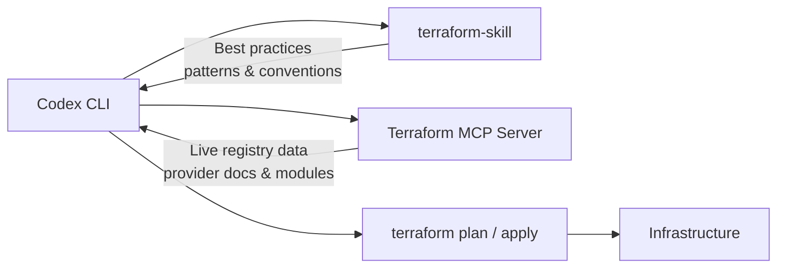
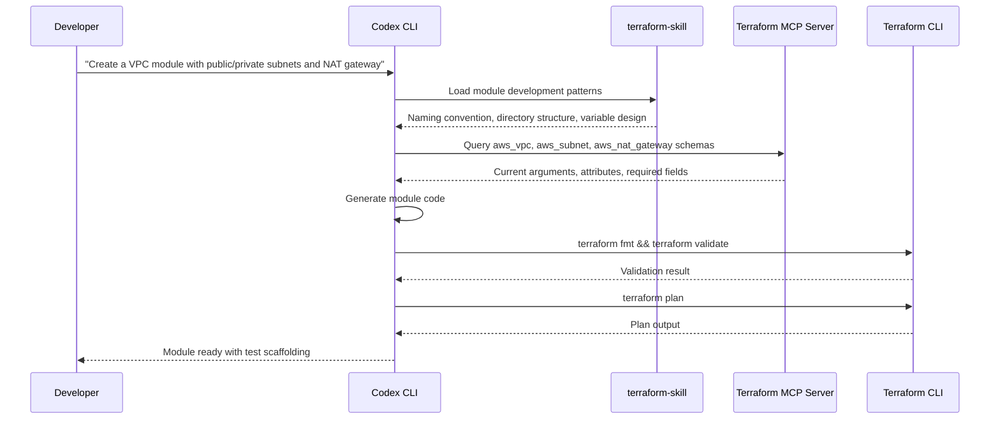

# Infrastructure as Code with Codex CLI: The Terraform Skill, HashiCorp MCP Server, and Agent-Driven IaC Workflows


---

AI coding agents have reshaped application development, yet infrastructure as code remains a domain where hallucinated resource arguments, outdated provider syntax, and phantom module attributes can destroy a production environment in a single `terraform apply`. Two complementary extensions — Anton Babenko's **terraform-skill** and HashiCorp's official **Terraform MCP Server** — close that gap by grounding Codex CLI in real documentation and live registry data. This article explains how to wire them together for production-grade IaC workflows.

## The Problem: Stale Training Data Meets Infrastructure

Large language models learn Terraform syntax from training corpora that inevitably lag behind provider releases. A model trained on AWS provider v4 documentation will cheerfully generate `aws_s3_bucket` configurations using inline `acl` arguments deprecated since v4.0 [^1]. In infrastructure work, these silent errors compile, plan cleanly, and detonate at apply time — or worse, at 3 a.m. when a security group rule references a removed attribute.

The solution is to give the agent access to **current** documentation at inference time rather than relying on frozen weights.

## Two Pillars: Skill + MCP Server



The terraform-skill provides **conventions and patterns** — how to structure modules, write tests, configure CI/CD pipelines, and avoid anti-patterns [^2]. The Terraform MCP Server provides **live data** — current provider schemas, resource arguments, module inputs/outputs, and Sentinel policies from the Terraform Registry [^3]. Together, they ensure Codex generates syntactically correct, idiomatically sound infrastructure code.

## Installing the Terraform Skill

The terraform-skill follows the standard agent skill directory convention. Clone it into Codex's user-scope skill directory:

```bash
git clone https://github.com/antonbabenko/terraform-skill.git \
  ~/.agents/skills/terraform-skill
```

Codex auto-discovers skills from `~/.agents/skills/` on session startup [^4]. The skill uses progressive disclosure — Codex initially loads only the skill's name and description (consuming roughly 2% of the context window), then pulls in detailed guides on demand when the task requires them [^4].

For project-scoped installation, clone into `.agents/skills/terraform-skill` at the repository root. This ensures every team member working in the repo gets consistent IaC guidance without manual setup.

The skill covers six domains [^2]:

| Domain | What It Provides |
|--------|-----------------|
| Testing | Native Terraform tests (1.6+) vs Terratest comparison matrices |
| Module development | `terraform-<PROVIDER>-<NAME>` naming, directory structure, versioning |
| State management | Remote backends (S3, Azure, GCS), locking, multi-team isolation |
| CI/CD | GitHub Actions, GitLab CI, Atlantis, Infracost, Trivy/Checkov |
| Security & compliance | Policy-as-code, secrets management, encryption |
| Patterns & anti-patterns | Side-by-side correct vs incorrect examples |

## Configuring the Terraform MCP Server

Add the HashiCorp MCP server to your Codex configuration. For the stdio transport:

```toml
# ~/.codex/config.toml

[mcp_servers.terraform]
command = "terraform-mcp-server"
args    = ["stdio"]
env     = { TFE_TOKEN = "your-hcp-terraform-token" }
```

For HTTP transport (useful when sharing a single server instance across tools):

```toml
[mcp_servers.terraform]
url = "http://127.0.0.1:8080"
```

The server exposes tools for [^3]:

- **Provider documentation search** — retrieves current resource schemas, argument references, and attribute descriptions directly from the Terraform Registry
- **Module discovery** — finds modules with their inputs, outputs, dependencies, and usage examples
- **Sentinel policy lookup** — locates governance policies for compliance requirements
- **Workspace management** — lists, creates, and modifies HCP Terraform or Terraform Enterprise workspaces (including variables, tags, and run triggers)

Verify the connection within a Codex session by running `/mcp` in the TUI to confirm the terraform server appears in the active server list [^5].

## AGENTS.md for IaC Repositories

Ground rules for infrastructure repositories belong in `AGENTS.md` at the repo root. A minimal but effective configuration:

```markdown
# AGENTS.md

## Terraform Conventions
- All resources MUST use the project naming prefix: `${var.project}-${var.environment}-`
- Never use inline `acl` on S3 buckets; use `aws_s3_bucket_acl` resources instead
- All modules MUST follow `terraform-<provider>-<name>` naming
- State backend configuration is in `backend.tf` — do not modify without approval
- Run `terraform fmt` and `terraform validate` before presenting any changes
- Tag every resource with `managed_by = "terraform"` and `environment = var.environment`

## Testing Requirements
- New modules require at least one native Terraform test in `tests/`
- Integration tests use Terratest in `test/` with cleanup teardown

## Forbidden Operations
- Never run `terraform destroy` or remove lifecycle blocks
- Never hardcode AWS account IDs, regions, or credentials
- Never modify `.terraform.lock.hcl` manually
```

These constraints bind across all Codex sessions in the repository, preventing the agent from generating code that violates team standards [^6].

## Workflow: Module Creation with Dual Grounding

Here is a practical workflow combining both extensions. Suppose you need a new AWS VPC module:



The skill ensures the module follows `terraform-aws-vpc` naming, uses separate files for `variables.tf`, `outputs.tf`, and `main.tf`, and includes a `versions.tf` with provider constraints [^2]. The MCP server ensures every resource argument matches the current AWS provider schema rather than hallucinated attributes from training data [^3].

## PreToolUse Hooks for Safety

Codex hooks add a deterministic safety layer around Terraform operations. Configure a `PreToolUse` hook to prevent destructive operations:

```toml
# ~/.codex/config.toml

[[hooks]]
event = "PreToolUse"
tool  = "shell"
command = """
if echo "$INPUT" | grep -qE 'terraform\\s+(destroy|taint|untaint|import)'; then
  echo "DENY: Destructive Terraform commands require manual execution"
  exit 1
fi
"""
```

A `PostToolUse` hook can enforce validation after every file write:

```toml
[[hooks]]
event = "PostToolUse"
tool  = "write_file"
command = """
if echo "$INPUT" | grep -qE '\\.tf$'; then
  cd "$(dirname "$INPUT")" && terraform fmt -check && terraform validate
fi
"""
```

These hooks run deterministically — no model reasoning involved — providing a hard boundary the agent cannot circumvent [^7].

## OpenTofu Compatibility

The terraform-skill supports both Terraform 1.0+ and OpenTofu 1.6+ [^2]. OpenTofu uses identical HCL syntax and the same state format; only the CLI binary name differs (`tofu` vs `terraform`) [^8]. If your organisation has moved to OpenTofu following HashiCorp's BSL licence change, adjust your AGENTS.md accordingly:

```markdown
## CLI
- Use `tofu` instead of `terraform` for all commands
- The OpenTofu Registry at registry.opentofu.org is the primary module source
```

The Terraform MCP Server currently queries the HashiCorp Registry. For teams on OpenTofu, provider documentation remains compatible since OpenTofu providers share the same schema definitions, but module discovery may return HashiCorp Registry results rather than OpenTofu Registry modules [^3]. ⚠️ There is no official OpenTofu MCP server at the time of writing; teams relying exclusively on the OpenTofu Registry should verify module availability manually.

## Cost Estimation and Security Scanning

The terraform-skill includes CI/CD patterns for Infracost (cost estimation) and Trivy/Checkov (security scanning) [^2]. A typical Codex-driven workflow integrates these as validation gates:

```bash
# After Codex generates Terraform code
codex exec "Run infracost breakdown on the modules/ directory \
  and flag any resources exceeding $100/month. \
  Then run checkov on all .tf files and fix any HIGH severity findings."
```

The structured output from `codex exec --json` reports reasoning-token usage, making it straightforward to track cost-of-generation alongside cost-of-infrastructure [^9].

## Model Selection for IaC Work

Infrastructure code demands precision over speed. The recommended model routing for Terraform workflows:

| Task | Recommended Model | Rationale |
|------|------------------|-----------|
| Module scaffolding | GPT-5.5 | Complex multi-resource composition benefits from full reasoning [^10] |
| Variable/output additions | GPT-5.3-Codex-Spark | Simple, targeted edits suit the speed-optimised model [^11] |
| Security remediation | GPT-5.5 | Policy compliance requires deep contextual understanding |
| Documentation generation | GPT-5.4 | Balanced cost and quality for prose generation |

Switch models mid-session with `/model` in the TUI or set defaults per project in `.codex/config.toml`:

```toml
model = "gpt-5.5"
```

## Current Limitations

- **Terraform MCP Server is in beta** — HashiCorp does not recommend it for production environments yet [^3]. Test thoroughly before relying on it for critical infrastructure pipelines.
- **No plan/apply from sandbox** — the Codex sandbox restricts network access by default, preventing `terraform init` from downloading providers. Use `--add-dir` to grant access to the `.terraform` directory and configure network allowlists for registry endpoints [^12].
- **State file sensitivity** — Codex should never read state files directly, as they may contain secrets. Add `terraform.tfstate*` to your deny-read policies [^13].
- **Skill currency lag** — the terraform-skill tracks terraform-best-practices.com patterns but may lag behind the latest provider releases. Combine with the MCP server to compensate.
- **No OpenTofu MCP server** — teams exclusively on OpenTofu lack a dedicated MCP server for registry queries. ⚠️

## Conclusion

The combination of terraform-skill (conventions) and the Terraform MCP Server (live data) transforms Codex CLI from a confident-but-unreliable IaC generator into a grounded infrastructure assistant. The skill ensures your modules follow established patterns; the MCP server ensures every resource argument exists in the current provider version. Add AGENTS.md constraints and PreToolUse hooks, and you have a layered defence that catches errors before they reach `terraform plan` — let alone production.

---

## Citations

[^1]: HashiCorp, "Terraform AWS Provider v4.0 Upgrade Guide — S3 Bucket Refactoring," HashiCorp Developer, [https://developer.hashicorp.com/terraform/language/upgrade-guides](https://developer.hashicorp.com/terraform/language/upgrade-guides)

[^2]: A. Babenko, "terraform-skill: Terraform & OpenTofu Skill for AI Agents," GitHub, [https://github.com/antonbabenko/terraform-skill](https://github.com/antonbabenko/terraform-skill)

[^3]: HashiCorp, "Terraform MCP Server Overview," HashiCorp Developer, [https://developer.hashicorp.com/terraform/mcp-server](https://developer.hashicorp.com/terraform/mcp-server)

[^4]: OpenAI, "Skills — Codex CLI," OpenAI Developers, [https://developers.openai.com/codex/skills](https://developers.openai.com/codex/skills)

[^5]: OpenAI, "MCP — Codex CLI," OpenAI Developers, [https://developers.openai.com/codex/mcp](https://developers.openai.com/codex/mcp)

[^6]: OpenAI, "AGENTS.md Guide — Codex CLI," OpenAI Developers, [https://developers.openai.com/codex/agents-md](https://developers.openai.com/codex/agents-md)

[^7]: OpenAI, "Hooks — Codex CLI," OpenAI Developers, [https://developers.openai.com/codex/hooks](https://developers.openai.com/codex/hooks)

[^8]: OpenTofu, "OpenTofu vs Terraform Migration Guide," [https://opentofu.org/docs/intro/migration/](https://opentofu.org/docs/intro/migration/)

[^9]: OpenAI, "Non-interactive Mode — Codex CLI," OpenAI Developers, [https://developers.openai.com/codex/cli/non-interactive](https://developers.openai.com/codex/cli/non-interactive)

[^10]: OpenAI, "Models — Codex," OpenAI Developers, [https://developers.openai.com/codex/models](https://developers.openai.com/codex/models)

[^11]: OpenAI, "Introducing GPT-5.3-Codex-Spark," [https://openai.com/index/introducing-gpt-5-3-codex-spark/](https://openai.com/index/introducing-gpt-5-3-codex-spark/)

[^12]: OpenAI, "Sandbox — Codex CLI," OpenAI Developers, [https://developers.openai.com/codex/concepts/sandboxing](https://developers.openai.com/codex/concepts/sandboxing)

[^13]: OpenAI, "Agent Approvals & Security — Codex CLI," OpenAI Developers, [https://developers.openai.com/codex/concepts/agent-approvals-and-security](https://developers.openai.com/codex/concepts/agent-approvals-and-security)
