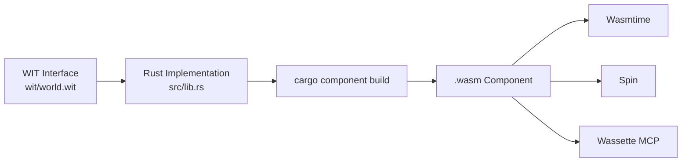

# Codex CLI for WebAssembly Development: Rust-to-Wasm Workflows, Wassette MCP, and the Component Model


---

WebAssembly has crossed the threshold from browser curiosity to production infrastructure. The 2026 State of WebAssembly survey reports 67% of respondents now run Wasm in production, with server-side deployments overtaking browser-only use for the first time at 52%[^1]. WASI Preview 2 stabilised in April 2026[^2], the Component Model is shipping in Wasmtime and Spin, and Rust remains the dominant source language for Wasm modules.

Codex CLI — itself built in Rust[^3] — sits naturally in this ecosystem. This article covers three layers of the Codex-Wasm intersection: using Codex CLI to *develop* WebAssembly modules, using Wasm components as *tools inside* Codex via Wassette, and the emerging pattern of distributing agent capabilities as portable Wasm binaries.

## Setting Up the Wasm Toolchain

A Rust-to-Wasm project needs `rustup`, the `wasm32-unknown-unknown` or `wasm32-wasip2` target, `wasm-pack` (v0.13+), and `wasm-bindgen` (v0.2.120 as of April 2026)[^4]. The sandbox must be able to reach these tools.

### Sandbox Configuration

Codex CLI's sandbox restricts filesystem and network access by default. For Wasm cross-compilation, you need the Rust toolchain directories on the allow list and network access for `cargo` registry fetches during the first build:

```toml
# .codex/config.toml (project-scoped)
sandbox_mode = "workspace-write"

[sandbox]
add_dirs = [
  "~/.rustup:ro",
  "~/.cargo:rw",
]
```

On Linux, Codex uses Bubblewrap for isolation[^5]. The `add_dirs` entries mount the Rust toolchain read-only and the Cargo cache read-write, so `cargo build --target wasm32-wasip2` can resolve dependencies and compile without escaping the sandbox boundary.

### AGENTS.md for Wasm Projects

An `AGENTS.md` file in the repository root anchors Codex's behaviour to Wasm conventions:

```markdown
# AGENTS.md

## Build
- Target: `wasm32-wasip2` for WASI components, `wasm32-unknown-unknown` for browser modules.
- Build command: `cargo component build --release` (WASI) or `wasm-pack build --target web` (browser).
- Always run `cargo clippy --target <target>` before committing.

## Testing
- Use `cargo component test` for WASI component tests.
- For browser targets, run `wasm-pack test --headless --chrome`.

## Conventions
- Export interfaces via WIT files in the `wit/` directory.
- Never commit `.wasm` binaries — build artefacts belong in CI.
- Pin wasm-bindgen version in Cargo.toml to match the CLI version exactly.
```

This prevents the model from defaulting to native compilation or generating code that targets the wrong Wasm interface.

## Rust-to-Wasm Workflow Patterns

### Browser Module Generation

The most common pattern is scaffolding a Rust library that compiles to a browser-consumable Wasm module via `wasm-pack`:

```bash
codex exec -a full-auto \
  "Create a Rust library that exports a markdown_to_html function \
   using pulldown-cmark. Target wasm32-unknown-unknown with wasm-pack. \
   Include wasm-bindgen annotations and a package.json for npm publishing. \
   Run wasm-pack build --target web and verify the pkg/ output compiles."
```

Codex will scaffold `Cargo.toml` with `crate-type = ["cdylib"]`, add `wasm-bindgen` annotations, configure `wasm-pack`, and run the build inside the sandbox. The structured output from `codex exec --json` reports reasoning-token usage[^6], useful for tracking cost on iterative Wasm compilation cycles.

### WASI Component Model

WASI Preview 2's Component Model introduces WIT (WebAssembly Interface Types) — a formal type system for inter-module communication covering strings, records, enums, options, results, and resource handles[^7]. Codex CLI can scaffold WIT interfaces and the corresponding Rust implementations:

```bash
codex exec -a full-auto \
  "Create a WASI component that exports a 'process' function \
   accepting a string and returning a result<string, string>. \
   Write the WIT file in wit/world.wit, implement in src/lib.rs \
   using cargo-component, and run cargo component build --release."
```

The `wasm32-wasip2` target — stabilised in Rust 1.85[^8] — generates a Component Model binary that any WASI-compliant runtime (Wasmtime, Spin, WasmEdge) can load.



## Wassette: Wasm Components as Agent Tools

The most distinctive angle in the Codex-Wasm story is **Wassette** — Microsoft's MCP server that executes WebAssembly Components as agent tools[^9]. Released in August 2025 and now at v0.3.4, Wassette translates each exported function from a Wasm Component into an individual MCP tool, giving Codex CLI access to sandboxed, portable capabilities.

### Configuration

Add Wassette as an MCP server for Codex CLI:

```bash
codex mcp add wassette -- wassette serve --stdio
```

Or configure it directly in `config.toml`:

```toml
[mcp_servers.wassette]
command = "wassette"
args = ["serve", "--stdio"]
```

Once registered, Codex discovers all tools exposed by loaded Wasm components via `/mcp` in the TUI[^10].

### Fetching Components from OCI Registries

Wassette can pull Wasm Components directly from OCI-compliant container registries[^11]. This means an agent can dynamically obtain a tool, execute it in a Wasmtime sandbox with deny-by-default permissions, and discard it afterwards — no host-level installation, no persistent state, no supply-chain risk from native binaries:

```bash
wassette serve --stdio \
  --component oci://ghcr.io/example/csv-parser:latest \
  --component oci://ghcr.io/example/json-validator:latest
```

Each component runs with browser-grade isolation: no filesystem access, no network access, and no ambient authority unless explicitly granted through Wassette's permission system[^12].

### Building Custom Tools

The development loop for creating Wasm-based agent tools combines both sides of the Codex-Wasm story:

1. **Scaffold** the Wasm component with Codex CLI, using WIT to define the tool interface.
2. **Build** with `cargo component build --release`.
3. **Test** with the MCP Inspector: `npx @modelcontextprotocol/inspector --cli wassette serve --stdio --component ./target/wasm32-wasip2/release/my_tool.wasm`.
4. **Publish** to an OCI registry: `wasm-tools compose` and `oras push`.
5. **Consume** in Codex CLI via the Wassette MCP server.

This creates a virtuous cycle: Codex CLI generates the Wasm tools that Codex CLI then uses.

## The Wasm Tool Distribution Model

The broader pattern emerging in 2026 is **Wasm as the universal tool format for AI agents**. Instead of shipping capabilities as Python packages, npm modules, or Docker containers, teams distribute portable WebAssembly Components that any MCP-compatible agent can load[^13].

The advantages for agent tooling are structural:

| Property | Native Binary | Docker Container | Wasm Component |
|---|---|---|---|
| Startup latency | ~0ms | 500ms–2s | ~5ms |
| Isolation | None | Process-level | Capability-based |
| Portability | Platform-specific | Linux-only (mostly) | Universal |
| Size | Varies | 50MB+ | Typically <5MB |
| Supply-chain auditability | Low | Medium | High (single binary) |

Fermyon's Spin v3.5 shipped the first release candidate for WASI Preview 3 with native async I/O[^14], and WASI 1.0 — the stable long-term standard — is planned for later in 2026[^15]. As these standards solidify, the Wasm Component becomes an increasingly attractive distribution format for the agent skills ecosystem.

## Model Selection and Cost

Wasm development involves two distinct phases with different model requirements:

- **Scaffolding and WIT design**: Use `o4-mini` or `gpt-5.3-codex-spark` for fast iteration on interface definitions and boilerplate. The 128k context window is sufficient for most single-component work[^16].
- **Complex implementation**: Switch to `gpt-5.4` or `gpt-5.5` for implementing algorithms, optimising hot paths, or debugging cross-compilation issues where deeper reasoning pays off[^17].

Profile switching makes this seamless:

```toml
[profiles.wasm-scaffold]
model = "gpt-5.3-codex-spark"
model_reasoning_effort = "medium"

[profiles.wasm-deep]
model = "gpt-5.5"
model_reasoning_effort = "high"
```

## Current Limitations

- **No in-sandbox Wasm runtime testing**: Codex CLI's sandbox does not ship Wasmtime or Spin. You can compile Wasm modules inside the sandbox, but running them requires `add_dirs` access to a host-installed runtime or a PostToolUse hook that invokes the runtime externally.
- **WIT complexity**: The Component Model's type system is expressive but verbose. Models occasionally generate invalid WIT syntax, particularly around resource handles and async interfaces. AGENTS.md constraints with WIT examples help.
- **wasm-bindgen version pinning**: A mismatch between the `wasm-bindgen` crate version and the CLI version produces cryptic build failures. Pin both explicitly in your AGENTS.md.
- **Wassette is stdio-only for CLI**: ⚠️ Wassette supports HTTP transport for some clients, but Codex CLI integration currently uses stdio transport only. HTTP transport support for Codex CLI's MCP configuration is available but untested with Wassette specifically.

## Citations

[^1]: [State of WebAssembly Survey 2026](https://blog.nicholasharvey.com/series/state-of-webassembly) — 67% production adoption, server-side overtaking browser-only.
[^2]: [WASI Preview 2 Stability Announcement](https://www.programming-helper.com/tech/wasi-preview-2-2026-webassembly-system-interface-security) — Listed as stable April 28, 2026.
[^3]: [OpenAI Codex CLI — Built in Rust](https://github.com/openai/codex/blob/main/codex-rs/README.md) — Rust implementation is the maintained CLI.
[^4]: [wasm-bindgen v0.2.120](https://crates.io/crates/wasm-bindgen) — Released April 28, 2026.
[^5]: [Codex CLI Sandbox — Bubblewrap on Linux](https://developers.openai.com/codex/security) — Linux sandbox isolation details.
[^6]: [Codex exec --json Reasoning Tokens](https://developers.openai.com/codex/changelog) — v0.130.0 changelog, May 8, 2026.
[^7]: [Component Model and WIT](https://bytecodealliance.org/articles/webassembly-the-updated-roadmap-for-developers) — Bytecode Alliance roadmap for the Component Model type system.
[^8]: [Rust wasm32-wasip2 Target](https://doc.rust-lang.org/nightly/rustc/platform-support/wasm32-wali-linux.html) — Stabilised wasm64 and wasip2 targets in Rust 1.85.
[^9]: [Wassette: WebAssembly-based tools for AI agents](https://opensource.microsoft.com/blog/2025/08/06/introducing-wassette-webassembly-based-tools-for-ai-agents/) — Microsoft Open Source Blog, August 2025.
[^10]: [Codex CLI MCP Configuration](https://developers.openai.com/codex/mcp) — MCP server setup in config.toml.
[^11]: [Wassette OCI Registry Support](https://github.com/microsoft/wassette) — Fetching Wasm Components from OCI registries.
[^12]: [Wassette Security Model](https://microsoft.github.io/wassette/latest/concepts.html) — Deny-by-default permission system.
[^13]: [Wasm as Universal Tool Format](https://thenewstack.io/webassembly-sandboxing-ai-agents/) — The New Stack on WebAssembly solving AI agent security gaps.
[^14]: [Spin v3.5 WASI Preview 3 RC](https://techbytes.app/posts/wasm-components-wasi-preview-3-edge-optimization-2026/) — Fermyon Spin with async I/O in the Component Model.
[^15]: [WASI 1.0 Roadmap](https://bytecodealliance.org/articles/webassembly-the-updated-roadmap-for-developers) — Stable long-term standard planned for 2026.
[^16]: [Codex-Spark 128k Context](https://developers.openai.com/codex/models) — GPT-5.3-Codex-Spark specifications.
[^17]: [Codex CLI Model Selection](https://developers.openai.com/codex/models) — Model capabilities and routing guidance.
