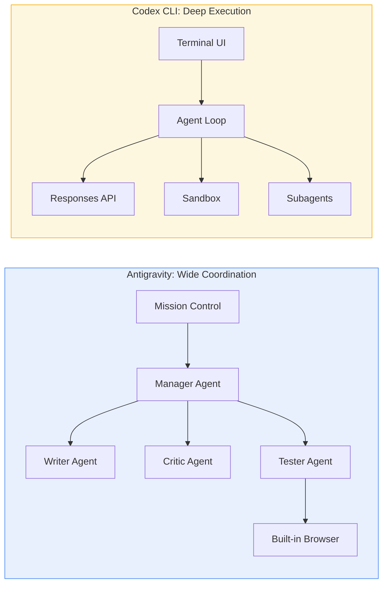
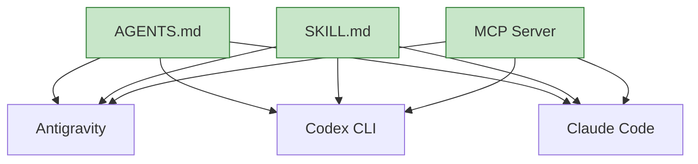

# Google Antigravity vs Codex CLI: Multi-Agent IDE Meets Terminal-First Agent in the 2026 Coding Wars


---

Google Antigravity landed in public preview on 20 November 2025 and has since grown into the most serious IDE-native challenger to terminal-first agents like Codex CLI[^1]. By May 2026 the two tools represent fundamentally different philosophies — wide coordination versus deep execution — yet share a surprising amount of common infrastructure. This article maps the architectural divide, benchmarks where each tool leads, and shows Codex CLI practitioners how to exploit the convergence of AGENTS.md, skills, and MCP across both platforms.

## Two Philosophies of Agentic Coding

Antigravity and Codex CLI sit at opposite ends of the agent-architecture spectrum.

**Antigravity: wide coordination.** A Mission Control surface spawns multiple agents — Manager, Writer, Critic, Tester — that plan, execute, and verify work in parallel across an editor, a terminal, and a built-in Chromium browser[^2]. Each mission is a user-defined goal backed by its own plan, context, and artifact stream. The IDE presents tangible deliverables — task lists, implementation plans, screenshots, browser recordings — rather than raw logs[^1].

**Codex CLI: deep execution.** A single agent loop maximises memory efficiency and execution speed within a sandboxed environment[^3]. The harness iterates through the Responses API, building prompts, executing tool calls, and compacting context automatically when the conversation grows beyond the context window[^4]. Parallelism arrives through subagents and the MultiAgentV2 configuration, but the default mental model is one agent, one deep reasoning chain.



The distinction matters because it shapes every downstream decision: how you structure prompts, how you handle verification, and how you manage cost.

## Model Support and Performance

Both platforms are model-flexible, but their defaults and routing strategies differ.

| Dimension | Antigravity | Codex CLI |
|-----------|------------|-----------|
| **Default model** | Gemini 3 Pro[^1] | GPT-5.5 (recommended)[^5] |
| **Alternative models** | Claude Sonnet 4.5, GPT-OSS[^2] | GPT-5.4, GPT-5.3-Codex-Spark[^5] |
| **Model selection** | Per-mission | Per-session or mid-session via `/model`[^5] |
| **Terminal-Bench 2.0** | Not independently ranked | GPT-5.5: 82.0% (#1 on leaderboard)[^6] |
| **SWE-Bench Verified** | Gemini 3.1 Pro: 80.6%[^2] | GPT-5.3-Codex: ~74.5%[^7] |

Codex CLI dominates Terminal-Bench 2.0, which measures real-world terminal task completion — the exact workflow Codex CLI is optimised for[^6]. Antigravity's Gemini 3.1 Pro edges ahead on SWE-Bench Verified, which rewards multi-file reasoning and planning[^2]. The benchmarks tell the same story as the architecture: Codex CLI goes deeper on single tasks; Antigravity coordinates across broader problem spaces.

## The Convergence Layer: AGENTS.md, Skills, and MCP

Despite their architectural differences, both tools have converged on three shared standards — and this convergence is the most practically important development for teams running both.

### AGENTS.md

Antigravity adopted native AGENTS.md support in v1.20.3 (5 March 2026)[^8]. The format is identical: a Markdown file in the project root that provides coding standards, naming conventions, testing requirements, and project-specific constraints to every agent working in the workspace. A single AGENTS.md file now works across Codex CLI, Antigravity, Claude Code, and Cursor[^8].

```toml
# Codex CLI reads AGENTS.md from the same location
# No configuration needed — both tools auto-discover it
```

For Codex CLI practitioners, this means your existing AGENTS.md files work in Antigravity without modification. The precedence chain differs slightly — Codex CLI walks from `~/.codex/AGENTS.md` down through the directory tree with override semantics[^9] — but the file format is interchangeable.

### Skills (SKILL.md)

Antigravity formally adopted the Agent Skills open standard in January 2026[^10]. Skills are filesystem-based Markdown packages containing metadata (name, description) and instructions. The agent reads metadata at startup and loads full instructions only when a matching task is detected — the same progressive-disclosure pattern Codex CLI uses[^11].

The practical result: a SKILL.md authored for Codex CLI runs unchanged in Antigravity, Claude Code, and Gemini CLI. The `antigravity-awesome-skills` repository catalogues over 1,400 cross-platform skills[^10], and the portability holds because skills are directory-structure-based rather than API-based — any agent that can read a directory and parse Markdown can consume a skill[^10].

### MCP Servers

Both platforms support the Model Context Protocol for tool integration. Antigravity offers a UI-driven MCP Store that automatically updates `mcp_config.json`[^12], whilst Codex CLI configures MCP servers in `config.toml` under `[mcp_servers]` with stdio or HTTP transport[^13]. The same MCP server binary serves both tools — only the configuration wrapper differs.



## Where Each Tool Leads

### Antigravity excels at:

- **Ambiguous requirements.** The Manager-Writer-Critic-Tester pipeline explores alternatives and catches blind spots before code ships[^2]. When requirements are fuzzy, having multiple agents debate approaches outperforms a single deep-reasoning pass.
- **Frontend verification.** The built-in Chromium browser captures screenshots, diffs DOM state against expected output, reads network requests, and verifies basic accessibility (focus order, contrast)[^2]. Codex CLI requires external browser tooling via Playwright MCP or the Chrome DevTools MCP server.
- **Greenfield exploration.** Per-mission model selection lets you route speculative work to cheaper models while reserving Gemini 3.1 Pro for the final pass[^2].

### Codex CLI excels at:

- **Terminal-native workflows.** `codex exec` integrates directly into shell scripts, CI/CD pipelines, and Unix pipes[^14]. There is no IDE to install, no GUI to configure.
- **Deep single-task execution.** The agent loop with automatic context compaction sustains multi-hour reasoning sessions without hitting context limits[^4].
- **Sandbox security.** Platform-specific sandboxing (Seatbelt on macOS, Landlock on Linux) with configurable permission profiles provides deterministic isolation[^15]. Antigravity relies on Google Cloud-managed containers.
- **Open-source extensibility.** The Rust core is publicly available on GitHub, enabling custom harness builds, binary-level debugging, and enterprise auditing[^3].
- **CI/CD automation.** `codex exec --output-schema` produces structured JSON for downstream pipeline consumption — a pattern with no direct Antigravity equivalent for headless server-side execution[^14].

## A Combined Workflow

The most effective teams in 2026 are not choosing one tool exclusively. A three-phase pattern has emerged[^7]:

1. **Planning (Antigravity).** Use Manager View to spawn agents exploring multiple solution approaches. The Critic agent challenges assumptions; the Tester agent validates feasibility against the browser.
2. **Implementation (Codex CLI).** With specs now clear, switch to `codex exec` for high-performance, deep-execution code generation. Feed the AGENTS.md and SKILL.md files both tools share.
3. **Verification (Antigravity).** Return to Antigravity for browser-based acceptance testing, screenshot diffs, and accessibility checks.

This workflow exploits each tool's strength whilst the shared AGENTS.md, skills, and MCP layer eliminates context-switching overhead.

## Pricing and Access

| Plan | Antigravity | Codex CLI |
|------|------------|-----------|
| **Free tier** | Yes (rate-limited)[^2] | Requires ChatGPT Plus (\$20/month) or API key[^5] |
| **Pro** | \$20/month[^2] | Bundled with ChatGPT Plus (\$20/month)[^5] |
| **Credit packs** | \$25 for 2,500 credits[^2] | API usage at standard token rates[^5] |
| **Enterprise** | Google Cloud billing | OpenAI enterprise contracts[^5] |

A notable difference: Antigravity's credit-to-token conversion ratio remains undocumented as of May 2026[^2], making cost prediction harder than Codex CLI's transparent per-token API pricing.

## Current Limitations

**Antigravity:**
- Aggressive rate limits during US working hours in public preview[^2]
- Credit-to-token conversion opaque — cost modelling requires empirical measurement[^2]
- No headless CLI mode for server-side CI/CD integration (community `antigravity-agent` wrapper exists but is unofficial)[^16]
- Closed source — no binary-level auditing for enterprise compliance

**Codex CLI:**
- No built-in browser — frontend verification requires MCP server configuration for Playwright or Chrome DevTools
- Multi-agent orchestration via MultiAgentV2 is less mature than Antigravity's Manager View
- Parallel agent coordination requires explicit `config.toml` configuration (`max_threads`, `max_depth`)[^17]
- Single-vendor model dependency (OpenAI), though Bedrock provider support adds AWS model access[^18]

## Practical Migration Notes for Codex CLI Users

If you are evaluating Antigravity alongside your existing Codex CLI setup:

1. **Your AGENTS.md files are portable.** Copy them to the Antigravity workspace root — they work immediately[^8].
2. **Your SKILL.md files are portable.** Place them in `.agent/skills/` within the workspace or `~/.gemini/antigravity/skills/` globally[^10].
3. **Your MCP servers need re-configuration** — the server binary is the same, but Antigravity uses `mcp_config.json` rather than `config.toml`[^12].
4. **Your Starlark rules do not transfer.** Codex CLI's `.rules` files are tool-specific; Antigravity uses its own rules system[^15].
5. **Your hooks do not transfer.** Codex CLI's `PreToolUse`/`PostToolUse` hooks have no Antigravity equivalent.

## Conclusion

Antigravity and Codex CLI are not interchangeable — they solve different problems. Antigravity's multi-agent coordination and built-in browser make it the stronger choice for ambiguous, frontend-heavy, or exploratory work. Codex CLI's terminal-first architecture, sandbox security, and `codex exec` automation make it the stronger choice for deep implementation, CI/CD pipelines, and security-sensitive environments. The convergence of AGENTS.md, SKILL.md, and MCP means your configuration investment is increasingly portable between them.

The winning strategy is not picking a side. It is understanding the seam between planning and execution, and routing each phase to the tool built for it.

## Citations

[^1]: [Build with Google Antigravity, our new agentic development platform — Google Developers Blog](https://developers.googleblog.com/build-with-google-antigravity-our-new-agentic-development-platform/)
[^2]: [Google Antigravity Guide: Features, Pricing & vs Cursor, Codex — Lushbinary](https://lushbinary.com/blog/google-antigravity-developer-guide-features-pricing-vs-cursor-codex-claude-code/)
[^3]: [openai/codex — GitHub](https://github.com/openai/codex)
[^4]: [Unrolling the Codex agent loop — OpenAI](https://openai.com/index/unrolling-the-codex-agent-loop/)
[^5]: [Models — Codex — OpenAI Developers](https://developers.openai.com/codex/models)
[^6]: [Terminal-Bench 2.0 Leaderboard](https://www.tbench.ai/leaderboard/terminal-bench/2.0)
[^7]: [AI Coding Agents 2026: Claude Code vs Antigravity vs Codex vs Cursor vs Kiro vs Copilot vs Windsurf — Lushbinary](https://lushbinary.com/blog/ai-coding-agents-comparison-cursor-windsurf-claude-copilot-kiro-2026/)
[^8]: [AGENTS.md Guide: Cross-Tool Rules for Antigravity — Antigravity.codes](https://antigravity.codes/blog/antigravity-agents-md-guide)
[^9]: [Custom instructions with AGENTS.md — Codex — OpenAI Developers](https://developers.openai.com/codex/guides/agents-md)
[^10]: [antigravity-awesome-skills — GitHub](https://github.com/sickn33/antigravity-awesome-skills)
[^11]: [Skills — Codex — OpenAI Developers](https://developers.openai.com/codex/skills)
[^12]: [MCP Integration — Antigravity Editor](https://antigravity.google/docs/mcp)
[^13]: [MCP — Codex — OpenAI Developers](https://developers.openai.com/codex/mcp)
[^14]: [Non-interactive mode — Codex — OpenAI Developers](https://developers.openai.com/codex/noninteractive)
[^15]: [Agent approvals & security — Codex — OpenAI Developers](https://developers.openai.com/codex/agent-approvals-security)
[^16]: [antigravity-agent — GitHub](https://github.com/kaycke1337/antigravity-agent)
[^17]: [Subagents — Codex — OpenAI Developers](https://developers.openai.com/codex/subagents)
[^18]: [Changelog — Codex — OpenAI Developers](https://developers.openai.com/codex/changelog)
