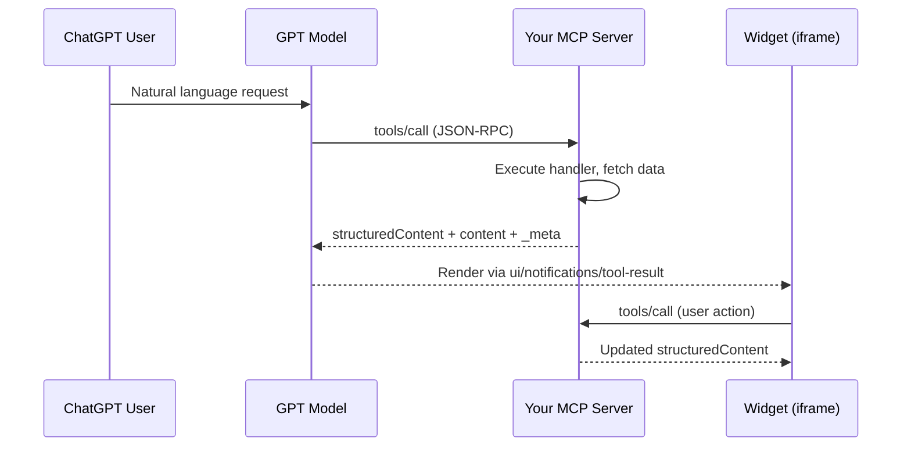
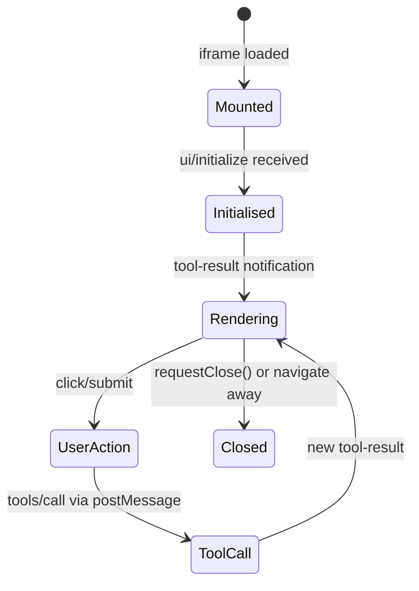

# Building ChatGPT Apps with Codex CLI: Scaffolding MCP Servers, Widgets, and the Apps SDK Workflow


---

OpenAI's Apps SDK turns ChatGPT into a platform. Rather than building standalone web applications that happen to call the API, developers now build *inside* ChatGPT — defining MCP tools that the model invokes on the user's behalf and optional widget UIs that render in ChatGPT's iframe[^1]. The official Codex use case "Bring your app to ChatGPT" documents a phased workflow for this, and Codex CLI is the natural tool for executing it[^2]. This article walks through the architecture, the agent-assisted scaffolding workflow, and the practical patterns that make the difference between a demo and a shippable app.

## The Apps SDK Architecture

A ChatGPT app comprises three components that communicate through the MCP Apps standard[^1][^3]:



The **MCP server** defines tools, enforces authentication, returns data, and references UI bundles. Each tool has a Zod-typed input/output schema, tool annotations describing side-effects, and optional `_meta` linking to a widget resource URI[^3].

The **widget** is an HTML/JS/React bundle registered as an MCP resource with MIME type `text/html;profile=mcp-app`. It renders inside ChatGPT's iframe and communicates bidirectionally via JSON-RPC 2.0 over `postMessage`[^4].

The **model** decides when to invoke tools based on tool metadata — names, descriptions, and annotations you provide. It never sees `_meta` payloads, only `structuredContent` and `content`[^3].

## Three Response Channels

Every tool response carries three parallel payloads, and understanding the separation is critical[^3]:

| Channel | Consumer | Purpose |
|---|---|---|
| `structuredContent` | Model + Widget | Concise JSON the model reasons over and the widget renders |
| `content` | Model only | Optional Markdown narration for the conversational response |
| `_meta` | Widget only | Large or sensitive data (full records, tokens, timestamps) that must not reach the model |

This three-channel design prevents context bloat. A kanban board tool, for instance, returns five tasks per column in `structuredContent` for the model to summarise, but ships the full task objects with metadata in `_meta` for the widget to render[^3].

## The Codex-Assisted Build Workflow

The official "Bring your app to ChatGPT" use case prescribes five phases[^2]. Here is how each maps to Codex CLI patterns:

### Phase 1: Plan Before Scaffolding

Start with a planning prompt rather than jumping to code:

```bash
codex "I'm building a ChatGPT app for [domain]. Plan the MCP server: \
  define one core user outcome, propose 3-5 tools with names, descriptions, \
  input/output schemas, and annotations. Decide whether v1 needs a widget \
  or can remain data-only. Write the plan to PLAN.md."
```

The key constraint from the official guidance: define a *single* core user outcome first[^2]. Porting an entire product into ChatGPT is the most common failure mode. A Jira integration, for example, should start with "show my assigned tickets" — not "replicate the full Jira experience."

### Phase 2: Scaffold the MCP Server

With the plan in hand, use Codex to generate the server skeleton. Install the official ChatGPT Apps skill first[^2]:

```bash
codex "Read PLAN.md. Scaffold a TypeScript MCP server using \
  @modelcontextprotocol/sdk and @modelcontextprotocol/ext-apps. \
  Register tools with Zod schemas matching the plan. Add tool annotations \
  (readOnlyHint, openWorldHint, destructiveHint) for each tool. \
  Expose the /mcp HTTP endpoint with CORS support."
```

The SDK provides `registerAppTool` and `registerAppResource` helpers that handle JSON-RPC plumbing[^3]. A minimal tool registration looks like this:

```typescript
import { registerAppTool } from "@modelcontextprotocol/ext-apps/server";
import { z } from "zod";

registerAppTool(
  server,
  "list-tickets",
  {
    title: "List assigned tickets",
    inputSchema: { project: z.string().optional() },
    outputSchema: {
      tickets: z.array(z.object({
        id: z.string(),
        title: z.string(),
        status: z.enum(["todo", "in-progress", "done"]),
      })),
    },
    annotations: {
      readOnlyHint: true,
      openWorldHint: false,
      destructiveHint: false,
    },
    _meta: {
      ui: { resourceUri: "ui://widget/ticket-board.html" },
      "openai/toolInvocation/invoking": "Fetching your tickets…",
    },
  },
  async ({ project }) => {
    const tickets = await fetchTickets(project);
    return {
      structuredContent: { tickets: tickets.slice(0, 10) },
      content: [{ type: "text", text: `Found ${tickets.length} tickets.` }],
      _meta: { fullTickets: tickets },
    };
  }
);
```

### Phase 3: Build the Widget

For apps that need visual output, scaffold the widget bundle:

```bash
codex "Create a React widget in web/ that listens for \
  ui/notifications/tool-result via postMessage, renders the \
  ticket board from structuredContent, and calls tools/call \
  for user actions like status updates. Bundle with esbuild \
  and register as an MCP resource in the server."
```

The widget lifecycle follows a predictable pattern[^4]:



The bridge communication uses `window.parent.postMessage` with JSON-RPC 2.0 format. Widgets receive data through `ui/notifications/tool-result` and trigger actions through `tools/call`[^4]. ChatGPT-specific extensions like `window.openai.uploadFile()`, `requestDisplayMode()`, and `requestCheckout()` are available but should be used sparingly to maintain MCP Apps portability[^4].

### Phase 4: Add Authentication

The official guidance is clear: implement OAuth only *after* validating the core tool flow works[^2]. ChatGPT manages the OAuth 2.1 token lifecycle — your server receives a `Bearer` token header with each MCP request[^5].

```bash
codex "Add OAuth 2.1 authentication to the MCP server. \
  Keep read-only tools anonymous. Require auth only for \
  write-action tools. Follow the ChatGPT OAuth flow where \
  ChatGPT manages tokens and sends Authorization: Bearer headers."
```

### Phase 5: Test and Deploy

Test locally using the MCP Inspector before connecting to ChatGPT[^1]:

```bash
npx @modelcontextprotocol/inspector@latest \
  --server-url http://localhost:8787/mcp
```

Then expose via HTTPS tunnel for ChatGPT developer mode testing:

```bash
ngrok http 8787
```

Enable developer mode in ChatGPT Settings → Apps & Connectors, create a connector with the ngrok HTTPS URL, and test the full flow[^1].

For production deployment, Codex can generate infrastructure configuration targeting Vercel, Cloudflare Workers, or Fly.io:

```bash
codex exec "Generate a Vercel deployment config for the MCP server \
  in server/. Ensure the /mcp endpoint is exposed with streaming \
  support and the widget assets are served with correct CSP headers." \
  --sandbox workspace-write
```

## State Management: The Three-Layer Model

ChatGPT apps manage three distinct state categories, and mixing them is a common source of bugs[^6]:

| Layer | Owner | Lifetime | Example |
|---|---|---|---|
| Business data | MCP server/backend | Persistent | Tasks, orders, documents |
| UI state | Widget instance | Current widget | Selected row, expanded panel |
| Cross-session | Your backend | Across conversations | Saved filters, preferences |

The cardinal rule: **business data lives on your server, never in the widget**[^6]. After every mutation, return the updated authoritative state in `structuredContent` so both the model and widget stay consistent.

For optional widget state persistence, the `window.openai.widgetState` and `window.openai.setWidgetState()` APIs allow ephemeral UI state to survive minor widget remounts[^6].

## Content Security Policy

Widget CSP configuration is declared in the resource `_meta` and controls what the iframe can access[^3]:

```typescript
_meta: {
  ui: {
    domain: "https://myapp.example.com",
    csp: {
      connectDomains: ["https://api.myapp.example.com"],
      resourceDomains: ["https://*.oaistatic.com"],
      // frameDomains: [] — avoid unless absolutely necessary
    },
  },
}
```

Declaring `frameDomains` triggers heightened review scrutiny. Avoid sub-iframes unless they are core to the experience[^3].

## Tool Annotations Matter

Tool annotations directly affect how ChatGPT presents confirmation prompts and manages user trust[^3]:

```typescript
annotations: {
  readOnlyHint: false,    // This tool writes data
  openWorldHint: false,   // Bounded to known targets
  destructiveHint: true,  // Irreversible operation
}
```

Mark retrieval-only tools as `readOnlyHint: true` so ChatGPT can invoke them without user confirmation. Write operations with `destructiveHint: true` trigger explicit confirmation UIs.

## Common Pitfalls

The official use case documentation highlights several failure modes worth internalising[^2]:

1. **Porting entire products** instead of solving one outcome. Start with a single read flow.
2. **Giant implementation prompts**. Split into plan → scaffold → auth → deploy phases.
3. **Building UI before tool contracts**. Wire the MCP tools first, verify with the Inspector, then add widgets.
4. **Ignoring `structuredContent` design**. If the model cannot reason over your tool output, it cannot invoke tools effectively.
5. **Embedding secrets in responses**. Never place API keys, tokens, or credentials in `structuredContent`, `content`, or `_meta`[^3].

## Practical Recommendations

- **Use the ChatGPT Apps skill** in your Codex CLI session for up-to-date SDK guidance[^2]
- **Start data-only**. Many useful apps (weather, analytics, search) need no widget at all
- **Version your resource URIs** when deploying breaking widget changes — ChatGPT caches aggressively[^3]
- **Make handlers idempotent**. The model may retry tool calls[^3]
- **Target sub-second latency** for tool responses. ChatGPT users expect conversational speed[^6]
- **Use `codex exec` with `--output-schema`** to generate typed tool schemas from your data models, then paste into the MCP server definition

## What Comes Next

The Apps SDK is evolving rapidly. The MCP Apps UI standard means widgets built today will run in any compatible host, not just ChatGPT[^4]. Instant Checkout via `requestCheckout()` hints at a commerce platform layer[^4]. And with Codex CLI's iterative repair loops, the build-test-refine cycle for ChatGPT apps can be compressed from days to hours.

The interesting strategic point: Codex CLI is now being used to build extensions *for the platform that hosts Codex itself*. This recursive relationship — where the agent builds the tools the agent will later use — is precisely the kind of compounding leverage that makes the Apps SDK worth investing in now.

## Citations

[^1]: OpenAI, "Apps SDK Quickstart," *OpenAI Developers*, 2026. [https://developers.openai.com/apps-sdk/quickstart](https://developers.openai.com/apps-sdk/quickstart)

[^2]: OpenAI, "Bring your app to ChatGPT — Codex Use Cases," *OpenAI Developers*, 2026. [https://developers.openai.com/codex/use-cases/chatgpt-apps](https://developers.openai.com/codex/use-cases/chatgpt-apps)

[^3]: OpenAI, "Build your MCP server — Apps SDK," *OpenAI Developers*, 2026. [https://developers.openai.com/apps-sdk/build/mcp-server](https://developers.openai.com/apps-sdk/build/mcp-server)

[^4]: OpenAI, "Build your ChatGPT UI — Apps SDK," *OpenAI Developers*, 2026. [https://developers.openai.com/apps-sdk/build/chatgpt-ui](https://developers.openai.com/apps-sdk/build/chatgpt-ui)

[^5]: OpenAI, "MCP Apps compatibility in ChatGPT — Apps SDK," *OpenAI Developers*, 2026. [https://developers.openai.com/apps-sdk/mcp-apps-in-chatgpt](https://developers.openai.com/apps-sdk/mcp-apps-in-chatgpt)

[^6]: OpenAI, "Managing State — Apps SDK," *OpenAI Developers*, 2026. [https://developers.openai.com/apps-sdk/build/state-management](https://developers.openai.com/apps-sdk/build/state-management)
