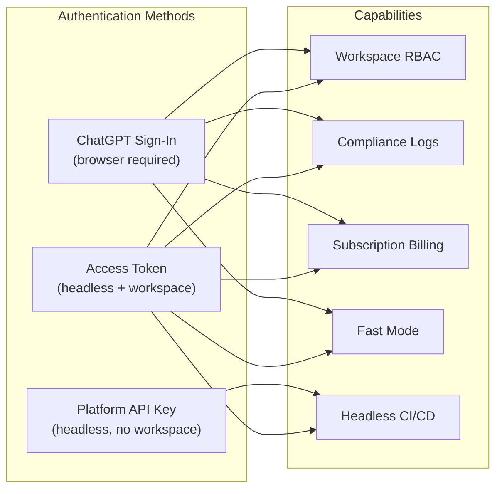
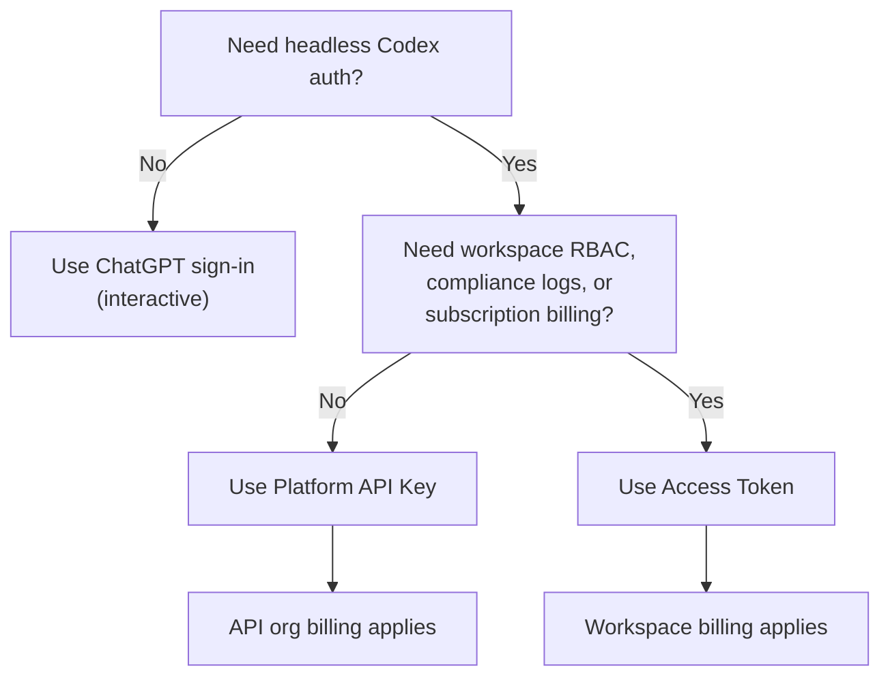

# Codex Access Tokens: Enterprise CI/CD Authentication with Workspace Identity


---

On 5 May 2026 OpenAI shipped **Codex access tokens** — a new credential type that lets ChatGPT Business and Enterprise workspace members generate long-lived tokens for non-interactive `codex exec` workflows without a browser sign-in[^1]. Until this release, teams running Codex in CI/CD pipelines had two choices: Platform API keys (billed at standard API rates, outside workspace governance) or fragile workarounds that copied browser-session credentials into runners. Access tokens close that gap by binding automation runs to a workspace user's identity, RBAC policies, and compliance logs while remaining headless-friendly.

This article covers why the new credential exists, how it differs from the two older auth paths, how to provision and rotate tokens safely, and practical pipeline patterns for GitHub Actions and GitLab CI.

---

## Why a Third Credential Type?

Codex CLI has supported two authentication methods since general availability[^2]:

| Aspect | ChatGPT sign-in | Platform API key |
|--------|-----------------|------------------|
| **Billing** | ChatGPT subscription | Usage-based API rates |
| **Admin controls** | Workspace RBAC, retention, residency | API organisation settings |
| **Data handling** | Enterprise retention policies | API data-sharing rules |
| **Fast mode** | Available | Not available |
| **Headless-friendly** | No — requires a browser | Yes |

The mismatch is obvious: **ChatGPT sign-in** gives you workspace governance but needs a browser; **API keys** are headless-friendly but bypass workspace controls entirely. Access tokens combine the best of both — workspace identity without a browser[^1].



---

## Anatomy of an Access Token

An access token represents a specific workspace user's identity. When a `codex exec` run authenticates with one, the Codex back-end validates the token and associates every action with that user's workspace membership[^1]. This means:

- **Billing** flows through the user's ChatGPT subscription, not a separate API billing account.
- **RBAC** policies apply — if an admin has restricted the user to read-only Codex access, the token inherits that restriction.
- **Compliance logs** record the run under the user's identity in the ChatGPT Compliance Logs Platform[^3].
- **Fast mode** is available if the user's plan supports it, unlike API key auth[^2].

Tokens are opaque bearer strings. Once generated, they cannot be retrieved from the admin UI — only revoked[^1].

---

## Provisioning Tokens

### Prerequisites

1. **Workspace type**: ChatGPT Business or Enterprise[^1].
2. **Admin enablement**: A workspace owner must enable "Allow members to use Codex Local" and, optionally, "Allow members to use Codex access tokens" in **Workspace Settings > Settings and Permissions**[^1].
3. **RBAC assignment**: For selective rollout, assign the access-token permission via a custom role rather than enabling it workspace-wide[^1].

### Creating a Token

Navigate to the **Access tokens** page in Codex settings, select **Create**, and provide:

- **Name** — a descriptive label tied to the workflow, e.g. `release-ci`, `nightly-docs-check`, or `staging-migration-bot`[^1].
- **Expiration** — minimum one day; "No expiration" is available but OpenAI recommend regular rotation[^1].

Copy the token immediately. It is displayed once and cannot be recovered[^1].

### Permission Model

| Role | Create | List | Revoke |
|------|--------|------|--------|
| Workspace owner/admin | Own tokens | All workspace tokens | Any token |
| Member with permission | Own tokens | Own tokens only | Own tokens only |
| Member without permission | — | — | — |

Admins see creator attribution on every token, making it straightforward to audit which automation uses which identity[^1].

---

## Token vs API Key: Decision Framework

Use this decision tree when choosing a credential for automation:



The official guidance is clear: "If a Platform API key works for your automation, keep using API key auth. Use Codex access tokens when the workflow specifically needs ChatGPT workspace access."[^1]

Concrete scenarios where tokens win:

- **Audit trail requirements** — regulated teams need every automated run tied to a named workspace identity.
- **Budget governance** — subscription billing rolls up under the workspace, avoiding separate API spend.
- **Fast-mode access** — API keys cannot use fast mode; tokens inherit the user's plan tier[^2].
- **Managed configuration** — enterprise admins pushing `forced_login_method = "chatgpt"` block API key auth entirely, making tokens the only headless option[^2].

---

## CI/CD Integration Patterns

### Ephemeral Environment Variable

The simplest pattern pipes the token via an environment variable. No persistent credential file is written to disk.

```bash
export CODEX_ACCESS_TOKEN="<access-token>"
codex exec --json --sandbox workspace-write \
  "run tests, fix failures, commit the fix"
```

Progress streams to stderr; the final agent message goes to stdout[^4]. The `--json` flag emits JSON Lines events (`thread.started`, `turn.completed`, `item.*`) for machine parsing[^4].

### GitHub Actions Example


```yaml
name: Codex Nightly Audit
on:
  schedule:
    - cron: '0 3 * * *'

jobs:
  audit:
    runs-on: ubuntu-latest
    steps:
      - uses: actions/checkout@v4

      - name: Install Codex CLI
        run: npm install -g @openai/codex@0.130.0

      - name: Run security audit
        env:
          CODEX_ACCESS_TOKEN: ${{ secrets.CODEX_ACCESS_TOKEN }}
        run: |
          codex exec --sandbox workspace-write \
            --output-schema ./schemas/audit-schema.json \
            -o ./audit-report.json \
            "audit dependencies for known vulnerabilities, \
             produce a JSON report per the schema"

      - name: Upload report
        uses: actions/upload-artifact@v4
        with:
          name: audit-report
          path: ./audit-report.json
```


Store the token in **GitHub Secrets** — never hard-code it in workflow files. For organisation-wide use, prefer **GitHub Organisation Secrets** scoped to specific repositories[^5].

### GitLab CI Example

```yaml
codex-review:
  image: node:22
  stage: review
  variables:
    CODEX_ACCESS_TOKEN: $CODEX_ACCESS_TOKEN
  before_script:
    - npm install -g @openai/codex@0.130.0
  script:
    - codex exec --sandbox workspace-write
        "review the changes in this MR, post inline comments
         for any P1 issues, then summarise findings to stdout"
  rules:
    - if: $CI_PIPELINE_SOURCE == "merge_request_event"
```

In GitLab, store the token as a **CI/CD variable** with the **Masked** and **Protected** flags enabled[^6].

### Persistent Login (Long-Running Runners)

For self-hosted runners that execute multiple Codex jobs, a persistent login avoids re-authenticating on every run:

```bash
printf '%s' "$CODEX_ACCESS_TOKEN" | codex login --with-access-token
codex exec "summarise the last release diff"
```

This writes credentials to `~/.codex/auth.json`. The CLI and IDE extension share the cached credentials, and active sessions refresh tokens proactively before expiry[^2]. Ensure the runner's home directory is not shared across untrusted jobs.

---

## Structured Output in Pipelines

Access tokens pair naturally with `codex exec --output-schema` for pipeline-friendly structured data. Define a JSON Schema contract:

```json
{
  "$schema": "https://json-schema.org/draft/2020-12/schema",
  "type": "object",
  "properties": {
    "summary": { "type": "string" },
    "risk_level": { "enum": ["low", "medium", "high", "critical"] },
    "issues": {
      "type": "array",
      "items": {
        "type": "object",
        "properties": {
          "file": { "type": "string" },
          "line": { "type": "integer" },
          "description": { "type": "string" }
        },
        "required": ["file", "description"]
      }
    }
  },
  "required": ["summary", "risk_level", "issues"]
}
```

Then invoke:

```bash
codex exec --output-schema ./schema.json -o ./result.json \
  "analyse the codebase for security anti-patterns"
```

The agent's final response conforms to the schema, making downstream `jq` or Python parsing deterministic[^4]. Note that `--output-schema` enforcement may be unreliable when MCP servers are active in the session — a known issue tracked on GitHub[^7].

---

## Security Best Practices

### Rotation Workflow

OpenAI recommend rotating tokens regularly, even when "No expiration" is selected[^1]. A safe rotation sequence:

1. **Create** a replacement token with a descriptive name (e.g. `release-ci-2026-05`).
2. **Update** the secret in your CI/CD secret manager.
3. **Smoke-test** with the new token.
4. **Revoke** the old token from the Access tokens page.

Revocation is immediate — no grace period. In-flight runs authenticated with the revoked token will fail on their next API call[^1].

### Least-Privilege Sandbox

Never grant `danger-full-access` unless the runner is fully isolated. Default to `--sandbox workspace-write` for jobs that need to edit files, or omit the flag entirely for read-only analysis[^4]:

```bash
# Read-only analysis — safest default
codex exec "summarise test coverage gaps"

# File edits needed — workspace-write
codex exec --sandbox workspace-write "fix lint errors and commit"

# Full access — only in isolated containers
codex exec --sandbox danger-full-access "install missing system deps and run integration tests"
```

### Runner Isolation

Tokens carry the creating user's full Codex permissions. On shared or public runners:

- **Never** expose tokens to forked-PR workflows — forked PRs can read secrets on some CI platforms[^5].
- **Prefer** ephemeral runners or isolated containers where `~/.codex/auth.json` is not persisted between jobs.
- **Avoid** reusing a single token across unrelated teams — it complicates auditing and makes revocation disruptive[^1].

### Credential Storage Checklist

| Platform | Storage mechanism | Protection flags |
|----------|-------------------|------------------|
| GitHub Actions | Repository/organisation secret | Scoped to environments |
| GitLab CI | CI/CD variable | Masked + Protected |
| Jenkins | Credentials store (Secret text) | Folder-scoped |
| CircleCI | Project environment variable | Restricted contexts |
| Self-hosted | OS keyring or vault (HashiCorp, AWS SM) | Rotate on schedule |

---

## Monitoring and Compliance

Every `codex exec` run authenticated with an access token appears in the **ChatGPT Compliance Logs Platform** under the creating user's identity[^3]. Enterprise admins can:

- **Filter** by user to see which automation jobs ran against which repositories.
- **Correlate** with workspace analytics dashboards for token-count and cost attribution[^8].
- **Export** via the enterprise Analytics API for integration with SIEM platforms[^8].

For teams subject to SOC 2 or ISO 27001, the combination of named-user attribution, workspace-scoped RBAC, and compliance-log integration provides a defensible audit trail that API key auth cannot match.

---

## Limitations and Caveats

- **No fine-grained scoping** — a token grants the same Codex permissions as the creating user. Per-repository or per-action scoping is not yet available[^1].
- **Business and Enterprise only** — Plus and Pro plans cannot generate access tokens[^1].
- **One user, one identity** — tokens cannot represent a service account or team identity; they are always tied to an individual workspace member.
- **No `codex exec resume` token refresh** — if a resumed session outlives the token, re-authentication is required. Ephemeral tokens with short lifespans can hit this edge case.

---

## Practical Recommendations

1. **Start with API keys** for simple automation. Migrate to access tokens only when you need workspace governance, compliance logs, or fast-mode billing.
2. **Name tokens after workflows**, not people — `nightly-audit-prod` is more useful than `jane-ci-key` when rotating credentials six months later.
3. **Set finite expirations** aligned with your rotation cadence. Thirty-day tokens with a calendar reminder to rotate are a reasonable default.
4. **Use `--ephemeral`** in CI jobs to avoid writing session transcripts to the runner's filesystem[^4].
5. **Combine with `--output-schema`** for deterministic pipeline outputs — but test schema enforcement with your MCP server configuration before relying on it in production[^7].
6. **Audit monthly** — have an admin review the workspace token list, revoke any tokens tied to departed employees or decommissioned pipelines.

---

## Citations

[^1]: OpenAI, "Access tokens – Codex," OpenAI Developers, May 2026. [https://developers.openai.com/codex/enterprise/access-tokens](https://developers.openai.com/codex/enterprise/access-tokens)

[^2]: OpenAI, "Authentication – Codex," OpenAI Developers, 2026. [https://developers.openai.com/codex/auth](https://developers.openai.com/codex/auth)

[^3]: OpenAI, "Running Codex safely at OpenAI," OpenAI Blog, May 2026. [https://openai.com/index/running-codex-safely/](https://openai.com/index/running-codex-safely/)

[^4]: OpenAI, "Non-interactive mode – Codex," OpenAI Developers, 2026. [https://developers.openai.com/codex/noninteractive](https://developers.openai.com/codex/noninteractive)

[^5]: GitHub, "Encrypted secrets – GitHub Actions," GitHub Docs, 2026. [https://docs.github.com/en/actions/security-for-github-actions/security-guides/using-secrets-in-github-actions](https://docs.github.com/en/actions/security-for-github-actions/security-guides/using-secrets-in-github-actions)

[^6]: GitLab, "CI/CD variables – GitLab," GitLab Docs, 2026. [https://docs.gitlab.com/ee/ci/variables/](https://docs.gitlab.com/ee/ci/variables/)

[^7]: GitHub, "Issue #15451 — --json and --output-schema are silently ignored when tools/MCP servers are active," openai/codex, 2026. [https://github.com/openai/codex/issues/15451](https://github.com/openai/codex/issues/15451)

[^8]: OpenAI, "Governance – Codex Enterprise," OpenAI Developers, 2026. [https://developers.openai.com/codex/enterprise/governance](https://developers.openai.com/codex/enterprise/governance)
