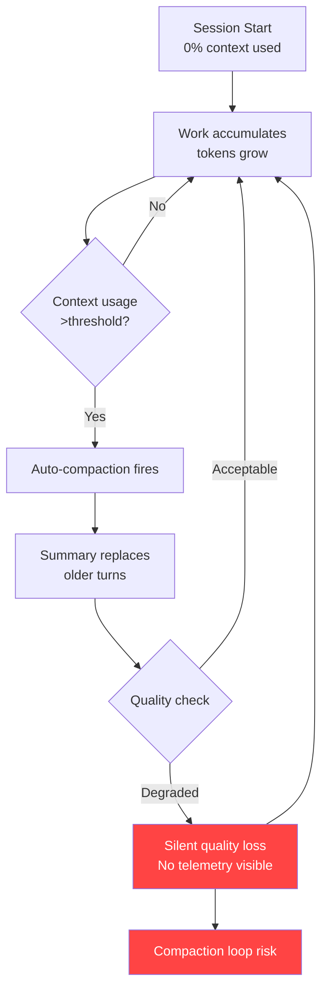

# Context Health Monitoring in Codex CLI: Compaction Telemetry, Degradation Detection, and Long-Session Quality Patterns


---

Long-running Codex CLI sessions are now routine. Multi-hour debugging marathons, `/goal` workflows spanning entire feature branches, and agentic refactoring runs that touch hundreds of files all push context windows to their limits. The problem is not that compaction exists — it is that you cannot see it happening, cannot measure its impact, and cannot tell when your session has silently degraded past the point of usefulness.

This article covers the current state of context health monitoring in Codex CLI as of v0.130, the configuration levers available today, practical patterns for detecting and mitigating degradation, and the community-driven push for proper compaction telemetry.

## The Invisible Degradation Problem

Every Codex CLI session accumulates tokens across three categories: the system prompt and AGENTS.md instructions, tool call inputs and outputs, and the conversational history between you and the model [^1]. When the total approaches the model's context window — 200K tokens for GPT-5.4-codex, up to 1M for GPT-5.5 — compaction fires automatically [^2].

Compaction summarises older conversation turns into a compressed representation, discarding detail to free space. The first compaction is usually benign. The second loses fidelity. By the third, the model may have lost track of architectural decisions made early in the session [^3].

The core issue, as documented in GitHub Issue #22220, is that users currently cannot determine [^4]:

- How many compactions have occurred in the current session
- The current context quality or integrity level
- When the last compaction triggered
- Whether a compaction loop is forming
- How aggressively compression is running relative to available context



## What You Can See Today

Codex CLI does expose some context state, but it requires manual checking.

### The `/status` Command

Running `/status` in the TUI shows current context usage as a percentage [^5]. This is the single most useful signal available today — but it is a point-in-time snapshot, not a trend. You cannot see whether you were at 60% five minutes ago and are now at 92%.

### The Context Percentage Indicator

The TUI status line shows a persistent context usage percentage [^3]. When this climbs past 80%, you are approaching compaction territory. A session sitting at 95% with three compactions behind it will produce measurably worse output than a fresh session with focused context.

### The `codex exec --json` Token Reporting

Since v0.125.0, `codex exec --json` reports reasoning-token usage in the `turn.completed` event [^6]:

```bash
codex exec --json "Refactor the payments module" \
  | jq 'select(.type == "turn.completed") | .usage'
```

This yields `input_tokens`, `cached_input_tokens`, `output_tokens`, and `reasoning_output_tokens` — useful for CI pipelines but not for interactive session monitoring.

## Configuration Levers for Context Management

Three `config.toml` settings directly affect compaction behaviour.

### `model_auto_compact_token_limit`

Sets the token threshold that triggers automatic compaction [^7]. When unset, Codex uses model-specific defaults (typically ~95% of the context window). For projects with large AGENTS.md files, monorepo file maps, or heavy MCP tool schemas, lowering this to 80-85% of context capacity is advisable:

```toml
# config.toml — project-level override
model_auto_compact_token_limit = 160000  # ~80% of 200K window
```

### `compact_prompt`

Overrides the default compaction summarisation prompt [^8]. This only affects the local compaction path — when using OpenAI-hosted models, server-side compaction ignores this setting. A structured handoff prompt preserves more actionable state:

```toml
compact_prompt = """
Summarise this coding session as a structured handoff:
1. Current task and progress percentage
2. Files modified with change descriptions
3. Decisions made and their rationale
4. Blockers encountered
5. Clear next steps as a numbered list
Preserve all variable names, function signatures, and file paths exactly.
"""
```

### `tool_output_token_limit`

Restricts the token budget for individual tool outputs in conversation history [^7]. Large tool outputs — Playwright snapshots, `grep` results across monorepos, full file reads — are the primary cause of rapid context consumption. Setting a reasonable ceiling prevents a single tool call from consuming 20% of your context:

```toml
tool_output_token_limit = 8000
```

## Manual Compaction: The `/compact` Command

Since v0.117.0, `/compact` supports queued follow-up instructions [^9]. This is the single most effective technique for maintaining session quality:

```
/compact Focus on the authentication refactor and the three failing tests.
Preserve the database schema decisions from earlier.
```

The critical insight: **compact at 60% context usage, not 95%** [^3]. Waiting for the automatic trigger means compaction runs under pressure, with less room to produce a high-quality summary. Manual compaction at a natural task boundary — after completing a sub-task, before starting a new file — gives the summariser more breathing room and produces better results.

## Building Your Own Context Health Telemetry

While Codex CLI lacks built-in compaction telemetry, you can approximate it using hooks and external tooling.

### PostToolUse Hooks for Token Monitoring

A PostToolUse hook can log token consumption after each tool call, building a local telemetry trail [^10]:

```toml
# config.toml
[hooks.post_tool_use.context_monitor]
command = "python3 /path/to/context_monitor.py"
```

```python
#!/usr/bin/env python3
# context_monitor.py — log token usage after each tool call
import json, sys, os
from datetime import datetime

data = json.load(sys.stdin)
log_path = os.path.expanduser("~/.codex/context_health.jsonl")

entry = {
    "timestamp": datetime.utcnow().isoformat(),
    "tool": data.get("tool_name", "unknown"),
    "output_tokens": len(data.get("output", "")),
    "session_id": os.environ.get("CODEX_SESSION_ID", "unknown"),
}

with open(log_path, "a") as f:
    f.write(json.dumps(entry) + "\n")
```

### context-mode MCP Server

The `context-mode` MCP server (npm package) sandboxes raw tool output, achieving up to 98% context reduction on outputs like Playwright snapshots, GitHub issue bodies, and log files [^11]. It works across 15 platforms including Codex CLI:

```bash
npm install -g context-mode
```

```json
{
  "mcpServers": {
    "context-mode": {
      "command": "context-mode",
      "args": ["--platform", "codex"]
    }
  }
}
```

Note: Codex CLI's PreToolUse routing currently supports deny rules only. Full input rewriting awaits upstream `updatedInput` support [^11].

### Session Checkpoint Pattern

For critical long-running sessions, create explicit checkpoints by combining `/compact` with a structured prompt and a git commit:

```
/compact CHECKPOINT: Authentication middleware complete.
Files: src/auth/middleware.ts, src/auth/jwt.ts, tests/auth/*.test.ts
All 14 tests passing. Next: rate limiting layer.
```

Then commit your work. If session quality degrades beyond recovery, you can start a fresh session with `--resume` from the checkpoint.

## Detecting Compaction Loops

Compaction loops — where the model compacts, immediately fills context again, and compacts again in rapid succession — are the most dangerous failure mode. They were particularly severe in v0.118, where a regression caused compaction to trigger approximately twice as frequently as in v0.116, doubling or tripling token consumption [^12].

Signs of a compaction loop:

1. **Rapid context percentage oscillation** — watching `/status` shows 95% → 40% → 90% within a few turns
2. **Repeated identical tool calls** — the model re-reads files it already processed, having lost that context to compaction
3. **Token drain** — `codex exec --json` shows reasoning_output_tokens spiking without corresponding useful work
4. **Response quality cliff** — the model starts asking questions it answered earlier in the session

The workaround for v0.118-era loops was to drop reasoning effort from `xhigh` to `high` [^12]. In current versions, the primary defence is proactive manual compaction before the automatic trigger fires.

## The Compaction API: Server-Side vs Local

It is worth understanding that Codex CLI uses two distinct compaction paths [^13]:

| Aspect | Server-Side (Fast Path) | Local Path |
|--------|------------------------|------------|
| **Trigger** | `compact_threshold` in Responses API | `model_auto_compact_token_limit` |
| **Summarisation** | OpenAI-hosted, opaque | Local model call, configurable |
| **`compact_prompt` respected?** | No | Yes |
| **Output format** | Encrypted compaction block | Readable summary |
| **User control** | Minimal | Full |

When using OpenAI-hosted models (the default), server-side compaction handles summarisation, and your `compact_prompt` configuration is ignored [^8]. The `/compact` slash command always uses the local path, which is why manual compaction with a custom prompt is more controllable than the automatic trigger.

## What Is Coming: The Telemetry Roadmap

GitHub Issue #22220 proposes exposing lightweight compaction telemetry via the UI and `/status` [^4]:

- **Compaction count** — "Compactions this session: 3"
- **Time since last compaction** — useful for detecting acceleration
- **Context usage percentage** — already available, but proposed for richer display
- **Estimated context integrity level** — a quality score based on compaction depth

Eric Traut from OpenAI responded that the team is "working on an update to our compaction mechanism" and hopes improved compaction reliability may eventually eliminate the need for dedicated telemetry [^4]. The PreCompact and PostCompact hooks requested in Issue #16098 remain unimplemented [^14].

The minimal viable improvement, as proposed by the community, is simply a compaction counter visible in `/status`:

> "Compactions this session: 3" displayed in `/status`, session metadata, or near the context percentage indicator would substantially help.

## Practical Recommendations

1. **Set `model_auto_compact_token_limit` to 80% of your model's context window** — this gives compaction more room to produce quality summaries
2. **Use `/compact` manually at natural task boundaries** — after completing a sub-task, before context hits 60%
3. **Write a structured `compact_prompt`** — preserve file paths, function signatures, and decision rationale explicitly
4. **Install `context-mode`** if your workflow involves large tool outputs — Playwright snapshots, `grep` across monorepos, or full file reads
5. **Watch for compaction loop symptoms** — rapid context oscillation, repeated file reads, and reasoning token spikes
6. **For critical sessions, use the checkpoint pattern** — `/compact` with explicit state, then git commit
7. **Keep reasoning effort at `high` rather than `xhigh`** for sessions expected to exceed 30 minutes

Until Codex CLI ships native compaction telemetry, context health monitoring remains a manual discipline. The tools exist to build approximate observability — hooks, token reporting, and manual checkpoints — but they require deliberate setup. The gap between "context compaction exists" and "I can see what compaction is doing to my session" remains the largest observability blind spot in agentic coding workflows today.

## Citations

[^1]: [Codex CLI Features — OpenAI Developers](https://developers.openai.com/codex/cli/features)
[^2]: [Configuration Reference — OpenAI Developers](https://developers.openai.com/codex/config-reference)
[^3]: [Context Compaction Deep Dive — Codex Blog](https://codex.danielvaughan.com/2026/04/14/context-compaction-deep-dive-codex-cli-claude-code-opencode/)
[^4]: [Conversation Compaction Telemetry / Context Health — GitHub Issue #22220](https://github.com/openai/codex/issues/22220)
[^5]: [Codex CLI Reference — OpenAI Developers](https://developers.openai.com/codex/cli/reference)
[^6]: [Codex CLI Changelog — OpenAI Developers](https://developers.openai.com/codex/changelog)
[^7]: [Configuration Reference — OpenAI Developers](https://developers.openai.com/codex/config-reference)
[^8]: [Context Compaction Research — GitHub Gist (badlogic)](https://gist.github.com/badlogic/cd2ef65b0697c4dbe2d13fbecb0a0a5f)
[^9]: [Codex CLI Context Compaction Architecture — Codex Blog](https://codex.danielvaughan.com/2026/03/31/codex-cli-context-compaction-architecture/)
[^10]: [Codex CLI Hooks — OpenAI Developers](https://developers.openai.com/codex/cli/features)
[^11]: [context-mode — GitHub (mksglu)](https://github.com/mksglu/context-mode)
[^12]: [Excessive Compaction Regression — GitHub Issue #16812](https://github.com/openai/codex/issues/16812)
[^13]: [Compaction API Guide — OpenAI Developers](https://developers.openai.com/api/docs/guides/compaction)
[^14]: [Add pre_compact and post_compact hooks — GitHub Issue #16098](https://github.com/openai/codex/issues/16098)
