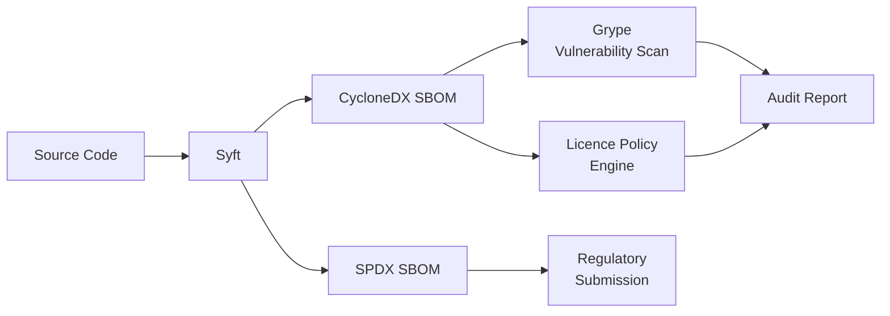
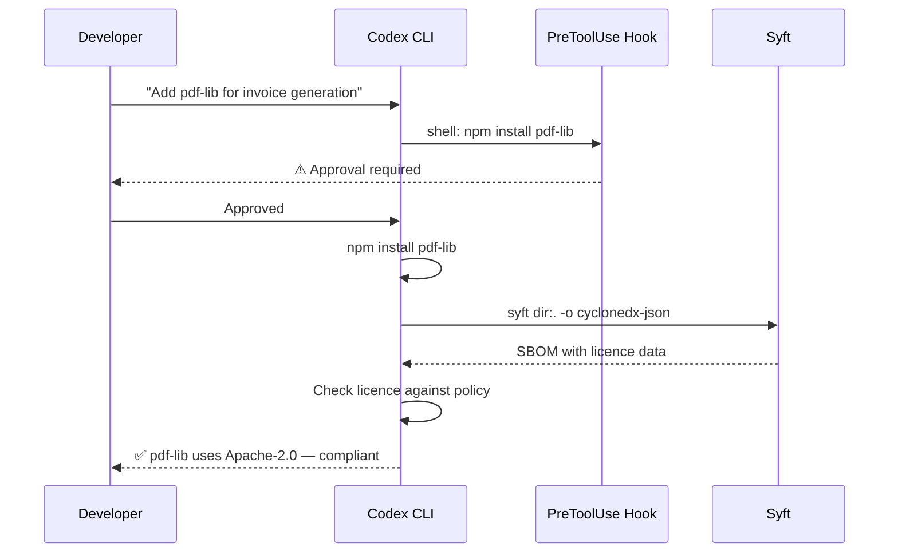

# Codex CLI for Automated Dependency Auditing: Licence Compliance, SBOM Generation, and Supply Chain Policy Enforcement


---

Knowing your dependencies have no critical CVEs is only half the supply chain story. The other half — knowing what licences you ship, whether you can legally redistribute them, and proving it to auditors — remains a manual, error-prone process in most organisations. Regulatory pressure is accelerating: the EU Cyber Resilience Act mandates machine-readable SBOMs for all products with digital elements sold in the EU from September 2026 [^1], and US Executive Order 14028 already requires SBOMs for federal software procurement [^2].

This article shows how to use Codex CLI to automate licence auditing, SBOM generation, and policy enforcement across Node.js, Python, and Rust ecosystems — turning a weekend-long compliance exercise into a repeatable, agent-driven pipeline.

## The Toolchain: Syft, Not Trivy

Until March 2026, many teams used Trivy for both vulnerability scanning and SBOM generation. That changed when researchers discovered a supply chain compromise in Trivy's own plugin ecosystem, allowing arbitrary code execution during scan operations [^3]. The incident did not affect Trivy's core binary, but it shattered confidence in using it as a trusted SBOM generator inside automated pipelines.

**Syft**, maintained by Anchore, is now the recommended standalone SBOM generator [^4]. It supports both CycloneDX 1.6 and SPDX 2.3 output formats, covers 30+ ecosystems including container images, and has no plugin architecture to compromise. For vulnerability scanning on top of the SBOM, pair Syft with **Grype** (also from Anchore), which consumes Syft's output directly [^5].



## Generating SBOMs with Codex CLI

### One-Shot Generation with `codex exec`

For CI pipelines, use `codex exec` to generate an SBOM without human interaction:

```bash
codex exec \
  --approval-policy on-failure \
  --sandbox workspace-write \
  "Run syft dir:. -o cyclonedx-json=sbom.cdx.json -o spdx-json=sbom.spdx.json. \
   Then parse sbom.cdx.json and report: total component count, \
   top 5 licences by frequency, and any components with no licence declared."
```

This produces both CycloneDX and SPDX SBOMs in a single pass, then uses the model to summarise the licence landscape — something raw tooling cannot do without custom scripting [^6].

### Interactive Exploration

For ad-hoc auditing, run Codex CLI interactively with a dependency profile:

```toml
# ~/.codex/config.toml
[profiles.sbom]
model = "gpt-5.5"
model_reasoning_effort = "high"
approval_policy = "on-request"

[profiles.sbom.sandbox_workspace_write]
network_access = false
writable_roots = ["."]
```

Then invoke:

```bash
codex --profile sbom \
  "Generate an SBOM for this project using Syft. \
   Identify every dependency using AGPL, SSPL, or any Commons Clause licence. \
   For each flagged dependency, suggest a permissively-licenced alternative."
```

Network access is deliberately disabled — Syft works offline against local manifests and lockfiles, and you do not want the agent fetching anything during a compliance audit [^7].

## Licence Policy Enforcement

### Encoding Policy in AGENTS.md

Your licence policy belongs in `AGENTS.md` so it applies to every Codex session automatically:

```markdown
## Licence Compliance Policy

- Production dependencies MUST use only: MIT, Apache-2.0, BSD-2-Clause, BSD-3-Clause, ISC, or MPL-2.0.
- AGPL-3.0, SSPL-1.0, and any Commons Clause licence are PROHIBITED in production dependencies.
- Dev dependencies may use any OSI-approved licence.
- Any new dependency addition MUST include a licence check before commit.
- When a dependency has no declared licence (NOASSERTION in SBOM), flag it for manual review.
- Generate an SBOM on every release branch merge using Syft.
```

This prevents the agent from introducing licence-incompatible dependencies during routine coding work — not just during explicit audit sessions [^8].

### Automated Policy Gate with Hooks

Codex CLI's `PreToolUse` hook can enforce licence policy before any install command executes:

```json
// .codex/hooks/pre-install-licence-check.json
{
  "hook": "PreToolUse",
  "pattern": "shell:(npm install|pip install|cargo add)",
  "action": "require_approval",
  "message": "Dependency installation detected. Run licence check before proceeding."
}
```

Combined with an AGENTS.md rule requiring `syft` output after every install, this creates a two-layer gate: human approval for the install command, then automated licence verification afterwards [^9].



## Multi-Ecosystem Audit Skill

For projects spanning multiple ecosystems, create a reusable skill:

```markdown
# .agents/skills/licence-audit/SKILL.md

---
trigger: "licence audit" OR "license check" OR "compliance scan"
---

## Licence Compliance Audit

For each ecosystem detected in the project:

### Step 1: Generate SBOM
Run `syft dir:. -o cyclonedx-json=sbom.cdx.json`

### Step 2: Extract Licence Inventory
Parse the SBOM and list every unique licence identifier (SPDX format).

### Step 3: Apply Policy
Flag any component whose licence is NOT in the allowed list:
MIT, Apache-2.0, BSD-2-Clause, BSD-3-Clause, ISC, MPL-2.0

### Step 4: Report
Output a Markdown table with columns:
| Component | Version | Licence | Status | Alternative |

For each PROHIBITED component, suggest a permissively-licenced alternative.
For each NOASSERTION component, note it requires manual review.

Do NOT modify any files — report only.
```

This skill triggers on natural language and produces a structured, actionable report without modifying the project [^10].

## CI Pipeline Integration

A weekly licence audit in GitHub Actions using `codex exec`:

```yaml
# .github/workflows/licence-audit.yml
name: Weekly Licence Audit
on:
  schedule:
    - cron: '0 6 * * 1' # Every Monday at 06:00 UTC

jobs:
  audit:
    runs-on: ubuntu-latest
    steps:
      - uses: actions/checkout@v4
      - name: Install Syft
        run: curl -sSfL https://raw.githubusercontent.com/anchore/syft/main/install.sh | sh -s
      - name: Run Codex Licence Audit
        run: |
          codex exec \
            --approval-policy on-failure \
            --sandbox workspace-write \
            "Run syft dir:. -o cyclonedx-json=sbom.cdx.json. \
             Parse the SBOM. Flag any component using AGPL, SSPL, \
             Commons Clause, or with no licence declared. \
             Output results as JSON to licence-report.json."
      - name: Upload Report
        uses: actions/upload-artifact@v4
        with:
          name: licence-report
          path: licence-report.json
```

This produces a machine-readable report every week without developer intervention. Pair it with a Slack notification step to surface violations immediately [^11].

## CycloneDX vs SPDX: Which Format?

Both formats are ISO standards. The practical difference for most teams:

| Aspect | CycloneDX 1.6 | SPDX 2.3 |
|---|---|---|
| **Primary focus** | Security and risk | Licence compliance |
| **Tooling breadth** | Broader vulnerability tooling (Grype, Dependency-Track) | Broader legal tooling (FOSSA, SW360) |
| **Regulatory acceptance** | EU CRA compatible [^1] | NTIA minimum elements compliant [^2] |
| **Syft support** | Full | Full |
| **Recommendation** | Generate both; use CycloneDX as primary for security workflows | Use SPDX for legal/procurement submissions |

Generating both formats from a single Syft invocation costs negligible additional time and ensures you are prepared for any regulatory requirement [^4].

## Conclusion

Licence compliance and SBOM generation are operational requirements, not optional hygiene. Codex CLI transforms them from periodic fire drills into automated, policy-enforced pipelines:

1. **Syft over Trivy** for SBOM generation — smaller attack surface, no plugin risk
2. **AGENTS.md** encodes your licence policy so it applies to every session
3. **`codex exec`** enables headless CI integration for weekly audits
4. **PreToolUse hooks** gate dependency installs behind licence verification
5. **Generate both CycloneDX and SPDX** — the cost is trivial, the regulatory coverage is complete

The agent does not replace your legal team's judgement on licence compatibility. It replaces the tedious inventory work that prevents your legal team from being consulted in the first place.

## Citations

[^1]: European Commission. "Cyber Resilience Act — Regulation (EU) 2024/2847." Official Journal of the European Union, November 2024. [https://digital-strategy.ec.europa.eu/en/policies/cyber-resilience-act](https://digital-strategy.ec.europa.eu/en/policies/cyber-resilience-act)

[^2]: Executive Office of the President. "Executive Order 14028 — Improving the Nation's Cybersecurity." May 2021. [https://www.nist.gov/system/files/documents/2021/07/12/EO-Critical-Software-Use-Security-Measures-Guidance.pdf](https://www.nist.gov/system/files/documents/2021/07/12/EO-Critical-Software-Use-Security-Measures-Guidance.pdf)

[^3]: Nesbitt, A. "Package Security Problems for AI Agents." April 8, 2026. [https://nesbitt.io/2026/04/08/package-security-problems-for-ai-agents.html](https://nesbitt.io/2026/04/08/package-security-problems-for-ai-agents.html)

[^4]: Anchore. "Syft — A CLI tool and Go library for generating SBOMs." [https://github.com/anchore/syft](https://github.com/anchore/syft)

[^5]: Anchore. "Grype — A vulnerability scanner for container images and filesystems." [https://github.com/anchore/grype](https://github.com/anchore/grype)

[^6]: OpenAI. "Codex CLI Non-Interactive Mode." [https://developers.openai.com/codex/guides/non-interactive-mode](https://developers.openai.com/codex/guides/non-interactive-mode)

[^7]: OpenAI. "Advanced Configuration — Codex." [https://developers.openai.com/codex/config-advanced](https://developers.openai.com/codex/config-advanced)

[^8]: OpenAI. "Custom Instructions with AGENTS.md — Codex." [https://developers.openai.com/codex/guides/agents-md](https://developers.openai.com/codex/guides/agents-md)

[^9]: OpenAI. "Agent Hooks — Codex." [https://developers.openai.com/codex/guides/hooks](https://developers.openai.com/codex/guides/hooks)

[^10]: OpenAI. "Best Practices — Codex." [https://developers.openai.com/codex/learn/best-practices](https://developers.openai.com/codex/learn/best-practices)

[^11]: OpenAI Cookbook. "Use Codex CLI to Automatically Fix CI Failures." [https://cookbook.openai.com/examples/codex/autofix-github-actions](https://cookbook.openai.com/examples/codex/autofix-github-actions)
