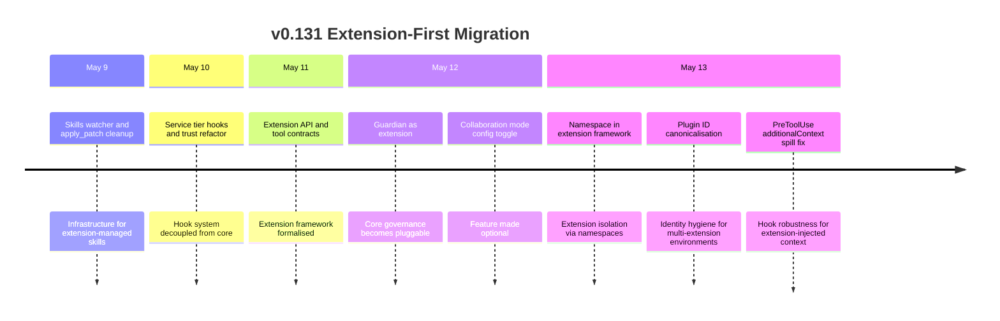
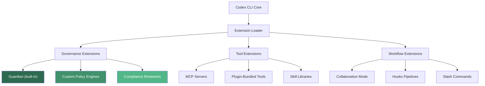
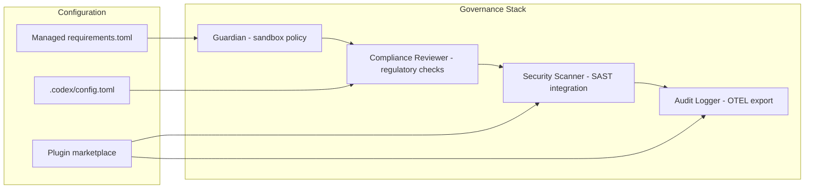

# Codex CLI's Extension-First Architecture: Guardian as a Plugin, Namespaced Extensions, and Modular Governance


---

The v0.131 alpha track (May 9–13 2026) reveals a fundamental architectural shift inside Codex CLI: core features that were once monolithic internal components are migrating to **pluggable, namespaced extensions** [^1]. Guardian — the approval reviewer that sits between the agent and every sandbox-crossing action — is becoming an extension [^2]. Collaboration mode is an optional configuration toggle [^3]. The extension framework now enforces namespace isolation [^4]. This is not incremental improvement; it is a recomposition of the governance stack.

This article traces what changed, how the extension framework operates, and what it means for teams building on Codex CLI.

## The Monolithic Starting Point

Until v0.130, Codex CLI's architecture followed a familiar pattern: core features compiled into a single Rust binary, with extensibility limited to three surfaces:

1. **Plugins** — installable bundles packaging skills, app integrations, MCP servers, and hooks into a distributable unit [^5]
2. **Hooks** — PreToolUse and PostToolUse lifecycle callbacks configured in `config.toml` or `hooks.json` [^6]
3. **MCP servers** — external tool servers connected via stdio or streaming HTTP [^7]

Guardian, the auto-review subsystem, was deeply embedded in the core. Its policy lived at `codex-rs/core/src/guardian/policy.md` [^8]. Hooks were explicitly disabled during Guardian review sessions to prevent interference [^8]. The collaboration mode instructions were unconditionally injected. None of these could be swapped, layered, or independently versioned.

## What Changed in v0.131

The alpha PRs tell a clear story:



Three changes deserve particular attention.

### Guardian Becomes an Extension

PR #22216 (May 12) moved Guardian from a hardcoded internal component to a pluggable extension [^2]. The immediate practical consequence: enterprises can configure whether Guardian loads at all, and the architecture now supports layering additional governance extensions alongside or instead of Guardian.

Guardian's policy is configured via `[auto_review]` in `config.toml`:

```toml
approval_policy = "on-request"
approvals_reviewer = "auto_review"

[auto_review]
policy = """
Deny any command that writes outside the workspace.
Deny any network request to non-allowlisted domains.
Allow read-only filesystem operations.
"""
```

With Guardian as an extension, managed requirements can override this at the organisation level using `guardian_policy_config`, whilst project-level `config.toml` can refine policies for specific repositories [^8]. The extension boundary means Guardian's review model (currently GPT-5.4 Thinking at low reasoning effort [^9]) can be updated independently of CLI version upgrades.

### Namespace Isolation

PR #22556 (May 13) introduced namespacing into the extension framework [^4]. Plugin names already served as component namespaces — Codex uses the plugin name as the identifier and namespace throughout a session [^5]. The extension framework now extends this principle to all extensions, not just marketplace plugins.

The disambiguation rule follows the pattern `$EXTENSION_NAME@$SOURCE`:

```
guardian@core
my-policy@acme-marketplace
lint-reviewer@local
```

This prevents name collisions when multiple governance extensions coexist. A security team's custom reviewer extension cannot accidentally shadow Guardian's tool definitions, and two marketplace plugins from different vendors cannot claim the same hook namespace.

### Plugin ID Canonicalisation

PR #22564 (May 13) enforced canonical plugin identifiers for shared workspace environments [^3]. When multiple developers share a workspace plugin configuration, slight variations in plugin naming (case differences, path differences) previously caused duplicate installations or broken references. Canonicalisation ensures that `my-plugin`, `My-Plugin`, and `./plugins/my-plugin` all resolve to the same identity.

## The Extension Framework Architecture

The extension framework that emerged from v0.131 supports three categories of extension:



### Building a Plugin with Bundled Hooks

The plugin manifest at `.codex-plugin/plugin.json` declares all extension components:

```json
{
  "name": "security-reviewer",
  "version": "1.0.0",
  "description": "Custom security review extension",
  "skills": "./skills/",
  "hooks": "./hooks/hooks.json",
  "mcpServers": "./.mcp.json",
  "interface": {
    "displayName": "Security Reviewer",
    "category": "Security",
    "capabilities": ["Read"]
  }
}
```

The `hooks` field accepts a path to a lifecycle JSON file, an array of paths, an inline object, or an array of inline objects [^5]. When Codex loads the plugin, its hooks are namespaced under the plugin name — a `PreToolUse` hook from `security-reviewer` cannot interfere with hooks from `lint-checker`.

The directory structure follows a strict convention:

```
security-reviewer/
├── .codex-plugin/
│   └── plugin.json
├── skills/
│   └── review/
│       └── SKILL.md
├── hooks/
│   └── hooks.json
├── .mcp.json
└── assets/
    └── icon.png
```

### Hook Precedence with Extensions

When multiple hook sources exist — core configuration, project-level `.codex/config.toml`, and one or more plugin-bundled hooks — Codex loads all matching hooks [^6]. Higher-precedence config layers do not replace lower-precedence hooks; they accumulate. This means:

1. A project's `PreToolUse` hook runs alongside a plugin's `PreToolUse` hook
2. Either hook can block an action (PreToolUse supports blocking)
3. PostToolUse hooks from all sources observe the same tool execution

The `additionalContext` spill fix in PR #22529 addressed a robustness issue where extension-injected context could overflow into unrelated hook evaluations [^1].

### Marketplace Distribution

Plugins distribute through marketplaces — local, git-backed, or (soon) the official Plugin Directory [^5]:

```bash
# Add a git-backed marketplace
codex plugin marketplace add owner/plugins-repo --ref main

# Install from CLI
codex plugin install security-reviewer@acme-marketplace

# Inspect bundled hooks before installing
codex plugin inspect security-reviewer --hooks
```

Local marketplaces use a `marketplace.json` manifest at `$REPO_ROOT/.agents/plugins/`:

```json
{
  "name": "team-governance",
  "plugins": [
    {
      "name": "security-reviewer",
      "source": {
        "source": "local",
        "path": "./plugins/security-reviewer"
      },
      "policy": {
        "installation": "INSTALLED_BY_DEFAULT"
      }
    }
  ]
}
```

Setting `installation` to `INSTALLED_BY_DEFAULT` ensures every team member loading the repository gets the governance extension automatically [^5].

## What This Means for Enterprise Teams

### Composable Governance Stacks

The extension-first pattern enables layered governance where each concern is an independent, versioned extension:



Each layer can be updated independently. A security team can ship a new version of their scanner extension without waiting for a CLI release. Regulated environments where CLI updates require change approval can pin the core CLI version whilst still receiving governance policy updates [^10].

### Selective Feature Loading

Features like collaboration mode (`include_collaboration_mode_instructions`) are now configuration toggles rather than unconditional injections [^3]. This reduces both attack surface and token consumption — collaboration mode instructions that are irrelevant for solo developers no longer consume context window budget.

### The `codex doctor` Diagnostic Command

PR #22336 introduced `codex doctor`, a diagnostic command that checks extension health [^1]. Whilst current documentation focuses on `/status` and `/debug-config` for inline diagnostics [^11], `codex doctor` provides a pre-flight check that validates:

- Extension manifest integrity
- Hook configuration consistency
- MCP server connectivity
- Plugin version compatibility

## Comparison with Other Agent Architectures

| Capability | Codex CLI v0.131 | Claude Code | GitHub Copilot |
|---|---|---|---|
| Core features as extensions | Yes (emerging) | No (monolithic) | Partial (providers) |
| Namespaced extension tools | Yes | No | No |
| Plugin-bundled hooks | Yes | No | No |
| Custom governance extensions | Yes (Guardian-as-ext) | No | Limited |
| Independent extension versioning | Planned | No | Yes (VS Code extensions) |
| Extension health diagnostics | Yes (`codex doctor`) | No | No |

Claude Code bundles its governance, tool definitions, and hooks into a single binary with no extension seams [^12]. GitHub Copilot supports VS Code extension providers but does not expose its governance layer as swappable [^13]. Codex CLI's approach is architecturally closer to a microkernel: the core handles the agent loop, sandbox, and model communication, whilst everything else migrates outward.

## Practical Recommendations

**For teams already using Codex CLI plugins:**

1. **Audit plugin names** — canonicalisation may surface duplicate installations. Run `codex plugin list` and check for near-duplicates.
2. **Move hooks into plugins** — if you maintain separate `hooks.json` files, bundle them into your plugin manifest for namespace isolation.
3. **Pin marketplace refs** — use `--ref` with specific tags rather than `main` for production governance plugins.

**For enterprise platform teams:**

1. **Design governance as extensions** — build custom policy engines as plugins with bundled hooks, distributing via internal marketplaces with `INSTALLED_BY_DEFAULT`.
2. **Layer, don't replace** — Guardian remains a strong default. Add custom reviewers alongside it rather than disabling it.
3. **Use managed requirements** — set `allowed_approvals_reviewers` and `guardian_policy_config` in managed `requirements.toml` to enforce organisational baselines that project-level config cannot override [^8].

**For tool builders:**

1. **Adopt kebab-case names now** — plugin names are identifiers and namespaces. Renaming a published plugin is a breaking change [^5].
2. **Ship hooks with your plugin** — the `hooks` manifest field makes governance portable. A Terraform plugin can ship `PreToolUse` hooks that validate plan output before apply [^6].
3. **Test with `codex doctor`** — validate extension health before distribution.

## What to Watch

The extension-first migration is incomplete. Guardian is the first core feature to cross the boundary, but the pattern suggests others will follow. Watch for:

- **Extension SDK or template** for third-party governance layers
- **Extension marketplace** (beyond the current plugin marketplace) for governance-specific extensions
- **Cross-extension communication** — whether extensions can declare dependencies on other extensions
- **Extension sandboxing** — whether extensions themselves run in isolated contexts to prevent a malicious plugin from compromising governance

The v0.131 track marks the point where Codex CLI stopped being a monolithic agent and started becoming an agent platform. For teams investing in Codex CLI for production workflows, the extension-first pattern is the architectural foundation everything else will build on.

## Citations

[^1]: [Codex CLI v0.131 alpha PRs — GitHub openai/codex releases](https://github.com/openai/codex/releases) — v0.131.0-alpha.1 through alpha.9+, May 9–13 2026

[^2]: [Codex CLI PR #22216 — Guardian as extension](https://github.com/openai/codex/pull/22216) — Guardian migration to pluggable extension, May 12 2026 ⚠️ PR number from internal research notes; verify against public PR list

[^3]: [Codex CLI PR #22383, #22564 — Collaboration mode toggle and plugin ID canonicalisation](https://github.com/openai/codex/pull/22383) — May 12–13 2026 ⚠️ PR numbers from internal research notes

[^4]: [Codex CLI PR #22556 — Namespace in extension framework](https://github.com/openai/codex/pull/22556) — Extension isolation via namespaces, May 13 2026 ⚠️ PR number from internal research notes

[^5]: [Build plugins — Codex, OpenAI Developers](https://developers.openai.com/codex/plugins/build) — Plugin manifest format, directory structure, marketplace configuration, naming conventions

[^6]: [Hooks — Codex, OpenAI Developers](https://developers.openai.com/codex/hooks) — PreToolUse, PostToolUse lifecycle hooks, hook loading from multiple sources

[^7]: [Features — Codex CLI, OpenAI Developers](https://developers.openai.com/codex/cli/features) — MCP server configuration via config.toml and CLI commands

[^8]: [Agent approvals and security — Codex, OpenAI Developers](https://developers.openai.com/codex/agent-approvals-security) — Guardian policy, auto-review configuration, managed requirements override

[^9]: [Auto-review of agent actions without synchronous human oversight — OpenAI Alignment](https://alignment.openai.com/auto-review/) — Auto-review architecture, GPT-5.4 Thinking reviewer, 99.1% approval rate, safety claims

[^10]: [Advanced Configuration — Codex, OpenAI Developers](https://developers.openai.com/codex/config-advanced) — Configuration layers, managed requirements, policy enforcement

[^11]: [Command line options — Codex CLI, OpenAI Developers](https://developers.openai.com/codex/cli/reference) — `/status`, `/debug-config` diagnostic commands

[^12]: [Codex CLI — OpenAI Developers](https://developers.openai.com/codex/cli) — Codex CLI architecture overview, Rust implementation

[^13]: [IDE extension — Codex, OpenAI Developers](https://developers.openai.com/codex/ide) — Codex IDE extension and VS Code integration
