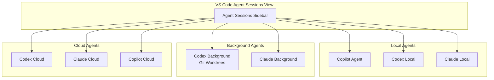
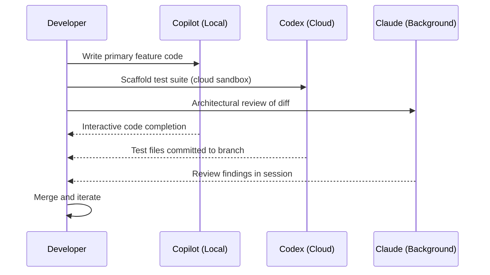

# Codex CLI Inside VS Code's Multi-Agent Architecture: Agent Sessions, Model Selection, and the Unified Development Experience


---

For months, terminal-native developers ran Codex CLI in one window, Claude Code in another, and kept Copilot humming in VS Code — three separate tools, three separate billing contexts, three separate mental models. With VS Code 1.109 (January 2026), Microsoft collapsed that fragmentation into a single Agent Sessions sidebar where Codex, Claude, and Copilot run as peers[^1]. By May 2026, this unified architecture has matured enough that teams are routinely routing different tasks to different agents from one editor.

This article examines how Codex CLI fits into VS Code's multi-agent architecture, how to configure it effectively alongside other agents, and the practical workflow patterns that exploit agent diversity rather than treating it as overhead.

## The Multi-Agent Architecture

VS Code's agent architecture defines four deployment models[^2]:



Each deployment model serves a different feedback loop:

| Mode | Execution | Isolation | Best for |
|------|-----------|-----------|----------|
| **Local** | Your machine, interactive | None — direct workspace access | Debugging, quick edits, exploratory prompts |
| **Background** | Your machine, async | Git worktrees | Long-running test generation, refactoring |
| **Cloud** | Remote infrastructure | Full sandbox | Autonomous implementation, parallel tasks |

The Agent Sessions view (`Cmd+Shift+P` > "Agent Sessions") surfaces all three modes in a single panel[^1]. You can monitor a Codex cloud session building a feature whilst interactively debugging with a local Copilot session — without switching windows.

## Installing and Authenticating Codex in VS Code

Prerequisites: a Copilot Pro+ subscription and the OpenAI Codex extension from the VS Code marketplace[^3].

```bash
code --install-extension openai.chatgpt
```

Authentication flows through your Copilot Pro+ subscription — no separate OpenAI API key required for the VS Code integration[^3]. Codex appears in the Session Type dropdown alongside Copilot and Claude.

For teams already using Codex CLI directly, this is worth pausing on: the VS Code extension wraps the same agent engine and reads the same `~/.codex/config.toml`[^4]. Your existing profiles, model preferences, and permission settings carry across. The difference is the session management layer — VS Code's Agent Sessions view replaces the TUI's session picker.

### Configuration

Add these to your VS Code `settings.json`:

```json
{
  "github.copilot.chat.agent.enabled": true,
  "codex.defaultMode": "agent",
  "chat.agentSessions.orientation": "side-by-side"
}
```

The `side-by-side` orientation is critical for multi-agent workflows — it lets you view two agent sessions simultaneously, comparing outputs or delegating follow-up work[^5].

## How Codex Reads Your Project Context

When running as a local agent inside VS Code, Codex ingests project context using the same hierarchy as the CLI[^4]:

1. **Global config**: `~/.codex/config.toml` — personal defaults, model preferences, API keys
2. **Repository AGENTS.md**: Project root `AGENTS.md` — coding standards, test commands, directory structure
3. **Directory-scoped AGENTS.md**: Subdirectory overrides for monorepo segments
4. **SKILL.md files**: Reusable skill definitions under `.codex/skills/` or `.agents/skills/`

Two configuration knobs control how much project guidance enters the first turn[^6]:

```toml
# ~/.codex/config.toml
project_doc_max_bytes = 16384        # Cap per AGENTS.md file
project_doc_fallback_filenames = [   # Try these if AGENTS.md is missing
  "CLAUDE.md",
  "CONTRIBUTING.md"
]
```

The `project_doc_fallback_filenames` setting is particularly useful in multi-agent repositories where teams maintain both `AGENTS.md` and `CLAUDE.md` — Codex reads whichever is present without requiring duplication[^6].

## Configuration Portability Across Agents

The convergence story in May 2026 is stronger than most developers realise. Three layers of configuration are now genuinely portable:

### AGENTS.md

The AGENTS.md format has become a de facto cross-agent standard[^7]. A single file works with Codex CLI, Copilot Agent mode, Claude Code, and VS Code's built-in agent — each reads it on first turn and applies the constraints it understands.

### SKILL.md

Skills written as SKILL.md files with YAML frontmatter are portable across 20+ agent clients[^8]. A skill written for Codex CLI works identically when invoked from the VS Code sidebar or from Claude Code.

```markdown
---
name: security-review
description: Review code changes for security vulnerabilities
trigger: when user asks to review security, check for vulnerabilities
---

## Instructions
1. Check for SQL injection, XSS, CSRF vulnerabilities
2. Verify input validation on all user-facing endpoints
3. Flag hardcoded secrets or credentials
4. Output findings in structured format
```

The cross-client convention places skills in `.agents/skills/`, though some clients also scan `.codex/skills/` and `.claude/skills/` for backward compatibility[^8].

### Hooks

VS Code's hook system uses the same format as Codex CLI and Claude Code hooks[^9]. A `PreToolUse` hook that blocks destructive commands works identically whether triggered from a VS Code agent session or a terminal Codex session.

## Practical Multi-Agent Workflow Patterns

The real value of VS Code's multi-agent architecture isn't running three agents at once for the sake of it — it's routing tasks to the agent best suited for each one. After several months of community adoption, three patterns have stabilised[^5].

### Pattern 1: Parallel Feature Development



Copilot handles interactive coding with inline completions. Codex runs in a cloud session, scaffolding tests in an isolated sandbox. Claude analyses the growing diff for architectural concerns[^5]. All three sessions appear in the Agent Sessions sidebar.

### Pattern 2: Debug-Fix-Verify Cycle

1. **Claude** analyses the error trace and root cause (large context window handles full stack traces)[^10]
2. **Copilot** implements the fix inline with autocomplete
3. **Codex** writes regression tests in a background session using git worktrees for isolation

This pattern exploits each agent's strength: Claude's reasoning depth, Copilot's low-latency inline suggestions, and Codex's sandbox isolation for test execution[^5].

### Pattern 3: Large-Scale Refactoring

For cross-cutting changes across a codebase:

1. **Claude** plans the refactoring with subagent decomposition (parallel module analysis)
2. Multiple **Codex cloud sessions** execute independent refactoring tasks in parallel
3. **Copilot** handles integration glue and conflict resolution interactively

The subagent pattern is key here. Both Claude and Codex support spawning context-isolated subagents for parallel tasks — the results merge without polluting the main conversation's token budget[^2].

## Model Selection and Cost Considerations

Each agent brings different models and pricing:

| Agent | Default Model (May 2026) | Context Window | Billing |
|-------|-------------------------|----------------|---------|
| **Copilot** | GPT-5.5 / Claude Sonnet | Varies by task | Copilot subscription |
| **Codex (local)** | GPT-5.5, GPT-5.4 | 1M (GPT-5.5) | Copilot Pro+ |
| **Codex (cloud)** | GPT-5.5, Codex-Spark | 1M (GPT-5.5) | Copilot Pro+ (cloud premium) |
| **Claude** | Claude Opus 4.7 | 1M | Anthropic subscription |

For teams already paying for Copilot Pro+, running Codex locally through VS Code costs nothing beyond the existing subscription[^3]. Cloud sessions incur additional usage charges billed through GitHub[^11].

### Cost Optimisation Tips

- **Disable Copilot autocomplete in non-code files** — markdown, JSON, and YAML autocompletions consume tokens without adding value
- **Limit background sessions to two** — each consumes 100–200 MB of memory[^5]
- **Prefer Codex cloud sessions for heavy work** — offloads compute from your development machine
- **Use reasoning effort tuning** in `config.toml` for Codex sessions that don't need deep reasoning:

```toml
[profiles.fast-tasks]
model = "codex-spark"
model_reasoning_effort = "low"
```

## The /ide Bridge: CLI Meets VS Code

For developers who prefer the Codex CLI TUI but want VS Code context awareness, the `/ide` bridge (introduced in v0.129.0) connects both surfaces through a Unix domain socket[^12]. The CLI receives a continuous feed of editor state — focused file, selected text, open tabs — so prompts like "refactor the selected function" work identically whether typed in the TUI or the VS Code sidebar.

This is an either/or proposition: you can use the VS Code Agent Sessions view for session management, or use the CLI with `/ide` for terminal-native workflows with editor context. Both read the same `config.toml` and `AGENTS.md` files.

## Current Limitations

The multi-agent experience, whilst functional, has edges:

- **No cross-agent session handoff**: You cannot transfer a Codex session to Claude mid-conversation. You must start a new session and re-provide context[^2].
- **Memory overhead**: Running all three agents simultaneously consumes 350–700 MB of RAM[^5]. On machines with 8 GB, this is noticeable.
- **Hook duplication risk**: If you define hooks in both `.codex/config.toml` and VS Code's `settings.json`, both fire — leading to duplicate linting or formatting runs[^9].
- **AGENTS.md interpretation varies**: Each agent interprets the same AGENTS.md slightly differently. Codex CLI follows directives more literally than Copilot, which tends to treat them as suggestions[^7]. Test your AGENTS.md with each agent individually before assuming uniform behaviour.
- **Copilot Pro+ requirement**: The unified experience requires the most expensive Copilot tier. Teams on Copilot Business can use Claude and Codex cloud agents via Agent HQ but miss the local agent integration[^11].

## When to Use the VS Code Multi-Agent View vs. Terminal CLI

The decision isn't binary. A sensible heuristic:

- **Use VS Code Agent Sessions** when you need visual session management, parallel agent comparison, or when your workflow mixes inline editing with agent delegation
- **Use Codex CLI directly** when you need the TUI's full power — vim keybindings, `/goal` persistent workflows, shell piping with `codex exec`, or deep terminal integration with tmux/neovim

The shared `config.toml` and `AGENTS.md` mean switching between surfaces is low-friction. Your configuration, skills, and hooks follow you regardless of which surface you choose.

## Citations

[^1]: [VS Code Blog: Your Home for Multi-Agent Development (February 2026)](https://code.visualstudio.com/blogs/2026/02/05/multi-agent-development)
[^2]: [VS Code Docs: Using agents in Visual Studio Code](https://code.visualstudio.com/docs/copilot/agents/overview)
[^3]: [VS Code Docs: Third-party agents — OpenAI Codex](https://code.visualstudio.com/docs/copilot/agents/third-party-agents)
[^4]: [OpenAI Docs: Advanced Configuration — Codex CLI](https://developers.openai.com/codex/config-advanced)
[^5]: [Morph LLM: VS Code Multi-Agent Guide — Claude + Codex + Copilot Setup (2026)](https://www.morphllm.com/vscode-multi-agent)
[^6]: [OpenAI Docs: Config basics — project_doc_max_bytes](https://developers.openai.com/codex/config-basic)
[^7]: [OpenAI Docs: Custom instructions with AGENTS.md](https://developers.openai.com/codex/guides/agents-md)
[^8]: [VS Code Docs: Use Agent Skills in VS Code](https://code.visualstudio.com/docs/copilot/customization/agent-skills)
[^9]: [VS Code Docs: Agent hooks in Visual Studio Code (Preview)](https://code.visualstudio.com/docs/copilot/customization/hooks)
[^10]: [VS Code Blog: A Unified Experience for all Coding Agents (November 2025)](https://code.visualstudio.com/blogs/2025/11/03/unified-agent-experience)
[^11]: [GitHub Blog: Claude and Codex now available for Copilot Business & Pro users](https://github.blog/changelog/2026-02-26-claude-and-codex-now-available-for-copilot-business-pro-users/)
[^12]: [OpenAI Docs: Codex CLI Features — /ide command](https://developers.openai.com/codex/cli/features)
