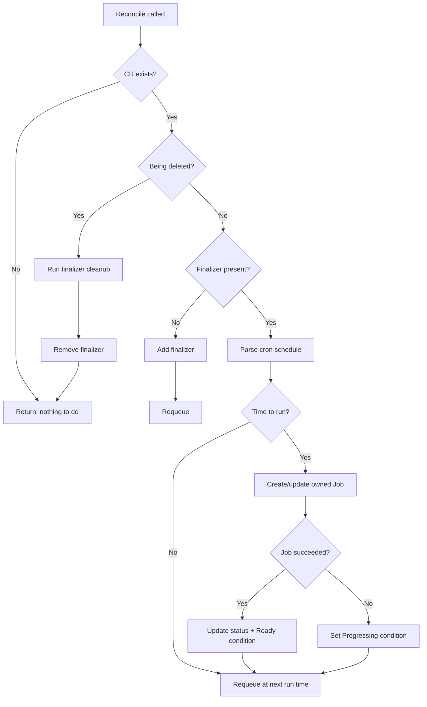
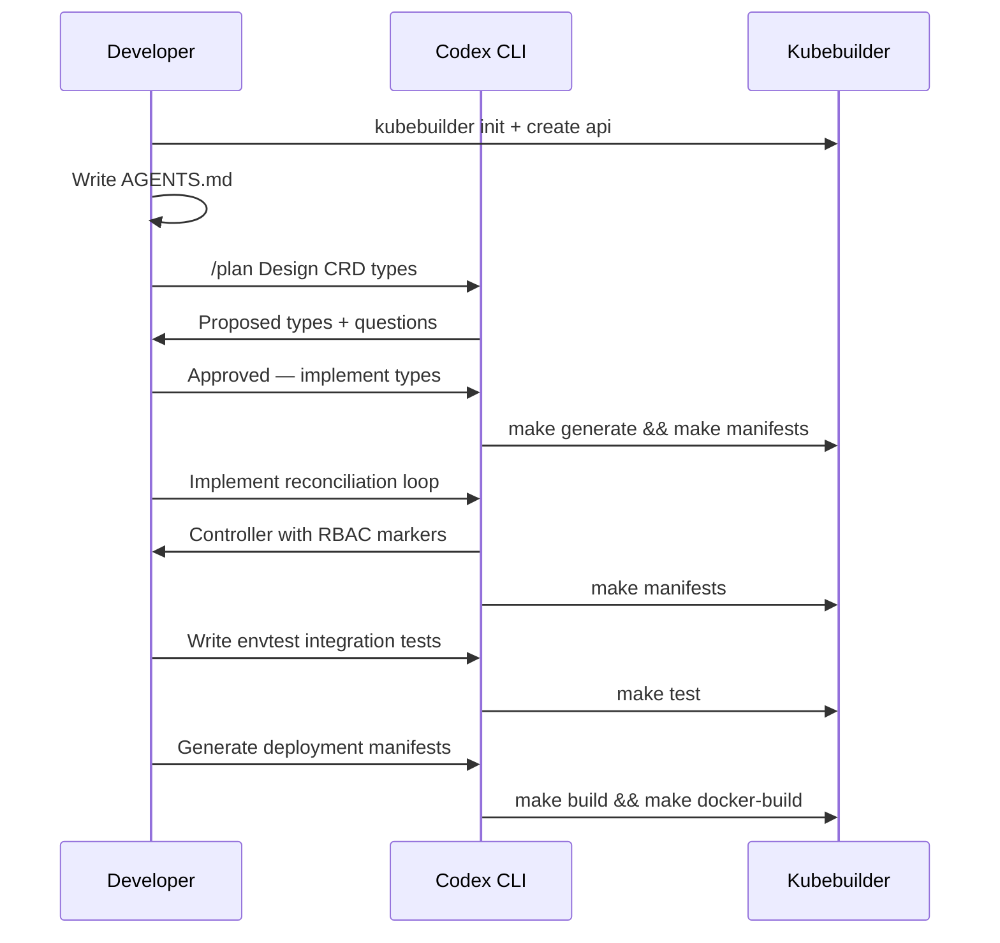

# Codex CLI for Kubernetes Operator Development: Scaffolding CRDs, Writing Reconciliation Loops, and Testing with envtest


---

Building a Kubernetes operator is one of the most structurally demanding tasks in cloud-native Go development. You need a Custom Resource Definition that models your domain, a controller whose reconciliation loop converges actual state toward desired state, RBAC manifests scoped to exactly the right verbs, and integration tests that exercise the full loop against a real API server — all before you think about webhooks, finalizers, or status subresources. Codex CLI turns out to be remarkably well-suited to this workflow, provided you tell it what it needs to know.

This article covers the end-to-end operator development cycle with Codex CLI: from Kubebuilder scaffolding through reconciliation logic, envtest integration testing, and deployment manifest generation. The patterns here assume Kubebuilder v4.13.0[^1], controller-runtime v0.23.x[^2], and Kubernetes 1.36[^3].

## Why Operators Are a Good Fit for Codex CLI

Operator development is heavily template-driven. Kubebuilder generates a project skeleton with `Makefile`, `config/` manifests, and stub files — then the developer fills in domain-specific logic. The repetitive structural code (status conditions, event recording, owner references, finalizer management) follows well-documented patterns that a coding agent can reproduce reliably. The genuinely creative work — deciding *what* your CRD should model and *how* the reconciliation loop should converge — benefits from plan mode and the interview pattern.

Codex CLI's sandbox also helps here. Operator code typically needs `make generate` and `make manifests` to run controller-gen, but does not need network access or cluster connectivity during development. A `workspace-write` sandbox with targeted command rules keeps the agent productive without exposing your kubeconfig.

## Setting Up the Project

### AGENTS.md for Operator Projects

The single highest-leverage step is writing an `AGENTS.md` that captures operator conventions Codex cannot infer from the scaffolding alone[^4]:

```markdown
# AGENTS.md

## Project Overview
Kubernetes operator built with Kubebuilder v4.13.0 and Go 1.24.
Manages `BackupSchedule` custom resources in the `data.example.com` API group.

## Build & Test Commands
- `make generate` — regenerate deepcopy and CRD manifests (run after any type change)
- `make manifests` — regenerate RBAC, CRD YAML, and webhook configs
- `make test` — run envtest suite (requires KUBEBUILDER_ASSETS)
- `make lint` — run golangci-lint with the project config

## Conventions
- Every reconciliation must be idempotent; never assume prior state
- Use `controllerutil.CreateOrUpdate` for owned resources
- Record events via `ctrl.EventRecorder` for every state transition
- Status conditions follow `metav1.Condition` with reason codes in PascalCase
- Finalizers use the pattern `data.example.com/cleanup`
- RBAC markers live on the Reconcile method, not in separate files
- Errors that indicate transient failures return `ctrl.Result{RequeueAfter: 30 * time.Second}`
- Permanent failures set a `Degraded` condition and return `ctrl.Result{}`

## Testing
- Integration tests use controller-runtime envtest with Ginkgo/Gomega
- Every reconciliation path must have a corresponding envtest case
- Do NOT mock the Kubernetes client; use the envtest API server
- Test fixtures live in `internal/controller/testdata/`

## Forbidden
- Do not use `client-go` informers directly; use controller-runtime caches
- Do not add cluster-admin RBAC; scope to the minimum required verbs
- Do not shell out to kubectl from the operator binary
```

This file prevents the three most common agent mistakes in operator projects: generating overly broad RBAC, mocking the Kubernetes client instead of using envtest, and forgetting to run `make generate` after modifying types.

### Scaffolding with Kubebuilder

Start the project with Kubebuilder, then let Codex fill in the domain logic:

```bash
kubebuilder init --domain example.com --repo github.com/example/backup-operator
kubebuilder create api --group data --version v1alpha1 --kind BackupSchedule --resource --controller
```

This produces the canonical layout[^1]:

```
├── api/v1alpha1/
│   ├── backupschedule_types.go    # CRD spec and status structs
│   └── zz_generated.deepcopy.go   # auto-generated
├── internal/controller/
│   ├── backupschedule_controller.go
│   └── suite_test.go
├── config/
│   ├── crd/
│   ├── rbac/
│   └── manager/
├── Makefile
└── AGENTS.md
```

## Designing the CRD with Plan Mode

CRD design benefits from Codex's plan mode. The spec and status structs define the operator's API contract — get them wrong and every downstream component breaks.

```
/plan Design the BackupSchedule CRD. The spec should let users define:
a cron schedule, a target PVC name, a retention policy (count and age),
and an optional S3 destination. The status should track the last
successful backup time, the next scheduled time, and a conditions array.
```

Codex will propose the type definitions, ask clarifying questions about validation (minimum retention count? required vs optional S3 fields?), and produce a plan you can review before any code is written. Once approved, it generates the types:

```go
// api/v1alpha1/backupschedule_types.go
type BackupScheduleSpec struct {
    // Schedule in Cron format (e.g. "0 2 * * *")
    // +kubebuilder:validation:MinLength=1
    Schedule string `json:"schedule"`

    // TargetPVC is the PersistentVolumeClaim to back up
    TargetPVC string `json:"targetPVC"`

    // Retention defines how long backups are kept
    Retention RetentionPolicy `json:"retention"`

    // S3Destination is the optional remote storage target
    // +optional
    S3Destination *S3Destination `json:"s3Destination,omitempty"`
}

type BackupScheduleStatus struct {
    // LastSuccessfulBackup is the timestamp of the most recent successful run
    // +optional
    LastSuccessfulBackup *metav1.Time `json:"lastSuccessfulBackup,omitempty"`

    // NextScheduledBackup is the computed next run time
    // +optional
    NextScheduledBackup *metav1.Time `json:"nextScheduledBackup,omitempty"`

    // Conditions represent the latest observations of the resource's state
    Conditions []metav1.Condition `json:"conditions,omitempty"`
}
```

After the types are written, Codex should run `make generate && make manifests` — the AGENTS.md instruction ensures it does this automatically after any type change.

## Writing the Reconciliation Loop

The reconciliation loop is where most operator complexity lives. A well-structured prompt gives Codex enough context to generate idempotent, production-grade logic:

```
Implement the Reconcile method for BackupScheduleReconciler.
The loop should:
1. Fetch the BackupSchedule CR; return if not found (deleted)
2. Handle finalizer addition/removal for cleanup
3. Parse the cron schedule and compute the next run time
4. If the next run time has passed, create a batch/v1 Job owned by the CR
5. Update status.lastSuccessfulBackup when the Job succeeds
6. Set status conditions: Ready, Progressing, or Degraded
7. Requeue at the next scheduled time

Follow the conventions in AGENTS.md. Use controllerutil for owned resources.
```

The resulting reconciliation loop follows a standard pattern:



Key patterns Codex should apply (and the AGENTS.md enforces):

- **Idempotency**: `controllerutil.CreateOrUpdate` ensures the Job is created if missing or updated if the spec has drifted[^5].
- **Owner references**: `ctrl.SetControllerReference` on every owned resource ensures garbage collection when the CR is deleted[^5].
- **Status conditions**: Use `meta.SetStatusCondition` from `apimachinery/pkg/api/meta` to avoid duplicate conditions[^6].
- **Event recording**: `recorder.Eventf(cr, corev1.EventTypeNormal, "BackupStarted", ...)` provides an audit trail visible via `kubectl describe`.

### RBAC Markers

Codex generates RBAC markers directly on the `Reconcile` method. Verify they are scoped tightly:

```go
//+kubebuilder:rbac:groups=data.example.com,resources=backupschedules,verbs=get;list;watch;update;patch
//+kubebuilder:rbac:groups=data.example.com,resources=backupschedules/status,verbs=get;update;patch
//+kubebuilder:rbac:groups=data.example.com,resources=backupschedules/finalizers,verbs=update
//+kubebuilder:rbac:groups=batch,resources=jobs,verbs=get;list;watch;create;update;patch;delete
//+kubebuilder:rbac:groups="",resources=events,verbs=create;patch
```

A common agent mistake is generating `cluster-admin`-level RBAC or adding wildcard verbs. The AGENTS.md constraint prevents this, but always review the generated `config/rbac/role.yaml` after running `make manifests`.

## Testing with envtest

The envtest framework from controller-runtime provides a lightweight test environment with real etcd and API server components, enabling fast operator testing without deploying to a full cluster[^7]. This is where Codex CLI adds the most value — writing envtest cases is tedious but structurally predictable.

### Suite Setup

Kubebuilder scaffolds `internal/controller/suite_test.go` with the envtest bootstrap. The key components:

```go
var (
    cfg       *rest.Config
    k8sClient client.Client
    testEnv   *envtest.Environment
    ctx       context.Context
    cancel    context.CancelFunc
)

var _ = BeforeSuite(func() {
    testEnv = &envtest.Environment{
        CRDDirectoryPaths:     []string{filepath.Join("..", "..", "config", "crd", "bases")},
        ErrorIfCRDPathMissing: true,
    }
    cfg, err := testEnv.Start()
    Expect(err).NotTo(HaveOccurred())

    // Register the CRD scheme
    err = datav1alpha1.AddToScheme(scheme.Scheme)
    Expect(err).NotTo(HaveOccurred())

    k8sClient, err = client.New(cfg, client.Options{Scheme: scheme.Scheme})
    Expect(err).NotTo(HaveOccurred())
})
```

### Writing Reconciliation Tests

Prompt Codex to generate envtest cases for every reconciliation path:

```
Write envtest integration tests for BackupScheduleReconciler covering:
1. Creating a BackupSchedule CR triggers Job creation
2. Deleting the CR runs the finalizer and cleans up Jobs
3. A completed Job updates status.lastSuccessfulBackup
4. An invalid cron schedule sets the Degraded condition
5. Retention policy deletes Jobs older than the retention age

Use Ginkgo/Gomega. Follow the testing conventions in AGENTS.md.
```

A well-generated test case for the happy path:

```go
It("should create a Job when the schedule fires", func() {
    cr := &datav1alpha1.BackupSchedule{
        ObjectMeta: metav1.ObjectMeta{
            Name:      "test-backup",
            Namespace: "default",
        },
        Spec: datav1alpha1.BackupScheduleSpec{
            Schedule:  "* * * * *", // every minute for testing
            TargetPVC: "data-pvc",
            Retention: datav1alpha1.RetentionPolicy{Count: 3},
        },
    }
    Expect(k8sClient.Create(ctx, cr)).To(Succeed())

    // Wait for the controller to create a Job
    Eventually(func() bool {
        var jobs batchv1.JobList
        err := k8sClient.List(ctx, &jobs,
            client.InNamespace("default"),
            client.MatchingLabels{"app.kubernetes.io/managed-by": "backup-operator"},
        )
        return err == nil && len(jobs.Items) > 0
    }, timeout, interval).Should(BeTrue())
})
```

### Running Tests in the Sandbox

Codex CLI's sandbox needs access to the `setup-envtest` binary and the downloaded Kubernetes API server binaries. Configure your project's `.codex/config.toml` to enable this:

```toml
# .codex/config.toml — operator project overrides
sandbox_mode = "workspace-write"

[shell_environment_policy]
inherit = "core"
set = { KUBEBUILDER_ASSETS = "/usr/local/kubebuilder/bin" }
```

With `workspace-write` and the `KUBEBUILDER_ASSETS` path set, `make test` works inside the sandbox. Network access is not required — envtest runs etcd and kube-apiserver as local processes[^7].

## Deployment Manifest Generation

Once the operator logic and tests pass, Codex can generate the deployment manifests. The standard Kubebuilder approach uses Kustomize overlays in `config/`:

```
Generate production Kustomize overlays for the backup-operator:
- config/production/ with namespace, resource limits, replica count 2
- config/production/manager_patch.yaml with memory limit 128Mi, CPU limit 100m
- Update config/default/kustomization.yaml to include the production overlay
```

Codex also generates the Dockerfile for the manager binary. Verify it uses a distroless base image and a non-root user — both are Kubebuilder defaults, but agents occasionally rewrite Dockerfiles with `ubuntu:latest`[^8].

## Common Pitfalls and Agent-Specific Guidance

### 1. Forgetting `make generate` After Type Changes

The AGENTS.md convention handles this, but if you are prompting without it, explicitly instruct: "After modifying any types in `api/`, run `make generate && make manifests` before writing tests."

### 2. Overly Broad RBAC

Codex sometimes generates `verbs=*` or adds permissions for resource types the operator never touches. Review `config/rbac/role.yaml` after every generation cycle.

### 3. Non-Idempotent Reconciliation

The most subtle bug: a reconciliation loop that creates duplicate resources on requeue. Enforce `controllerutil.CreateOrUpdate` in AGENTS.md and verify in envtest that calling `Reconcile` twice produces the same cluster state.

### 4. Mocking the Kubernetes Client

Codex may default to generating unit tests with a fake client. The AGENTS.md directive "Do NOT mock the Kubernetes client; use the envtest API server" prevents this. envtest catches real-world issues — validation, defaulting, RBAC — that mocks silently hide[^7].

### 5. Context Window Pressure on Large Operators

Operators with many types and controllers can exhaust Codex's context window. Use subagents for independent controllers and the `/compact` command between phases (CRD design → controller logic → tests → deployment manifests).

## The Recommended Workflow



The cycle takes advantage of Codex's strengths — template-heavy code generation, test case proliferation, and manifest management — whilst keeping the developer in control of the domain-specific design decisions that require human judgement.

## Citations

[^1]: Kubebuilder v4.13.0 Release Notes, kubernetes-sigs/kubebuilder, February 2026 — [https://github.com/kubernetes-sigs/kubebuilder/releases](https://github.com/kubernetes-sigs/kubebuilder/releases)
[^2]: controller-runtime v0.23.x, kubernetes-sigs/controller-runtime — [https://pkg.go.dev/sigs.k8s.io/controller-runtime](https://pkg.go.dev/sigs.k8s.io/controller-runtime)
[^3]: Kubernetes v1.36 Release, April 2026 — [https://kubernetes.io/blog/2026/04/22/kubernetes-v1-36-release/](https://kubernetes.io/blog/2026/04/22/kubernetes-v1-36-release/)
[^4]: Custom Instructions with AGENTS.md, OpenAI Codex Docs — [https://developers.openai.com/codex/guides/agents-md](https://developers.openai.com/codex/guides/agents-md)
[^5]: controllerutil Package Reference, controller-runtime — [https://pkg.go.dev/sigs.k8s.io/controller-runtime/pkg/controller/controllerutil](https://pkg.go.dev/sigs.k8s.io/controller-runtime/pkg/controller/controllerutil)
[^6]: Kubebuilder Book: Writing Controllers — [https://book.kubebuilder.io/cronjob-tutorial/controller-implementation](https://book.kubebuilder.io/cronjob-tutorial/controller-implementation)
[^7]: envtest Package Reference, controller-runtime — [https://pkg.go.dev/sigs.k8s.io/controller-runtime/pkg/envtest](https://pkg.go.dev/sigs.k8s.io/controller-runtime/pkg/envtest)
[^8]: Kubebuilder Book: Quick Start — [https://book.kubebuilder.io/quick-start](https://book.kubebuilder.io/quick-start)
