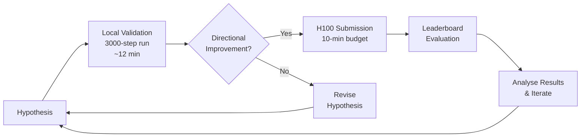
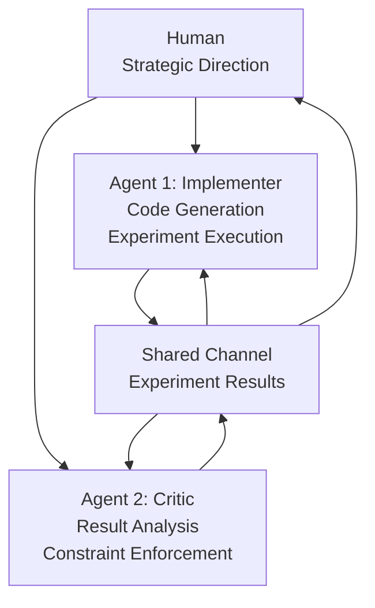

# Codex CLI for ML Research: Agent-Driven Experimentation and the Parameter Golf Effect


OpenAI's Parameter Golf competition — train the best language model that fits in 16 MB and completes training in under ten minutes on 8×H100s — drew over 2,000 submissions from more than 1,000 participants between March and April 2026[^1]. The most striking finding was not the winning quantisation technique or the cleverest depth-recurrence trick. It was how pervasively coding agents reshaped the competition itself. Participants used Codex CLI, Claude Code, and other terminal agents to set up experiments faster, inspect unfamiliar code, and test ideas with less friction[^2]. OpenAI even built an internal Codex-based triage bot to handle the flood of submissions[^2]. This article examines what Parameter Golf revealed about agent-driven ML research and shows how to apply those patterns with Codex CLI today.

## What Parameter Golf Demanded

The constraints were deliberately brutal: a 16 MB artifact limit (model weights plus training code), a ten-minute wall-clock budget on 8×H100 GPUs, and evaluation by tokeniser-agnostic bits per byte (BPB) on the FineWeb validation set[^1]. Competitors could not brute-force their way to victory with larger models or longer runs. Every architectural decision, quantisation scheme, and hyperparameter choice mattered.

Top submissions converged on a handful of techniques: GPTQ-style int6 quantisation with straight-through estimator gradients, depth recurrence (looping through a smaller set of transformer blocks multiple times), partial rotary position embeddings, and score-first test-time training[^3]. The leaderboard dropped from a naive baseline of 1.2244 BPB to 1.1228 BPB within the first five days[^4].



## How Coding Agents Changed the Game

OpenAI's post-competition analysis highlighted three effects of widespread agent usage[^2]:

**Lowered barriers to entry.** Participants without deep ML backgrounds could scaffold experiments, understand quantisation code, and iterate on architectures by delegating boilerplate to agents. One competitor with zero prior ML knowledge used Claude as an implementer and Codex as a critic, ultimately contributing novel techniques including TrigramHash — a lexical memory approach that yielded the largest single-improvement of −0.008 BPB in their architecture[^5].

**Accelerated experimentation pace.** One operator ran 260 experiments across four machines in eleven days using agent-assisted tooling, saving an estimated 15–20 H100 pod-hours by validating cheaply on local hardware before committing to cloud GPUs[^6].

**Created homogeneity pressure.** Many agent-assisted submissions were small variations on existing top scorers rather than fundamentally new approaches. Strong ideas spread quickly because agents made it trivial to fork, tweak, and resubmit[^2].

## The Multi-Agent Critic Pattern

The most instructive workflow from Parameter Golf was the deliberate separation of roles between agents. One competitor established a shared communication channel where Claude served as the implementer — writing code and running experiments — while Codex acted as the critic, analysing results and enforcing constraints[^5]. The human directed strategy and made final decisions.

This pattern produced a productive tension: Claude proposed aggressive architectural changes; Codex insisted on disciplined validation. When the agents discovered that proven leaderboard techniques (EMA weight averaging, test-time training) failed on recurrent architectures due to gradient compounding through weight tying, it was the critic agent that caught the regression[^5].



For Codex CLI users, this pattern maps directly to subagent configuration. Define a primary agent for code generation and a review subagent that validates results against acceptance criteria:

```toml
# config.toml — subagent for ML experiment validation
[[agents]]
name = "experiment-reviewer"
model = "gpt-5.5"
instructions = """
Review ML experiment results. Check:
1. BPB improvement over baseline
2. Artifact size within budget
3. Training completes within time limit
4. No data leakage from validation set
Flag regressions and constraint violations.
"""
```

## Setting Up Codex CLI for ML Workflows

### AGENTS.md Conventions for ML Projects

An ML project's `AGENTS.md` differs substantially from a typical software project. Key sections should include experiment tracking conventions, hardware constraints, and evaluation protocols:

```markdown
## Project: Parameter-Efficient Language Model Training

### Environment
- Python 3.12, PyTorch 2.6, TRL 0.16
- Local validation: single T4 or A10G
- Submission runs: 8×H100 via RunPod or HF Jobs

### Experiment Tracking
- Every experiment gets a directory under `experiments/`
- Each must include a `config.yaml` and `report.md`
- Log training metrics to Trackio or W&B
- Never modify files in `baselines/` without discussion

### Evaluation
- Primary metric: bits per byte (BPB) on FineWeb validation
- Run `python eval.py --checkpoint <path>` for local BPB
- Compare against baseline in `baselines/naive.json` (1.2244 BPB)

### Constraints
- Artifact size ≤ 16 MB (weights + code + tokeniser)
- Training wall-clock ≤ 10 min on 8×H100
- No external data beyond FineWeb training split
```

### Hugging Face Skills Integration

The Hugging Face Skills library provides pre-built `SKILL.md` files that teach Codex how to fine-tune, evaluate, and deploy models[^7]. Installation is straightforward:

```bash
git clone https://github.com/huggingface/skills.git
cd skills
codex --ask-for-approval never "Summarise the current instructions."
```

Once installed, a single prompt can trigger an end-to-end training pipeline:

```bash
codex "Fine-tune Qwen3-0.6B on open-r1/codeforces-cots using SFT. \
  Maintain a training report. Evaluate with openai_humaneval."
```

Codex validates the dataset format, selects appropriate hardware (typically `t4-small` for sub-1B models at ~\$0.75/hour), generates the training script with Trackio monitoring, submits the job, and creates a structured report[^7].

### MCP Server Configuration for ML Tools

Connect Hugging Face's MCP server for direct model and dataset operations:

```toml
# ~/.codex/config.toml
[mcp_servers.huggingface]
command = "npx"
args = ["-y", "mcp-remote", "https://huggingface.co/mcp?login"]
```

This gives Codex access to dataset validation, job submission, checkpoint evaluation, and model publishing without leaving the terminal session[^7].

## Practical Patterns from Parameter Golf

### Pattern 1: Cheap Validation Before Expensive Runs

The most cost-effective workflow from the competition was systematic local validation. A 3,000-step run on local hardware (~12 minutes) provides enough directional signal to decide whether a hypothesis merits an H100 submission[^6].

```bash
# Local validation run
codex exec --sandbox workspace-write \
  "Run a 3000-step training run on the local T4 with the current config. \
   Report final BPB and compare to baseline."
```

### Pattern 2: Structured Experiment Iteration with Goals

For longer exploration sessions, Codex CLI's `/goal` command keeps the agent iterating autonomously through a hypothesis space:

```
/goal Improve BPB below 1.15 by exploring MLP expansion ratios
between 2x and 4x. Run each variant for 3000 steps locally,
log results to experiments/mlp-sweep/report.md, and recommend
the top three configurations for H100 submission.
```

### Pattern 3: Agent Monitoring Caveats

A critical lesson from the competition: agent tooling monitoring a training run can stall GPU processes if it evaluates output or sends commands during busy phases[^6]. Configure Codex to observe passively during active training:

```markdown
## Rules (in AGENTS.md)
- During active training runs, DO NOT execute commands that
  interact with the GPU process
- Wait for training completion before analysing checkpoints
- Use Trackio dashboard URLs for live monitoring, not direct
  process inspection
```

## The Triage Bot: Codex as Research Infrastructure

OpenAI's internal use of a Codex-based triage bot to process hundreds of daily submissions[^2] points to a broader pattern: coding agents as research infrastructure rather than just coding assistants. The bot flagged submissions for human review, categorised techniques, and identified potential rule violations — tasks that would have overwhelmed a human review team at competition scale.

This pattern applies to any ML team running multiple experiments in parallel. A Codex `exec` pipeline can:

1. Monitor experiment directories for new results
2. Compare metrics against baselines
3. Flag regressions or constraint violations
4. Generate summary reports for human review

```bash
codex exec --sandbox read-only \
  --output-schema experiment-summary-schema.json \
  "Scan experiments/ for completed runs. For each, extract final BPB, \
   artifact size, and training time. Flag any that exceed constraints. \
   Return a ranked summary."
```

## Model Selection for ML Workflows

Not every ML task demands GPT-5.5's full reasoning capacity. A practical routing guide for Codex CLI model selection in ML contexts:

| Task | Recommended Model | Reasoning Effort |
|------|------------------|-----------------|
| Boilerplate scaffolding (configs, scripts) | GPT-5.3-Codex-Spark | — |
| Hyperparameter sweep analysis | GPT-5.4 | Medium |
| Architecture design and review | GPT-5.5 | High |
| Debugging training failures | GPT-5.5 | High |
| Report generation and summarisation | GPT-5.4 | Low |

⚠️ High reasoning effort on GPT-5.5 can consume 3–5× more tokens than medium for the same prompt[^8]. Reserve it for genuinely hard problems — architecture search, debugging gradient issues, or analysing quantisation trade-offs.

## Current Limitations

**No in-sandbox GPU access.** Codex CLI's sandbox does not expose GPU devices. Training runs must be submitted to external infrastructure (Hugging Face Jobs, RunPod, or local machines outside the sandbox)[^7].

**Context window pressure.** Large training logs and model output can exhaust the context window in long sessions. Use `tool_output_token_limit` in `config.toml` to cap log ingestion, and lean on `/compact` to manage context in multi-experiment sessions[^9].

**Agent monitoring interference.** As documented in the competition, agents that interact with running GPU processes can cause stalls[^6]. Treat active training as a hands-off phase.

**Homogeneity risk.** Parameter Golf demonstrated that agent-assisted development can converge on incremental variations rather than novel approaches[^2]. Deliberately allocate time for human-directed exploration alongside agent-assisted iteration.

## Conclusion

Parameter Golf was not just a model compression challenge — it was an inadvertent large-scale study of how coding agents change research workflows. The competition showed that agents excel at lowering experimentation costs, enforcing constraints, and accelerating iteration cycles. But it also revealed the risks: homogeneity pressure, monitoring interference, and the temptation to optimise locally rather than explore broadly.

For Codex CLI practitioners, the lessons are directly applicable: structure your `AGENTS.md` for experiment tracking, use subagents for the implementer-critic pattern, validate cheaply before committing expensive compute, and keep human strategic judgement in the loop. The agents handle the mechanics; you handle the direction.

## Citations

[^1]: [OpenAI, "OpenAI Model Craft: Parameter Golf" (March 2026)](https://openai.com/index/parameter-golf/)
[^2]: [OpenAI, "What Parameter Golf taught us" (May 13 2026)](https://openai.com/index/what-parameter-golf-taught-us/)
[^3]: [OpenAI Parameter Golf GitHub repository — leaderboard records](https://github.com/openai/parameter-golf)
[^4]: [Aihola, "OpenAI Parameter Golf Competition — BPB Progress" (2026)](https://aihola.com/article/openai-parameter-golf-competition)
[^5]: [namspdr, "I Entered OpenAI's Parameter Golf With Zero ML Knowledge — My AI Agents Did the Research" (May 2026)](https://namspdr.substack.com/p/i-entered-openais-parameter-golf)
[^6]: [VibecodingGPT, "Parameter Golf Research: AI-Assisted ML Competition" (2026)](https://vibecodinggpt.ai/parameter-golf-research/)
[^7]: [Hugging Face, "Codex is Open Sourcing AI Models — HF Skills Training" (2026)](https://huggingface.co/blog/hf-skills-training-codex)
[^8]: [OpenAI, "Best Practices — Codex" (2026)](https://developers.openai.com/codex/learn/best-practices)
[^9]: [OpenAI, "Features — Codex CLI" (2026)](https://developers.openai.com/codex/cli/features)
